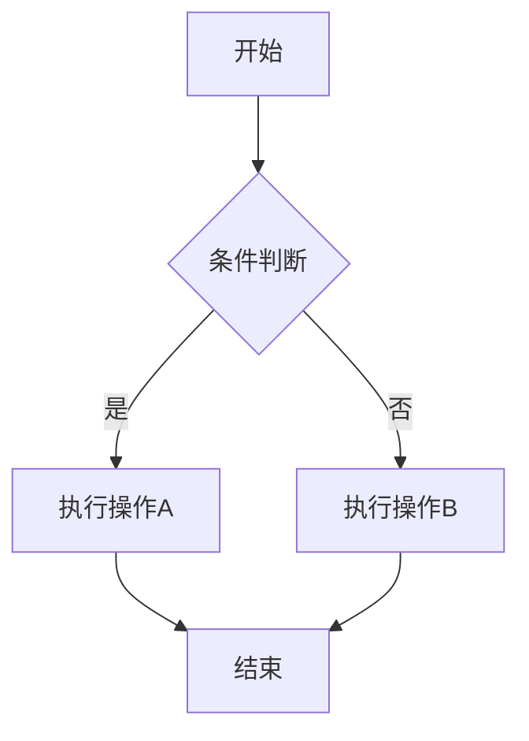

# Laravel 设计模式项目 - Enhanced Markdown 支持

## 🎉 新功能：增强的 Markdown 解析器

我们已经成功将项目从 `spatie/laravel-markdown` 迁移到更强大的 `league/commonmark` + `spatie/commonmark-highlighter` 解决方案！

### ✨ 新增功能

- **🎨 代码语法高亮**: 支持 100+ 编程语言的语法高亮
- **📊 Mermaid 流程图**: 支持流程图、类图、序列图等
- **📋 任务列表**: 支持复选框任务列表
- **🔗 自动链接**: 自动识别和转换 URL
- **⚓ 标题锚点**: 自动生成标题锚点链接
- **🛡️ 安全处理**: 更安全的 HTML 处理

### 🚀 快速开始

#### 访问演示页面
```bash
php artisan serve
```
然后访问: http://localhost:8000/markdown-demo

#### 在代码中使用

**方法 1: 使用 Blade 组件**
```blade
<x-enhanced-markdown 
    class="prose prose-gray max-w-none"
    :content="$markdownContent" />
```

**方法 2: 在 Livewire 组件中使用**
```php
use App\Services\MarkdownService;

class YourComponent extends Component
{
    public function render()
    {
        $markdownService = app(MarkdownService::class);
        $html = $markdownService->toHtml($markdownContent);
        
        return view('your-view', compact('html'));
    }
}
```

**方法 3: 直接调用服务**
```php
$markdownService = app(\App\Services\MarkdownService::class);
$html = $markdownService->parse($markdown);
```

### 📝 支持的 Markdown 语法

#### 代码高亮
```php
<?php
class Example {
    public function hello() {
        return "Hello World!";
    }
}
```

#### Mermaid 流程图


#### 表格
| 功能 | 支持状态 |
|------|----------|
| 代码高亮 | ✅ |
| Mermaid 图表 | ✅ |
| 表格 | ✅ |
| 任务列表 | ✅ |

#### 任务列表
- [x] 已完成的任务
- [ ] 待完成的任务

### 🔧 技术栈

- **Laravel 12**: 现代化的 PHP 框架
- **Livewire 3**: 响应式前端组件
- **league/commonmark**: 强大的 Markdown 解析器
- **spatie/commonmark-highlighter**: 代码语法高亮
- **Mermaid**: 流程图和图表支持
- **Tailwind CSS**: 现代化的 CSS 框架

### 📚 文档

- [迁移指南](docs/markdown-migration-guide.md)
- [解决方案对比](docs/markdown-solutions.md)

### 🧪 测试

运行 Markdown 功能测试:
```bash
php artisan test tests/Feature/MarkdownServiceTest.php
```

### 🎯 性能对比

| 功能 | 旧方案 | 新方案 |
|------|--------|--------|
| 基础解析 | ✅ | ✅ |
| 代码高亮 | ❌ | ✅ |
| Mermaid 图表 | ❌ | ✅ |
| 表格支持 | ✅ | ✅ |
| 任务列表 | ❌ | ✅ |
| 标题锚点 | ✅ | ✅ |
| 自动链接 | ❌ | ✅ |
| 解析速度 | 中等 | 快速 |
| 扩展性 | 有限 | 优秀 |

### 🛠️ 开发环境设置

1. 克隆项目
```bash
git clone <repository-url>
cd laravel_dp
```

2. 安装依赖
```bash
composer install
npm install
```

3. 环境配置
```bash
cp .env.example .env
php artisan key:generate
```

4. 启动开发服务器
```bash
php artisan serve
npm run dev
```

### 📄 许可证

MIT License