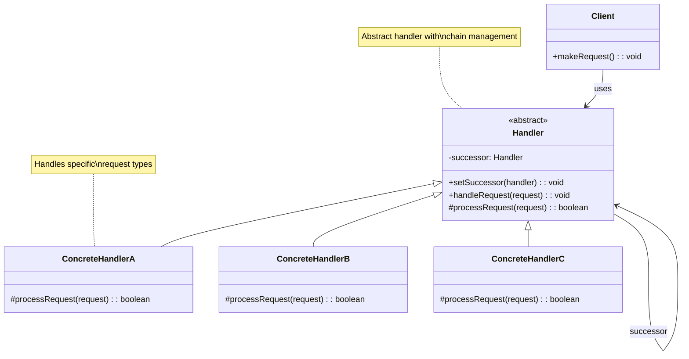
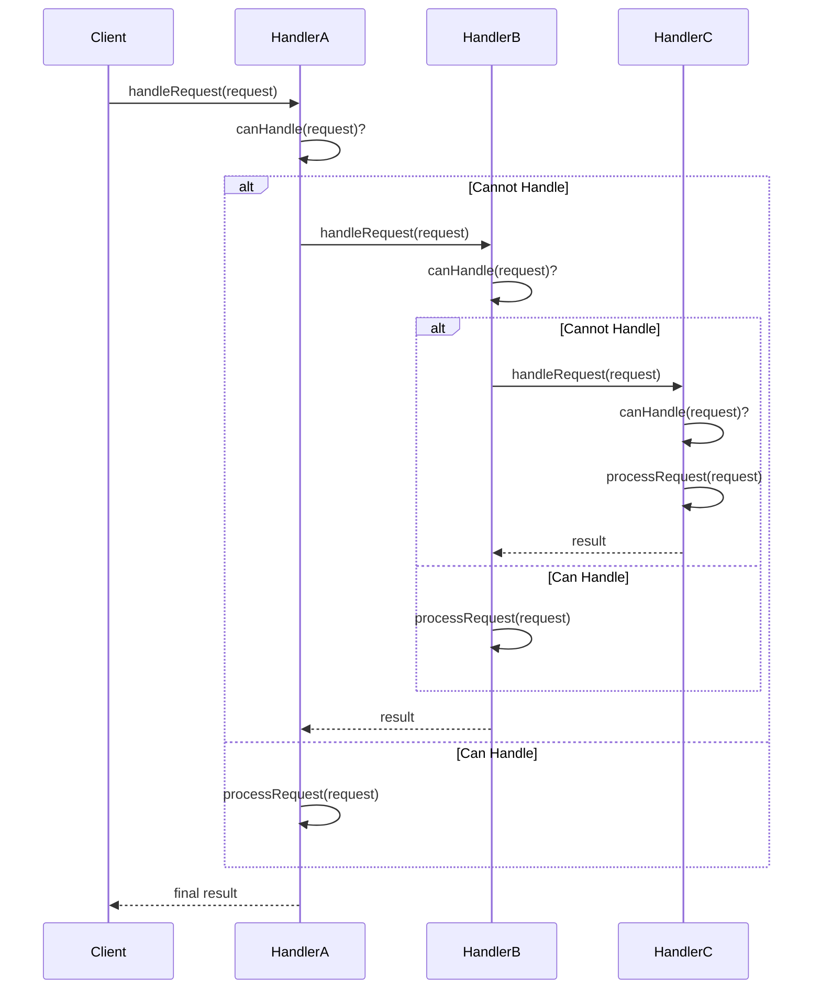
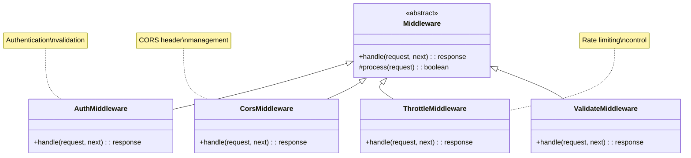
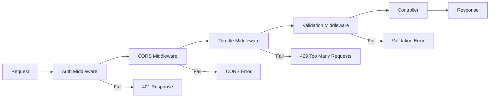

# Chain of Responsibility Pattern

## Overview

The Chain of Responsibility pattern avoids coupling the sender of a request to its receiver by giving more than one object a chance to handle the request. Chain the receiving objects and pass the request along the chain until an object handles it.

## Architecture Diagrams

### Chain of Responsibility Pattern Class Diagram


### Chain of Responsibility Sequence Diagram


### Laravel Middleware Chain


### Laravel Pipeline Architecture


## Implementation in Laravel

### 1. Abstract Handler

```php
<?php

namespace App\Patterns\ChainOfResponsibility;

abstract class RequestHandler
{
    protected ?RequestHandler $successor = null;
    
    public function setSuccessor(RequestHandler $handler): RequestHandler
    {
        $this->successor = $handler;
        return $handler;
    }
    
    public function handle($request)
    {
        if ($this->canHandle($request)) {
            return $this->processRequest($request);
        }
        
        if ($this->successor !== null) {
            return $this->successor->handle($request);
        }
        
        throw new \Exception('No handler found for request: ' . get_class($request));
    }
    
    abstract protected function canHandle($request): bool;
    abstract protected function processRequest($request);
}
```

### 2. Request Classes

```php
<?php

namespace App\Patterns\ChainOfResponsibility\Requests;

class PaymentRequest
{
    public function __construct(
        public float $amount,
        public string $method,
        public array $details = []
    ) {}
    
    public function getAmount(): float
    {
        return $this->amount;
    }
    
    public function getMethod(): string
    {
        return $this->method;
    }
    
    public function getDetails(): array
    {
        return $this->details;
    }
}

class RefundRequest
{
    public function __construct(
        public string $transactionId,
        public float $amount,
        public string $reason = ''
    ) {}
    
    public function getTransactionId(): string
    {
        return $this->transactionId;
    }
    
    public function getAmount(): float
    {
        return $this->amount;
    }
    
    public function getReason(): string
    {
        return $this->reason;
    }
}

class AuthorizationRequest
{
    public function __construct(
        public int $userId,
        public string $resource,
        public string $action
    ) {}
    
    public function getUserId(): int
    {
        return $this->userId;
    }
    
    public function getResource(): string
    {
        return $this->resource;
    }
    
    public function getAction(): string
    {
        return $this->action;
    }
}
```

### 3. Concrete Handlers

```php
<?php

namespace App\Patterns\ChainOfResponsibility\Handlers;

use App\Patterns\ChainOfResponsibility\RequestHandler;
use App\Patterns\ChainOfResponsibility\Requests\PaymentRequest;

class CreditCardHandler extends RequestHandler
{
    protected function canHandle($request): bool
    {
        return $request instanceof PaymentRequest && 
               $request->getMethod() === 'credit_card';
    }
    
    protected function processRequest($request)
    {
        $amount = $request->getAmount();
        $details = $request->getDetails();
        
        // Validate credit card details
        if (!$this->validateCreditCard($details)) {
            throw new \Exception('Invalid credit card details');
        }
        
        // Process payment
        return [
            'status' => 'success',
            'transaction_id' => 'cc_' . uniqid(),
            'amount' => $amount,
            'method' => 'credit_card',
            'processed_at' => now()
        ];
    }
    
    private function validateCreditCard(array $details): bool
    {
        return isset($details['card_number']) && 
               isset($details['expiry_date']) && 
               isset($details['cvv']);
    }
}

class PayPalHandler extends RequestHandler
{
    protected function canHandle($request): bool
    {
        return $request instanceof PaymentRequest && 
               $request->getMethod() === 'paypal';
    }
    
    protected function processRequest($request)
    {
        $amount = $request->getAmount();
        $details = $request->getDetails();
        
        // Validate PayPal details
        if (!$this->validatePayPal($details)) {
            throw new \Exception('Invalid PayPal details');
        }
        
        // Process PayPal payment
        return [
            'status' => 'success',
            'transaction_id' => 'pp_' . uniqid(),
            'amount' => $amount,
            'method' => 'paypal',
            'processed_at' => now()
        ];
    }
    
    private function validatePayPal(array $details): bool
    {
        return isset($details['email']) && 
               filter_var($details['email'], FILTER_VALIDATE_EMAIL);
    }
}

class BankTransferHandler extends RequestHandler
{
    protected function canHandle($request): bool
    {
        return $request instanceof PaymentRequest && 
               $request->getMethod() === 'bank_transfer';
    }
    
    protected function processRequest($request)
    {
        $amount = $request->getAmount();
        $details = $request->getDetails();
        
        // Validate bank transfer details
        if (!$this->validateBankTransfer($details)) {
            throw new \Exception('Invalid bank transfer details');
        }
        
        // Process bank transfer
        return [
            'status' => 'pending',
            'transaction_id' => 'bt_' . uniqid(),
            'amount' => $amount,
            'method' => 'bank_transfer',
            'processed_at' => now(),
            'estimated_completion' => now()->addDays(3)
        ];
    }
    
    private function validateBankTransfer(array $details): bool
    {
        return isset($details['account_number']) && 
               isset($details['routing_number']) && 
               isset($details['account_holder']);
    }
}
```

## Laravel Middleware Implementation

### 1. Custom Middleware Chain

```php
<?php

namespace App\Http\Middleware;

use Closure;
use Illuminate\Http\Request;

abstract class ChainableMiddleware
{
    protected ?ChainableMiddleware $next = null;
    
    public function setNext(ChainableMiddleware $middleware): ChainableMiddleware
    {
        $this->next = $middleware;
        return $middleware;
    }
    
    public function handle(Request $request, Closure $next)
    {
        if ($this->shouldProcess($request)) {
            $result = $this->process($request);
            
            if ($result !== true) {
                return $result; // Return error response
            }
        }
        
        return $next($request);
    }
    
    abstract protected function shouldProcess(Request $request): bool;
    abstract protected function process(Request $request);
}

class ApiKeyValidationMiddleware extends ChainableMiddleware
{
    protected function shouldProcess(Request $request): bool
    {
        return $request->is('api/*');
    }
    
    protected function process(Request $request)
    {
        $apiKey = $request->header('X-API-Key');
        
        if (!$apiKey) {
            return response()->json(['error' => 'API key required'], 401);
        }
        
        if (!$this->isValidApiKey($apiKey)) {
            return response()->json(['error' => 'Invalid API key'], 401);
        }
        
        return true;
    }
    
    private function isValidApiKey(string $key): bool
    {
        return \App\Models\ApiKey::where('key', $key)
                                ->where('is_active', true)
                                ->exists();
    }
}

class RateLimitMiddleware extends ChainableMiddleware
{
    protected function shouldProcess(Request $request): bool
    {
        return true; // Apply to all requests
    }
    
    protected function process(Request $request)
    {
        $key = $this->getRateLimitKey($request);
        $limit = $this->getRateLimit($request);
        
        $current = cache()->get($key, 0);
        
        if ($current >= $limit) {
            return response()->json([
                'error' => 'Rate limit exceeded',
                'retry_after' => 60
            ], 429);
        }
        
        cache()->put($key, $current + 1, 60);
        return true;
    }
    
    private function getRateLimitKey(Request $request): string
    {
        return 'rate_limit:' . $request->ip() . ':' . now()->format('Y-m-d-H-i');
    }
    
    private function getRateLimit(Request $request): int
    {
        return $request->is('api/*') ? 100 : 1000; // Different limits for API vs web
    }
}
```

## Advantages

1. **Decoupling**: Sender doesn't need to know which handler will process the request
2. **Flexibility**: Easy to add, remove, or reorder handlers
3. **Single Responsibility**: Each handler focuses on one type of request
4. **Dynamic Configuration**: Chain can be built at runtime

## Disadvantages

1. **Performance**: Request may traverse the entire chain
2. **Debugging**: Can be difficult to trace which handler processed the request
3. **No Guarantee**: Request might not be handled if no suitable handler exists
4. **Chain Management**: Need to carefully manage the chain structure

## When to Use

- When multiple objects can handle a request and the handler isn't known beforehand
- When you want to issue requests to several objects without specifying the receiver explicitly
- When the set of objects that can handle a request should be specified dynamically
- When you want to pass requests along a chain of handlers until one handles it

## Laravel-Specific Benefits

1. **Middleware Pipeline**: Perfect fit for Laravel's middleware system
2. **Request Processing**: Natural for handling different types of HTTP requests
3. **Authorization**: Chain different authorization strategies
4. **Validation**: Apply different validation rules in sequence
5. **Error Handling**: Cascade error handling through different levels