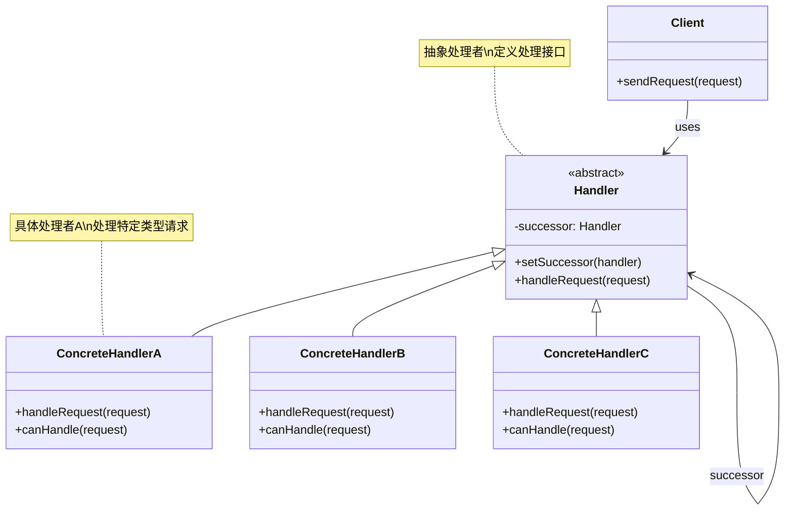
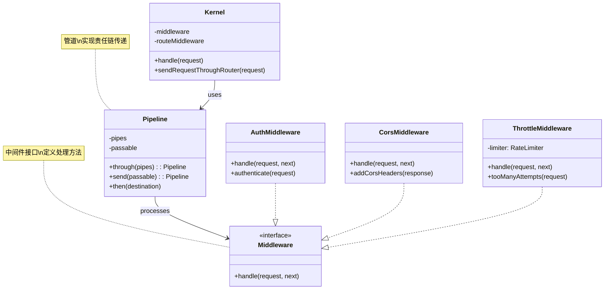
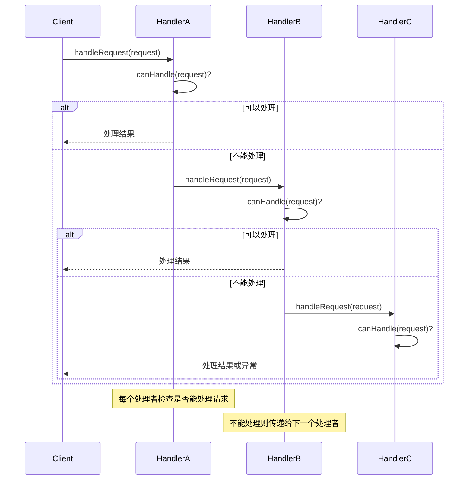
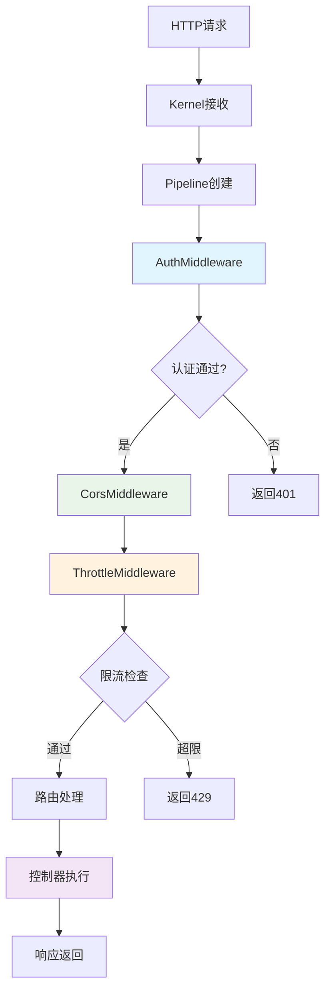
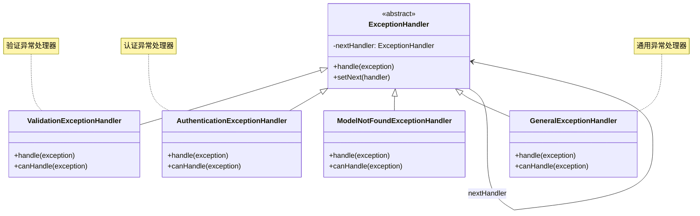
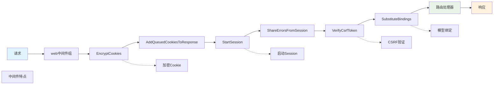

# 责任链模式 (Chain of Responsibility Pattern)

## 概述

责任链模式为请求创建了一个接收者对象的链，使多个对象都有机会处理请求，从而避免请求的发送者和接收者之间的耦合关系。将这些对象连成一条链，并沿着这条链传递请求，直到有一个对象处理它为止。

## 架构图

### 责任链模式类图


### Laravel 中间件责任链架构


### 责任链处理流程


### Laravel 中间件执行流程


### 异常处理责任链


### Laravel 路由中间件链


## 设计意图

- **解耦发送者和接收者**：请求发送者不需要知道哪个对象会处理请求
- **动态处理链**：可以动态地添加或修改处理链
- **多对象处理**：多个对象都有机会处理请求
- **灵活性**：可以灵活地组织处理顺序

## Laravel 中的实现

### 1. 中间件责任链

Laravel 的中间件系统是责任链模式的典型实现：

```php
// Illuminate\Pipeline\Pipeline.php
class Pipeline
{
    protected $pipes = [];
    protected $passable;
    
    // 设置处理链
    public function through($pipes)
    {
        $this->pipes = is_array($pipes) ? $pipes : func_get_args();
        return $this;
    }
    
    // 传递请求通过责任链
    public function then(Closure $destination)
    {
        $pipeline = array_reduce(
            array_reverse($this->pipes),
            $this->carry(),
            $this->prepareDestination($destination)
        );
        
        return $pipeline($this->passable);
    }
    
    // 创建责任链处理器
    protected function carry()
    {
        return function ($stack, $pipe) {
            return function ($passable) use ($stack, $pipe) {
                if (is_callable($pipe)) {
                    return $pipe($passable, $stack);
                }
                
                if (! is_object($pipe)) {
                    $pipe = $this->getContainer()->make($pipe);
                }
                
                // 调用中间件的handle方法，传递下一个处理器
                return $pipe->handle($passable, $stack);
            };
        };
    }
}
```

### 2. 异常处理责任链

Laravel 的异常处理也使用了责任链模式：

```php
// Illuminate\Foundation\Exceptions\Handler.php
class Handler
{
    protected $handlers = [];
    
    // 注册异常处理器
    public function register(callable $handler)
    {
        $this->handlers[] = $handler;
    }
    
    // 通过责任链处理异常
    public function render($request, Throwable $e)
    {
        // 首先尝试自定义处理器
        foreach ($this->handlers as $handler) {
            $result = $handler($request, $e);
            if ($result !== null) {
                return $result;
            }
        }
        
        // 如果没有处理器处理，使用默认处理
        return $this->prepareResponse($request, $e);
    }
}
```

### 3. 事件处理责任链

事件系统的监听器链也是责任链模式的应用：

```php
// Illuminate\Events\Dispatcher.php
class Dispatcher
{
    protected $listeners = [];
    
    // 触发事件，通过责任链调用监听器
    public function dispatch($event, $payload = [], $halt = false)
    {
        $responses = [];
        
        foreach ($this->getListeners($event) as $listener) {
            $response = $listener($event, $payload);
            
            // 如果监听器返回了响应且需要停止传播
            if ($halt && ! is_null($response)) {
                return $response;
            }
            
            // 如果监听器返回false，停止传播
            if ($response === false) {
                break;
            }
            
            $responses[] = $response;
        }
        
        return $halt ? null : $responses;
    }
}
```

## 实际应用场景

### 1. 认证责任链

用户认证系统中的责任链模式：

```php
class AuthenticationChain
{
    protected $authenticators = [];
    
    public function addAuthenticator(Authenticator $authenticator)
    {
        $this->authenticators[] = $authenticator;
        return $this;
    }
    
    public function authenticate($credentials)
    {
        foreach ($this->authenticators as $authenticator) {
            $user = $authenticator->authenticate($credentials);
            if ($user !== null) {
                return $user;
            }
        }
        
        throw new AuthenticationException('Authentication failed');
    }
}

// 具体的认证器
class DatabaseAuthenticator
{
    public function authenticate($credentials)
    {
        // 数据库认证逻辑
        return User::where('email', $credentials['email'])->first();
    }
}

class OAuthAuthenticator  
{
    public function authenticate($credentials)
    {
        // OAuth认证逻辑
        return OAuth::verify($credentials['token']);
    }
}
```

### 2. 日志处理责任链

日志系统的责任链应用：

```php
class LogProcessorChain
{
    protected $processors = [];
    
    public function addProcessor(LogProcessor $processor)
    {
        $this->processors[] = $processor;
        return $this;
    }
    
    public function process($message, $context)
    {
        foreach ($this->processors as $processor) {
            list($message, $context) = $processor->process($message, $context);
        }
        
        return [$message, $context];
    }
}

// 具体的日志处理器
class TimestampProcessor
{
    public function process($message, $context)
    {
        $message = '['.now().'] '.$message;
        return [$message, $context];
    }
}

class ContextProcessor
{
    public function process($message, $context)
    {
        if (!empty($context)) {
            $message .= ' '.json_encode($context);
        }
        return [$message, $context];
    }
}
```

### 3. 数据验证责任链

数据验证的责任链实现：

```php
class ValidationChain
{
    protected $validators = [];
    
    public function addValidator(Validator $validator)
    {
        $this->validators[] = $validator;
        return $this;
    }
    
    public function validate($data)
    {
        $errors = [];
        
        foreach ($this->validators as $validator) {
            $result = $validator->validate($data);
            if ($result !== true) {
                $errors = array_merge($errors, $result);
            }
        }
        
        return empty($errors) ? true : $errors;
    }
}
```

## 源码分析要点

### 1. 链式调用机制

责任链模式的核心是链式调用：

```php
protected function createChain()
{
    // 从后向前构建调用链
    $chain = $this->finalHandler;
    
    foreach (array_reverse($this->handlers) as $handler) {
        $chain = function ($request) use ($handler, $chain) {
            return $handler->handle($request, $chain);
        };
    }
    
    return $chain;
}
```

### 2. 处理中断机制

责任链需要支持处理中断：

```php
public function handle($request, $next)
{
    // 如果条件满足，处理请求并中断链
    if ($this->canHandle($request)) {
        return $this->process($request);
    }
    
    // 否则传递给下一个处理器
    return $next($request);
}
```

### 3. 动态链构建

Laravel 支持动态构建处理链：

```php
public function pipeThrough($pipes)
{
    $this->pipes = is_array($pipes) ? $pipes : func_get_args();
    return $this;
}

public function pipe($pipe)
{
    $this->pipes[] = $pipe;
    return $this;
}
```

## 最佳实践

### 1. 合理使用责任链模式

**适用场景：**
- 多个对象可以处理同一请求，但不确定哪个对象会处理
- 需要动态指定处理对象集合
- 希望发送者与接收者解耦
- 处理流程可能变化

**不适用场景：**
- 请求只能被一个对象处理
- 处理流程固定不变

### 2. Laravel 中的责任链实践

**中间件链配置：**
```php
// 在路由中配置中间件链
Route::middleware(['auth', 'log', 'throttle'])
    ->get('/profile', 'ProfileController@show');
```

**异常处理链：**
```php
// 注册自定义异常处理器
app('Illuminate\Contracts\Debug\ExceptionHandler')
    ->register(function ($exception) {
        if ($exception instanceof CustomException) {
            return response()->json(['error' => 'Custom error'], 400);
        }
    });
```

**事件监听链：**
```php
// 注册事件监听器
Event::listen('user.registered', [
    SendWelcomeEmail::class,
    CreateUserProfile::class,
    LogUserRegistration::class
]);
```

### 3. 测试责任链模式

**测试处理链：**
```php
public function test_chain_processing()
{
    $chain = new ProcessingChain();
    $chain->addHandler(new HandlerA());
    $chain->addHandler(new HandlerB());
    
    $result = $chain->process('request');
    
    $this->assertEquals('processed', $result);
}
```

**测试链中断：**
```php
public function test_chain_interruption()
{
    $chain = new ProcessingChain();
    $chain->addHandler(new InterruptingHandler());
    $chain->addHandler(new ShouldNotBeCalledHandler());
    
    $result = $chain->process('request');
    
    $this->assertInstanceOf(InterruptedResponse::class, $result);
}
```

## 与其他模式的关系

### 1. 与装饰器模式

责任链模式与装饰器模式都涉及对象链，但目的不同：

```php
// 责任链模式：处理请求，可能中断
class ChainHandler 
{
    public function handle($request, $next) 
    {
        if ($this->canHandle($request)) {
            return $this->process($request); // 可能中断链
        }
        return $next($request);
    }
}

// 装饰器模式：增强功能，不中断
class Decorator 
{
    public function handle($request, $next) 
    {
        $this->beforeHandle($request);
        $response = $next($request);
        $this->afterHandle($response);
        return $response; // 总是继续链
    }
}
```

### 2. 与策略模式

责任链模式可以结合策略模式：

```php
class StrategyChain 
{
    protected $strategies = [];
    
    public function addStrategy(Strategy $strategy) 
    {
        $this->strategies[] = $strategy;
    }
    
    public function execute($context) 
    {
        foreach ($this->strategies as $strategy) {
            if ($strategy->supports($context)) {
                return $strategy->execute($context);
            }
        }
        throw new Exception('No strategy found');
    }
}
```

### 3. 与组合模式

责任链模式可以使用组合模式构建复杂链：

```php
class CompositeHandler implements Handler 
{
    protected $children = [];
    
    public function add(Handler $handler)
    {
        $this->children[] = $handler;
        return $this;
    }
    
    public function handle($request, $next)
    {
        foreach ($this->children as $child) {
            $result = $child->handle($request, $next);
            if ($result !== null) {
                return $result;
            }
        }
        return $next($request);
    }
}
```

## 性能考虑

### 1. 链长度优化

过长的责任链可能影响性能：

```php
class OptimizedChain
{
    protected $handlers = [];
    
    public function addHandler(Handler $handler, $priority = 0)
    {
        $this->handlers[$priority][] = $handler;
        ksort($this->handlers); // 按优先级排序
        return $this;
    }
    
    public function process($request)
    {
        // 按优先级处理，可能提前中断
        foreach ($this->handlers as $priority => $handlers) {
            foreach ($handlers as $handler) {
                $result = $handler->handle($request);
                if ($result !== null) {
                    return $result;
                }
            }
        }
        return null;
    }
}
```

### 2. 缓存处理链

对于不变的处理链可以缓存：

```php
class CachedChain
{
    protected $chain;
    protected $dirty = true;
    
    public function addHandler(Handler $handler)
    {
        $this->handlers[] = $handler;
        $this->dirty = true;
        return $this;
    }
    
    public function process($request)
    {
        if ($this->dirty) {
            $this->rebuildChain();
            $this->dirty = false;
        }
        
        return $this->chain($request);
    }
    
    protected function rebuildChain()
    {
        // 重新构建处理链
        $this->chain = $this->buildChain($this->handlers);
    }
}
```

## 总结

责任链模式在 Laravel 框架中有着广泛的应用，特别是在中间件系统、异常处理和事件系统中。它通过将多个处理对象连接成链，实现了请求处理的灵活性和可扩展性。

责任链模式的优势在于：
- **解耦性**：发送者与接收者解耦
- **灵活性**：可以动态调整处理链
- **可扩展性**：易于添加新的处理器
- **责任分离**：每个处理器专注于特定职责

在 Laravel 开发中，合理使用责任链模式可以创建出结构清晰、易于维护的系统，特别是在需要处理复杂请求流程的场景中。