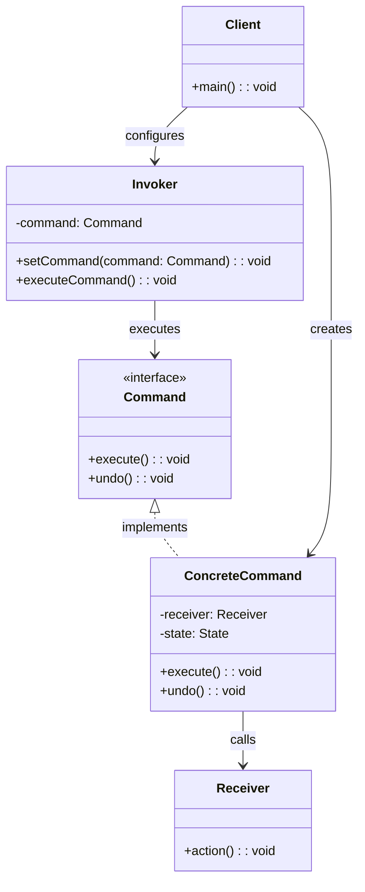
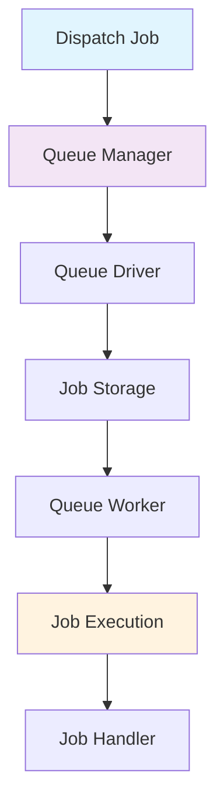
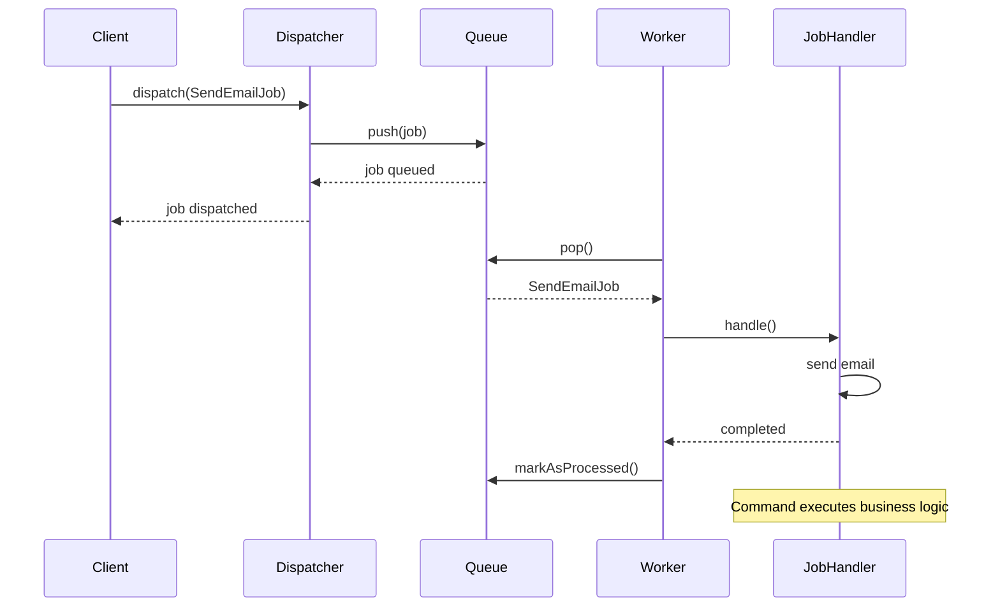

# Command Pattern

## Overview

Encapsulate a request as an object, thereby letting you parameterize clients with different requests, queue or log requests, and support undoable operations.

## Architecture Diagram

### Command Pattern Structure



### Laravel Job Queue System



### Command Execution Flow



## Implementation in Laravel

### 1. Job Commands

Laravel's job system implements the Command pattern:

```php
// Job interface (Command)
interface ShouldQueue
{
    public function handle();
}

// Concrete command
class SendEmailJob implements ShouldQueue
{
    use Dispatchable, InteractsWithQueue, Queueable, SerializesModels;
    
    protected $user;
    protected $message;
    
    public function __construct(User $user, $message)
    {
        $this->user = $user;
        $this->message = $message;
    }
    
    public function handle(MailManager $mailer)
    {
        $mailer->to($this->user->email)->send(new WelcomeEmail($this->message));
    }
}

// Invoker
class Dispatcher
{
    public function dispatch($command)
    {
        if ($this->queueResolver && $this->commandShouldBeQueued($command)) {
            return $this->dispatchToQueue($command);
        }
        
        return $this->dispatchNow($command);
    }
}
```

### 2. Artisan Commands

```php
// Artisan command as Command pattern
class MakeControllerCommand extends GeneratorCommand
{
    protected $signature = 'make:controller {name : The name of the controller}';
    protected $description = 'Create a new controller class';
    
    public function handle()
    {
        $name = $this->qualifyClass($this->getNameInput());
        $path = $this->getPath($name);
        
        if ($this->alreadyExists($this->getNameInput())) {
            $this->error($this->type.' already exists!');
            return false;
        }
        
        $this->makeDirectory($path);
        $this->files->put($path, $this->buildClass($name));
        $this->info($this->type.' created successfully.');
    }
}
```