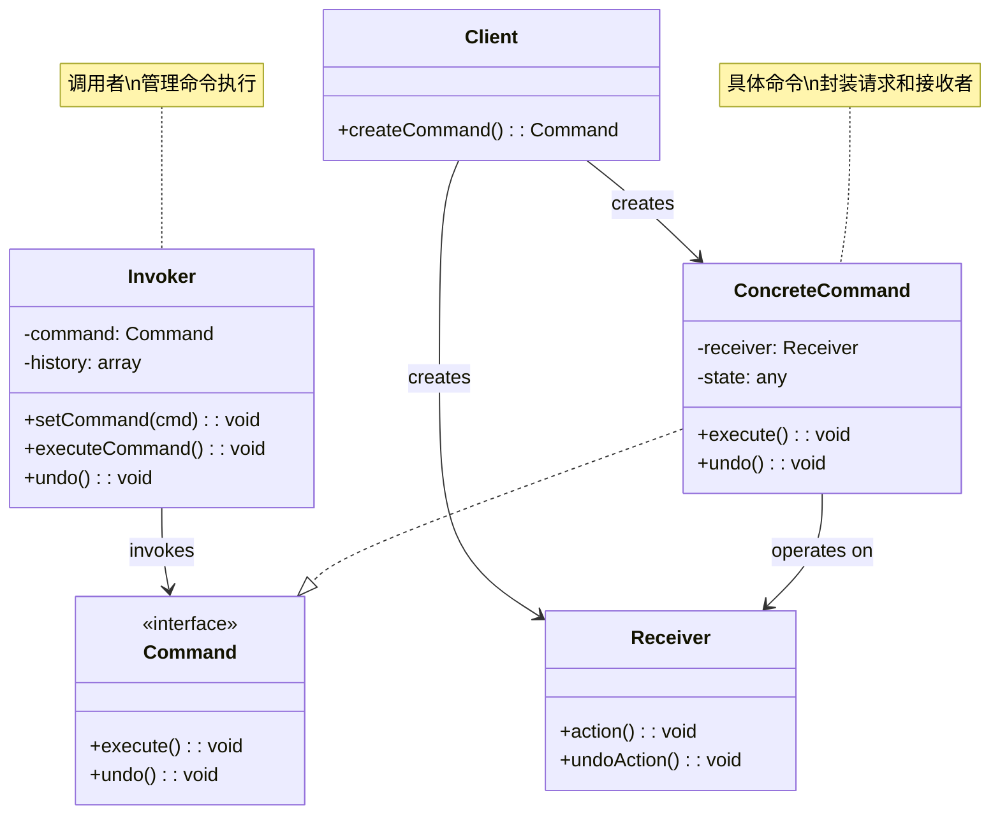
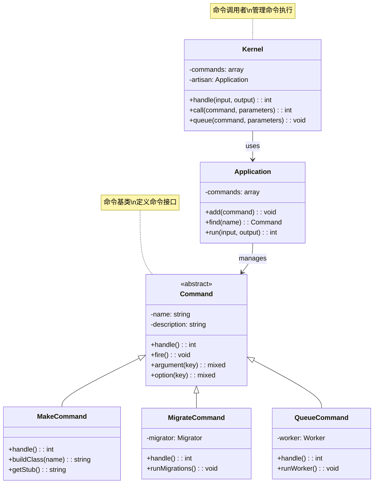
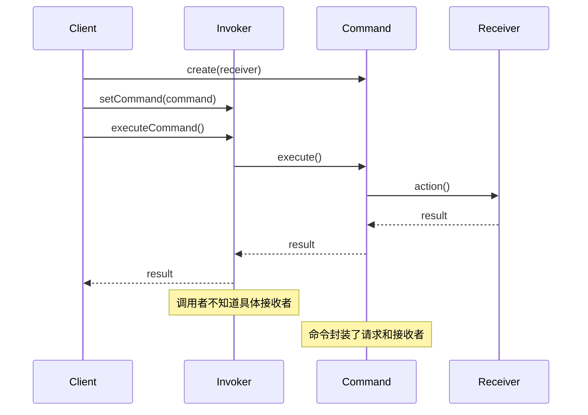
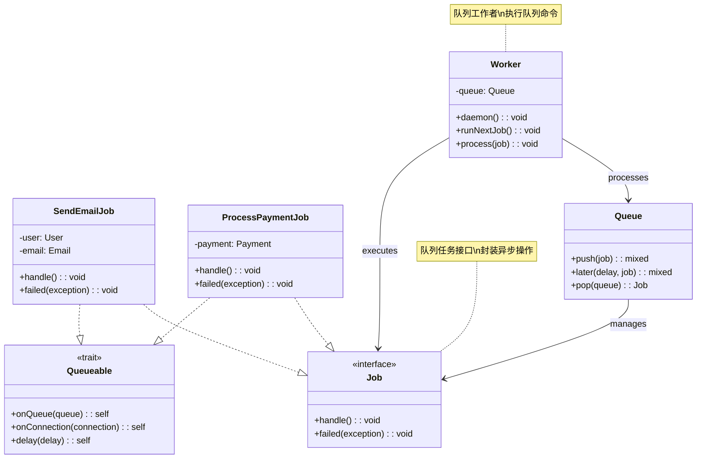
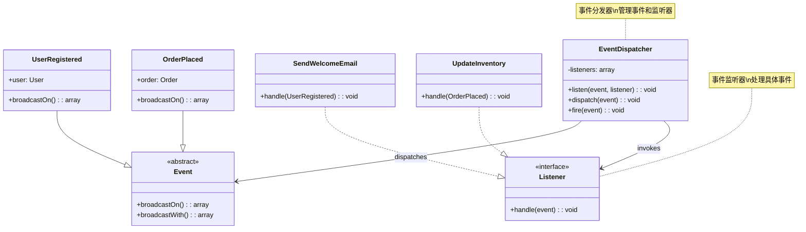

# 命令模式 (Command Pattern)

## 概述

命令模式将一个请求封装为一个对象，从而使你可用不同的请求对客户进行参数化，对请求排队或记录请求日志，以及支持可撤销的操作。它将请求的发送者和接收者解耦。

## 架构图

### 命令模式类图


### Laravel Artisan 命令架构


### 命令模式时序图


### Laravel 队列命令架构


### Laravel 事件命令模式


## 设计意图

- **请求封装**：将请求封装为对象
- **解耦发送者和接收者**：发送者不需要知道接收者的具体实现
- **支持撤销操作**：可以记录操作历史，支持撤销
- **队列支持**：可以将命令放入队列延迟执行
- **日志记录**：可以记录命令执行历史

## Laravel 中的实现

### 1. Artisan 命令系统

Laravel 的 Artisan 命令行工具是命令模式的典型实现：

```php
// Illuminate\Console\Command.php
abstract class Command
{
    protected $name;
    protected $description;
    protected $hidden = false;
    
    // 命令执行入口
    public function handle()
    {
        // 由具体命令类实现
        return 0;
    }
    
    // 执行命令
    public function run(InputInterface $input, OutputInterface $output)
    {
        $this->input = $input;
        $this->output = $output;
        
        return $this->execute($input, $output);
    }
    
    protected function execute(InputInterface $input, OutputInterface $output)
    {
        return $this->laravel->call([$this, 'handle']);
    }
}

// 具体命令示例
class MakeModelCommand extends Command
{
    protected $signature = 'make:model {name}';
    protected $description = 'Create a new Eloquent model';
    
    public function handle()
    {
        $name = $this->argument('name');
        
        // 创建模型文件
        $this->createModel($name);
        
        $this->info('Model created successfully.');
    }
}
```

### 2. 队列任务命令

Laravel 的队列系统也使用了命令模式：

```php
// Illuminate\Contracts\Queue\ShouldQueue.php
interface ShouldQueue
{
    // 标记为可队列化的任务
}

// Illuminate\Bus\Queueable.php
trait Queueable
{
    public function queue($queue = null, $delay = 0)
    {
        // 将命令放入队列
        return $this->dispatch($queue, $delay);
    }
}

// 具体队列任务
class ProcessPodcast implements ShouldQueue
{
    use Queueable;
    
    protected $podcast;
    
    public function __construct(Podcast $podcast)
    {
        $this->podcast = $podcast;
    }
    
    public function handle()
    {
        // 处理播客的逻辑
        $this->podcast->process();
    }
}
```

### 3. 事件监听器命令

事件监听器也可以看作是命令模式的应用：

```php
// Illuminate\Events\Dispatcher.php
class Dispatcher
{
    public function dispatch($event, $payload = [], $halt = false)
    {
        // 将事件转换为命令并执行
        foreach ($this->getListeners($event) as $listener) {
            $response = $listener($event, $payload);
            
            if ($halt && ! is_null($response)) {
                return $response;
            }
        }
    }
}

// 事件监听器
class SendWelcomeEmail
{
    public function handle(UserRegistered $event)
    {
        // 发送欢迎邮件的命令逻辑
        Mail::to($event->user)->send(new WelcomeEmail());
    }
}
```

## 实际应用场景

### 1. 业务操作命令

将业务操作封装为命令对象：

```php
class CreateUserCommand
{
    protected $name;
    protected $email;
    protected $password;
    
    public function __construct($name, $email, $password)
    {
        $this->name = $name;
        $this->email = $email;
        $this->password = $password;
    }
    
    public function handle()
    {
        // 验证数据
        $this->validate();
        
        // 创建用户
        $user = User::create([
            'name' => $this->name,
            'email' => $this->email,
            'password' => Hash::make($this->password),
        ]);
        
        // 触发用户创建事件
        event(new UserCreated($user));
        
        return $user;
    }
    
    protected function validate()
    {
        // 验证逻辑
        validator([
            'name' => $this->name,
            'email' => $this->email,
            'password' => $this->password,
        ], [
            'name' => 'required|string|max:255',
            'email' => 'required|email|unique:users',
            'password' => 'required|min:8',
        ])->validate();
    }
}

// 使用命令
$command = new CreateUserCommand('John Doe', 'john@example.com', 'password');
$user = $command->handle();
```

### 2. 支持撤销的命令

实现可撤销的命令：

```php
interface ReversibleCommand
{
    public function execute();
    public function undo();
}

class UpdateUserEmailCommand implements ReversibleCommand
{
    protected $user;
    protected $newEmail;
    protected $oldEmail;
    
    public function __construct(User $user, $newEmail)
    {
        $this->user = $user;
        $this->newEmail = $newEmail;
        $this->oldEmail = $user->email;
    }
    
    public function execute()
    {
        $this->user->email = $this->newEmail;
        $this->user->save();
    }
    
    public function undo()
    {
        $this->user->email = $this->oldEmail;
        $this->user->save();
    }
}

// 命令管理器，支持撤销
class CommandManager
{
    protected $history = [];
    protected $redoStack = [];
    
    public function execute(ReversibleCommand $command)
    {
        $command->execute();
        $this->history[] = $command;
        $this->redoStack = [];
    }
    
    public function undo()
    {
        if (empty($this->history)) {
            return;
        }
        
        $command = array_pop($this->history);
        $command->undo();
        $this->redoStack[] = $command;
    }
    
    public function redo()
    {
        if (empty($this->redoStack)) {
            return;
        }
        
        $command = array_pop($this->redoStack);
        $command->execute();
        $this->history[] = $command;
    }
}
```

### 3. 批量命令执行

批量执行多个命令：

```php
class BatchCommand
{
    protected $commands = [];
    
    public function addCommand($command)
    {
        $this->commands[] = $command;
        return $this;
    }
    
    public function execute()
    {
        $results = [];
        
        foreach ($this->commands as $command) {
            $results[] = $command->execute();
        }
        
        return $results;
    }
}

// 使用批量命令
$batch = new BatchCommand();
$batch->addCommand(new CreateUserCommand('User1', 'user1@example.com', 'pass1'))
      ->addCommand(new CreateUserCommand('User2', 'user2@example.com', 'pass2'))
      ->addCommand(new CreateUserCommand('User3', 'user3@example.com', 'pass3'));

$results = $batch->execute();
```

## 源码分析要点

### 1. 命令接口设计

Laravel 中的命令通常遵循统一的接口：

```php
interface CommandInterface
{
    public function handle();
}

trait DispatchesCommands
{
    public function dispatch($command)
    {
        return app(Dispatcher::class)->dispatch($command);
    }
    
    public function dispatchNow($command)
    {
        return app(Dispatcher::class)->dispatchNow($command);
    }
}
```

### 2. 命令总线模式

Laravel 使用命令总线来管理命令：

```php
// Illuminate\Bus\Dispatcher.php
class Dispatcher
{
    public function dispatch($command)
    {
        if ($this->queueResolver && $this->commandShouldBeQueued($command)) {
            return $this->dispatchToQueue($command);
        }
        
        return $this->dispatchNow($command);
    }
    
    public function dispatchNow($command, $handler = null)
    {
        return $this->pipeline->send($command)
            ->through($this->pipes)
            ->then(function ($command) use ($handler) {
                return $this->resolveHandler($command, $handler)->handle($command);
            });
    }
}
```

### 3. 中间件管道

命令执行通过中间件管道：

```php
class Pipeline
{
    public function then(Closure $destination)
    {
        $pipeline = array_reduce(
            array_reverse($this->pipes),
            $this->carry(),
            $destination
        );
        
        return $pipeline($this->passable);
    }
}
```

## 最佳实践

### 1. 合理使用命令模式

**适用场景：**
- 需要将操作请求封装为对象
- 需要支持撤销/重做操作
- 需要将操作放入队列延迟执行
- 需要记录操作日志
- 需要支持事务性操作

**不适用场景：**
- 简单的一次性操作
- 性能要求极高的场景
- 操作逻辑非常简单

### 2. Laravel 中的命令实践

**创建 Artisan 命令：**
```php
// 使用 make:command 创建命令
php artisan make:command ProcessOrder

// 生成的命令类
class ProcessOrder extends Command
{
    protected $signature = 'order:process {orderId}';
    
    public function handle()
    {
        $order = Order::find($this->argument('orderId'));
        $order->process();
        $this->info('Order processed successfully.');
    }
}
```

**创建队列任务：**
```php
// 使用 make:job 创建队列任务
php artisan make:job SendNotification

// 生成的队列任务
class SendNotification implements ShouldQueue
{
    use Dispatchable, InteractsWithQueue, Queueable, SerializesModels;
    
    public function handle()
    {
        // 发送通知的逻辑
    }
}
```

**使用命令总线：**
```php
// 分发命令
Bus::dispatch(new ProcessPayment($order));

// 同步执行命令
Bus::dispatchNow(new ValidateOrder($order));
```

### 3. 测试命令模式

**测试命令执行：**
```php
public function test_command_execution()
{
    $command = new CreateUserCommand('Test User', 'test@example.com', 'password');
    $user = $command->handle();
    
    $this->assertInstanceOf(User::class, $user);
    $this->assertEquals('Test User', $user->name);
}

public function test_queued_command()
{
    Queue::fake();
    
    Bus::dispatch(new ProcessPayment($order));
    
    Queue::assertPushed(ProcessPayment::class);
}
```

**测试撤销操作：**
```php
public function test_command_undo()
{
    $user = User::factory()->create(['email' => 'old@example.com']);
    $command = new UpdateUserEmailCommand($user, 'new@example.com');
    
    $command->execute();
    $this->assertEquals('new@example.com', $user->email);
    
    $command->undo();
    $this->assertEquals('old@example.com', $user->email);
}
```

## 与其他模式的关系

### 1. 与策略模式

命令模式关注操作封装，策略模式关注算法选择：

```php
// 命令模式：封装操作
class PaymentCommand 
{
    public function execute() 
    {
        // 执行支付操作
    }
}

// 策略模式：选择算法
class PaymentContext 
{
    public function setStrategy(PaymentStrategy $strategy) 
    {
        $this->strategy = $strategy;
    }
    
    public function pay($amount) 
    {
        return $this->strategy->pay($amount);
    }
}
```

### 2. 与备忘录模式

命令模式常与备忘录模式结合实现撤销功能：

```php
class CommandWithMemento implements ReversibleCommand
{
    protected $originator;
    protected $memento;
    
    public function execute() 
    {
        $this->memento = $this->originator->save();
        $this->originator->doOperation();
    }
    
    public function undo() 
    {
        $this->originator->restore($this->memento);
    }
}
```

### 3. 与组合模式

命令模式可以使用组合模式创建宏命令：

```php
class MacroCommand implements CommandInterface
{
    protected $commands = [];
    
    public function add(CommandInterface $command) 
    {
        $this->commands[] = $command;
    }
    
    public function execute() 
    {
        foreach ($this->commands as $command) {
            $command->execute();
        }
    }
}
```

## 性能考虑

### 1. 命令对象创建开销

命令模式涉及对象创建，在性能敏感场景需要注意：

```php
// 使用轻量级命令
class LightweightCommand
{
    protected $callback;
    
    public function __construct(callable $callback)
    {
        $this->callback = $callback;
    }
    
    public function execute()
    {
        return ($this->callback)();
    }
}

// 使用闭包创建轻量级命令
$command = new LightweightCommand(function () {
    return 'Hello World';
});
```

### 2. 队列性能优化

对于队列命令，注意序列化性能：

```php
class OptimizedQueuedCommand implements ShouldQueue
{
    use SerializesModels;
    
    // 只序列化必要的ID，而不是整个模型
    public $userId;
    
    public function __construct($userId)
    {
        $this->userId = $userId;
    }
    
    public function handle()
    {
        $user = User::find($this->userId);
        // 处理逻辑
    }
}
```

## 总结

命令模式在 Laravel 框架中有着广泛的应用，特别是在 Artisan 命令行工具、队列系统和事件系统中。它通过将操作封装为对象，实现了操作请求与执行者的解耦。

命令模式的优势在于：
- **解耦性**：发送者与接收者解耦
- **灵活性**：支持队列、撤销、日志等功能
- **可扩展性**：易于添加新的命令类型
- **事务性**：支持复杂的事务操作

在 Laravel 开发中，合理使用命令模式可以创建出结构清晰、易于维护的系统，特别是在需要处理复杂业务操作和需要支持异步执行的场景中。