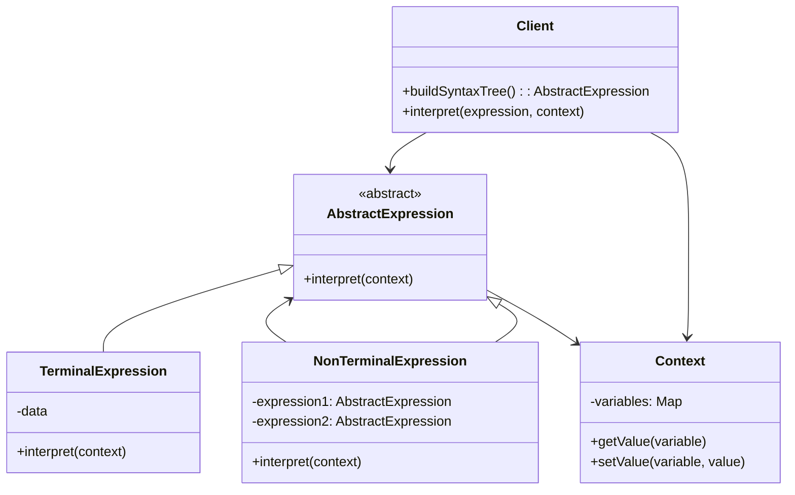

# Interpreter Pattern

## Overview

The Interpreter pattern defines a representation for a language's grammar along with an interpreter that uses the representation to interpret sentences in the language. It's useful for implementing domain-specific languages, query languages, and expression evaluators.

## Architecture Diagrams

### Interpreter Pattern Class Diagram


### Expression Evaluation Flow
```mermaid
sequenceDiagram
    participant Client
    participant Context
    participant Expression
    participant TerminalExpr
    participant NonTerminalExpr
    
    Client->>Context: setValue("x", 10)
    Client->>Context: setValue("y", 5)
    Client->>Expressionerpret(context)
    
    Expression->>NonTerminalExprerpret(context)
    NonTerminalExpr->>TerminalExprerpret(context)
    TerminalExpr->>Context: getValue("x")
    Context-->>TerminalExpr: 10
    TerminalExpr-->>NonTerminalExpr: 10
    
    NonTerminalExpr->>TerminalExprerpret(context)
    TerminalExpr->>Context: getValue("y")
    Context-->>TerminalExpr: 5
    TerminalExpr-->>NonTerminalExpr: 5
    
    NonTerminalExpr->>NonTerminalExpr: calculate(10, 5)
    NonTerminalExpr-->>Expression: 15
    Expression-->>Client: 15
```

## Implementation in Laravel

### 1. Basic Expression Classes

```php
<?php

namespace App\Patterns\Interpreter;

abstract class AbstractExpression
{
    abstract public function interpret(Context $context);
}

class Context
{
    private array $variables = [];
    
    public function setValue(string $variable, $value)
    {
        $this->variables[$variable] = $value;
    }
    
    public function getValue(string $variable)
    {
        return $this->variables[$variable] ?? null;
    }
    
    public function hasVariable(string $variable)
    {
        return array_key_exists($variable, $this->variables);
    }
    
    public function getAllVariables()
    {
        return $this->variables;
    }
}
```

### 2. Terminal Expressions

```php
<?php

namespace App\Patterns\Interpreter;

class NumberExpression extends AbstractExpression
{
    private $number;
    
    public function __construct($number)
    {
        $this->number = $number;
    }
    
    public function interpret(Context $context)
    {
        return $this->number;
    }
}

class VariableExpression extends AbstractExpression
{
    private string $variable;
    
    public function __construct(string $variable)
    {
        $this->variable = $variable;
    }
    
    public function interpret(Context $context)
    {
        $value = $context->getValue($this->variable);
        
        if ($value === null) {
            throw new \InvalidArgumentException("Variable '{$this->variable}' is not defined");
        }
        
        return $value;
    }
}

class StringExpression extends AbstractExpression
{
    private string $value;
    
    public function __construct(string $value)
    {
        $this->value = $value;
    }
    
    public function interpret(Context $context)
    {
        return $this->value;
    }
}
```

### 3. Non-Terminal Expressions

```php
<?php

namespace App\Patterns\Interpreter;

class AddExpression extends AbstractExpression
{
    private AbstractExpression $left;
    private AbstractExpression $right;
    
    public function __construct(AbstractExpression $left, AbstractExpression $right)
    {
        $this->left = $left;
        $this->right = $right;
    }
    
    public function interpret(Context $context)
    {
        return $this->left->interpret($context) + $this->right->interpret($context);
    }
}

class SubtractExpression extends AbstractExpression
{
    private AbstractExpression $left;
    private AbstractExpression $right;
    
    public function __construct(AbstractExpression $left, AbstractExpression $right)
    {
        $this->left = $left;
        $this->right = $right;
    }
    
    public function interpret(Context $context)
    {
        return $this->left->interpret($context) - $this->right->interpret($context);
    }
}

class MultiplyExpression extends AbstractExpression
{
    private AbstractExpression $left;
    private AbstractExpression $right;
    
    public function __construct(AbstractExpression $left, AbstractExpression $right)
    {
        $this->left = $left;
        $this->right = $right;
    }
    
    public function interpret(Context $context)
    {
        return $this->left->interpret($context) * $this->right->interpret($context);
    }
}

class EqualsExpression extends AbstractExpression
{
    private AbstractExpression $left;
    private AbstractExpression $right;
    
    public function __construct(AbstractExpression $left, AbstractExpression $right)
    {
        $this->left = $left;
        $this->right = $right;
    }
    
    public function interpret(Context $context)
    {
        return $this->left->interpret($context) == $this->right->interpret($context);
    }
}
```

### 4. Laravel Rule Engine

```php
<?php

namespace App\Services;

use App\Patterns\Interpreter\{Context, AbstractExpression};

class RuleEngine
{
    private array $compiledRules = [];
    
    public function addRule(string $name, AbstractExpression $expression)
    {
        $this->compiledRules[$name] = $expression;
    }
    
    public function evaluateRule(string $name, array $variables)
    {
        if (!isset($this->compiledRules[$name])) {
            throw new \InvalidArgumentException("Rule '{$name}' not found");
        }
        
        $context = new Context();
        foreach ($variables as $variable => $value) {
            $context->setValue($variable, $value);
        }
        
        return (bool) $this->compiledRules[$name]->interpret($context);
    }
    
    public function evaluateExpression(AbstractExpression $expression, array $variables = [])
    {
        $context = new Context();
        foreach ($variables as $variable => $value) {
            $context->setValue($variable, $value);
        }
        
        return $expression->interpret($context);
    }
    
    public function getRules()
    {
        return array_keys($this->compiledRules);
    }
    
    public function removeRule(string $name)
    {
        if (isset($this->compiledRules[$name])) {
            unset($this->compiledRules[$name]);
            return true;
        }
        
        return false;
    }
}
```

### 5. Expression Builder

```php
<?php

namespace App\Services;

use App\Patterns\Interpreter\{
    AbstractExpression,
    NumberExpression,
    VariableExpression,
    AddExpression,
    SubtractExpression,
    MultiplyExpression,
    EqualsExpression
};

class ExpressionBuilder
{
    public function number($value): NumberExpression
    {
        return new NumberExpression($value);
    }
    
    public function variable(string $name): VariableExpression
    {
        return new VariableExpression($name);
    }
    
    public function add(AbstractExpression $left, AbstractExpression $right): AddExpression
    {
        return new AddExpression($left, $right);
    }
    
    public function subtract(AbstractExpression $left, AbstractExpression $right): SubtractExpression
    {
        return new SubtractExpression($left, $right);
    }
    
    public function multiply(AbstractExpression $left, AbstractExpression $right): MultiplyExpression
    {
        return new MultiplyExpression($left, $right);
    }
    
    public function equals(AbstractExpression $left, AbstractExpression $right): EqualsExpression
    {
        return new EqualsExpression($left, $right);
    }
    
    // Fluent interface for building complex expressions
    public function build(): ExpressionBuilder
    {
        return new self();
    }
    
    public static function create(): self
    {
        return new self();
    }
}
```

### 6. Laravel Service Implementation

```php
<?php

namespace App\Services;

class BusinessRuleService
{
    private RuleEngine $ruleEngine;
    private ExpressionBuilder $builder;
    
    public function __construct(RuleEngine $ruleEngine, ExpressionBuilder $builder)
    {
        $this->ruleEngine = $ruleEngine;
        $this->builder = $builder;
    }
    
    public function setupDefaultRules()
    {
        // Rule: Adult user (age >= 18)
        $adultRule = $this->builder->equals(
            $this->builder->variable('age'),
            $this->builder->number(18)
        );
        $this->ruleEngine->addRule('is_adult', $adultRule);
        
        // Rule: Premium user (subscription_type == 'premium')
        $premiumRule = $this->builder->equals(
            $this->builder->variable('subscription_type'),
            $this->builder->variable('premium')
        );
        $this->ruleEngine->addRule('is_premium', $premiumRule);
        
        // Rule: Discount eligibility (total > 100)
        $discountRule = $this->builder->multiply(
            $this->builder->variable('total'),
            $this->builder->number(0.1)
        );
        $this->ruleEngine->addRule('discount_amount', $discountRule);
    }
    
    public function evaluateUserEligibility(array $userData)
    {
        $results = [];
        
        foreach ($this->ruleEngine->getRules() as $ruleName) {
            try {
                $results[$ruleName] = $this->ruleEngine->evaluateRule($ruleName, $userData);
            } catch (\Exception $e) {
                $results[$ruleName] = false;
                logger()->error("Rule evaluation failed for '{$ruleName}': " . $e->getMessage());
            }
        }
        
        return $results;
    }
    
    public function calculateDynamicPricing(array $orderData): float
    {
        $basePrice = $orderData['base_price'] ?? 0;
        
        // Build dynamic pricing expression
        $expression = $this->builder->add(
            $this->builder->variable('base_price'),
            $this->builder->multiply(
                $this->builder->variable('tax_rate'),
                $this->builder->variable('base_price')
            )
        );
        
        return $this->ruleEngine->evaluateExpression($expression, $orderData);
    }
}
```

### 7. Laravel Controller

```php
<?php

namespace App\Http\Controllers;

use App\Services\{RuleEngine, BusinessRuleService, ExpressionBuilder};
use Illuminate\Http\Request;
use Illuminate\Http\JsonResponse;

class RuleController extends Controller
{
    private BusinessRuleService $ruleService;
    
    public function __construct(BusinessRuleService $ruleService)
    {
        $this->ruleService = $ruleService;
    }
    
    public function evaluateUser(Request $request): JsonResponse
    {
        $validated = $request->validate([
            'age' => 'required|integer|min:0',
            'subscription_type' => 'required|string',
            'total' => 'numeric|min:0'
        ]);
        
        $results = $this->ruleService->evaluateUserEligibility($validated);
        
        return response()->json([
            'success' => true,
            'user_data' => $validated,
            'rule_results' => $results
        ]);
    }
    
    public function calculatePrice(Request $request): JsonResponse
    {
        $validated = $request->validate([
            'base_price' => 'required|numeric|min:0',
            'tax_rate' => 'required|numeric|min:0|max:1'
        ]);
        
        try {
            $finalPrice = $this->ruleService->calculateDynamicPricing($validated);
            
            return response()->json([
                'success' => true,
                'base_price' => $validated['base_price'],
                'tax_rate' => $validated['tax_rate'],
                'final_price' => $finalPrice
            ]);
            
        } catch (\Exception $e) {
            return response()->json([
                'success' => false,
                'error' => $e->getMessage()
            ], 400);
        }
    }
}
```

## Laravel Integration Examples

### 1. Validation Rule DSL

```php
<?php

namespace App\Services;

class ValidationRuleDSL
{
    public function createCustomRule(string $expression): \Closure
    {
        return function ($attribute, $value, $fail) use ($expression) {
            $builder = new ExpressionBuilder();
            $ruleEngine = new RuleEngine();
            
            // Parse and evaluate custom validation expression
            // This is a simplified example
            $variables = [$attribute => $value];
            
            try {
                $result = $ruleEngine->evaluateExpression($expression, $variables);
                if (!$result) {
                    $fail("The {$attribute} field does not meet the custom validation criteria.");
                }
            } catch (\Exception $e) {
                $fail("Validation rule error: " . $e->getMessage());
            }
        };
    }
}
```

### 2. Query Builder DSL

```php
<?php

namespace App\Services;

class QueryBuilderDSL
{
    public function buildQuery(string $model, array $conditions): \Illuminate\Database\Eloquent\Builder
    {
        $modelClass = "App\\Models\\{$model}";
        $query = $modelClass::query();
        
        foreach ($conditions as $condition) {
            if (isset($condition['field'], $condition['operator'], $condition['value'])) {
                $query->where($condition['field'], $condition['operator'], $condition['value']);
            }
        }
        
        return $query;
    }
}
```

## Advantages

1. **Extensibility**: Easy to add new grammar rules and expressions
2. **Reusability**: Expressions can be reused in different contexts
3. **Maintainability**: Grammar changes are localized to specific classes
4. **Flexibility**: Can implement complex domain-specific languages

## Disadvantages

1. **Complexity**: Can become complex for large grammars
2. **Performance**: Interpretation can be slower than compiled code
3. **Memory Usage**: Creates many objects for complex expressions
4. **Debugging**: Can be difficult to debug complex expressions

## When to Use

- When you need to implement a domain-specific language
- When you have frequently changing business rules
- When you need to allow users to define custom expressions
- When building query builders or configuration systems
- When implementing mathematical expression evaluators

## Laravel-Specific Benefits

1. **Validation Integration**: Can create custom validation rule DSLs
2. **Query Builder**: Perfect for building dynamic query builders
3. **Configuration**: Can implement configuration DSLs
4. **Business Rules**: Ideal for complex business rule engines
5. **API Filtering**: Can create flexible API filtering languages