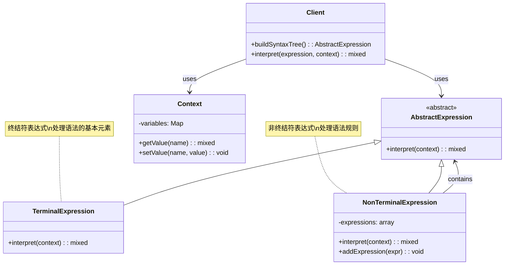
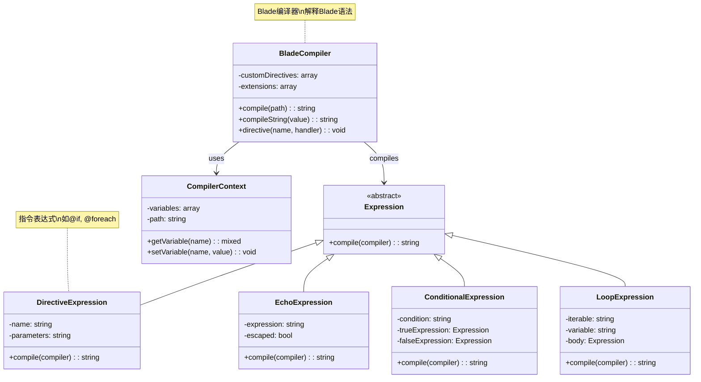
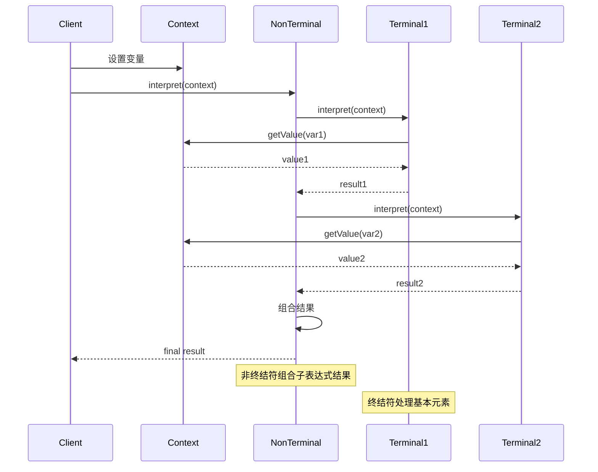
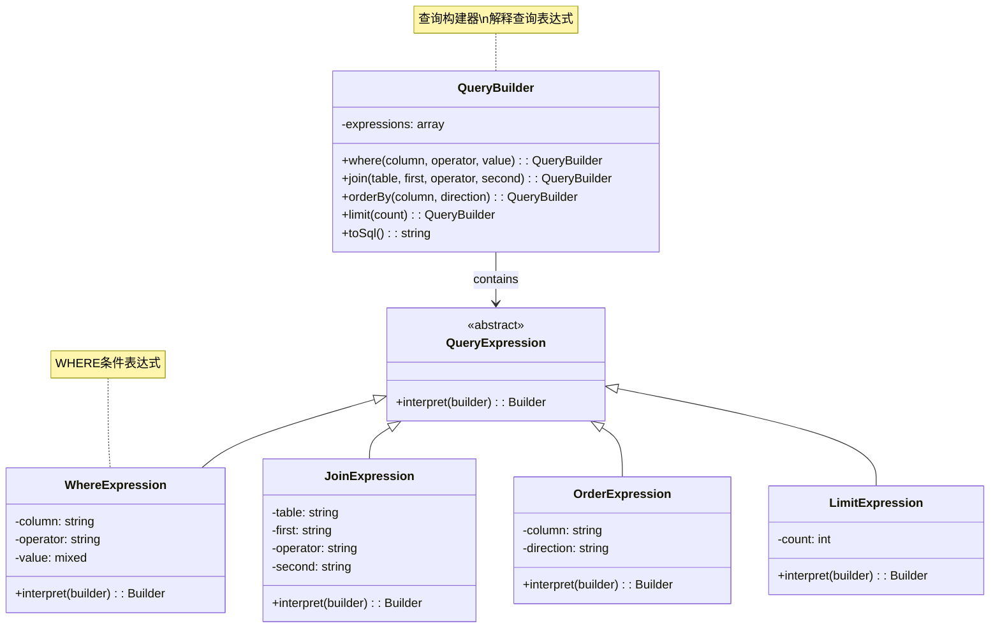
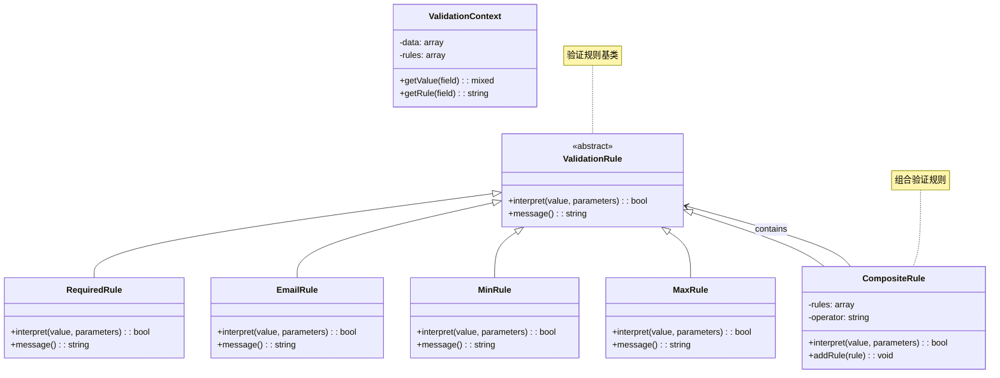
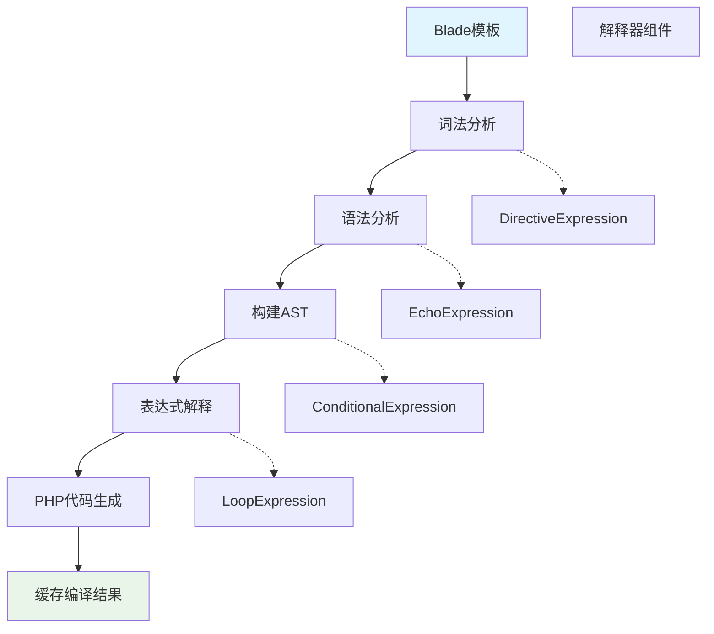

# 解释器模式 (Interpreter Pattern)

## 概述

解释器模式给定一个语言，定义它的文法的一种表示，并定义一个解释器，这个解释器使用该表示来解释语言中的句子。它主要用于解释和执行特定语法规则的语言。

## 架构图

### 解释器模式类图


### Laravel Blade 解释器架构


### 解释器模式时序图


### Laravel 查询构建器解释器


### Laravel 验证规则解释器


### Blade 编译流程


## 设计意图

- **语法解释**：定义语言的文法规则
- **表达式求值**：解释和执行表达式
- **语言处理**：处理特定领域语言(DSL)
- **规则引擎**：实现业务规则的解释执行

## Laravel 中的实现

### 1. Blade 模板引擎解释器

Laravel 的 Blade 模板引擎是解释器模式的典型应用：

```php
// Illuminate\View\Compilers\BladeCompiler.php
class BladeCompiler extends Compiler implements CompilerInterface
{
    // 解释器：解析 Blade 语法
    public function compile($path = null)
    {
        if ($path) {
            $this->setPath($path);
        }
        
        // 解析 Blade 指令
        $contents = $this->compileString($this->files->get($this->getPath()));
        
        // 编译为 PHP 代码
        return $this->compileString($contents);
    }
    
    // 解释特定的 Blade 指令
    protected function compileStatements($value)
    {
        return preg_replace_callback(
            '/\B@(@?\w+(?:::\w+)?)([ \t]*)(\( ( (?>[^()]+) | (?3) )* \))?/x',
            function ($match) {
                return $this->compileStatement($match);
            }, $value
        );
    }
    
    // 解释单个语句
    protected function compileStatement($match)
    {
        if (str_contains($match[1], '@')) {
            $match[0] = isset($match[3]) ? $match[1].$match[3] : $match[1];
        } elseif (isset($this->customDirectives[$match[1]])) {
            // 解释自定义指令
            $match[0] = $this->callCustomDirective($match[1], $match[3] ?? '');
        } elseif (method_exists($this, $method = 'compile'.ucfirst($match[1]))) {
            // 解释内置指令
            $match[0] = $this->$method($match[3] ?? '');
        }
        
        return isset($match[3]) ? $match[0] : $match[0].$match[2];
    }
    
    // 解释 @if 指令
    protected function compileIf($expression)
    {
        return "<?php if{$expression}: ?>";
    }
    
    // 解释 @foreach 指令
    protected function compileForeach($expression)
    {
        return "<?php foreach{$expression}: ?>";
    }
}
```

### 2. 查询语法解释器

Eloquent 查询构建器中的语法解释：

```php
// Illuminate\Database\Query\Builder.php
class Builder
{
    // 解释 where 条件
    public function where($column, $operator = null, $value = null, $boolean = 'and')
    {
        // 如果只有两个参数，解释为等值比较
        if (func_num_args() === 2) {
            [$value, $operator] = [$operator, '='];
        }
        
        // 解释操作符
        $type = 'Basic';
        $this->wheres[] = compact('type', 'column', 'operator', 'value', 'boolean');
        
        return $this;
    }
    
    // 解释复杂的 where 条件
    public function whereNested(Closure $callback, $boolean = 'and')
    {
        $query = $this->forNestedWhere();
        call_user_func($callback, $query);
        
        return $this->addNestedWhereQuery($query, $boolean);
    }
    
    // 解释 SQL 语句
    public function toSql()
    {
        return $this->grammar->compileSelect($this);
    }
}

// SQL 语法编译器
class Grammar
{
    public function compileSelect(Builder $query)
    {
        // 解释查询组成部分
        $components = $this->compileComponents($query);
        
        return $this->concatenate($components);
    }
    
    protected function compileComponents(Builder $query)
    {
        $sql = [];
        
        $sql['aggregate'] = $this->compileAggregate($query, $query->aggregate);
        $sql['columns'] = $this->compileColumns($query, $query->columns);
        $sql['from'] = $this->compileFrom($query, $query->from);
        $sql['joins'] = $this->compileJoins($query, $query->joins);
        $sql['wheres'] = $this->compileWheres($query, $query->wheres);
        $sql['groups'] = $this->compileGroups($query, $query->groups);
        $sql['havings'] = $this->compileHavings($query, $query->havings);
        $sql['orders'] = $this->compileOrders($query, $query->orders);
        $sql['limit'] = $this->compileLimit($query, $query->limit);
        $sql['offset'] = $this->compileOffset($query, $query->offset);
        
        return $sql;
    }
}
```

### 3. 路由语法解释器

Laravel 路由系统的语法解释：

```php
// Illuminate\Routing\Route.php
class Route
{
    // 解释路由参数
    public function bind(Request $request)
    {
        $this->compileRoute();
        
        $this->parameters = (new RouteParameterBinder($this))
            ->parameters($request);
        
        return $this;
    }
    
    // 编译路由规则
    public function compileRoute()
    {
        if (! $this->compiled) {
            $this->compiled = $this->compile();
        }
        
        return $this->compiled;
    }
    
    // 解释路由路径
    protected function compile()
    {
        $route = $this->toRoute();
        
        return (new RouteCompiler)->compile($route);
    }
}

// 路由编译器
class RouteCompiler
{
    public function compile(Route $route)
    {
        $hostVariables = [];
        $variables = [];
        $hostRegex = null;
        $regex = null;
        
        // 解释路由路径中的参数
        if ('' !== $host = $route->getHost()) {
            $result = $this->compilePattern($route, $host, true);
            $hostVariables = $result['variables'];
            $variables = $hostVariables;
            $hostRegex = $result['regex'];
        }
        
        $path = $route->getPath();
        $result = $this->compilePattern($route, $path, false);
        $variables = array_merge($variables, $result['variables']);
        $regex = $result['regex'];
        
        return compact('regex', 'hostRegex', 'variables', 'hostVariables');
    }
}
```

## 实际应用场景

### 1. 规则引擎解释器

业务规则的解释器实现：

```php
class RuleInterpreter
{
    protected $context;
    
    public function __construct(array $context)
    {
        $this->context = $context;
    }
    
    public function interpret($rule)
    {
        // 解析规则语法
        $tokens = $this->tokenize($rule);
        $ast = $this->parse($tokens);
        return $this->evaluate($ast);
    }
    
    protected function tokenize($rule)
    {
        // 将规则字符串分解为标记
        return preg_split('/\s+/', trim($rule));
    }
    
    protected function parse(array $tokens)
    {
        // 解析标记为抽象语法树
        $ast = [];
        $i = 0;
        
        while ($i < count($tokens)) {
            $token = $tokens[$i];
            
            if ($token === '(') {
                // 处理括号表达式
                $subExpression = $this->parseSubExpression($tokens, $i);
                $ast[] = $subExpression;
            } elseif (in_array($token, ['AND', 'OR'])) {
                // 处理逻辑操作符
                $ast[] = ['type' => 'operator', 'value' => $token];
                $i++;
            } else {
                // 处理操作数
                $ast[] = ['type' => 'operand', 'value' => $token];
                $i++;
            }
        }
        
        return $ast;
    }
    
    protected function evaluate(array $ast)
    {
        $stack = [];
        
        foreach ($ast as $node) {
            if ($node['type'] === 'operand') {
                $stack[] = $this->resolveOperand($node['value']);
            } elseif ($node['type'] === 'operator') {
                $right = array_pop($stack);
                $left = array_pop($stack);
                
                if ($node['value'] === 'AND') {
                    $stack[] = $left && $right;
                } else {
                    $stack[] = $left || $right;
                }
            }
        }
        
        return array_pop($stack);
    }
    
    protected function resolveOperand($operand)
    {
        // 从上下文中解析操作数的值
        return $this->context[$operand] ?? false;
    }
}
```

### 2. 表达式求值解释器

数学表达式解释器：

```php
class ExpressionInterpreter
{
    public function evaluate($expression)
    {
        $tokens = $this->tokenize($expression);
        $rpn = $this->shuntingYard($tokens);
        return $this->evaluateRPN($rpn);
    }
    
    protected function tokenize($expression)
    {
        // 将表达式分解为标记
        preg_match_all('/\d+|\+|\-|\*|\/|\(|\)/', $expression, $matches);
        return $matches[0];
    }
    
    protected function shuntingYard(array $tokens)
    {
        // 调度场算法，将中缀表达式转换为后缀表达式
        $output = [];
        $operators = [];
        $precedence = ['+' => 1, '-' => 1, '*' => 2, '/' => 2];
        
        foreach ($tokens as $token) {
            if (is_numeric($token)) {
                $output[] = $token;
            } elseif (in_array($token, ['+', '-', '*', '/'])) {
                while (!empty($operators) && $operators[count($operators)-1] !== '(' && 
                       $precedence[$token] <= $precedence[$operators[count($operators)-1]]) {
                    $output[] = array_pop($operators);
                }
                $operators[] = $token;
            } elseif ($token === '(') {
                $operators[] = $token;
            } elseif ($token === ')') {
                while (end($operators) !== '(') {
                    $output[] = array_pop($operators);
                }
                array_pop($operators); // 移除 '('
            }
        }
        
        while (!empty($operators)) {
            $output[] = array_pop($operators);
        }
        
        return $output;
    }
    
    protected function evaluateRPN(array $rpn)
    {
        $stack = [];
        
        foreach ($rpn as $token) {
            if (is_numeric($token)) {
                $stack[] = $token;
            } else {
                $b = array_pop($stack);
                $a = array_pop($stack);
                
                switch ($token) {
                    case '+': $stack[] = $a + $b; break;
                    case '-': $stack[] = $a - $b; break;
                    case '*': $stack[] = $a * $b; break;
                    case '/': $stack[] = $a / $b; break;
                }
            }
        }
        
        return array_pop($stack);
    }
}
```

### 3. 模板变量解释器

模板变量替换解释器：

```php
class TemplateInterpreter
{
    protected $variables = [];
    
    public function setVariables(array $variables)
    {
        $this->variables = $variables;
        return $this;
    }
    
    public function interpret($template)
    {
        // 解释模板中的变量占位符
        return preg_replace_callback('/\{\{\s*(\w+)\s*\}\}/', function ($matches) {
            return $this->resolveVariable($matches[1]);
        }, $template);
    }
    
    protected function resolveVariable($name)
    {
        // 解析变量值，支持点表示法
        $value = $this->variables;
        $parts = explode('.', $name);
        
        foreach ($parts as $part) {
            if (is_array($value) && isset($value[$part])) {
                $value = $value[$part];
            } elseif (is_object($value) && isset($value->$part)) {
                $value = $value->$part;
            } else {
                return ''; // 变量不存在
            }
        }
        
        return $value;
    }
}
```

## 源码分析要点

### 1. 语法解析技术

Laravel 中的解释器模式使用多种语法解析技术：

```php
// 正则表达式解析
protected function parseWithRegex($pattern, $subject)
{
    if (preg_match($pattern, $subject, $matches)) {
        return $matches;
    }
    return null;
}

// 递归下降解析
protected function parseExpression(&$tokens)
{
    $left = $this->parseTerm($tokens);
    
    while (!empty($tokens) && in_array($tokens[0], ['+', '-'])) {
        $operator = array_shift($tokens);
        $right = $this->parseTerm($tokens);
        $left = ['type' => 'binary', 'operator' => $operator, 'left' => $left, 'right' => $right];
    }
    
    return $left;
}
```

### 2. 抽象语法树(AST)

解释器模式通常构建抽象语法树：

```php
class ASTNode
{
    protected $type;
    protected $value;
    protected $children = [];
    
    public function __construct($type, $value = null, array $children = [])
    {
        $this->type = $type;
        $this->value = $value;
        $this->children = $children;
    }
    
    public function evaluate($context = [])
    {
        switch ($this->type) {
            case 'number':
                return $this->value;
            case 'variable':
                return $context[$this->value] ?? 0;
            case 'binary':
                $left = $this->children[0]->evaluate($context);
                $right = $this->children[1]->evaluate($context);
                
                switch ($this->value) {
                    case '+': return $left + $right;
                    case '-': return $left - $right;
                    case '*': return $left * $right;
                    case '/': return $right != 0 ? $left / $right : 0;
                }
        }
    }
}
```

### 3. 上下文处理

解释器需要处理执行上下文：

```php
class InterpretationContext
{
    protected $variables = [];
    protected $functions = [];
    
    public function setVariable($name, $value)
    {
        $this->variables[$name] = $value;
        return $this;
    }
    
    public function getVariable($name)
    {
        return $this->variables[$name] ?? null;
    }
    
    public function registerFunction($name, callable $function)
    {
        $this->functions[$name] = $function;
        return $this;
    }
    
    public function callFunction($name, array $arguments)
    {
        if (isset($this->functions[$name])) {
            return call_user_func_array($this->functions[$name], $arguments);
        }
        throw new Exception("Function {$name} not found");
    }
}
```

## 最佳实践

### 1. 合理使用解释器模式

**适用场景：**
- 需要解释特定领域语言(DSL)
- 实现简单的规则引擎
- 处理表达式求值
- 需要灵活的语法扩展

**不适用场景：**
- 语法非常复杂
- 性能要求极高
- 有现成的解析库可用

### 2. Laravel 中的解释器实践

**Blade 指令扩展：**
```php
// 注册自定义 Blade 指令
Blade::directive('datetime', function ($expression) {
    return "<?php echo ($expression)->format('m/d/Y H:i'); ?>";
});

// 使用自定义指令
@datetime($user->created_at)
```

**查询条件解释：**
```php
// 解释复杂的查询条件
$query = User::query();

// 解释字符串条件为查询构建器调用
$conditions = 'age > 25 AND (status = "active" OR role = "admin")';
$interpreter = new QueryInterpreter($query);
$interpreter->interpret($conditions);

$users = $query->get();
```

**路由参数解释：**
```php
// 解释路由参数约束
Route::get('user/{id}', function ($id) {
    // $id 已经被解释为整数
})->where('id', '[0-9]+');

// 自定义路由参数解释器
Route::pattern('slug', '[a-z0-9-]+');
```

### 3. 测试解释器模式

**测试语法解析：**
```php
public function test_expression_parsing()
{
    $interpreter = new ExpressionInterpreter();
    $result = $interpreter->evaluate('2 + 3 * 4');
    
    $this->assertEquals(14, $result);
}

public function test_rule_evaluation()
{
    $context = ['age' => 25, 'status' => 'active'];
    $interpreter = new RuleInterpreter($context);
    $result = $interpreter->interpret('age > 20 AND status = "active"');
    
    $this->assertTrue($result);
}
```

**测试错误处理：**
```php
public function test_invalid_syntax_handling()
{
    $interpreter = new ExpressionInterpreter();
    
    $this->expectException(SyntaxErrorException::class);
    $interpreter->evaluate('2 + * 3');
}
```

## 与其他模式的关系

### 1. 与组合模式

解释器模式常使用组合模式构建语法树：

```php
// 组合模式构建表达式树
interface Expression 
{
    public function interpret(Context $context);
}

class Number implements Expression 
{
    public function interpret(Context $context) 
    {
        return $this->value;
    }
}

class Add implements Expression 
{
    public function interpret(Context $context) 
    {
        return $this->left->interpret($context) + $this->right->interpret($context);
    }
}
```

### 2. 与访问者模式

解释器模式可以与访问者模式结合：

```php
interface Visitor 
{
    public function visitNumber(Number $number);
    public function visitAdd(Add $add);
}

class Evaluator implements Visitor 
{
    public function visitNumber(Number $number) 
    {
        return $number->getValue();
    }
    
    public function visitAdd(Add $add) 
    {
        return $add->getLeft()->accept($this) + $add->getRight()->accept($this);
    }
}
```

### 3. 与工厂模式

解释器模式使用工厂模式创建表达式对象：

```php
class ExpressionFactory 
{
    public function createExpression($token) 
    {
        if (is_numeric($token)) {
            return new Number($token);
        }
        
        switch ($token) {
            case '+': return new Add();
            case '-': return new Subtract();
            // ... 其他操作符
        }
    }
}
```

## 性能考虑

### 1. 解析性能优化

对于频繁使用的解释器，可以优化解析性能：

```php
class CachedInterpreter
{
    protected $cache = [];
    
    public function interpret($input)
    {
        $key = md5($input);
        
        if (!isset($this->cache[$key])) {
            $this->cache[$key] = $this->doInterpret($input);
        }
        
        return $this->cache[$key];
    }
    
    protected function doInterpret($input)
    {
        // 实际的解释逻辑
        $tokens = $this->tokenize($input);
        $ast = $this->parse($tokens);
        return $this->evaluate($ast);
    }
}
```

### 2. 预编译技术

使用预编译提高执行性能：

```php
class CompiledInterpreter
{
    public function compile($expression)
    {
        $tokens = $this->tokenize($expression);
        $ast = $this->parse($tokens);
        return $this->generateCode($ast);
    }
    
    protected function generateCode($ast)
    {
        // 生成优化的 PHP 代码
        if ($ast['type'] === 'binary') {
            $left = $this->generateCode($ast['left']);
            $right = $this->generateCode($ast['right']);
            return "({$left} {$ast['operator']} {$right})";
        }
        
        return $ast['value'];
    }
}
```

## 总结

解释器模式在 Laravel 框架中有着重要的应用，特别是在 Blade 模板引擎、查询构建器和路由系统中。它通过定义语言的文法规则和解释器，实现了特定语法的解释和执行。

解释器模式的优势在于：
- **灵活性**：可以定义自定义语法规则
- **可扩展性**：易于添加新的语法元素
- **领域特定**：适合实现领域特定语言(DSL)
- **表达力强**：可以表达复杂的业务规则

在 Laravel 开发中，合理使用解释器模式可以创建出强大的模板系统、查询构建器和规则引擎，特别是在需要处理自定义语法和表达式的场景中。