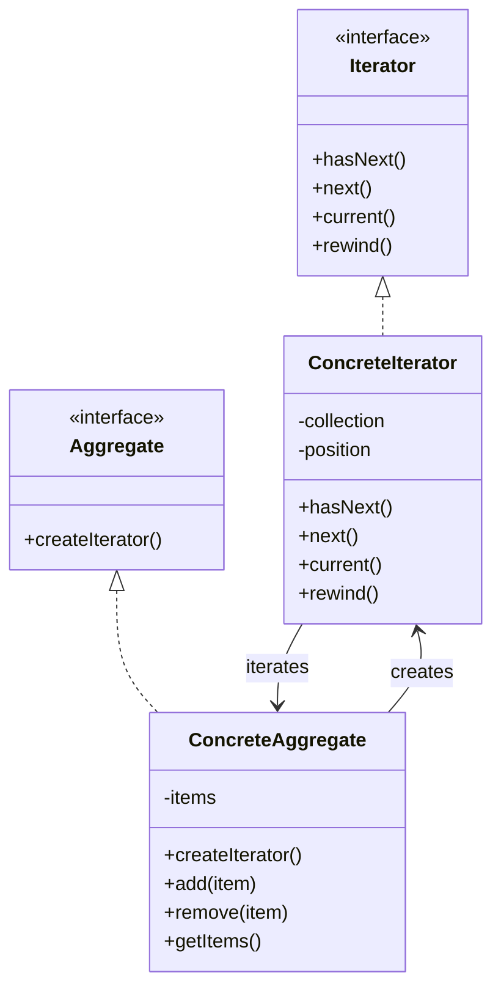
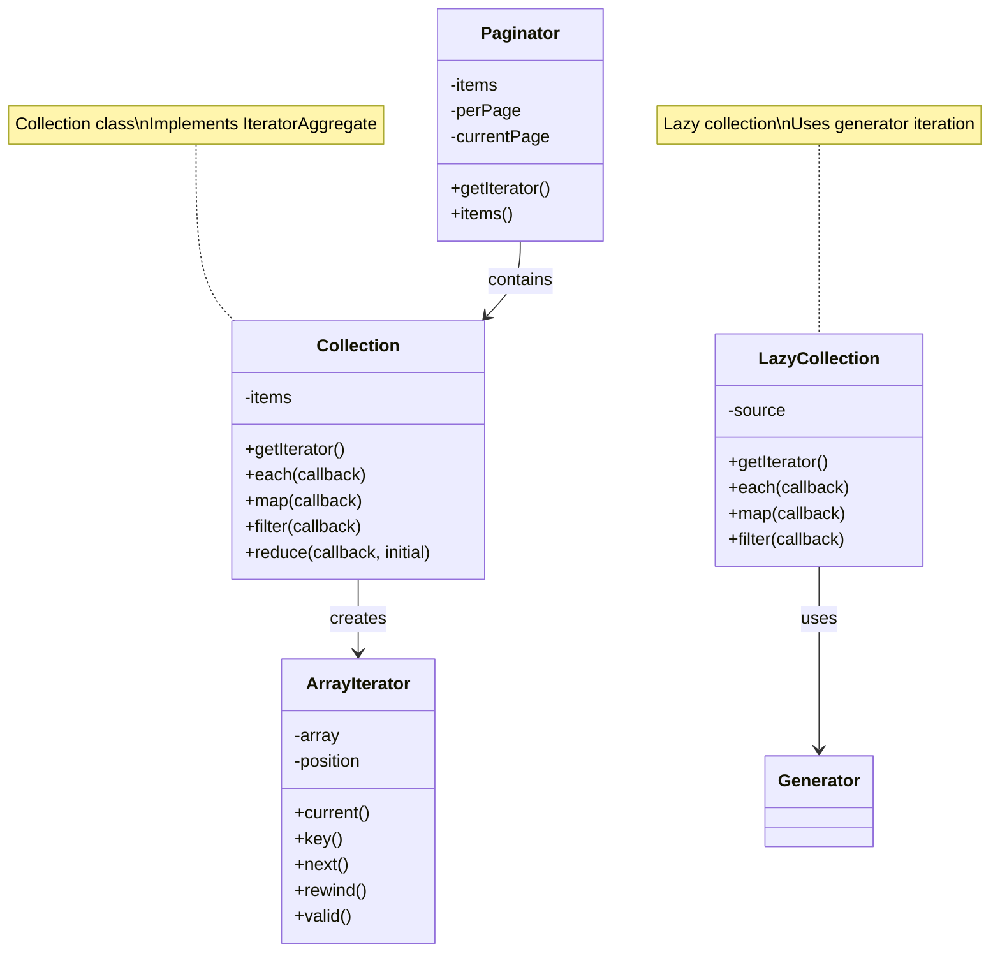
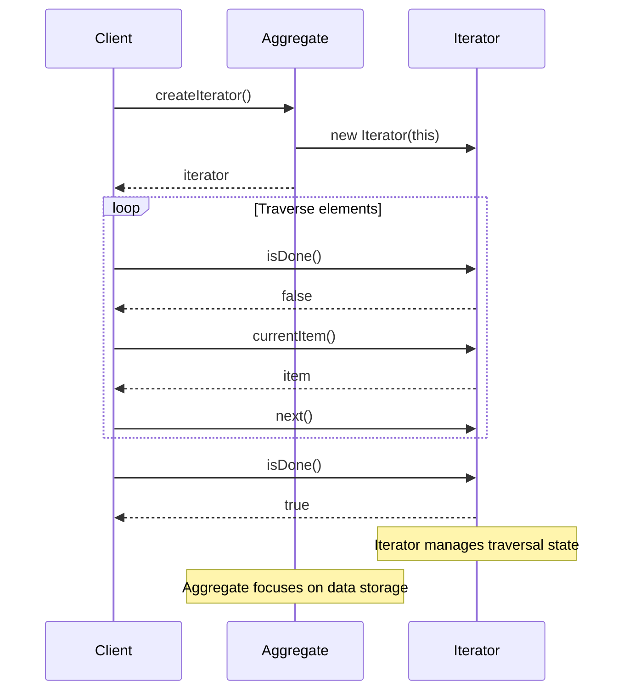
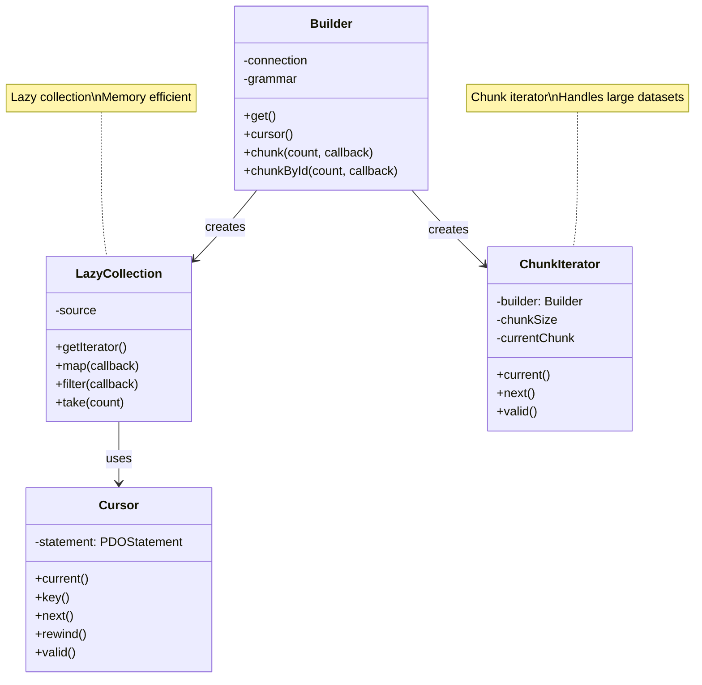
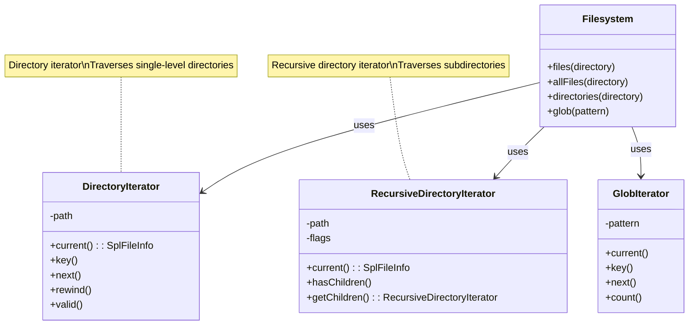
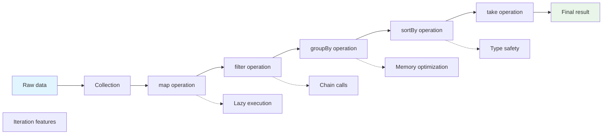
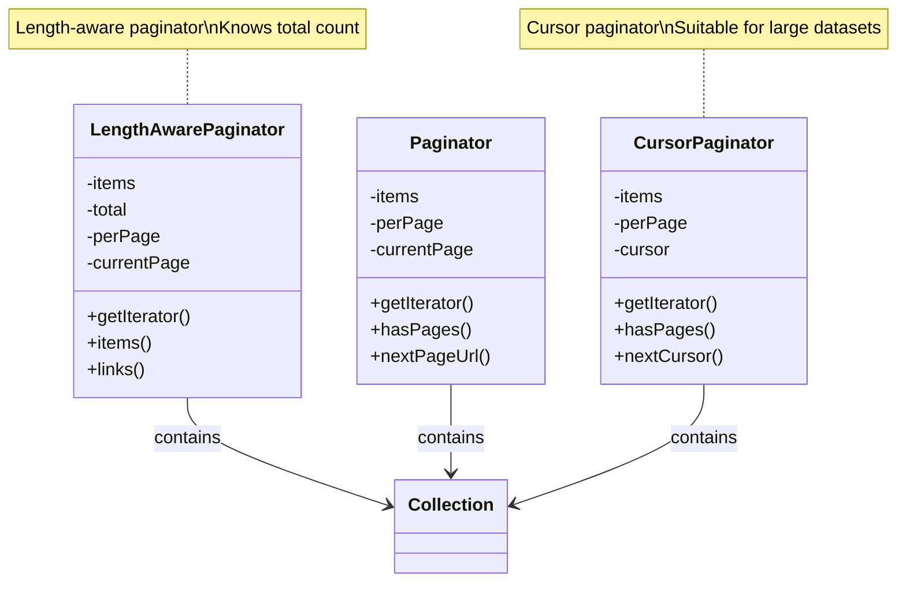

# Iterator Pattern

## Overview

The Iterator pattern provides a way to access the elements of an aggregate object sequentially without exposing its underlying representation. It defines a standard interface for traversing a collection of objects.

## Architecture Diagrams

### Iterator Pattern Class Diagram


### Laravel Collection Iterator Architecture


### Iterator Pattern Sequence Diagram


### Laravel Database Query Iterator


### Laravel Filesystem Iterator


### Collection Operation Chain Iteration


### Laravel Pagination Iterator


## Design Intent

- **Traversal encapsulation**: Encapsulates traversal logic in iterators
- **Unified interface**: Provides a unified traversal interface for different aggregate structures
- **Internal representation hiding**: Does not expose the internal structure of aggregate objects
- **Multiple traversal support**: Supports multiple traversal methods

## Implementation in Laravel

### 1. Collection Iterator

Laravel's Collection class is a typical implementation of the Iterator pattern:

```php
// Illuminate\Support\Collection.php
class Collection implements ArrayAccess, Arrayable, Countable, IteratorAggregate, Jsonable, JsonSerializable
{
    protected $items = [];
    
    // Implements IteratorAggregate interface
    public function getIterator()
    {
        return new ArrayIterator($this->items);
    }
    
    // Various traversal methods
    public function each(callable $callback)
    {
        foreach ($this->items as $key => $item) {
            if ($callback($item, $key) === false) {
                break;
            }
        }
        
        return $this;
    }
    
    public function map(callable $callback)
    {
        $keys = array_keys($this->items);
        $items = array_map($callback, $this->items, $keys);
        
        return new static(array_combine($keys, $items));
    }
    
    public function filter(callable $callback = null)
    {
        if ($callback) {
            return new static(array_filter($this->items, $callback, ARRAY_FILTER_USE_BOTH));
        }
        
        return new static(array_filter($this->items));
    }
}

// Usage example
$collection = collect([1, 2, 3, 4, 5]);

// Using iterator traversal
foreach ($collection as $item) {
    echo $item;
}

// Using higher-order function traversal
$collection->each(function ($item) {
    echo $item;
});
```

### 2. Query Result Iterator

Eloquent query results also implement the Iterator pattern:

```php
// Illuminate\Database\Eloquent\Collection.php
class Collection extends BaseCollection
{
    // Override iterator method, supports model serialization
    public function getIterator()
    {
        return new ArrayIterator($this->items);
    }
    
    // Chunk processing for large datasets
    public function chunk($size)
    {
        if ($size <= 0) {
            return new static;
        }
        
        $chunks = [];
        
        foreach (array_chunk($this->items, $size, true) as $chunk) {
            $chunks[] = new static($chunk);
        }
        
        return new static($chunks);
    }
    
    // Lazy loading of relationships
    public function load($relations)
    {
        if (count($this->items) > 0) {
            if (is_string($relations)) {
                $relations = func_get_args();
            }
            
            $query = $this->first()->newQueryWithoutRelationships()->with($relations);
            
            $this->items = $query->eagerLoadRelations($this->items);
        }
        
        return $this;
    }
}

// Usage example
$users = User::where('active', true)->get();

// Using iterator traversal
foreach ($users as $user) {
    echo $user->name;
}

// Chunk processing for large data
User::chunk(200, function ($users) {
    foreach ($users as $user) {
        // Process user
    }
});
```

### 3. Filesystem Iterator

Laravel's filesystem also uses the Iterator pattern:

```php
// Illuminate\Filesystem\Filesystem.php
class Filesystem
{
    // Traverse directory
    public function files($directory, $hidden = false)
    {
        return iterator_to_array(
            $this->getFiles($directory, $hidden), false
        );
    }
    
    protected function getFiles($path, $hidden)
    {
        return new FilterIterator(
            new RecursiveIteratorIterator(
                new RecursiveDirectoryIterator($path, RecursiveDirectoryIterator::SKIP_DOTS)
            ), function ($file) use ($hidden) {
                return $hidden || !$file->isDot() && substr($file->getFilename(), 0, 1) !== '.';
            }
        );
    }
    
    // Recursive directory traversal
    public function allFiles($directory, $hidden = false)
    {
        return iterator_to_array(
            new RecursiveIteratorIterator(
                new RecursiveDirectoryIterator($directory, RecursiveDirectoryIterator::SKIP_DOTS)
            ), false
        );
    }
}

// Usage example
$files = Storage::files('documents');
$allFiles = Storage::allFiles('documents');

foreach ($files as $file) {
    echo $file;
}
```

## Practical Application Scenarios

### 1. Paginated Iterator

Implement a paginated iterator:

```php
class PaginatedIterator implements Iterator
{
    protected $currentPage = 1;
    protected $perPage = 10;
    protected $currentItems = [];
    protected $total = 0;
    protected $query;
    
    public function __construct($query, $perPage = 10)
    {
        $this->query = $query;
        $this->perPage = $perPage;
        $this->loadPage(1);
    }
    
    public function current()
    {
        return current($this->currentItems);
    }
    
    public function key()
    {
        return key($this->currentItems);
    }
    
    public function next()
    {
        next($this->currentItems);
        
        // If current page traversal is complete, load next page
        if (!current($this->currentItems) && $this->hasMorePages()) {
            $this->loadPage($this->currentPage + 1);
            reset($this->currentItems);
        }
    }
    
    public function rewind()
    {
        $this->loadPage(1);
        reset($this->currentItems);
    }
    
    public function valid()
    {
        return current($this->currentItems) !== false;
    }
    
    protected function loadPage($page)
    {
        $this->currentPage = $page;
        $this->currentItems = $this->query->forPage($page, $this->perPage)->get()->all();
    }
    
    protected function hasMorePages()
    {
        return count($this->currentItems) === $this->perPage;
    }
}

// Usage example
$iterator = new PaginatedIterator(User::query(), 100);

foreach ($iterator as $user) {
    // Automatically handles pagination
    processUser($user);
}
```

### 2. Filter Iterator

Implement a filter iterator:

```php
class FilterIterator implements Iterator
{
    protected $innerIterator;
    protected $filterCallback;
    protected $current;
    protected $key;
    
    public function __construct(Iterator $innerIterator, callable $filterCallback)
    {
        $this->innerIterator = $innerIterator;
        $this->filterCallback = $filterCallback;
        $this->rewind();
    }
    
    public function current()
    {
        return $this->current;
    }
    
    public function key()
    {
        return $this->key;
    }
    
    public function next()
    {
        $this->innerIterator->next();
        $this->findNextValid();
    }
    
    public function rewind()
    {
        $this->innerIterator->rewind();
        $this->findNextValid();
    }
    
    public function valid()
    {
        return $this->current !== null;
    }
    
    protected function findNextValid()
    {
        $this->current = null;
        $this->key = null;
        
        while ($this->innerIterator->valid()) {
            $current = $this->innerIterator->current();
            $key = $this->innerIterator->key();
            
            if (call_user_func($this->filterCallback, $current, $key)) {
                $this->current = $current;
                $this->key = $key;
                break;
            }
            
            $this->innerIterator->next();
        }
    }
}

// Usage example
$numbers = new ArrayIterator([1, 2, 3, 4, 5, 6, 7, 8, 9, 10]);
$evenIterator = new FilterIterator($numbers, function ($number) {
    return $number % 2 === 0;
});

foreach ($evenIterator as $evenNumber) {
    echo $evenNumber; // Output: 2, 4, 6, 8, 10
}
```

### 3. Map Iterator

Implement a data transformation iterator:

```php
class MapIterator implements Iterator
{
    protected $innerIterator;
    protected $mapCallback;
    
    public function __construct(Iterator $innerIterator, callable $mapCallback)
    {
        $this->innerIterator = $innerIterator;
        $this->mapCallback = $mapCallback;
    }
    
    public function current()
    {
        return call_user_func($this->mapCallback, $this->innerIterator->current(), $this->innerIterator->key());
    }
    
    public function key()
    {
        return $this->innerIterator->key();
    }
    
    public function next()
    {
        $this->innerIterator->next();
    }
    
    public function rewind()
    {
        $this->innerIterator->rewind();
    }
    
    public function valid()
    {
        return $this->innerIterator->valid();
    }
}

// Usage example
$users = new ArrayIterator([
    ['name' => 'John', 'age' => 25],
    ['name' => 'Jane', 'age' => 30]
]);

$nameIterator = new MapIterator($users, function ($user) {
    return $user['name'];
});

foreach ($nameIterator as $name) {
    echo $name; // Output: John, Jane
}
```

## Source Code Analysis Points

### 1. Iterator Interface Implementation

Laravel's iterator pattern follows PHP's iterator interfaces:

```php
// Basic iterator interface
interface Iterator extends Traversable
{
    public function current();
    public function key();
    public function next();
    public function rewind();
    public function valid();
}

// Aggregator interface
interface IteratorAggregate extends Traversable
{
    public function getIterator();
}
```

### 2. Lazy Loading Iterator

Laravel uses lazy loading to optimize iteration performance:

```php
class LazyCollection implements IteratorAggregate
{
    protected $source;
    
    public function __construct($source)
    {
        $this->source = $source;
    }
    
    public function getIterator()
    {
        // Lazy generator iterator
        if (is_callable($this->source)) {
            $result = ($this->source)();
            return $result instanceof Iterator ? $result : new ArrayIterator((array) $result);
        }
        
        return new ArrayIterator((array) $this->source);
    }
    
    public function each(callable $callback)
    {
        foreach ($this as $key => $value) {
            if ($callback($value, $key) === false) {
                break;
            }
        }
        
        return $this;
    }
}
```

### 3. Chained Iterator Operations

Laravel supports chained iterator operations:

```php
$result = collect([1, 2, 3, 4, 5])
    ->filter(fn($n) => $n % 2 === 0)  // Filter even numbers
    ->map(fn($n) => $n * 2)           // Multiply by 2
    ->take(2)                         // Take first 2
    ->values();                       // Re-index
    
// Result: [4, 8]
```

## Best Practices

### 1. Appropriate Use of Iterator Pattern

**Suitable scenarios:**
- Need to uniformly traverse different data structures
- Need to hide the internal structure of aggregate objects
- Need to support multiple traversal methods
- Need lazy loading or batch processing of data

**Unsuitable scenarios:**
- Simple data structure, direct traversal is sufficient
- Extremely high performance requirements, need direct access to internal structure

### 2. Iterator Practices in Laravel

**Using Collection for data processing:**
```php
// Complex data processing chain
$activeUsers = User::all()
    ->filter(fn($user) => $user->isActive())
    ->map(fn($user) => [
        'name' => $user->name,
        'email' => $user->email,
        'last_login' => $user->last_login?->diffForHumans()
    ])
    ->sortBy('name')
    ->values();

// Using higher-order methods
$total = collect([1, 2, 3, 4, 5])->sum();
$average = collect([1, 2, 3, 4, 5])->avg();
$max = collect([1, 2, 3, 4, 5])->max();
```

**Handling large datasets:**
```php
// Using chunk for large data processing
User::chunk(1000, function ($users) {
    foreach ($users as $user) {
        // Process user, avoid memory overflow
    }
});

// Using cursor for streaming processing
foreach (User::cursor() as $user) {
    // Stream processing, memory friendly
}
```

**Custom iterators:**
```php
class DatabaseIterator implements Iterator
{
    protected $query;
    protected $current;
    protected $key = 0;
    
    public function __construct($query)
    {
        $this->query = $query;
    }
    
    public function current()
    {
        return $this->current;
    }
    
    public function key()
    {
        return $this->key;
    }
    
    public function next()
    {
        $this->key++;
        $this->current = $this->query->next();
    }
    
    public function rewind()
    {
        $this->key = 0;
        $this->current = $this->query->first();
    }
    
    public function valid()
    {
        return $this->current !== null;
    }
}
```

### 3. Testing Iterator Pattern

**Testing iterator functionality:**
```php
public function test_iterator_traversal()
{
    $data = [1, 2, 3, 4, 5];
    $iterator = new ArrayIterator($data);
    $result = [];
    
    foreach ($iterator as $item) {
        $result[] = $item;
    }
    
    $this->assertEquals($data, $result);
}

public function test_filter_iterator()
{
    $data = [1, 2, 3, 4, 5];
    $iterator = new FilterIterator(
        new ArrayIterator($data),
        fn($n) => $n % 2 === 0
    );
    
    $result = iterator_to_array($iterator);
    $this->assertEquals([2, 4], $result);
}
```

**Testing performance optimization:**
```php
public function test_lazy_collection_performance()
{
    // Test performance advantages of lazy loading
    $start = microtime(true);
    
    $collection = LazyCollection::make(function () {
        for ($i = 0; $i < 1000000; $i++) {
            yield $i;
        }
    });
    
    $result = $collection->take(10)->all();
    $end = microtime(true);
    
    $this->assertLessThan(1, $end - $start); // Should complete within 1 second
    $this->assertCount(10, $result);
}
```

## Relationship with Other Patterns

### 1. With Composite Pattern

Iterator pattern often combines with composite pattern to traverse complex structures:

```php
class CompositeIterator implements Iterator
{
    protected $stack = [];
    
    public function __construct(Iterator $iterator)
    {
        $this->stack[] = $iterator;
    }
    
    public function current()
    {
        if (empty($this->stack)) {
            return null;
        }
        
        $iterator = end($this->stack);
        return $iterator->current();
    }
    
    public function next()
    {
        $iterator = end($this->stack);
        $current = $iterator->current();
        
        if ($current instanceof Composite) {
            $this->stack[] = $current->getIterator();
        } else {
            $iterator->next();
        }
    }
}
```

### 2. With Visitor Pattern

Iterator pattern can combine with visitor pattern:

```php
class Traverser
{
    public function traverse(Iterator $iterator, Visitor $visitor)
    {
        foreach ($iterator as $element) {
            $element->accept($visitor);
        }
    }
}
```

### 3. With Factory Pattern

Iterator pattern uses factory pattern to create specific iterators:

```php
class IteratorFactory
{
    public function createIterator($collection, $type = 'default')
    {
        switch ($type) {
            case 'filtered':
                return new FilterIterator($collection->getIterator(), fn($item) => $item->isValid());
            case 'sorted':
                return new SortedIterator($collection->getIterator());
            default:
                return $collection->getIterator();
        }
    }
}
```

## Performance Considerations

### 1. Memory Usage Optimization

For large datasets, use generators to avoid memory overflow:

```php
class GeneratorIterator implements IteratorAggregate
{
    protected $generator;
    
    public function __construct(callable $generator)
    {
        $this->generator = $generator;
    }
    
    public function getIterator()
    {
        $result = ($this->generator)();
        
        if ($result instanceof Generator) {
            return $result;
        }
        
        return new ArrayIterator((array) $result);
    }
}

// Using generator for large data processing
$largeDataset = new GeneratorIterator(function () {
    for ($i = 0; $i < 1000000; $i++) {
        yield $i;
    }
});

foreach ($largeDataset as $item) {
    // Process each item, memory friendly
}
```

### 2. Caching Strategy

For expensive iteration operations, use caching:

```php
class CachedIterator implements Iterator
{
    protected $innerIterator;
    protected $cache = [];
    protected $cached = false;
    
    public function __construct(Iterator $innerIterator)
    {
        $this->innerIterator = $innerIterator;
    }
    
    public function current()
    {
        if (!$this->cached) {
            $this->cacheData();
        }
        
        return current($this->cache);
    }
    
    protected function cacheData()
    {
        $this->cache = iterator_to_array($this->innerIterator);
        $this->cached = true;
        reset($this->cache);
    }
}
```

## Summary

The Iterator pattern has extensive applications in the Laravel framework, particularly in Collection classes, Eloquent query results, and filesystem operations. By encapsulating traversal logic in iterators, it achieves a unified interface for data access and hides internal representations.

Advantages of the Iterator pattern:
- **Unified interface**: Provides consistent traversal methods for different data structures
- **Encapsulation**: Hides the internal structure of aggregate objects
- **Flexibility**: Supports multiple traversal algorithms and filtering conditions
- **Performance optimization**: Supports lazy loading and batch processing

In Laravel development, proper use of the Iterator pattern can create efficient and flexible data processing systems, especially in scenarios requiring complex data structures and large datasets.