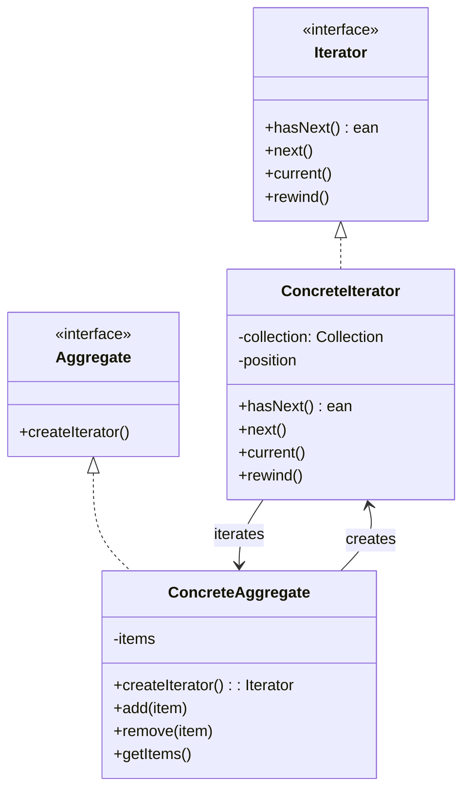
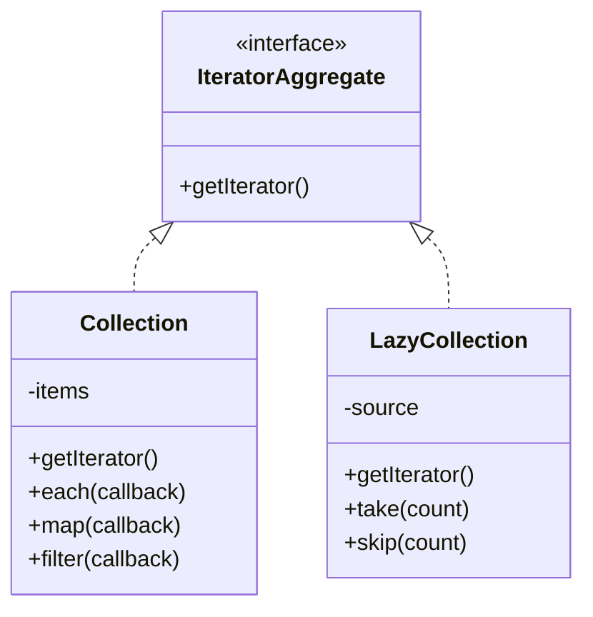

# Iterator Pattern

## Overview

The Iterator pattern provides a way to access the elements of an aggregate object sequentially without exposing its underlying representation. It defines a standard interface for traversing a collection of objects.

## Architecture Diagrams

### Iterator Pattern Class Diagram


### Laravel Collection Iterator


## Implementation in Laravel

### 1. Basic Iterator Interface

```php
<?php

namespace App\Patterns\Iterator;

interface CustomIterator
{
    public function hasNext();
    public function next();
    public function current();
    public function rewind();
    public function key();
}
```

### 2. Collection Classes

```php
<?php

namespace App\Patterns\Iterator;

class UserCollection implements \IteratorAggregate, \Countable
{
    private array $users = [];
    
    public function addUser($user)
    {
        $this->users[] = $user;
    }
    
    public function removeUser($user)
    {
        $key = array_search($user, $this->users, true);
        if ($key !== false) {
            unset($this->users[$key]);
            $this->users = array_values($this->users);
            return true;
        }
        return false;
    }
    
    public function getIterator(): UserIterator
    {
        return new UserIterator($this->users);
    }
    
    public function count()
    {
        return count($this->users);
    }
}

class ProductCollection implements \IteratorAggregate
{
    private array $products = [];
    
    public function addProduct($product)
    {
        $this->products[] = $product;
    }
    
    public function getIterator(): ProductIterator
    {
        return new ProductIterator($this->products);
    }
    
    public function getCategoryIterator(string $category): ProductIterator
    {
        $categoryProducts = array_filter($this->products, function ($product) use ($category) {
            return $product->category === $category;
        });
        
        return new ProductIterator(array_values($categoryProducts));
    }
}
```

### 3. Concrete Iterators

```php
<?php

namespace App\Patterns\Iterator;

class UserIterator implements CustomIterator
{
    private array $users;
    private int $position = 0;
    
    public function __construct(array $users)
    {
        $this->users = $users;
    }
    
    public function hasNext()
    {
        return $this->position < count($this->users);
    }
    
    public function next()
    {
        if (!$this->hasNext()) {
            return null;
        }
        
        $user = $this->users[$this->position];
        $this->position++;
        return $user;
    }
    
    public function current()
    {
        return $this->users[$this->position] ?? null;
    }
    
    public function rewind()
    {
        $this->position = 0;
    }
    
    public function key()
    {
        return $this->position;
    }
    
    public function filterByRole(string $role): UserIterator
    {
        $filteredUsers = array_filter($this->users, function ($user) use ($role) {
            return $user->role === $role;
        });
        
        return new UserIterator(array_values($filteredUsers));
    }
}

class ProductIterator implements CustomIterator
{
    private array $products;
    private int $position = 0;
    
    public function __construct(array $products)
    {
        $this->products = $products;
    }
    
    public function hasNext()
    {
        return $this->position < count($this->products);
    }
    
    public function next()
    {
        if (!$this->hasNext()) {
            return null;
        }
        
        $product = $this->products[$this->position];
        $this->position++;
        return $product;
    }
    
    public function current()
    {
        return $this->products[$this->position] ?? null;
    }
    
    public function rewind()
    {
        $this->position = 0;
    }
    
    public function key()
    {
        return $this->position;
    }
    
    public function sortByPrice(string $direction = 'asc'): ProductIterator
    {
        $sortedProducts = $this->products;
        
        usort($sortedProducts, function ($a, $b) use ($direction) {
            if ($direction === 'asc') {
                return $a->price <=> $b->price;
            } else {
                return $b->price <=> $a->price;
            }
        });
        
        return new ProductIterator($sortedProducts);
    }
}
```

### 4. Laravel Service Implementation

```php
<?php

namespace App\Services;

use App\Patterns\Iterator\{UserCollection, ProductCollection};
use App\Models\{User, Product};

class DataIteratorService
{
    public function getUserCollection(): UserCollection
    {
        $collection = new UserCollection();
        
        $users = User::all();
        foreach ($users as $user) {
            $collection->addUser($user);
        }
        
        return $collection;
    }
    
    public function processUsers(callable $callback)
    {
        $collection = $this->getUserCollection();
        $results = [];
        
        foreach ($collection as $user) {
            $results[] = $callback($user);
        }
        
        return $results;
    }
    
    public function generateUserReport()
    {
        $collection = $this->getUserCollection();
        $report = [
            'total_users' => $collection->count(),
            'active_users' => 0,
            'roles' => []
        ];
        
        foreach ($collection as $user) {
            if ($user->status === 'active') {
                $report['active_users']++;
            }
            
            $role = $user->role ?? 'user';
            if (!isset($report['roles'][$role])) {
                $report['roles'][$role] = 0;
            }
            $report['roles'][$role]++;
        }
        
        return $report;
    }
}
```

### 5. Database Query Iterator

```php
<?php

namespace App\Iterators;

class DatabaseResultIterator implements \Iterator
{
    private $query;
    private $currentBatch = [];
    private $batchSize;
    private $currentIndex = 0;
    private $batchIndex = 0;
    
    public function __construct($query, int $batchSize = 1000)
    {
        $this->query = $query;
        $this->batchSize = $batchSize;
    }
    
    public function rewind()
    {
        $this->currentIndex = 0;
        $this->batchIndex = 0;
        $this->loadNextBatch();
    }
    
    public function current()
    {
        return $this->currentBatch[$this->currentIndex] ?? null;
    }
    
    public function key()
    {
        return $this->batchIndex * $this->batchSize + $this->currentIndex;
    }
    
    public function next()
    {
        $this->currentIndex++;
        
        if ($this->currentIndex >= count($this->currentBatch)) {
            $this->batchIndex++;
            $this->currentIndex = 0;
            $this->loadNextBatch();
        }
    }
    
    public function valid()
    {
        return !empty($this->currentBatch) && $this->currentIndex < count($this->currentBatch);
    }
    
    private function loadNextBatch()
    {
        $offset = $this->batchIndex * $this->batchSize;
        $this->currentBatch = $this->query
            ->offset($offset)
            ->limit($this->batchSize)
            ->get()
            ->toArray();
    }
}
```

### 6. Laravel Command Implementation

```php
<?php

namespace App\Console\Commands;

use App\Services\DataIteratorService;
use Illuminate\Console\Command;

class ProcessUsersCommand extends Command
{
    protected $signature = 'users:process {--role=} {--batch=100}';
    protected $description = 'Process users using iterator pattern';
    
    public function handle(DataIteratorService $iteratorService)
    {
        $this->info('Starting user processing...');
        
        $collection = $iteratorService->getUserCollection();
        $iterator = $collection->getIterator();
        
        if ($this->option('role')) {
            $iterator = $iterator->filterByRole($this->option('role'));
        }
        
        $processed = 0;
        $iterator->rewind();
        
        while ($iterator->hasNext()) {
            $user = $iterator->next();
            $this->processUser($user);
            $processed++;
            
            if ($processed % 100 === 0) {
                $this->info("Processed {$processed} users...");
            }
        }
        
        $this->info("Completed! Processed {$processed} users total.");
        return 0;
    }
    
    private function processUser($user)
    {
        $user->last_processed_at = now();
        $user->save();
    }
}
```

## Advantages

1. **Uniform Interface**: Provides a standard way to traverse collections
2. **Encapsulation**: Hides the internal structure of collections
3. **Multiple Iterators**: Can have multiple iterators for the same collection
4. **Lazy Evaluation**: Can implement lazy loading for large datasets

## Disadvantages

1. **Complexity**: Adds complexity for simple collections
2. **Performance**: May have overhead compared to direct access
3. **Memory Usage**: May use more memory for complex iterators
4. **State Management**: Need to carefully manage iterator state

## When to Use

- When you need to traverse a collection without exposing its internal structure
- When you want to provide multiple ways to traverse the same collection
- When working with large datasets that need lazy loading
- When you need to implement custom traversal logic

## Laravel-Specific Benefits

1. **Collection Integration**: Works seamlessly with Laravel Collections
2. **Database Pagination**: Perfect for paginating large database results
3. **Memory Efficiency**: Helps process large datasets without memory issues
4. **Lazy Loading**: Supports Laravel's lazy collection features
5. **Eloquent Integration**: Can iterate over Eloquent models efficiently