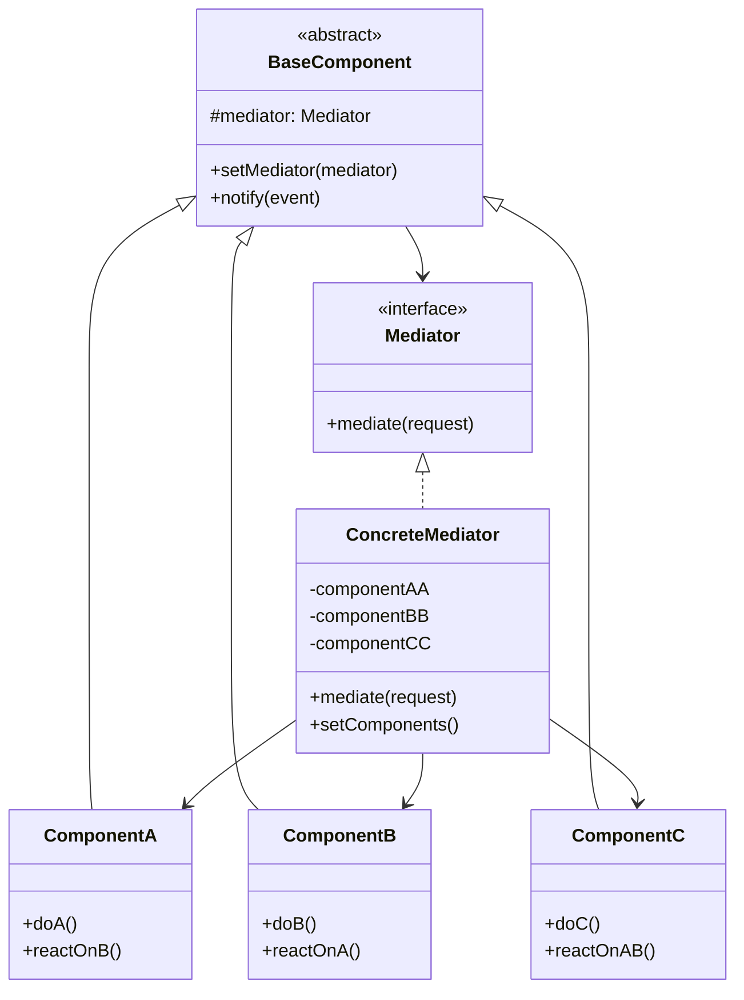
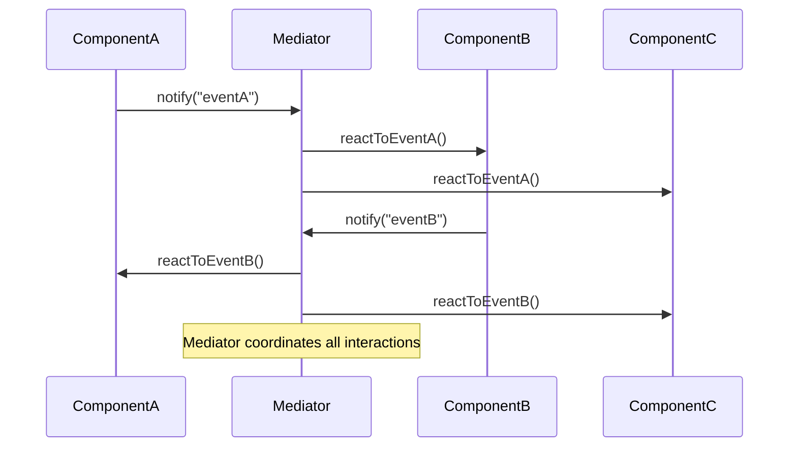
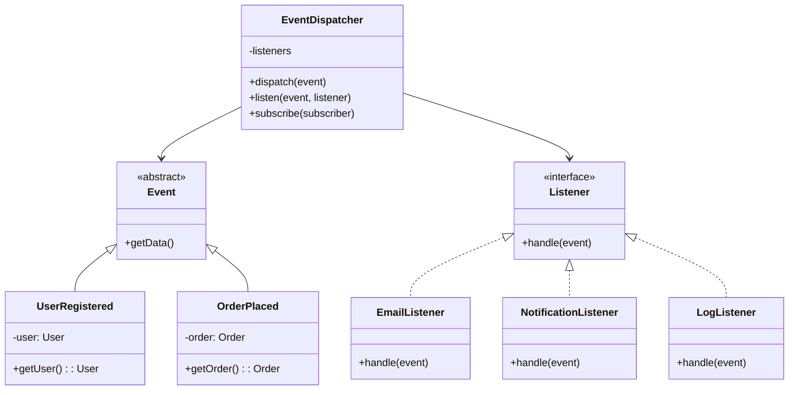

# Mediator Pattern

## Overview

The Mediator pattern defines how a set of objects interact with each other. Instead of objects communicating directly, they communicate through a central mediator object. This promotes loose coupling by keeping objects from referring to each other explicitly.

## Architecture Diagrams

### Mediator Pattern Class Diagram


### Mediator Pattern Sequence Diagram


### Laravel Event System Architecture


## Implementation in Laravel

### 1. Mediator Interface

```php
<?php

namespace App\Patterns\Mediator;

interface MediatorInterface
{
    public function mediate(string $event, $data = null);
    public function registerComponent(string $name, ComponentInterface $component);
    public function getComponent(string $name): ?ComponentInterface;
}
```

### 2. Base Component

```php
<?php

namespace App\Patterns\Mediator;

abstract class BaseComponent implements ComponentInterface
{
    protected MediatorInterface $mediator;
    
    public function setMediator(MediatorInterface $mediator)
    {
        $this->mediator = $mediator;
    }
    
    protected function notify(string $event, $data = null)
    {
        $this->mediator->mediate($event, $data);
    }
}

interface ComponentInterface
{
    public function setMediator(MediatorInterface $mediator);
}
```

### 3. Concrete Mediator

```php
<?php

namespace App\Patterns\Mediator;

class OrderProcessingMediator implements MediatorInterface
{
    private array $components = [];
    
    public function registerComponent(string $name, ComponentInterface $component)
    {
        $this->components[$name] = $component;
        $component->setMediator($this);
    }
    
    public function getComponent(string $name): ?ComponentInterface
    {
        return $this->components[$name] ?? null;
    }
    
    public function mediate(string $event, $data = null)
    {
        switch ($event) {
            case 'order.created':
                $this->handleOrderCreated($data);
                break;
                
            case 'payment.processed':
                $this->handlePaymentProcessed($data);
                break;
                
            case 'inventory.updated':
                $this->handleInventoryUpdated($data);
                break;
                
            case 'user.registered':
                $this->handleUserRegistered($data);
                break;
                
            default:
                logger()->warning("Unknown event: {$event}");
        }
    }
    
    private function handleOrderCreated($order)
    {
        // Notify inventory to reserve items
        if (isset($this->components['inventory'])) {
            $this->components['inventory']->reserveItems($order);
        }
        
        // Notify payment processor
        if (isset($this->components['payment'])) {
            $this->components['payment']->processPayment($order);
        }
        
        // Notify email service
        if (isset($this->components['email'])) {
            $this->components['email']->sendOrderConfirmation($order);
        }
        
        // Log the event
        if (isset($this->components['logger'])) {
            $this->components['logger']->logOrderCreated($order);
        }
    }
    
    private function handlePaymentProcessed($payment)
    {
        // Notify order service
        if (isset($this->components['order'])) {
            $this->components['order']->updatePaymentStatus($payment);
        }
        
        // Notify shipping service
        if (isset($this->components['shipping'])) {
            $this->components['shipping']->scheduleShipping($payment->order);
        }
        
        // Send confirmation email
        if (isset($this->components['email'])) {
            $this->components['email']->sendPaymentConfirmation($payment);
        }
    }
    
    private function handleInventoryUpdated($inventory)
    {
        // Notify product service
        if (isset($this->components['product'])) {
            $this->components['product']->updateAvailability($inventory);
        }
        
        // Check for low stock alerts
        if (isset($this->components['alert'])) {
            $this->components['alert']->checkLowStock($inventory);
        }
    }
    
    private function handleUserRegistered($user)
    {
        // Send welcome email
        if (isset($this->components['email'])) {
            $this->components['email']->sendWelcomeEmail($user);
        }
        
        // Create user profile
        if (isset($this->components['profile'])) {
            $this->components['profile']->createProfile($user);
        }
        
        // Log registration
        if (isset($this->components['logger'])) {
            $this->components['logger']->logUserRegistration($user);
        }
    }
}
```

### 4. Concrete Components

```php
<?php

namespace App\Patterns\Mediator\Components;

use App\Patterns\Mediator\BaseComponent;

class OrderComponent extends BaseComponent
{
    public function createOrder($orderData)
    {
        // Create order logic
        $order = $this->processOrderData($orderData);
        
        // Notify mediator about order creation
        $this->notify('order.created', $order);
    }
    
    public function updatePaymentStatus($payment)
    {
        // Update order payment status
        $order = $this->findOrder($payment->order_id);
        $order->payment_status = $payment->status;
        $order->save();
        
        if ($payment->status === 'completed') {
            $this->notify('order.payment_completed', $order);
        }
    }
    
    private function processOrderData($data): object
    {
        return (object) [
            'id' => uniqid(),
            'items' => $data['items'],
            'total' => $data['total'],
            'user_id' => $data['user_id'],
            'status' => 'pending'
        ];
    }
    
    private function findOrder($orderId): object
    {
        // Mock order retrieval
        return (object) ['id' => $orderId, 'payment_status' => 'pending'];
    }
}

class PaymentComponent extends BaseComponent
{
    public function processPayment($order)
    {
        // Payment processing logic
        $payment = $this->chargePayment($order);
        
        // Notify mediator about payment processing
        $this->notify('payment.processed', $payment);
    }
    
    private function chargePayment($order): object
    {
        // Mock payment processing
        return (object) [
            'id' => uniqid(),
            'order_id' => $order->id,
            'amount' => $order->total,
            'status' => 'completed',
            'order' => $order
        ];
    }
}

class InventoryComponent extends BaseComponent
{
    public function reserveItems($order)
    {
        foreach ($order->items as $item) {
            $this->reserveItem($item);
        }
        
        $this->notify('inventory.updated', [
            'action' => 'reserved',
            'items' => $order->items
        ]);
    }
    
    public function updateAvailability($inventory)
    {
        // Update product availability based on inventory changes
        foreach ($inventory['items'] as $item) {
            $this->updateItemAvailability($item);
        }
    }
    
    private function reserveItem($item)
    {
        // Mock item reservation
        logger()->info("Reserved item: {$item['product_id']}, quantity: {$item['quantity']}");
    }
    
    private function updateItemAvailability($item)
    {
        // Mock availability update
        logger()->info("Updated availability for item: {$item['product_id']}");
    }
}

class EmailComponent extends BaseComponent
{
    public function sendOrderConfirmation($order)
    {
        $this->sendEmail($order->user_id, 'order_confirmation', [
            'order' => $order
        ]);
    }
    
    public function sendPaymentConfirmation($payment)
    {
        $this->sendEmail($payment->order->user_id, 'payment_confirmation', [
            'payment' => $payment
        ]);
    }
    
    public function sendWelcomeEmail($user)
    {
        $this->sendEmail($user->id, 'welcome', [
            'user' => $user
        ]);
    }
    
    private function sendEmail($userId, $template, $data)
    {
        // Mock email sending
        logger()->info("Sending {$template} email to user {$userId}");
    }
}
```

### 5. Laravel Service Implementation

```php
<?php

namespace App\Services;

use App\Patterns\Mediator\OrderProcessingMediator;
use App\Patterns\Mediator\Components\{
    OrderComponent,
    PaymentComponent,
    InventoryComponent,
    EmailComponent
};

class OrderMediatorService
{
    private OrderProcessingMediator $mediator;
    
    public function __construct()
    {
        $this->mediator = new OrderProcessingMediator();
        $this->setupComponents();
    }
    
    private function setupComponents()
    {
        // Register all components
        $this->mediator->registerComponent('order', new OrderComponent());
        $this->mediator->registerComponent('payment', new PaymentComponent());
        $this->mediator->registerComponent('inventory', new InventoryComponent());
        $this->mediator->registerComponent('email', new EmailComponent());
    }
    
    public function processOrder(array $orderData)
    {
        $orderComponent = $this->mediator->getComponent('order');
        $orderComponent->createOrder($orderData);
    }
    
    public function getMediator(): OrderProcessingMediator
    {
        return $this->mediator;
    }
}
```

### 6. Laravel Controller Implementation

```php
<?php

namespace App\Http\Controllers;

use App\Services\OrderMediatorService;
use Illuminate\Http\Request;
use Illuminate\Http\JsonResponse;

class OrderController extends Controller
{
    private OrderMediatorService $orderService;
    
    public function __construct(OrderMediatorService $orderService)
    {
        $this->orderService = $orderService;
    }
    
    public function store(Request $request): JsonResponse
    {
        $validated = $request->validate([
            'items' => 'required|array',
            'items.*.product_id' => 'required|integer',
            'items.*.quantity' => 'required|integer|min:1',
            'total' => 'required|numeric|min:0',
            'user_id' => 'required|integer'
        ]);
        
        try {
            $this->orderService->processOrder($validated);
            
            return response()->json([
                'success' => true,
                'message' => 'Order processed successfully'
            ]);
            
        } catch (\Exception $e) {
            return response()->json([
                'success' => false,
                'message' => 'Order processing failed: ' . $e->getMessage()
            ], 500);
        }
    }
}
```

## Laravel Integration Examples

### 1. Event-Driven Mediator

```php
<?php

namespace App\Mediators;

use Illuminate\Events\Dispatcher;

class LaravelEventMediator implements MediatorInterface
{
    private Dispatcher $eventDispatcher;
    private array $components = [];
    
    public function __construct(Dispatcher $eventDispatcher)
    {
        $this->eventDispatcher = $eventDispatcher;
    }
    
    public function mediate(string $event, $data = null)
    {
        // Use Laravel's event system as the mediation mechanism
        $this->eventDispatcher->dispatch($event, $data);
    }
    
    public function registerComponent(string $name, ComponentInterface $component)
    {
        $this->components[$name] = $component;
        $component->setMediator($this);
    }
    
    public function getComponent(string $name): ?ComponentInterface
    {
        return $this->components[$name] ?? null;
    }
}
```

### 2. Job-Based Mediator

```php
<?php

namespace App\Mediators;

use Illuminate\Foundation\Bus\DispatchesJobs;

class JobQueueMediator implements MediatorInterface
{
    use DispatchesJobs;
    
    private array $components = [];
    
    public function mediate(string $event, $data = null)
    {
        // Dispatch jobs based on events
        switch ($event) {
            case 'user.registered':
                $this->dispatch(new \App\Jobs\SendWelcomeEmail($data));
                $this->dispatch(new \App\Jobs\CreateUserProfile($data));
                break;
                
            case 'order.created':
                $this->dispatch(new \App\Jobs\ProcessPayment($data));
                $this->dispatch(new \App\Jobs\ReserveInventory($data));
                break;
        }
    }
    
    public function registerComponent(string $name, ComponentInterface $component)
    {
        $this->components[$name] = $component;
        $component->setMediator($this);
    }
    
    public function getComponent(string $name): ?ComponentInterface
    {
        return $this->components[$name] ?? null;
    }
}
```

## Advantages

1. **Loose Coupling**s don't need to know about each other directly
2. **Centralized Control**: All interactions are managed in one place  
3. **Reusability**s can be reused in different contexts
4. **Maintainability**: Easy to modify interaction logic

## Disadvantages

1. **Complexity**: The mediator can become a complex "god object"
2. **Single Point of Failure**: If the mediator fails, the entire system may fail
3. **Performance**: Additional layer of indirection may impact performance
4. **Tight Coupling to Mediator**s become tightly coupled to the mediator

## When to Use

- When you have a set of objects that communicate in complex but well-defined ways
- When reusing an object is difficult because it communicates with many other objects
- When you want to customize behavior that's distributed between several classes without subclassing
- When object interactions need to be easily configurable or changeable at runtime

## Laravel-Specific Benefits

1. **Event System Integration**: Works seamlessly with Laravel's event system
2. **Job Queue Integration**: Can dispatch jobs for asynchronous processing
3. **Service Container**: Easy dependency injection and component management
4. **Middleware Integration**: Can be used in middleware chains
5. **Testing**: Easy to mock and test individual components