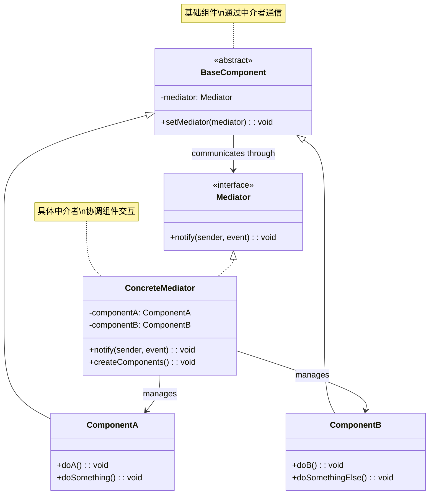
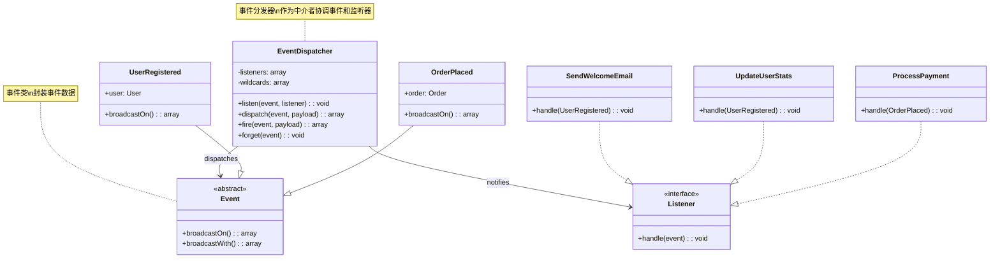
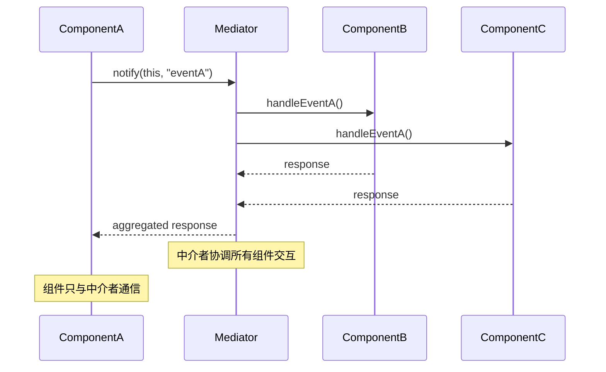
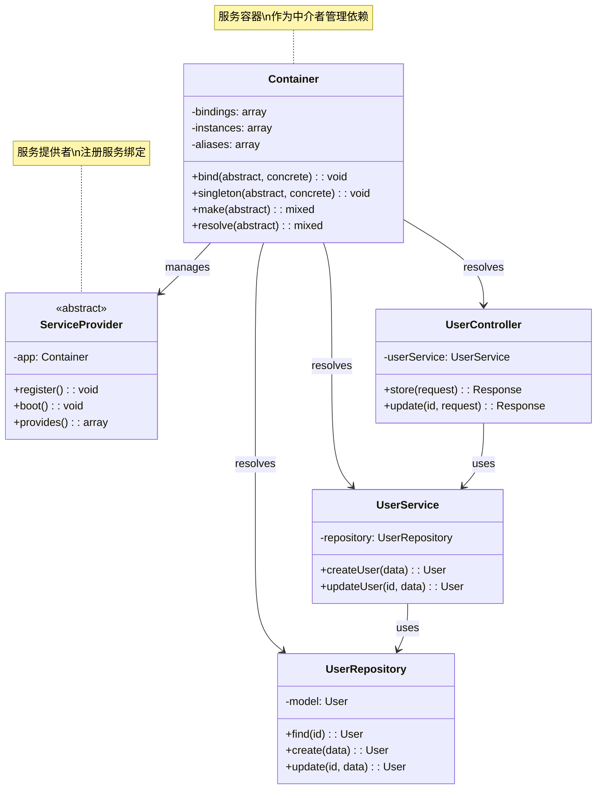
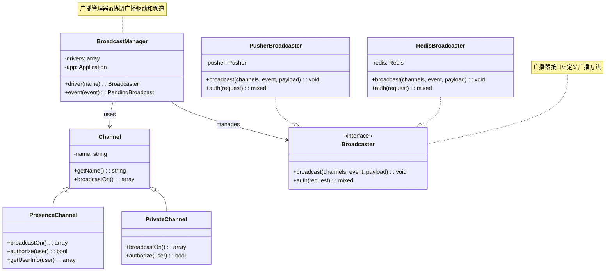
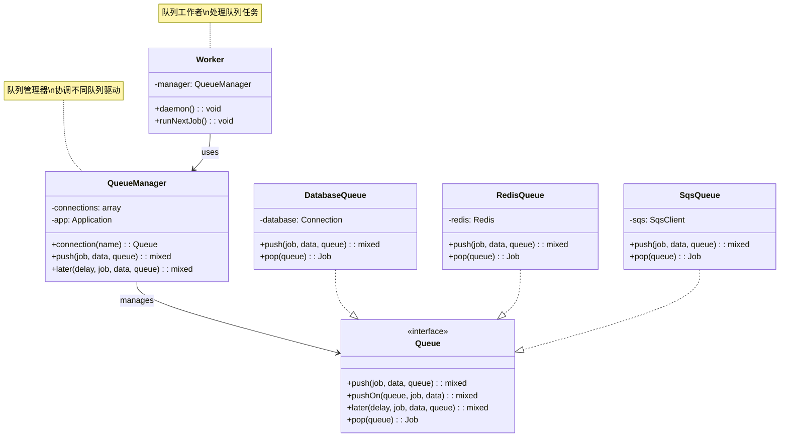

# 中介者模式 (Mediator Pattern)

## 概述

中介者模式用一个中介对象来封装一系列的对象交互。中介者使各对象不需要显式地相互引用，从而使其耦合松散，而且可以独立地改变它们之间的交互。

## 架构图

### 中介者模式类图


### Laravel 事件系统中介者架构


### 中介者模式时序图


### Laravel 服务容器中介者


### Laravel 广播系统中介者


### Laravel 队列系统中介者


## 设计意图

- **解耦对象**：减少对象间的直接依赖
- **集中控制**：将对象交互逻辑集中到中介者
- **简化通信**：简化对象间的复杂通信
- **提高灵活性**：易于添加新的交互对象

## Laravel 中的实现

### 1. 事件系统中介者

Laravel 的事件系统是中介者模式的典型实现：

```php
// Illuminate\Events\Dispatcher.php
class Dispatcher implements EventDispatcher
{
    protected $listeners = [];
    protected $wildcards = [];
    
    // 中介者：协调事件发布和监听
    public function dispatch($event, $payload = [], $halt = false)
    {
        // 获取事件的所有监听器
        $listeners = $this->getListeners($event);
        
        $responses = [];
        
        // 通知所有监听器
        foreach ($listeners as $listener) {
            $response = $listener($event, $payload);
            
            // 如果监听器返回了非空响应且需要停止传播
            if ($halt && ! is_null($response)) {
                return $response;
            }
            
            // 如果监听器返回false，停止传播
            if ($response === false) {
                break;
            }
            
            $responses[] = $response;
        }
        
        return $halt ? null : $responses;
    }
    
    // 注册事件监听器
    public function listen($events, $listener)
    {
        foreach ((array) $events as $event) {
            if (str_contains($event, '*')) {
                $this->setupWildcardListen($event, $listener);
            } else {
                $this->listeners[$event][] = $this->makeListener($listener);
            }
        }
    }
    
    // 获取事件的所有监听器
    public function getListeners($eventName)
    {
        $listeners = $this->listeners[$eventName] ?? [];
        $listeners = array_merge($listeners, $this->getWildcardListeners($eventName));
        
        return class_exists($eventName, false)
            ? $this->addInterfaceListeners($eventName, $listeners)
            : $listeners;
    }
}

// 使用示例
$dispatcher = new Dispatcher();

// 注册监听器（同事对象）
$dispatcher->listen('user.registered', function ($event) {
    // 发送欢迎邮件
    Mail::to($event->user)->send(new WelcomeEmail());
});

$dispatcher->listen('user.registered', function ($event) {
    // 创建用户配置文件
    UserProfile::createForUser($event->user);
});

// 触发事件（通过中介者协调）
$dispatcher->dispatch(new UserRegistered($user));
```

### 2. 消息队列中介者

Laravel 的队列系统也使用了中介者模式：

```php
// Illuminate\Queue\QueueManager.php
class QueueManager implements Factory
{
    protected $connectors = [];
    protected $connections = [];
    
    // 中介者：协调队列连接和作业处理
    public function push($job, $data = '', $queue = null)
    {
        return $this->connection($queue)->push($job, $data);
    }
    
    public function pushOn($queue, $job, $data = '')
    {
        return $this->connection($queue)->push($job, $data);
    }
    
    public function later($delay, $job, $data = '', $queue = null)
    {
        return $this->connection($queue)->later($delay, $job, $data);
    }
    
    // 获取队列连接
    public function connection($name = null)
    {
        $name = $name ?: $this->getDefaultDriver();
        
        if (! isset($this->connections[$name])) {
            $this->connections[$name] = $this->resolve($name);
        }
        
        return $this->connections[$name];
    }
}

// 使用示例
$queue = app('queue');

// 不同的作业通过中介者协调
$queue->push(new ProcessPodcast($podcast));
$queue->push(new SendNotification($user));
$queue->later(60, new CleanupExpiredSessions());
```

### 3. 广播系统中介者

Laravel 的广播系统使用中介者模式协调广播驱动：

```php
// Illuminate\Broadcasting\BroadcastManager.php
class BroadcastManager implements Factory
{
    protected $app;
    protected $drivers = [];
    
    // 中介者：协调不同的广播驱动
    public function driver($name = null)
    {
        $name = $name ?: $this->getDefaultDriver();
        
        return $this->drivers[$name] = $this->get($name);
    }
    
    protected function get($name)
    {
        return $this->drivers[$name] ?? $this->resolve($name);
    }
    
    protected function resolve($name)
    {
        $config = $this->getConfig($name);
        
        if (is_null($config)) {
            throw new InvalidArgumentException("Broadcast driver [{$name}] is not defined.");
        }
        
        $driverMethod = 'create'.ucfirst($config['driver']).'Driver';
        
        if (method_exists($this, $driverMethod)) {
            return $this->{$driverMethod}($config);
        }
        
        throw new InvalidArgumentException("Driver [{$config['driver']}] is not supported.");
    }
    
    // 广播事件到所有连接的客户端
    public function broadcast(array $channels, $event, array $payload = [])
    {
        $driver = $this->driver();
        
        foreach ($channels as $channel) {
            $driver->broadcast([$channel], $event, $payload);
        }
    }
}
```

## 实际应用场景

### 1. 聊天室中介者

实现聊天室的中介者模式：

```php
class ChatRoom implements ChatRoomMediator
{
    protected $users = [];
    
    public function addUser(User $user)
    {
        $this->users[$user->getName()] = $user;
        $user->setChatRoom($this);
    }
    
    public function sendMessage($message, User $sender)
    {
        foreach ($this->users as $name => $user) {
            // 不发送消息给发送者自己
            if ($user !== $sender) {
                $user->receive($message, $sender);
            }
        }
    }
    
    public function sendPrivateMessage($message, User $sender, User $receiver)
    {
        if (isset($this->users[$receiver->getName()])) {
            $this->users[$receiver->getName()]->receive($message, $sender);
        }
    }
}

class User
{
    protected $name;
    protected $chatRoom;
    
    public function __construct($name)
    {
        $this->name = $name;
    }
    
    public function setChatRoom(ChatRoomMediator $chatRoom)
    {
        $this->chatRoom = $chatRoom;
    }
    
    public function getName()
    {
        return $this->name;
    }
    
    public function send($message)
    {
        $this->chatRoom->sendMessage($message, $this);
    }
    
    public function sendTo($message, User $receiver)
    {
        $this->chatRoom->sendPrivateMessage($message, $this, $receiver);
    }
    
    public function receive($message, User $sender)
    {
        echo "{$this->name} 收到来自 {$sender->getName()} 的消息: {$message}\n";
    }
}

// 使用示例
$chatRoom = new ChatRoom();

$john = new User('John');
$jane = new User('Jane');
$doe = new User('Doe');

$chatRoom->addUser($john);
$chatRoom->addUser($jane);
$chatRoom->addUser($doe);

$john->send('大家好！'); // 所有用户都会收到消息
$jane->sendTo('你好 John!', $john); // 只有 John 收到私信
```

### 2. 订单处理中介者

电商系统中的订单处理中介者：

```php
class OrderProcessor implements OrderMediator
{
    protected $handlers = [];
    
    public function registerHandler($event, OrderHandler $handler)
    {
        $this->handlers[$event][] = $handler;
    }
    
    public function processOrder(Order $order, $event)
    {
        if (!isset($this->handlers[$event])) {
            return;
        }
        
        foreach ($this->handlers[$event] as $handler) {
            $handler->handle($order, $this);
        }
    }
    
    public function notifyInventory(Order $order)
    {
        // 通知库存系统
        InventorySystem::updateStock($order->getItems());
    }
    
    public function notifyShipping(Order $order)
    {
        // 通知物流系统
        ShippingSystem::createShipment($order);
    }
    
    public function notifyAccounting(Order $order)
    {
        // 通知财务系统
        AccountingSystem::createInvoice($order);
    }
}

interface OrderHandler
{
    public function handle(Order $order, OrderMediator $mediator);
}

class InventoryHandler implements OrderHandler
{
    public function handle(Order $order, OrderMediator $mediator)
    {
        $mediator->notifyInventory($order);
    }
}

class ShippingHandler implements OrderHandler
{
    public function handle(Order $order, OrderMediator $mediator)
    {
        $mediator->notifyShipping($order);
    }
}

// 使用示例
$processor = new OrderProcessor();
$processor->registerHandler('order.created', new InventoryHandler());
$processor->registerHandler('order.created', new ShippingHandler());
$processor->registerHandler('order.created', new AccountingHandler());

$order = new Order(/* ... */);
$processor->processOrder($order, 'order.created');
```

### 3. 工作流引擎中介者

业务流程管理中的中介者模式：

```php
class WorkflowEngine implements WorkflowMediator
{
    protected $activities = [];
    protected $transitions = [];
    protected $currentState;
    
    public function registerActivity($name, Activity $activity)
    {
        $this->activities[$name] = $activity;
        $activity->setMediator($this);
    }
    
    public function addTransition($from, $to, $condition = null)
    {
        $this->transitions[$from][] = compact('to', 'condition');
    }
    
    public function start($initialActivity)
    {
        $this->currentState = $initialActivity;
        $this->activities[$initialActivity]->execute();
    }
    
    public function notify($activity, $event, $data = null)
    {
        if ($activity === $this->currentState) {
            $this->handleTransition($event, $data);
        }
    }
    
    protected function handleTransition($event, $data)
    {
        if (!isset($this->transitions[$this->currentState])) {
            return;
        }
        
        foreach ($this->transitions[$this->currentState] as $transition) {
            if ($transition['condition'] === null || $transition['condition']($event, $data)) {
                $this->currentState = $transition['to'];
                $this->activities[$this->currentState]->execute();
                break;
            }
        }
    }
}

abstract class Activity
{
    protected $mediator;
    
    public function setMediator(WorkflowMediator $mediator)
    {
        $this->mediator = $mediator;
    }
    
    abstract public function execute();
}
```

## 源码分析要点

### 1. 中介者接口设计

中介者模式的核心是定义清晰的通信接口：

```php
interface Mediator
{
    public function notify($sender, $event, $data = null);
}

class ConcreteMediator implements Mediator
{
    protected $components = [];
    
    public function register($name, Component $component)
    {
        $this->components[$name] = $component;
        $component->setMediator($this);
    }
    
    public function notify($sender, $event, $data = null)
    {
        // 根据事件类型协调组件间的交互
        switch ($event) {
            case 'A_event':
                $this->components['B']->doSomething($data);
                break;
            case 'B_event':
                $this->components['C']->doAnotherThing($data);
                break;
        }
    }
}
```

### 2. 组件基类设计

组件对象需要知道中介者：

```php
abstract class Component
{
    protected $mediator;
    
    public function setMediator(Mediator $mediator)
    {
        $this->mediator = $mediator;
    }
    
    public function changed($event, $data = null)
    {
        $this->mediator->notify($this, $event, $data);
    }
}

class ConcreteComponent extends Component
{
    public function doSomething()
    {
        // 执行操作
        $this->changed('something_done', $result);
    }
}
```

### 3. 事件驱动通信

中介者模式通常采用事件驱动的方式：

```php
class EventDrivenMediator
{
    protected $eventListeners = [];
    
    public function on($event, callable $listener)
    {
        $this->eventListeners[$event][] = $listener;
    }
    
    public function emit($event, $data = null)
    {
        if (isset($this->eventListeners[$event])) {
            foreach ($this->eventListeners[$event] as $listener) {
                $listener($data);
            }
        }
    }
}
```

## 最佳实践

### 1. 合理使用中介者模式

**适用场景：**
- 对象间存在复杂的网状引用关系
- 需要集中控制对象间的交互
- 对象间的通信逻辑经常变化
- 需要支持广播通信

**不适用场景：**
- 对象间关系简单，直接通信即可
- 性能要求极高，中介者可能成为瓶颈
- 对象数量很少，中介者显得过度设计

### 2. Laravel 中的中介者实践

**使用事件系统解耦：**
```php
// 定义事件
class OrderShipped extends Event
{
    public $order;
    
    public function __construct(Order $order)
    {
        $this->order = $order;
    }
}

// 定义监听器
class SendShipmentNotification implements ShouldQueue
{
    public function handle(OrderShipped $event)
    {
        // 发送发货通知
        Mail::to($event->order->user)->send(new ShipmentNotification($event->order));
    }
}

class UpdateInventory implements ShouldQueue
{
    public function handle(OrderShipped $event)
    {
        // 更新库存
        foreach ($event->order->items as $item) {
            Inventory::decrement($item->product_id, $item->quantity);
        }
    }
}

// 注册事件监听
Event::listen(OrderShipped::class, SendShipmentNotification::class);
Event::listen(OrderShipped::class, UpdateInventory::class);

// 触发事件（通过中介者协调）
event(new OrderShipped($order));
```

**使用消息队列协调任务：**
```php
// 不同的作业通过队列中介者协调
Bus::chain([
    new ProcessPayment($order),
    new UpdateInventory($order),
    new SendConfirmationEmail($order),
    new CreateShippingLabel($order),
])->dispatch();
```

**使用广播系统协调实时通信：**
```php
// 广播事件到多个频道
broadcast(new NewMessage($message))
    ->toOthers()
    ->via(['pusher', 'redis']);
```

### 3. 测试中介者模式

**测试中介者协调功能：**
```php
public function test_mediator_coordinates_components()
{
    $mediator = new ConcreteMediator();
    $componentA = new ComponentA();
    $componentB = new ComponentB();
    
    $mediator->register('A', $componentA);
    $mediator->register('B', $componentB);
    
    // 测试组件A的操作会触发组件B
    $componentA->doSomething();
    
    $this->assertTrue($componentB->wasTriggered());
}

public function test_event_driven_communication()
{
    $mediator = new EventDrivenMediator();
    $result = null;
    
    $mediator->on('user.registered', function ($user) use (&$result) {
        $result = $user;
    });
    
    $mediator->emit('user.registered', 'John Doe');
    
    $this->assertEquals('John Doe', $result);
}
```

## 与其他模式的关系

### 1. 与观察者模式

中介者模式常与观察者模式结合：

```php
class ObservableMediator implements SplSubject
{
    protected $observers = [];
    
    public function attach(SplObserver $observer)
    {
        $this->observers[] = $observer;
    }
    
    public function detach(SplObserver $observer)
    {
        $key = array_search($observer, $this->observers, true);
        if ($key !== false) {
            unset($this->observers[$key]);
        }
    }
    
    public function notify($event, $data = null)
    {
        foreach ($this->observers as $observer) {
            $observer->update($this, compact('event', 'data'));
        }
    }
}
```

### 2. 与命令模式

中介者模式可以使用命令模式封装交互逻辑：

```php
class CommandMediator
{
    protected $commands = [];
    
    public function registerCommand($name, Command $command)
    {
        $this->commands[$name] = $command;
    }
    
    public function execute($commandName, $data = null)
    {
        if (isset($this->commands[$commandName])) {
            return $this->commands[$commandName]->execute($data);
        }
        
        throw new InvalidArgumentException("Command {$commandName} not found");
    }
}
```

### 3. 与门面模式

中介者模式与门面模式的区别：
- **中介者**：协调同事对象间的交互
- **门面**：为子系统提供简化接口

## 性能考虑

### 1. 中介者性能优化

对于高性能场景，可以优化中介者的性能：

```php
class OptimizedMediator
{
    protected $handlers = [];
    protected $cache = [];
    
    public function registerHandler($event, callable $handler)
    {
        $this->handlers[$event][] = $handler;
        $this->cache[$event] = null; // 清除缓存
    }
    
    public function notify($event, $data = null)
    {
        // 使用缓存优化性能
        if (!isset($this->cache[$event])) {
            $this->cache[$event] = $this->handlers[$event] ?? [];
        }
        
        foreach ($this->cache[$event] as $handler) {
            $handler($data);
        }
    }
}
```

### 2. 异步中介者

对于耗时操作，使用异步中介者：

```php
class AsyncMediator
{
    protected $eventLoop;
    
    public function notifyAsync($event, $data = null)
    {
        // 使用事件循环异步处理
        $this->eventLoop->addTimer(0, function () use ($event, $data) {
            $this->notify($event, $data);
        });
    }
}
```

## 总结

中介者模式在 Laravel 框架中有着广泛的应用，特别是在事件系统、队列系统和广播系统中。它通过引入中介者对象来封装对象间的复杂交互，实现了对象间的解耦和通信的集中控制。

中介者模式的优势在于：
- **降低耦合**：对象间不直接引用，通过中介者通信
- **集中控制**：交互逻辑集中在中介者中，易于维护
- **扩展性**：易于添加新的交互对象
- **灵活性**：可以独立改变对象间的交互方式

在 Laravel 开发中，合理使用中介者模式可以创建出松耦合、易维护的系统架构，特别是在需要协调多个组件或服务的复杂业务场景中。