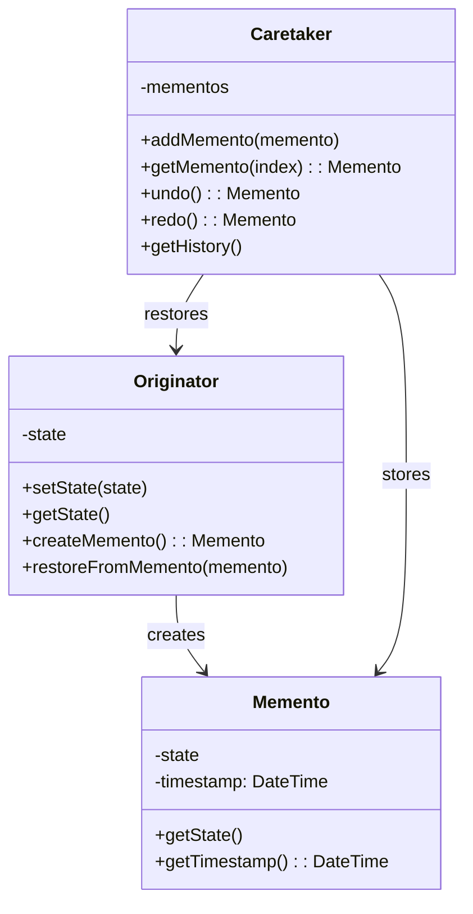
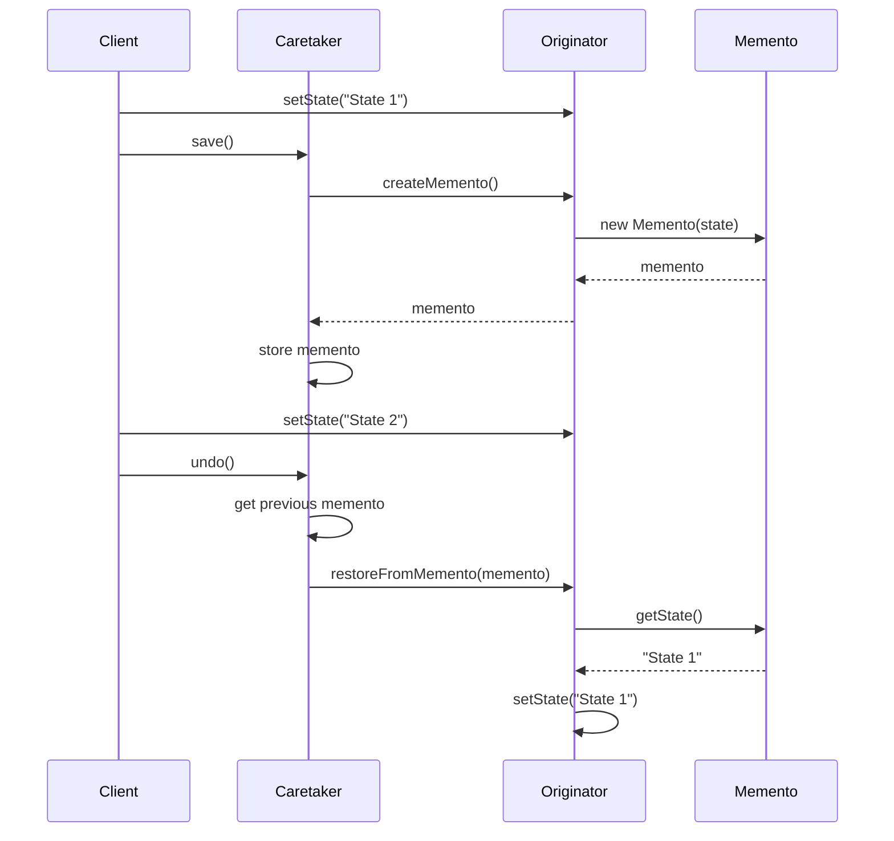
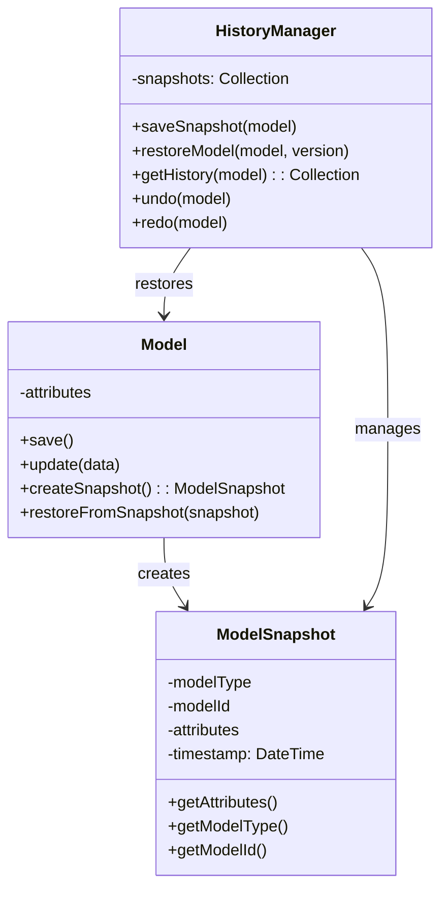

# Memento Pattern

## Overview

The Memento pattern captures and externalizes an object's internal state without violating encapsulation, so that the object can be restored to this state later. It's particularly useful for implementing undo/redo functionality, checkpoints, and state snapshots.

## Architecture Diagrams

### Memento Pattern Class Diagram


### Memento Pattern Sequence Diagram


### Laravel Model History Architecture


## Implementation in Laravel

### 1. Basic Memento Classes

```php
<?php

namespace App\Patterns\Memento;

class Memento
{
    private array $state;
    private \DateTime $timestamp;
    private string $description;
    
    public function __construct(array $state, string $description = '')
    {
        $this->state = $state;
        $this->timestamp = new \DateTime();
        $this->description = $description;
    }
    
    public function getState()
    {
        return $this->state;
    }
    
    public function getTimestamp(): \DateTime
    {
        return $this->timestamp;
    }
    
    public function getDescription()
    {
        return $this->description;
    }
    
    public function getSize()
    {
        return strlen(serialize($this->state));
    }
}

class MementoCaretaker
{
    private array $mementos = [];
    private int $currentIndex = -1;
    private int $maxHistory = 50;
    
    public function save(Memento $memento)
    {
        // Remove any mementos after current index (for redo functionality)
        $this->mementos = array_slice($this->mementos, 0, $this->currentIndex + 1);
        
        // Add new memento
        $this->mementos[] = $memento;
        $this->currentIndex++;
        
        // Limit history size
        if (count($this->mementos) > $this->maxHistory) {
            array_shift($this->mementos);
            $this->currentIndex--;
        }
    }
    
    public function undo(): ?Memento
    {
        if ($this->currentIndex > 0) {
            $this->currentIndex--;
            return $this->mementos[$this->currentIndex];
        }
        
        return null;
    }
    
    public function redo(): ?Memento
    {
        if ($this->currentIndex < count($this->mementos) - 1) {
            $this->currentIndex++;
            return $this->mementos[$this->currentIndex];
        }
        
        return null;
    }
    
    public function getCurrentMemento(): ?Memento
    {
        return $this->mementos[$this->currentIndex] ?? null;
    }
    
    public function getHistory()
    {
        return array_map(function ($memento, $index) {
            return [
                'index' => $index,
                'timestamp' => $memento->getTimestamp(),
                'description' => $memento->getDescription(),
                'size' => $memento->getSize(),
                'is_current' => $index === $this->currentIndex
            ];
        }, $this->mementos, array_keys($this->mementos));
    }
    
    public function canUndo()
    {
        return $this->currentIndex > 0;
    }
    
    public function canRedo()
    {
        return $this->currentIndex < count($this->mementos) - 1;
    }
    
    public function clear()
    {
        $this->mementos = [];
        $this->currentIndex = -1;
    }
}
```

### 2. Document Editor Implementation

```php
<?php

namespace App\Patterns\Memento;

class DocumentEditor
{
    private string $content = '';
    private string $title = '';
    private array $metadata = [];
    private MementoCaretaker $caretaker;
    
    public function __construct()
    {
        $this->caretaker = new MementoCaretaker();
        $this->saveState('Initial state');
    }
    
    public function setContent(string $content)
    {
        $this->content = $content;
    }
    
    public function getContent()
    {
        return $this->content;
    }
    
    public function setTitle(string $title)
    {
        $this->title = $title;
    }
    
    public function getTitle()
    {
        return $this->title;
    }
    
    public function setMetadata(array $metadata)
    {
        $this->metadata = $metadata;
    }
    
    public function getMetadata()
    {
        return $this->metadata;
    }
    
    public function saveState(string $description = '')
    {
        $state = [
            'content' => $this->content,
            'title' => $this->title,
            'metadata' => $this->metadata
        ];
        
        $memento = new Memento($state, $description);
        $this->caretaker->save($memento);
    }
    
    public function undo()
    {
        $memento = $this->caretaker->undo();
        
        if ($memento) {
            $this->restoreFromMemento($memento);
            return true;
        }
        
        return false;
    }
    
    public function redo()
    {
        $memento = $this->caretaker->redo();
        
        if ($memento) {
            $this->restoreFromMemento($memento);
            return true;
        }
        
        return false;
    }
    
    private function restoreFromMemento(Memento $memento)
    {
        $state = $memento->getState();
        
        $this->content = $state['content'];
        $this->title = $state['title'];
        $this->metadata = $state['metadata'];
    }
    
    public function getHistory()
    {
        return $this->caretaker->getHistory();
    }
    
    public function canUndo()
    {
        return $this->caretaker->canUndo();
    }
    
    public function canRedo()
    {
        return $this->caretaker->canRedo();
    }
    
    public function insertText(string $text, int $position = null)
    {
        if ($position === null) {
            $this->content .= $text;
        } else {
            $this->content = substr_replace($this->content, $text, $position, 0);
        }
        
        $this->saveState("Inserted text: " . substr($text, 0, 20) . "...");
    }
    
    public function deleteText(int $start, int $length)
    {
        $deletedText = substr($this->content, $start, $length);
        $this->content = substr_replace($this->content, '', $start, $length);
        
        $this->saveState("Deleted text: " . substr($deletedText, 0, 20) . "...");
    }
    
    public function replaceText(string $search, string $replace)
    {
        $this->content = str_replace($search, $replace, $this->content);
        $this->saveState("Replaced '{$search}' with '{$replace}'");
    }
}
```

### 3. Laravel Model History Trait

```php
<?php

namespace App\Traits;

use App\Models\ModelHistory;
use Illuminate\Database\Eloquent\Relations\HasMany;

trait HasHistory
{
    protected static function bootHasHistory()
    {
        static::updating(function ($model) {
            $model->saveHistorySnapshot('Before update');
        });
        
        static::deleting(function ($model) {
            $model->saveHistorySnapshot('Before delete');
        });
    }
    
    public function history(): HasMany
    {
        return $this->hasMany(ModelHistory::class, 'model_id')
                    ->where('model_type', static::class)
                    ->orderBy('created_at', 'desc');
    }
    
    public function saveHistorySnapshot(string $description = '')
    {
        ModelHistory::create([
            'model_type' => static::class,
            'model_id' => $this->getKey(),
            'attributes' => $this->getAttributes(),
            'description' => $description,
            'user_id' => auth()->id(),
            'ip_address' => request()->ip(),
            'user_agent' => request()->userAgent()
        ]);
    }
    
    public function restoreFromHistory(int $historyId)
    {
        $history = $this->history()->find($historyId);
        
        if (!$history) {
            return false;
        }
        
        $this->saveHistorySnapshot('Before restore to version ' . $historyId);
        
        $this->fill($history->attributes);
        $this->save();
        
        return true;
    }
    
    public function getHistoryAt(\DateTime $datetime): ?ModelHistory
    {
        return $this->history()
                    ->where('created_at', '<=', $datetime)
                    ->first();
    }
    
    public function compareWithHistory(int $historyId)
    {
        $history = $this->history()->find($historyId);
        
        if (!$history) {
            return [];
        }
        
        $currentAttributes = $this->getAttributes();
        $historicalAttributes = $history->attributes;
        
        $differences = [];
        
        foreach ($currentAttributes as $key => $value) {
            $historicalValue = $historicalAttributes[$key] ?? null;
            
            if ($value !== $historicalValue) {
                $differences[$key] = [
                    'current' => $value,
                    'historical' => $historicalValue
                ];
            }
        }
        
        return $differences;
    }
}
```

### 4. Model History Model

```php
<?php

namespace App\Models;

use Illuminate\Database\Eloquent\Model;
use Illuminate\Database\Eloquent\Relations\BelongsTo;

class ModelHistory extends Model
{
    protected $fillable = [
        'model_type',
        'model_id',
        'attributes',
        'description',
        'user_id',
        'ip_address',
        'user_agent'
    ];
    
    protected $casts = [
        'attributes' => 'array'
    ];
    
    public function user(): BelongsTo
    {
        return $this->belongsTo(User::class);
    }
    
    public function getModelInstance()
    {
        $modelClass = $this->model_type;
        return $modelClass::find($this->model_id);
    }
    
    public function getDifferencesFromCurrent()
    {
        $model = $this->getModelInstance();
        
        if (!$model) {
            return [];
        }
        
        $currentAttributes = $model->getAttributes();
        $historicalAttributes = $this->attributes;
        
        $differences = [];
        
        foreach ($currentAttributes as $key => $value) {
            $historicalValue = $historicalAttributes[$key] ?? null;
            
            if ($value !== $historicalValue) {
                $differences[$key] = [
                    'current' => $value,
                    'historical' => $historicalValue
                ];
            }
        }
        
        return $differences;
    }
}
```

### 5. Laravel Service Implementation

```php
<?php

namespace App\Services;

use App\Patterns\Memento\DocumentEditor;
use App\Models\Document;

class DocumentService
{
    private array $editors = [];
    
    public function getEditor(int $documentId): DocumentEditor
    {
        if (!isset($this->editors[$documentId])) {
            $this->editors[$documentId] = $this->createEditor($documentId);
        }
        
        return $this->editors[$documentId];
    }
    
    private function createEditor(int $documentId): DocumentEditor
    {
        $document = Document::findOrFail($documentId);
        
        $editor = new DocumentEditor();
        $editor->setTitle($document->title);
        $editor->setContent($document->content);
        $editor->setMetadata($document->metadata ?? []);
        
        return $editor;
    }
    
    public function saveDocument(int $documentId)
    {
        $editor = $this->getEditor($documentId);
        $document = Document::findOrFail($documentId);
        
        $document->update([
            'title' => $editor->getTitle(),
            'content' => $editor->getContent(),
            'metadata' => $editor->getMetadata()
        ]);
        
        return true;
    }
    
    public function undoChanges(int $documentId)
    {
        $editor = $this->getEditor($documentId);
        return $editor->undo();
    }
    
    public function redoChanges(int $documentId)
    {
        $editor = $this->getEditor($documentId);
        return $editor->redo();
    }
    
    public function getDocumentHistory(int $documentId)
    {
        $editor = $this->getEditor($documentId);
        return $editor->getHistory();
    }
    
    public function insertText(int $documentId, string $text, int $position = null)
    {
        $editor = $this->getEditor($documentId);
        $editor->insertText($text, $position);
    }
    
    public function deleteText(int $documentId, int $start, int $length)
    {
        $editor = $this->getEditor($documentId);
        $editor->deleteText($start, $length);
    }
    
    public function replaceText(int $documentId, string $search, string $replace)
    {
        $editor = $this->getEditor($documentId);
        $editor->replaceText($search, $replace);
    }
}
```

### 6. Laravel Controller Implementation

```php
<?php

namespace App\Http\Controllers;

use App\Services\DocumentService;
use Illuminate\Http\Request;
use Illuminate\Http\JsonResponse;

class DocumentController extends Controller
{
    private DocumentService $documentService;
    
    public function __construct(DocumentService $documentService)
    {
        $this->documentService = $documentService;
    }
    
    public function undo(int $documentId): JsonResponse
    {
        $success = $this->documentService->undoChanges($documentId);
        
        if ($success) {
            $editor = $this->documentService->getEditor($documentId);
            
            return response()->json([
                'success' => true,
                'content' => $editor->getContent(),
                'title' => $editor->getTitle(),
                'can_undo' => $editor->canUndo(),
                'can_redo' => $editor->canRedo()
            ]);
        }
        
        return response()->json([
            'success' => false,
            'message' => 'Cannot undo - no previous state available'
        ], 400);
    }
    
    public function redo(int $documentId): JsonResponse
    {
        $success = $this->documentService->redoChanges($documentId);
        
        if ($success) {
            $editor = $this->documentService->getEditor($documentId);
            
            return response()->json([
                'success' => true,
                'content' => $editor->getContent(),
                'title' => $editor->getTitle(),
                'can_undo' => $editor->canUndo(),
                'can_redo' => $editor->canRedo()
            ]);
        }
        
        return response()->json([
            'success' => false,
            'message' => 'Cannot redo - no next state available'
        ], 400);
    }
    
    public function history(int $documentId): JsonResponse
    {
        $history = $this->documentService->getDocumentHistory($documentId);
        
        return response()->json([
            'success' => true,
            'history' => $history
        ]);
    }
    
    public function insertText(Request $request, int $documentId): JsonResponse
    {
        $validated = $request->validate([
            'text' => 'required|string',
            'position' => 'nullable|integer|min:0'
        ]);
        
        $this->documentService->insertText(
            $documentId,
            $validated['text'],
            $validated['position'] ?? null
        );
        
        $editor = $this->documentService->getEditor($documentId);
        
        return response()->json([
            'success' => true,
            'content' => $editor->getContent(),
            'can_undo' => $editor->canUndo(),
            'can_redo' => $editor->canRedo()
        ]);
    }
}
```

## Advantages

1. **Encapsulation**: Preserves encapsulation boundaries while allowing state access
2. **Undo/Redo**: Perfect for implementing undo/redo functionality
3. **State History**: Maintains a history of object states
4. **Rollback**: Easy to rollback to previous states

## Disadvantages

1. **Memory Usage**: Can consume significant memory for large objects
2. **Performance**: Creating and storing mementos can be expensive
3. **Complexity**: Adds complexity to the system
4. **Storage Management**: Need to manage memento storage and cleanup

## When to Use

- When you need to implement undo/redo functionality
- When you need to create checkpoints or snapshots of object state
- When you need to rollback changes in case of errors
- When you need to maintain audit trails or version history

## Laravel-Specific Benefits

1. **Model History**: Easy integration with Eloquent models
2. **Database Storage**: Can store mementos in database for persistence
3. **Event Integration**: Works well with Laravel's model events
4. **Session Storage**: Can use session storage for temporary mementos
5. **Cache Integration**: Can use Laravel's cache for performance optimization