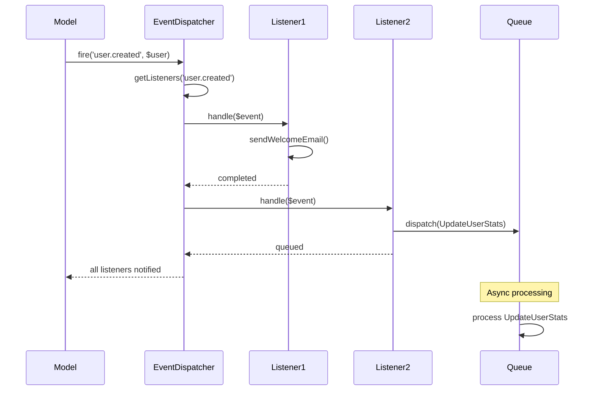

# Observer Pattern

## Overview

Define a one-to-many dependency between objects so that when one object changes state, all its dependents are notified and updated automatically.

## Architecture Diagram

### Observer Pattern Structure


### Laravel Event System Architecture


### Event Flow Sequence



## Design Intent

- **Loose coupling**: Reduce dependency between subject and observers
- **Dynamic relationships**: Allow observers to be added and removed at runtime
- **Event-driven architecture**: Support event-based communication
- **Broadcast notifications**: Enable one-to-many communication patterns

## Laravel Implementation

### 1. Laravel Event System

Laravel's event system is a sophisticated implementation of the Observer pattern:

```php
// Illuminate\Events\Dispatcher.php
class Dispatcher implements EventDispatcher
{
    protected $listeners = [];
    protected $wildcards = [];
    
    public function listen($events, $listener)
    {
        foreach ((array) $events as $event) {
            if (str_contains($event, '*')) {
                $this->setupWildcardListen($event, $listener);
            } else {
                $this->listeners[$event][] = $this->makeListener($listener);
            }
        }
    }
    
    public function dispatch($event, $payload = [], $halt = false)
    {
        // When the given event is an object, we will assume it is an event
        // object and use the class name as the event name
        [$event, $payload] = $this->parseEventAndPayload($event, $payload);
        
        $responses = [];
        
        foreach ($this->getListeners($event) as $listener) {
            $response = $listener($event, $payload);
            
            // If a response is returned from the listener and event halting is enabled
            if ($halt && ! is_null($response)) {
                return $response;
            }
            
            // If a listener returns false, stop propagation
            if ($response === false) {
                break;
            }
            
            $responses[] = $response;
        }
        
        return $halt ? null : $responses;
    }
    
    protected function makeListener($listener)
    {
        if (is_string($listener)) {
            return $this->createClassListener($listener);
        }
        
        return function ($event, $payload) use ($listener) {
            return $listener(...array_values($payload));
        };
    }
}
```

### 2. Event Classes

```php
// Example event class
class OrderShipped extends Event
{
    use SerializesModels;
    
    public $order;
    
    public function __construct(Order $order)
    {
        $this->order = $order;
    }
}

// Corresponding listener
class SendShipmentNotification implements ShouldQueue
{
    public function handle(OrderShipped $event)
    {
        // Send notification to customer
        $event->order->user->notify(new ShipmentNotification($event->order));
    }
}
```

### 3. Model Events

Laravel models also implement the Observer pattern through events:

```php
// Illuminate\Database\Eloquent\Model.php
class Model
{
    protected static $dispatcher;
    
    public static function boot()
    {
        static::bootTraits();
        
        foreach (static::getObservableEvents() as $event) {
            static::registerModelEvent($event, function ($model) use ($event) {
                if (static::$dispatcher) {
                    return static::$dispatcher->dispatch("eloquent.{$event}: ".get_class($model), $model);
                }
            });
        }
    }
    
    public static function creating($callback)
    {
        static::registerModelEvent('creating', $callback);
    }
    
    public static function created($callback)
    {
        static::registerModelEvent('created', $callback);
    }
    
    public static function updating($callback)
    {
        static::registerModelEvent('updating', $callback);
    }
    
    public static function updated($callback)
    {
        static::registerModelEvent('updated', $callback);
    }
}
```

## Practical Application Scenarios

### 1. User Activity Tracking

```php
// Event: User performed an action
class UserActivityPerformed extends Event
{
    public $user;
    public $activity;
    public $timestamp;
    
    public function __construct(User $user, string $activity)
    {
        $this->user = $user;
        $this->activity = $activity;
        $this->timestamp = now();
    }
}

// Observers/Listeners
class LogUserActivity implements ShouldQueue
{
    public function handle(UserActivityPerformed $event)
    {
        ActivityLog::create([
            'user_id' => $event->user->id,
            'activity' => $event->activity,
            'performed_at' => $event->timestamp,
        ]);
    }
}

class UpdateUserStatistics implements ShouldQueue
{
    public function handle(UserActivityPerformed $event)
    {
        $stats = UserStatistics::firstOrCreate(['user_id' => $event->user->id]);
        $stats->increment('total_activities');
        $stats->last_activity = $event->timestamp;
        $stats->save();
    }
}

class SendRealTimeNotification
{
    public function handle(UserActivityPerformed $event)
    {
        // Send real-time notification to admin dashboard
        broadcast(new UserActivityEvent($event->user, $event->activity));
    }
}

// Usage
event(new UserActivityPerformed($user, 'logged_in'));
```

### 2. E-commerce Order Processing

```php
// Order status change event
class OrderStatusChanged extends Event
{
    public $order;
    public $oldStatus;
    public $newStatus;
    
    public function __construct(Order $order, string $oldStatus, string $newStatus)
    {
        $this->order = $order;
        $this->oldStatus = $oldStatus;
        $this->newStatus = $newStatus;
    }
}

// Multiple observers for order status changes
class SendOrderStatusNotification
{
    public function handle(OrderStatusChanged $event)
    {
        // Send email/SMS notification to customer
        $event->order->user->notify(new OrderStatusUpdated(
            $event->order, 
            $event->newStatus
        ));
    }
}

class UpdateInventory implements ShouldQueue
{
    public function handle(OrderStatusChanged $event)
    {
        if ($event->newStatus === 'shipped') {
            // Reduce inventory for shipped items
            foreach ($event->order->items as $item) {
                $item->product->decrement('stock', $item->quantity);
            }
        }
    }
}

class TriggerFulfillmentProcess
{
    public function handle(OrderStatusChanged $event)
    {
        if ($event->newStatus === 'paid') {
            // Start fulfillment process
            FulfillmentService::process($event->order);
        }
    }
}

class UpdateAnalytics
{
    public function handle(OrderStatusChanged $event)
    {
        // Update business analytics
        Analytics::track('order_status_change', [
            'order_id' => $event->order->id,
            'from_status' => $event->oldStatus,
            'to_status' => $event->newStatus,
        ]);
    }
}
```

### 3. Cache Invalidation System

```php
// Cache invalidation event
class CacheInvalidated extends Event
{
    public $tags;
    public $keys;
    public $reason;
    
    public function __construct(array $tags = [], array $keys = [], string $reason = '')
    {
        $this->tags = $tags;
        $this->keys = $keys;
        $this->reason = $reason;
    }
}

// Cache observers
class ClearTaggedCache
{
    public function handle(CacheInvalidated $event)
    {
        if (!empty($event->tags)) {
            Cache::tags($event->tags)->flush();
        }
    }
}

class ClearSpecificKeys
{
    public function handle(CacheInvalidated $event)
    {
        foreach ($event->keys as $key) {
            Cache::forget($key);
        }
    }
}

class LogCacheInvalidation
{
    public function handle(CacheInvalidated $event)
    {
        Log::info('Cache invalidated', [
            'tags' => $event->tags,
            'keys' => $event->keys,
            'reason' => $event->reason,
        ]);
    }
}

class WarmRelatedCache
{
    public function handle(CacheInvalidated $event)
    {
        // Warm up related cache entries
        if (in_array('products', $event->tags)) {
            CacheWarmingService::warmProductCache();
        }
    }
}
```

## Source Code Analysis

### 1. Observer Pattern Implementation Details

Laravel's event system demonstrates several advanced Observer pattern features:

```php
// Event service provider registration
class EventServiceProvider extends ServiceProvider
{
    protected $listen = [
        Registered::class => [
            SendEmailVerificationNotification::class,
        ],
        OrderShipped::class => [
            SendShipmentNotification::class,
            UpdateInventory::class,
        ],
    ];
    
    protected $subscribe = [
        UserEventSubscriber::class,
    ];
}

// Event subscriber example
class UserEventSubscriber
{
    public function handleUserLogin($event) {}
    
    public function handleUserLogout($event) {}
    
    public function subscribe($events)
    {
        $events->listen(
            'Illuminate\Auth\Events\Login',
            [UserEventSubscriber::class, 'handleUserLogin']
        );
        
        $events->listen(
            'Illuminate\Auth\Events\Logout', 
            [UserEventSubscriber::class, 'handleUserLogout']
        );
    }
}
```

### 2. Queued Event Listeners

Laravel supports queued event listeners for better performance:

```php
class ProcessPayment implements ShouldQueue
{
    public $queue = 'payments';
    public $delay = 60;
    
    public function handle(PaymentProcessed $event)
    {
        // Heavy payment processing logic
        PaymentProcessor::process($event->payment);
    }
    
    public function failed(PaymentProcessed $event, $exception)
    {
        // Handle failure
        $event->payment->update(['status' => 'failed']);
    }
}
```

### 3. Event Broadcasting

Laravel can broadcast events to frontend applications:

```php
class OrderStatusChanged implements ShouldBroadcast
{
    use InteractsWithSockets, SerializesModels;
    
    public $order;
    
    public function __construct(Order $order)
    {
        $this->order = $order;
    }
    
    public function broadcastOn()
    {
        return new Channel('orders.' . $this->order->id);
    }
    
    public function broadcastWith()
    {
        return [
            'status' => $this->order->status,
            'updated_at' => $this->order->updated_at->toISOString(),
        ];
    }
}
```

## Best Practices

### 1. When to Use Observer Pattern

**Appropriate scenarios:**
- When you need one-to-many relationships between objects
- When changes to one object require changes to others
- For implementing event-driven architectures
- When you want to reduce coupling between components

**Inappropriate scenarios:**
- When the subject has very few observers
- When observers need to know too much about the subject
- For simple callback mechanisms

### 2. Laravel Event Best Practices

**Use events for cross-cutting concerns:**
```php
// Good: Separate concerns with events
class UserController
{
    public function register(UserRegistrationRequest $request)
    {
        $user = User::create($request->validated());
        
        // Fire event instead of handling everything in controller
        event(new UserRegistered($user));
        
        return response()->json($user, 201);
    }
}

// Avoid: Putting everything in controller
class UserController
{
    public function register(UserRegistrationRequest $request)
    {
        $user = User::create($request->validated());
        
        // Don't do this - too many responsibilities
        Mail::to($user)->send(new WelcomeEmail($user));
        Analytics::track('user_registered', $user);
        Cache::forget('users_count');
        // ... more logic
        
        return response()->json($user, 201);
    }
}
```

**Event naming conventions:**
```php
// Use past tense for events that have already occurred
UserRegistered::class      // Good
RegisterUser::class        // Avoid - sounds like a command

OrderShipped::class        // Good
ShipOrder::class           // Avoid
```

### 3. Testing Event-Driven Systems

**Testing event listeners:**
```php
class OrderProcessingTest extends TestCase
{
    use RefreshDatabase;
    
    public function test_order_shipped_event_triggers_notification()
    {
        Event::fake();
        
        $order = Order::factory()->create();
        
        // Perform action that should trigger event
        $order->update(['status' => 'shipped']);
        
        // Assert event was dispatched
        Event::assertDispatched(OrderShipped::class, function ($event) use ($order) {
            return $event->order->id === $order->id;
        });
    }
    
    public function test_listener_handles_event_correctly()
    {
        $order = Order::factory()->create();
        $listener = new SendShipmentNotification();
        
        $listener->handle(new OrderShipped($order));
        
        // Assert notification was sent
        Notification::assertSentTo(
            $order->user, 
            ShipmentNotification::class
        );
    }
}
```

## Performance Considerations

### 1. Event System Performance

Laravel's event system is optimized for performance:

```php
// Events are cached for better performance
protected function getListeners($eventName)
{
    if (isset($this->listeners[$eventName])) {
        return $this->listeners[$eventName];
    }
    
    // Wildcard matching logic...
}
```

### 2. Queued Listeners

For performance-intensive listeners, use queues:

```php
class ProcessLargeDataset implements ShouldQueue
{
    public $tries = 3;
    public $timeout = 300;
    
    public function handle(LargeDatasetProcessed $event)
    {
        // Heavy processing in background
        DataProcessor::process($event->dataset);
    }
}
```

### 3. Event Caching

Laravel cvents event listeners for better performance:

```php
// Event discovery is cached
php artisan event:cache

// Clear event cache when needed
php artisan event:clear
```

## Summary

The Observer pattern is deeply integrated into Laravel's architecture through its event system. This implementation provides a powerful, flexible way to build decoupled, event-driven applications while maintaining excellent performance characteristics.

Laravel's event system demonstrates how the Observer pattern can scale from simple local events to complex distributed systems with queued listeners and real-time broadcasting.