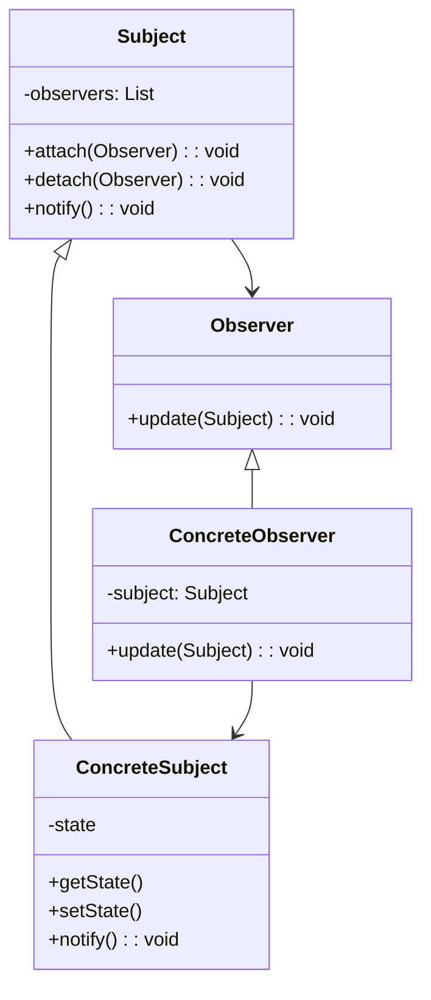
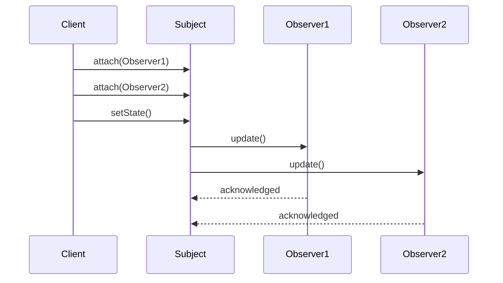

# 观察者模式 (Observer Pattern)

## 概述

观察者模式定义了对象间的一对多依赖关系，当一个对象的状态发生改变时，所有依赖于它的对象都会得到通知并自动更新。这种模式也被称为发布-订阅模式。

## 问题场景

在Laravel应用中，我们经常需要：
- 用户注册后发送欢迎邮件
- 订单状态变化时通知相关方
- 模型数据变化时更新缓存
- 系统事件的多重处理
- 日志记录和监控

## 解决方案

观察者模式通过定义主题（被观察者）和观察者接口，实现松耦合的事件通知机制。

## UML类图



## Laravel实现

### 1. 基础观察者模式

```php
<?php

namespace App\Patterns\Observer;

// 观察者接口
interface ObserverInterface
{
    public function update(SubjectInterface $subject, string $event, array $data = []): void;
}

// 主题接口
interface SubjectInterface
{
    public function attach(ObserverInterface $observer): void;
    public function detach(ObserverInterface $observer): void;
    public function notify(string $event, array $data = []): void;
}

// 抽象主题类
abstract class Subject implements SubjectInterface
{
    protected array $observers = [];
    
    public function attach(ObserverInterface $observer): void
    {
        $hash = spl_object_hash($observer);
        $this->observers[$hash] = $observer;
    }
    
    public function detach(ObserverInterface $observer): void
    {
        $hash = spl_object_hash($observer);
        unset($this->observers[$hash]);
    }
    
    public function notify(string $event, array $data = []): void
    {
        foreach ($this->observers as $observer) {
            $observer->update($this, $event, $data);
        }
    }
    
    public function getObservers(): array
    {
        return array_values($this->observers);
    }
    
    public function countObservers(): int
    {
        return count($this->observers);
    }
}
```

### 2. 用户管理系统实现

```php
<?php

namespace App\Patterns\Observer;

// 用户主题
class UserSubject extends Subject
{
    private int $id;
    private string $name;
    private string $email;
    private string $status;
    private array $data = [];
    
    public function __construct(int $id, string $name, string $email, string $status = 'active')
    {
        $this->id = $id;
        $this->name = $name;
        $this->email = $email;
        $this->status = $status;
        $this->data = compact('id', 'name', 'email', 'status');
    }
    
    public function setName(string $name): void
    {
        $oldName = $this->name;
        $this->name = $name;
        $this->data['name'] = $name;
        
        $this->notify('name_changed', [
            'old_name' => $oldName,
            'new_name' => $name,
            'user_id' => $this->id
        ]);
    }
    
    public function setEmail(string $email): void
    {
        $oldEmail = $this->email;
        $this->email = $email;
        $this->data['email'] = $email;
        
        $this->notify('email_changed', [
            'old_email' => $oldEmail,
            'new_email' => $email,
            'user_id' => $this->id
        ]);
    }
    
    public function setStatus(string $status): void
    {
        $oldStatus = $this->status;
        $this->status = $status;
        $this->data['status'] = $status;
        
        $this->notify('status_changed', [
            'old_status' => $oldStatus,
            'new_status' => $status,
            'user_id' => $this->id
        ]);
    }
    
    public function register(): void
    {
        $this->notify('user_registered', [
            'user_id' => $this->id,
            'name' => $this->name,
            'email' => $this->email
        ]);
    }
    
    public function login(): void
    {
        $this->notify('user_logged_in', [
            'user_id' => $this->id,
            'timestamp' => time()
        ]);
    }
    
    public function logout(): void
    {
        $this->notify('user_logged_out', [
            'user_id' => $this->id,
            'timestamp' => time()
        ]);
    }
    
    // Getters
    public function getId(): int { return $this->id; }
    public function getName(): string { return $this->name; }
    public function getEmail(): string { return $this->email; }
    public function getStatus(): string { return $this->status; }
    public function getData(): array { return $this->data; }
}

// 邮件通知观察者
class EmailNotificationObserver implements ObserverInterface
{
    private string $name;
    
    public function __construct(string $name = 'EmailNotification')
    {
        $this->name = $name;
    }
    
    public function update(SubjectInterface $subject, string $event, array $data = []): void
    {
        if (!$subject instanceof UserSubject) {
            return;
        }
        
        switch ($event) {
            case 'user_registered':
                $this->sendWelcomeEmail($data);
                break;
            case 'email_changed':
                $this->sendEmailChangeNotification($data);
                break;
            case 'status_changed':
                $this->sendStatusChangeNotification($data);
                break;
        }
    }
    
    private function sendWelcomeEmail(array $data): void
    {
        echo "[{$this->name}] 发送欢迎邮件到: {$data['email']} (用户: {$data['name']})\n";
    }
    
    private function sendEmailChangeNotification(array $data): void
    {
        echo "[{$this->name}] 邮箱变更通知: {$data['old_email']} -> {$data['new_email']}\n";
    }
    
    private function sendStatusChangeNotification(array $data): void
    {
        echo "[{$this->name}] 状态变更通知: {$data['old_status']} -> {$data['new_status']}\n";
    }
    
    public function getName(): string
    {
        return $this->name;
    }
}

// 日志记录观察者
class LoggingObserver implements ObserverInterface
{
    private string $logFile;
    
    public function __construct(string $logFile = 'user_activity.log')
    {
        $this->logFile = $logFile;
    }
    
    public function update(SubjectInterface $subject, string $event, array $data = []): void
    {
        $timestamp = date('Y-m-d H:i:s');
        $logEntry = "[{$timestamp}] {$event}: " . json_encode($data) . "\n";
        
        // 模拟写入日志文件
        echo "[日志记录] {$logEntry}";
    }
    
    public function getLogFile(): string
    {
        return $this->logFile;
    }
}

// 缓存更新观察者
class CacheUpdateObserver implements ObserverInterface
{
    private array $cache = [];
    
    public function update(SubjectInterface $subject, string $event, array $data = []): void
    {
        if (!$subject instanceof UserSubject) {
            return;
        }
        
        $userId = $data['user_id'] ?? $subject->getId();
        
        switch ($event) {
            case 'user_registered':
            case 'name_changed':
            case 'email_changed':
            case 'status_changed':
                $this->updateUserCache($userId, $subject->getData());
                break;
            case 'user_logged_in':
                $this->updateLoginCache($userId, $data['timestamp']);
                break;
        }
    }
    
    private function updateUserCache(int $userId, array $userData): void
    {
        $this->cache["user:{$userId}"] = $userData;
        echo "[缓存更新] 更新用户缓存: user:{$userId}\n";
    }
    
    private function updateLoginCache(int $userId, int $timestamp): void
    {
        $this->cache["user:{$userId}:last_login"] = $timestamp;
        echo "[缓存更新] 更新登录时间缓存: user:{$userId}:last_login\n";
    }
    
    public function getCache(): array
    {
        return $this->cache;
    }
    
    public function clearCache(): void
    {
        $this->cache = [];
    }
}
```

## 使用示例

### 用户管理系统使用

```php
<?php

// 创建用户主题
$user = new UserSubject(1, '张三', 'zhangsan@example.com');

// 创建观察者
$emailObserver = new EmailNotificationObserver();
$loggingObserver = new LoggingObserver();
$cacheObserver = new CacheUpdateObserver();

// 注册观察者
$user->attach($emailObserver);
$user->attach($loggingObserver);
$user->attach($cacheObserver);

// 触发事件
echo "=== 用户注册 ===\n";
$user->register();

echo "\n=== 修改邮箱 ===\n";
$user->setEmail('zhangsan_new@example.com');

echo "\n=== 修改状态 ===\n";
$user->setStatus('inactive');

echo "\n=== 用户登录 ===\n";
$user->login();
```

## Laravel中的实际应用

### 1. Eloquent模型观察者

```php
<?php

// 定义模型观察者
class UserObserver
{
    public function creating(User $user)
    {
        $user->uuid = Str::uuid();
    }
    
    public function created(User $user)
    {
        // 发送欢迎邮件
        Mail::to($user->email)->send(new WelcomeEmail($user));
    }
    
    public function updated(User $user)
    {
        // 清除相关缓存
        Cache::forget("user.{$user->id}");
    }
    
    public function deleting(User $user)
    {
        // 删除相关数据
        $user->posts()->delete();
    }
}

// 注册观察者
class AppServiceProvider extends ServiceProvider
{
    public function boot()
    {
        User::observe(UserObserver::class);
    }
}
```

### 2. 事件系统

```php
<?php

// 定义事件
class UserRegistered
{
    public $user;
    
    public function __construct(User $user)
    {
        $this->user = $user;
    }
}

// 定义监听器
class SendWelcomeEmail
{
    public function handle(UserRegistered $event)
    {
        Mail::to($event->user->email)->send(new WelcomeEmail($event->user));
    }
}

class LogUserRegistration
{
    public function handle(UserRegistered $event)
    {
        Log::info('User registered', ['user_id' => $event->user->id]);
    }
}

// 注册事件监听器
class EventServiceProvider extends ServiceProvider
{
    protected $listen = [
        UserRegistered::class => [
            SendWelcomeEmail::class,
            LogUserRegistration::class,
        ],
    ];
}

// 触发事件
event(new UserRegistered($user));
```

## 时序图



## 优点

1. **松耦合**：主题和观察者之间松耦合
2. **动态关系**：可以在运行时建立对象间的联系
3. **广播通信**：支持一对多的通信
4. **开闭原则**：可以独立地扩展主题和观察者

## 缺点

1. **性能问题**：观察者过多时通知开销大
2. **循环依赖**：可能导致循环调用
3. **内存泄漏**：观察者未正确移除可能导致内存泄漏

## 适用场景

1. **事件处理系统**
2. **模型-视图架构**
3. **发布-订阅系统**
4. **状态变化通知**

## 与其他模式的关系

- **中介者模式**：观察者分布式通信，中介者集中式通信
- **单例模式**：主题通常实现为单例

观察者模式在Laravel中有广泛应用，特别是在事件系统和模型观察者中。