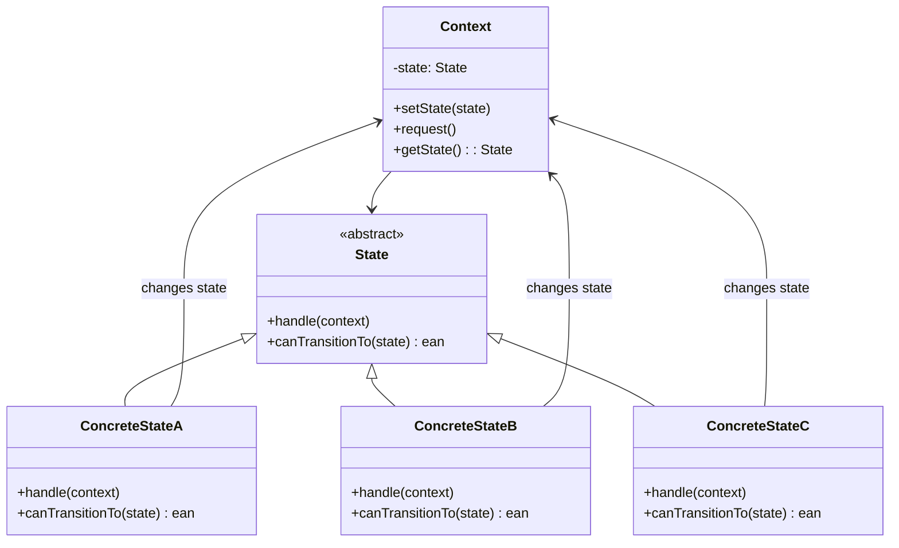
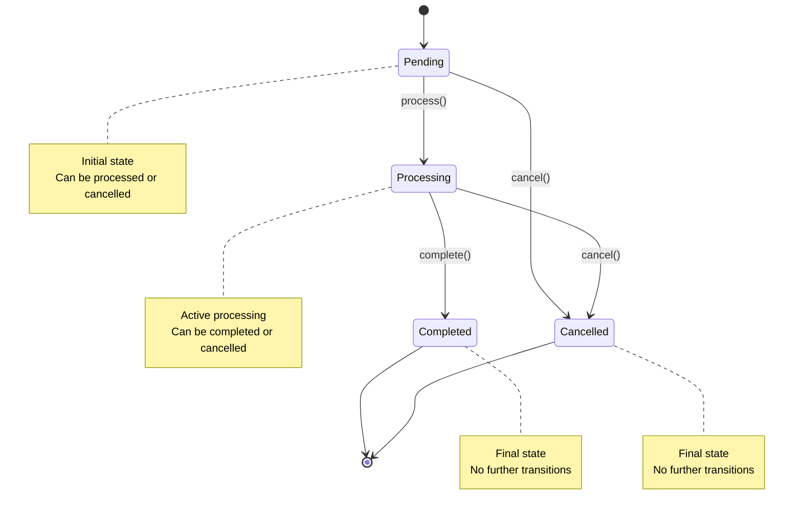
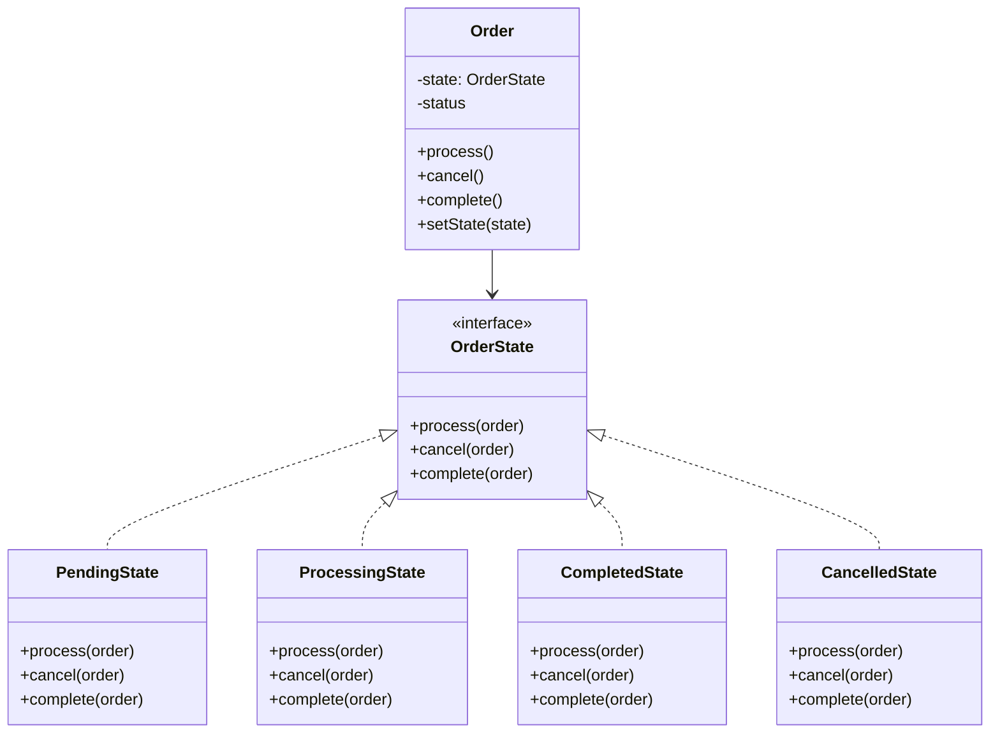
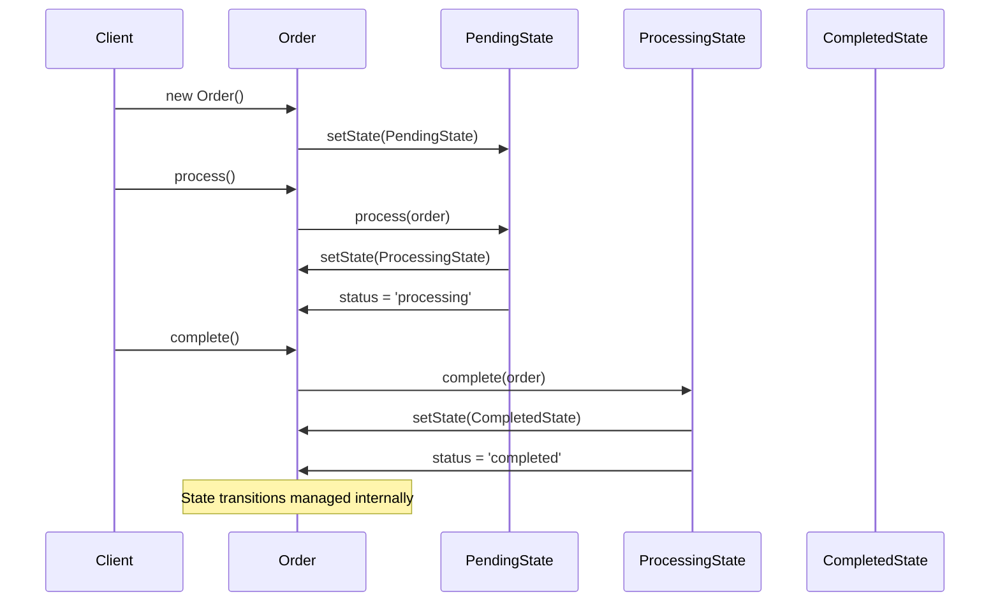

# State Pattern

## Overview

Allow an object to alter its behavior when its internal state changes. The object will appear to change its class.

## Architecture Diagrams

### State Pattern Class Diagram


### State Transition Diagram


### Laravel Order State Machine


### State Pattern Sequence Diagram


## Design Intent

- **State encapsulation**: Encapsulate state-specific behavior in separate classes
- **Context delegation**: Delegate state-specific behavior to state objects
- **State transitions**: Manage state transitions cleanly and consistently
- **Open/closed principle**: Make it easy to add new states without modifying existing code

## Laravel Implementation

### 1. Laravel's State Machine Implementation

Laravel provides excellent support for state patterns through Eloquent model states:

```php
// Illuminate\Database\Eloquent\Model.php
class Model
{
    protected $attributes = [];
    
    public function getAttribute($key)
    {
        // State-based attribute access
        if (array_key_exists($key, $this->attributes)) {
            return $this->attributes[$key];
        }
        
        return $this->getAttributeFromArray($key);
    }
    
    public function setAttribute($key, $value)
    {
        // State-based attribute setting with validation
        if ($this->hasSetMutator($key)) {
            $method = 'set'.Str::studly($key).'Attribute';
            return $this->{$method}($value);
        }
        
        $this->attributes[$key] = $value;
        
        return $this;
    }
    
    public function save(array $options = [])
    {
        // State-based save operation
        $query = $this->newModelQuery();
        
        if ($this->exists) {
            $saved = $this->isDirty() ?
                $this->performUpdate($query) : true;
        } else {
            $saved = $this->performInsert($query);
        }
        
        if ($saved) {
            $this->finishSave($options);
        }
        
        return $saved;
    }
}
```

### 2. State Pattern Implementation Example

```php
// Order state interface
interface OrderState
{
    public function process(Order $order);
    public function cancel(Order $order);
    public function complete(Order $order);
}

// Concrete state implementations
class PendingState implements OrderState
{
    public function process(Order $order)
    {
        $order->setState(new ProcessingState());
        $order->status = 'processing';
        $order->processed_at = now();
        $order->save();
        
        // Trigger processing events
        event(new OrderProcessingStarted($order));
    }
    
    public function cancel(Order $order)
    {
        $order->setState(new CancelledState());
        $order->status = 'cancelled';
        $order->cancelled_at = now();
        $order->save();
        
        event(new OrderCancelled($order));
    }
    
    public function complete(Order $order)
    {
        throw new InvalidStateException('Cannot complete a pending order');
    }
}

class ProcessingState implements OrderState
{
    public function process(Order $order)
    {
        throw new InvalidStateException('Order is already being processed');
    }
    
    public function cancel(Order $order)
    {
        $order->setState(new CancelledState());
        $order->status = 'cancelled';
        $order->cancelled_at = now();
        $order->save();
        
        event(new OrderCancelled($order));
    }
    
    public function complete(Order $order)
    {
        $order->setState(new CompletedState());
        $order->status = 'completed';
        $order->completed_at = now();
        $order->save();
        
        event(new OrderCompleted($order));
    }
}

class CompletedState implements OrderState
{
    public function process(Order $order)
    {
        throw new InvalidStateException('Cannot process a completed order');
    }
    
    public function cancel(Order $order)
    {
        throw new InvalidStateException('Cannot cancel a completed order');
    }
    
    public function complete(Order $order)
    {
        throw new InvalidStateException('Order is already completed');
    }
}

class CancelledState implements OrderState
{
    public function process(Order $order)
    {
        throw new InvalidStateException('Cannot process a cancelled order');
    }
    
    public function cancel(Order $order)
    {
        throw new InvalidStateException('Order is already cancelled');
    }
    
    public function complete(Order $order)
    {
        throw new InvalidStateException('Cannot complete a cancelled order');
    }
}
```

### 3. Context Class (Order)

```php
class Order extends Model
{
    protected $fillable = ['user_id', 'total', 'status'];
    protected $dates = ['processed_at', 'completed_at', 'cancelled_at'];
    
    private OrderState $state;
    
    public function __construct(array $attributes = [])
    {
        parent::__construct($attributes);
        $this->setStateBasedOnStatus();
    }
    
    protected function setStateBasedOnStatus()
    {
        switch ($this->status) {
            case 'pending':
                $this->state = new PendingState();
                break;
            case 'processing':
                $this->state = new ProcessingState();
                break;
            case 'completed':
                $this->state = new CompletedState();
                break;
            case 'cancelled':
                $this->state = new CancelledState();
                break;
            default:
                $this->state = new PendingState();
                $this->status = 'pending';
        }
    }
    
    public function setState(OrderState $state)
    {
        $this->state = $state;
    }
    
    public function process()
    {
        $this->state->process($this);
    }
    
    public function cancel()
    {
        $this->state->cancel($this);
    }
    
    public function complete()
    {
        $this->state->complete($this);
    }
    
    // Laravel model events for state transitions
    protected static function boot()
    {
        parent::boot();
        
        static::saving(function ($order) {
            // Validate state transitions
            $order->validateStateTransition();
        });
        
        static::saved(function ($order) {
            // Trigger state-specific events
            $order->triggerStateEvents();
        });
    }
    
    protected function validateStateTransition()
    {
        $originalStatus = $this->getOriginal('status');
        $newStatus = $this->status;
        
        $validTransitions = [
            'pending' => ['processing', 'cancelled'],
            'processing' => ['completed', 'cancelled'],
            'completed' => [],
            'cancelled' => [],
        ];
        
        if ($originalStatus !== $newStatus) {
            if (!in_array($newStatus, $validTransitions[$originalStatus] ?? [])) {
                throw new InvalidStateTransitionException(
                    "Cannot transition from {$originalStatus} to {$newStatus}"
                );
            }
        }
    }
    
    protected function triggerStateEvents()
    {
        $originalStatus = $this->getOriginal('status');
        $newStatus = $this->status;
        
        if ($originalStatus !== $newStatus) {
            switch ($newStatus) {
                case 'processing':
                    event(new OrderProcessingStarted($this));
                    break;
                case 'completed':
                    event(new OrderCompleted($this));
                    break;
                case 'cancelled':
                    event(new OrderCancelled($this));
                    break;
            }
        }
    }
}
```

## Practical Application Scenarios

### 1. User Subscription States

```php
interface SubscriptionState
{
    public function activate(Subscription $subscription);
    public function suspend(Subscription $subscription);
    public function cancel(Subscription $subscription);
    public function renew(Subscription $subscription);
}

class ActiveState implements SubscriptionState
{
    public function activate(Subscription $subscription)
    {
        throw new InvalidStateException('Subscription is already active');
    }
    
    public function suspend(Subscription $subscription)
    {
        $subscription->setState(new SuspendedState());
        $subscription->status = 'suspended';
        $subscription->suspended_at = now();
        $subscription->save();
        
        event(new SubscriptionSuspended($subscription));
    }
    
    public function cancel(Subscription $subscription)
    {
        $subscription->setState(new CancelledState());
        $subscription->status = 'cancelled';
        $subscription->cancelled_at = now();
        $subscription->save();
        
        event(new SubscriptionCancelled($subscription));
    }
    
    public function renew(Subscription $subscription)
    {
        $subscription->expires_at = $subscription->expires_at->addMonth();
        $subscription->save();
        
        event(new SubscriptionRenewed($subscription));
    }
}

class SuspendedState implements SubscriptionState
{
    public function activate(Subscription $subscription)
    {
        $subscription->setState(new ActiveState());
        $subscription->status = 'active';
        $subscription->activated_at = now();
        $subscription->save();
        
        event(new SubscriptionActivated($subscription));
    }
    
    public function suspend(Subscription $subscription)
    {
        throw new InvalidStateException('Subscription is already suspended');
    }
    
    public function cancel(Subscription $subscription)
    {
        $subscription->setState(new CancelledState());
        $subscription->status = 'cancelled';
        $subscription->cancelled_at = now();
        $subscription->save();
        
        event(new SubscriptionCancelled($subscription));
    }
    
    public function renew(Subscription $subscription)
    {
        throw new InvalidStateException('Cannot renew a suspended subscription');
    }
}

class ExpiredState implements SubscriptionState
{
    public function activate(Subscription $subscription)
    {
        throw new InvalidStateException('Cannot activate an expired subscription');
    }
    
    public function suspend(Subscription $subscription)
    {
        throw new InvalidStateException('Cannot suspend an expired subscription');
    }
    
    public function cancel(Subscription $subscription)
    {
        throw new InvalidStateException('Cannot cancel an expired subscription');
    }
    
    public function renew(Subscription $subscription)
    {
        $subscription->setState(new ActiveState());
        $subscription->status = 'active';
        $subscription->expires_at = now()->addMonth();
        $subscription->save();
        
        event(new SubscriptionRenewed($subscription));
    }
}

class Subscription extends Model
{
    protected $fillable = ['user_id', 'plan_id', 'status', 'expires_at'];
    protected $dates = ['activated_at', 'suspended_at', 'cancelled_at', 'expires_at'];
    
    private SubscriptionState $state;
    
    public function setState(SubscriptionState $state)
    {
        $this->state = $state;
    }
    
    public function activate() { $this->state->activate($this); }
    public function suspend() { $this->state->suspend($this); }
    public function cancel() { $this->state->cancel($this); }
    public function renew() { $this->state->renew($this); }
    
    // Auto-state management based on expiration
    public function scopeActive($query)
    {
        return $query->where('status', 'active')
                    ->where('expires_at', '>', now());
    }
    
    public function scopeExpired($query)
    {
        return $query->where(function ($q) {
            $q->where('status', 'active')
              ->where('expires_at', '<=', now());
        })->orWhere('status', 'expired');
    }
}
```

### 2. Document Workflow States

```php
interface DocumentState
{
    public function draft(Document $document);
    public function submit(Document $document);
    public function approve(Document $document);
    public function reject(Document $document);
    public function publish(Document $document);
}

class DraftState implements DocumentState
{
    public function draft(Document $document)
    {
        throw new InvalidStateException('Document is already in draft');
    }
    
    public function submit(Document $document)
    {
        $document->setState(new UnderReviewState());
        $document->status = 'under_review';
        $document->submitted_at = now();
        $document->save();
        
        event(new DocumentSubmitted($document));
    }
    
    public function approve(Document $document)
    {
        throw new InvalidStateException('Cannot approve a draft document');
    }
    
    public function reject(Document $document)
    {
        throw new InvalidStateException('Cannot reject a draft document');
    }
    
    public function publish(Document $document)
    {
        throw new InvalidStateException('Cannot publish a draft document');
    }
}

class UnderReviewState implements DocumentState
{
    public function draft(Document $document)
    {
        $document->setState(new DraftState());
        $document->status = 'draft';
        $document->save();
        
        event(new DocumentRevertedToDraft($document));
    }
    
    public function submit(Document $document)
    {
        throw new InvalidStateException('Document is already under review');
    }
    
    public function approve(Document $document)
    {
        $document->setState(new ApprovedState());
        $document->status = 'approved';
        $document->approved_at = now();
        $document->approved_by = auth()->id();
        $document->save();
        
        event(new DocumentApproved($document));
    }
    
    public function reject(Document $document)
    {
        $document->setState(new RejectedState());
        $document->status = 'rejected';
        $document->rejected_at = now();
        $document->rejected_by = auth()->id();
        $document->rejection_reason = 'Needs revision';
        $document->save();
        
        event(new DocumentRejected($document));
    }
    
    public function publish(Document $document)
    {
        throw new InvalidStateException('Cannot publish a document under review');
    }
}

class ApprovedState implements DocumentState
{
    public function draft(Document $document)
    {
        throw new InvalidStateException('Cannot revert an approved document to draft');
    }
    
    public function submit(Document $document)
    {
        throw new InvalidStateException('Cannot submit an approved document');
    }
    
    public function approve(Document $document)
    {
        throw new InvalidStateException('Document is already approved');
    }
    
    public function reject(Document $document)
    {
        throw new InvalidStateException('Cannot reject an approved document');
    }
    
    public function publish(Document $document)
    {
        $document->setState(new PublishedState());
        $document->status = 'published';
        $document->published_at = now();
        $document->save();
        
        event(new DocumentPublished($document));
    }
}

class Document extends Model
{
    protected $fillable = ['title', 'content', 'status', 'author_id'];
    protected $dates = ['submitted_at', 'approved_at', 'rejected_at', 'published_at'];
    
    private DocumentState $state;
    
    public function setState(DocumentState $state)
    {
        $this->state = $state;
    }
    
    public function draft() { $this->state->draft($this); }
    public function submit() { $this->state->submit($this); }
    public function approve() { $this->state->approve($this); }
    public function reject() { $this->state->reject($this); }
    public function publish() { $this->state->publish($this); }
    
    // State-based access control
    public function canEdit()
    {
        return in_array($this->status, ['draft', 'rejected']);
    }
    
    public function canApprove()
    {
        return $this->status === 'under_review' && auth()->user()->can('approve', $this);
    }
    
    public function canPublish()
    {
        return $this->status === 'approved' && auth()->user()->can('publish', $this);
    }
}
```

### 3. Payment Transaction States

```php
interface PaymentState
{
    public function initialize(Payment $payment);
    public function process(Payment $payment);
    public function complete(Payment $payment);
    public function fail(Payment $payment);
    public function refund(Payment $payment);
}

class InitializedState implements PaymentState
{
    public function initialize(Payment $payment)
    {
        throw new InvalidStateException('Payment is already initialized');
    }
    
    public function process(Payment $payment)
    {
        $payment->setState(new ProcessingState());
        $payment->status = 'processing';
        $payment->processed_at = now();
        $payment->save();
        
        // Start payment processing
        PaymentProcessor::process($payment);
        
        event(new PaymentProcessing($payment));
    }
    
    public function complete(Payment $payment)
    {
        throw new InvalidStateException('Cannot complete an initialized payment');
    }
    
    public function fail(Payment $payment)
    {
        throw new InvalidStateException('Cannot fail an initialized payment');
    }
    
    public function refund(Payment $payment)
    {
        throw new InvalidStateException('Cannot refund an initialized payment');
    }
}

class ProcessingState implements PaymentState
{
    public function initialize(Payment $payment)
    {
        throw new InvalidStateException('Cannot reinitialize a processing payment');
    }
    
    public function process(Payment $payment)
    {
        throw new InvalidStateException('Payment is already being processed');
    }
    
    public function complete(Payment $payment)
    {
        $payment->setState(new CompletedState());
        $payment->status = 'completed';
        $payment->completed_at = now();
        $payment->save();
        
        event(new PaymentCompleted($payment));
    }
    
    public function fail(Payment $payment)
    {
        $payment->setState(new FailedState());
        $payment->status = 'failed';
        $payment->failed_at = now();
        $payment->failure_reason = 'Payment processing failed';
        $payment->save();
        
        event(new PaymentFailed($payment));
    }
    
    public function refund(Payment $payment)
    {
        throw new InvalidStateException('Cannot refund a processing payment');
    }
}

class CompletedState implements PaymentState
{
    public function initialize(Payment $payment)
    {
        throw new InvalidStateException('Cannot reinitialize a completed payment');
    }
    
    public function process(Payment $payment)
    {
        throw new InvalidStateException('Cannot process a completed payment');
    }
    
    public function complete(Payment $payment)
    {
        throw new InvalidStateException('Payment is already completed');
    }
    
    public function fail(Payment $payment)
    {
        throw new InvalidStateException('Cannot fail a completed payment');
    }
    
    public function refund(Payment $payment)
    {
        $payment->setState(new RefundedState());
        $payment->status = 'refunded';
        $payment->refunded_at = now();
        $payment->save();
        
        event(new PaymentRefunded($payment));
    }
}

class Payment extends Model
{
    protected $fillable = ['amount', 'currency', 'status', 'gateway'];
    protected $dates = ['processed_at', 'completed_at', 'failed_at', 'refunded_at'];
    
    private PaymentState $state;
    
    public function setState(PaymentState $state)
    {
        $this->state = $state;
    }
    
    public function initialize() { $this->state->initialize($this); }
    public function process() { $this->state->process($this); }
    public function complete() { $this->state->complete($this); }
    public function fail() { $this->state->fail($this); }
    public function refund() { $this->state->refund($this); }
    
    // State-based validation
    public function canBeRefunded()
    {
        return $this->status === 'completed' && 
               $this->completed_at->gt(now()->subDays(30));
    }
    
    public function isFinal()
    {
        return in_array($this->status, ['completed', 'failed', 'refunded']);
    }
}
```

## Source Code Analysis

### 1. Laravel's Internal State Management

Laravel uses state patterns extensively in its core:

```php
// Illuminate\Http\Request.php
class Request
{
    protected $json;
    protected $convertedFiles;
    
    public function json($key = null, $default = null)
    {
        if (! isset($this->json)) {
            $this->json = new ParameterBag((array) json_decode($this->getContent(), true));
        }
        
        if (is_null($key)) {
            return $this->json;
        }
        
        return data_get($this->json->all(), $key, $default);
    }
    
    public function file($key = null, $default = null)
    {
        return data_get($this->allFiles(), $key, $default);
    }
    
    protected function allFiles()
    {
        if (! isset($this->convertedFiles)) {
            $this->convertedFiles = $this->convertUploadedFiles($this->files->all());
        }
        
        return $this->convertedFiles;
    }
}
```

### 2. Database Connection States

Laravel's database connection management demonstrates state pattern:

```php
// Illuminate\Database\Connection.php
class Connection
{
    protected $pdo;
    protected $readPdo;
    protected $transactions = 0;
    
    public function transaction(Closure $callback, $attempts = 1)
    {
        for ($currentAttempt = 1; $currentAttempt <= $attempts; $currentAttempt++) {
            $this->beginTransaction();
            
            try {
                $result = $callback($this);
                $this->commit();
                return $result;
            } catch (Exception $e) {
                $this->rollBack();
                if ($this->causedByDeadlock($e) && $currentAttempt < $attempts) {
                    continue;
                }
                throw $e;
            }
        }
    }
    
    public function beginTransaction()
    {
        $this->createTransaction();
        $this->transactions++;
    }
    
    public function commit()
    {
        if ($this->transactions == 1) {
            $this->getPdo()->commit();
        }
        
        $this->transactions = max(0, $this->transactions - 1);
    }
    
    public function rollBack()
    {
        if ($this->transactions == 1) {
            $this->transactions = 0;
            $this->getPdo()->rollBack();
        } else {
            $this->transactions--;
        }
    }
}
```

## Best Practices

### 1. When to Use State Pattern

**Appropriate scenarios:**
- When an object's behavior depends on its state
- When you have complex state transitions
- When you want to avoid large conditional statements
- When states need to be added or modified frequently

**Inappropriate scenarios:**
- When state transitions are simple and few
- When states don't significantly change behavior
- For simple flag-based state management

### 2. Laravel State Pattern Best Practices

**Use Eloquent model states:**
```php
// Good: Use state pattern for complex business logic
class Order extends Model
{
    public function process()
    {
        $this->state->process($this);
    }
}

// Avoid: Large conditional statements
class Order extends Model
{
    public function process()
    {
        if ($this->status === 'pending') {
            // Process pending order
        } elseif ($this->status === 'processing') {
            // Handle already processing
        } elseif ($this->status === 'completed') {
            // Handle completed order
        }
        // ... more conditions
    }
}
```

**State transition validation:**
```php
protected function validateStateTransition($from, $to)
{
    $validTransitions = [
        'pending' => ['processing', 'cancelled'],
        'processing' => ['completed', 'cancelled'],
        'completed' => [],
        'cancelled' => [],
    ];
    
    if (!in_array($to, $validTransitions[$from] ?? [])) {
        throw new InvalidStateTransitionException(
            "Invalid transition from {$from} to {$to}"
        );
    }
}
```

### 3. Testing State Patterns

**State transition testing:**
```php
class OrderStateTest extends TestCase
{
    public function test_pending_order_can_be_processed()
    {
        $order = Order::factory()->create(['status' => 'pending']);
        
        $order->process();
        
        $this->assertEquals('processing', $order->status);
        $this->assertNotNull($order->processed_at);
    }
    
    public function test_completed_order_cannot_be_processed()
    {
        $order = Order::factory()->create(['status' => 'completed']);
        
        $this->expectException(InvalidStateException::class);
        $order->process();
    }
    
    public function test_state_transitions_are_validated()
    {
        $order = Order::factory()->create(['status' => 'pending']);
        
        // This should work
        $order->update(['status' => 'processing']);
        
        // This should fail
        $this->expectException(InvalidStateTransitionException::class);
        $order->update(['status' => 'completed']);
    }
}
```

## Performance Considerations

### 1. State Object Creation

For performance-sensitive applications, consider object pooling:

```php
class StateFactory
{
    private static $states = [];
    
    public static function getState(string $stateClass): StateInterface
    {
        if (!isset(self::$states[$stateClass])) {
            self::$states[$stateClass] = new $stateClass();
        }
        
        return self::$states[$stateClass];
    }
}
```

### 2. State Caching

Cache state objects when appropriate:

```php
class CachedState implements StateInterface
{
    private $realState;
    private $cacheKey;
    
    public function __construct(StateInterface $realState, string $cacheKey)
    {
        $this->realState = $realState;
        $this->cacheKey = $cacheKey;
    }
    
    public function handle(Context $context)
    {
        return Cache::remember($this->cacheKey, 3600, function () use ($context) {
            return $this->realState->handle($context);
        });
    }
}
```

## Summary

The State pattern is particularly well-suited for Laravel applications due to their event-driven nature and complex business logic. By encapsulating state-specific behavior in separate classes, you can:

- Create more maintainable and testable code
- Easily add new states without modifying existing code
- Implement complex validation rules for state transitions
- Leverage Laravel's built-in events and model features

Laravel's Eloquent ORM provides excellent support for state patterns through model events, attribute casting, and relationship management, making it an ideal framework for implementing state-based business logic.