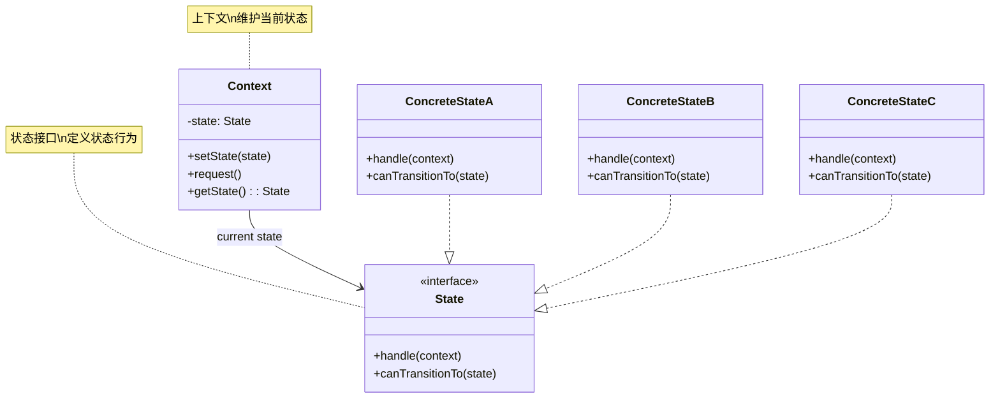
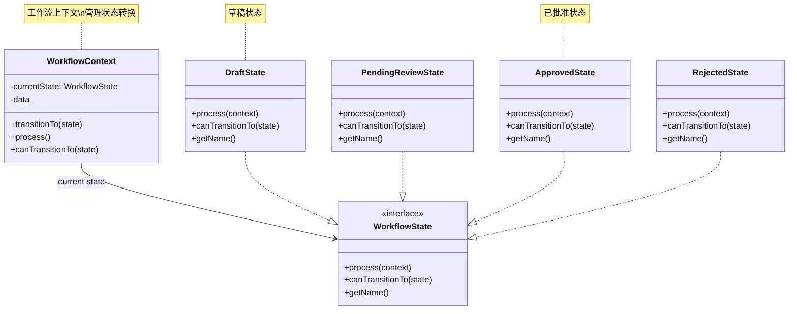
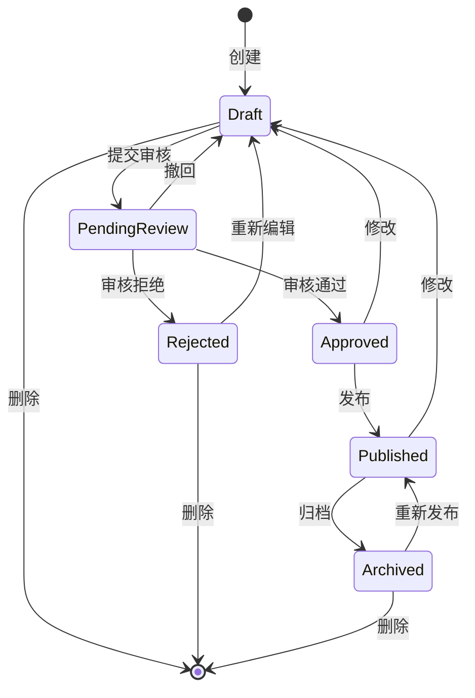
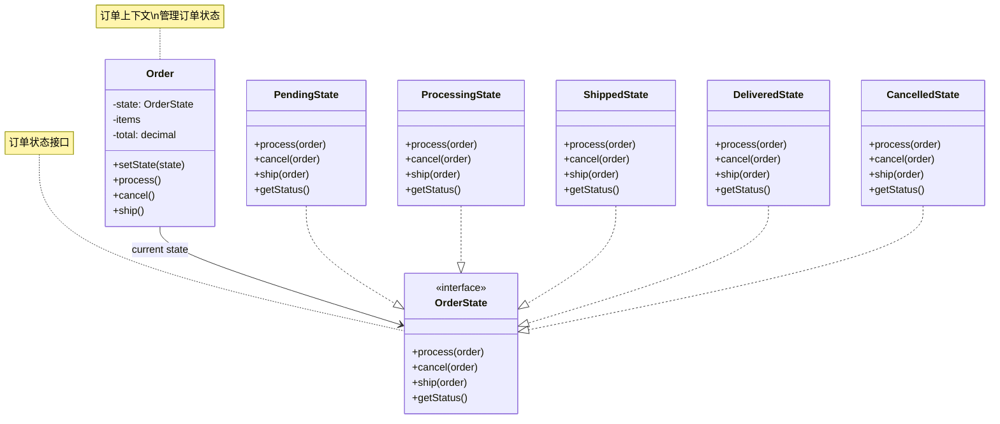
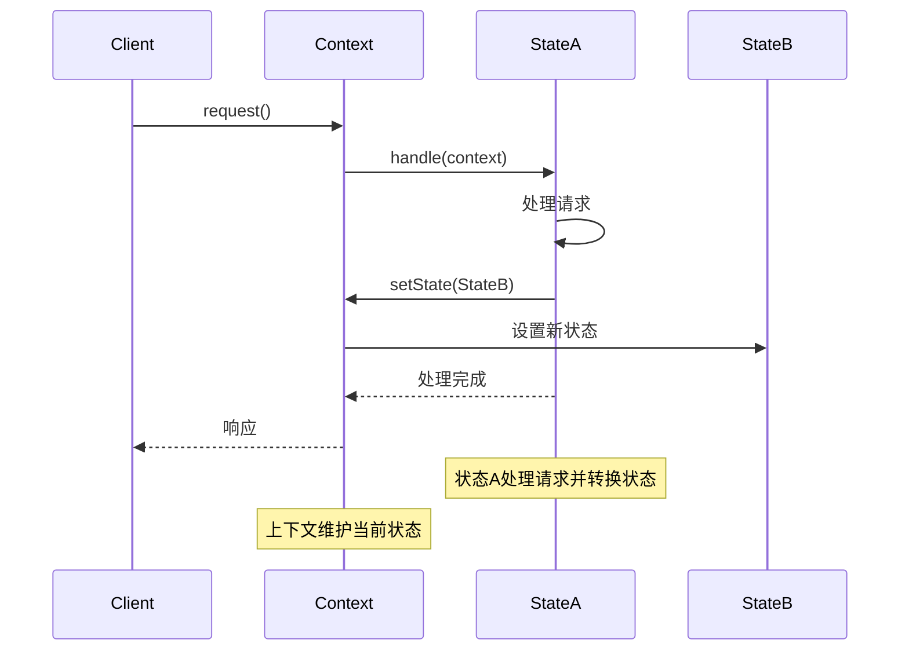

# 状态模式 (State Pattern)

## 概述

状态模式允许一个对象在其内部状态改变时改变它的行为。对象看起来似乎修改了它的类。

## 架构图

### 状态模式类图


### Laravel 工作流状态架构


### 状态转换图


### Laravel 订单状态模式


### 状态模式时序图


## 设计意图

- **状态封装**：将每个状态的行为封装在独立的类中
- **行为变化**：根据状态改变对象的行为
- **消除条件判断**：用多态代替复杂的条件判断
- **状态转换**：定义清晰的状态转换规则

## Laravel 中的实现

### 1. 工作流状态管理

Laravel 的工作流系统使用状态模式管理流程状态：

```php
// 状态接口
interface WorkflowState
{
    public function process(WorkflowContext $context);
    public function canTransitionTo($nextState);
    public function getName();
}

// 具体状态类
class DraftState implements WorkflowState
{
    public function process(WorkflowContext $context)
    {
        // 草稿状态的处理逻辑
        $context->setStatus('draft');
        
        // 可以转换为待审核状态
        if ($context->hasRequiredFields()) {
            $context->transitionTo(new PendingReviewState());
        }
    }
    
    public function canTransitionTo($nextState)
    {
        return $nextState instanceof PendingReviewState;
    }
    
    public function getName()
    {
        return 'draft';
    }
}

class PendingReviewState implements WorkflowState
{
    public function process(WorkflowContext $context)
    {
        $context->setStatus('pending_review');
        
        // 根据审核结果转换状态
        if ($context->isApproved()) {
            $context->transitionTo(new PublishedState());
        } elseif ($context->isRejected()) {
            $context->transitionTo(new RejectedState());
        }
    }
    
    public function canTransitionTo($nextState)
    {
        return $nextState instanceof PublishedState || 
               $nextState instanceof RejectedState;
    }
    
    public function getName()
    {
        return 'pending_review';
    }
}

class PublishedState implements WorkflowState
{
    public function process(WorkflowContext $context)
    {
        $context->setStatus('published');
        $context->publish();
        
        // 发布后可以归档
        if ($context->shouldArchive()) {
            $context->transitionTo(new ArchivedState());
        }
    }
    
    public function canTransitionTo($nextState)
    {
        return $nextState instanceof ArchivedState;
    }
    
    public function getName()
    {
        return 'published';
    }
}

// 上下文类
class WorkflowContext
{
    protected $state;
    protected $data;
    
    public function __construct($initialData = [])
    {
        $this->data = $initialData;
        $this->state = new DraftState();
    }
    
    public function transitionTo(WorkflowState $state)
    {
        if ($this->state->canTransitionTo($state)) {
            $this->state = $state;
            $this->state->process($this);
        } else {
            throw new InvalidStateTransitionException(
                "Cannot transition from {$this->state->getName()} to {$state->getName()}"
            );
        }
    }
    
    public function process()
    {
        $this->state->process($this);
    }
    
    public function setStatus($status)
    {
        $this->data['status'] = $status;
    }
    
    public function getStatus()
    {
        return $this->data['status'] ?? null;
    }
    
    public function hasRequiredFields()
    {
        return isset($this->data['title']) && isset($this->data['content']);
    }
    
    public function isApproved()
    {
        return $this->data['review_result'] === 'approved';
    }
    
    public function isRejected()
    {
        return $this->data['review_result'] === 'rejected';
    }
    
    public function shouldArchive()
    {
        return isset($this->data['archive_after']) && 
               $this->data['archive_after'] < now();
    }
    
    public function publish()
    {
        $this->data['published_at'] = now();
        // 执行发布逻辑
    }
}

// 使用示例
$workflow = new WorkflowContext([
    'title' => '文章标题',
    'content' => '文章内容'
]);

// 处理工作流
$workflow->process();
echo $workflow->getStatus(); // 输出: draft

// 转换为待审核状态
$workflow->transitionTo(new PendingReviewState());
echo $workflow->getStatus(); // 输出: pending_review

// 设置审核结果并处理
$workflow->setData(['review_result' => 'approved']);
$workflow->process();
echo $workflow->getStatus(); // 输出: published
```

### 2. 订单状态管理

电商系统中的订单状态管理：

```php
// 订单状态接口
interface OrderState
{
    public function cancel(Order $order);
    public function pay(Order $order);
    public function ship(Order $order);
    public function deliver(Order $order);
    public function complete(Order $order);
    public function refund(Order $order);
}

// 具体状态类
class PendingPaymentState implements OrderState
{
    public function cancel(Order $order)
    {
        $order->setStatus('cancelled');
        $order->save();
        
        // 发送取消通知
        event(new OrderCancelled($order));
    }
    
    public function pay(Order $order)
    {
        // 处理支付逻辑
        if ($order->processPayment()) {
            $order->setState(new PaidState());
            $order->setStatus('paid');
            $order->save();
            
            // 发送支付成功通知
            event(new OrderPaid($order));
        }
    }
    
    public function ship(Order $order)
    {
        throw new InvalidOrderStateException('待支付订单不能发货');
    }
    
    public function deliver(Order $order)
    {
        throw new InvalidOrderStateException('待支付订单不能完成配送');
    }
    
    public function complete(Order $order)
    {
        throw new InvalidOrderStateException('待支付订单不能完成');
    }
    
    public function refund(Order $order)
    {
        throw new InvalidOrderStateException('待支付订单不能退款');
    }
}

class PaidState implements OrderState
{
    public function cancel(Order $order)
    {
        // 已支付订单取消需要退款
        if ($order->processRefund()) {
            $order->setState(new RefundedState());
            $order->setStatus('refunded');
            $order->save();
            
            event(new OrderRefunded($order));
        }
    }
    
    public function pay(Order $order)
    {
        throw new InvalidOrderStateException('已支付订单不能再次支付');
    }
    
    public function ship(Order $order)
    {
        // 处理发货逻辑
        if ($order->prepareShipment()) {
            $order->setState(new ShippedState());
            $order->setStatus('shipped');
            $order->setShippedAt(now());
            $order->save();
            
            event(new OrderShipped($order));
        }
    }
    
    public function deliver(Order $order)
    {
        throw new InvalidOrderStateException('已支付订单需要先发货');
    }
    
    public function complete(Order $order)
    {
        throw new InvalidOrderStateException('已支付订单需要先发货');
    }
    
    public function refund(Order $order)
    {
        if ($order->processRefund()) {
            $order->setState(new RefundedState());
            $order->setStatus('refunded');
            $order->save();
            
            event(new OrderRefunded($order));
        }
    }
}

class ShippedState implements OrderState
{
    public function cancel(Order $order)
    {
        throw new InvalidOrderStateException('已发货订单不能取消');
    }
    
    public function pay(Order $order)
    {
        throw new InvalidOrderStateException('已发货订单不能支付');
    }
    
    public function ship(Order $order)
    {
        throw new InvalidOrderStateException('订单已发货');
    }
    
    public function deliver(Order $order)
    {
        // 处理配送完成逻辑
        $order->setState(new DeliveredState());
        $order->setStatus('delivered');
        $order->setDeliveredAt(now());
        $order->save();
        
        event(new OrderDelivered($order));
    }
    
    public function complete(Order $order)
    {
        throw new InvalidOrderStateException('已发货订单需要先完成配送');
    }
    
    public function refund(Order $order)
    {
        // 已发货订单退款逻辑
        if ($order->processRefundWithReturn()) {
            $order->setState(new RefundedState());
            $order->setStatus('refunded');
            $order->save();
            
            event(new OrderRefunded($order));
        }
    }
}

// 订单类
class Order extends Model
{
    protected $state;
    
    public function __construct(array $attributes = [])
    {
        parent::__construct($attributes);
        $this->initializeState();
    }
    
    protected function initializeState()
    {
        $status = $this->status ?? 'pending_payment';
        
        switch ($status) {
            case 'pending_payment':
                $this->state = new PendingPaymentState();
                break;
            case 'paid':
                $this->state = new PaidState();
                break;
            case 'shipped':
                $this->state = new ShippedState();
                break;
            case 'delivered':
                $this->state = new DeliveredState();
                break;
            case 'completed':
                $this->state = new CompletedState();
                break;
            case 'cancelled':
                $this->state = new CancelledState();
                break;
            case 'refunded':
                $this->state = new RefundedState();
                break;
            default:
                $this->state = new PendingPaymentState();
        }
    }
    
    public function setState(OrderState $state)
    {
        $this->state = $state;
    }
    
    public function cancel()
    {
        $this->state->cancel($this);
    }
    
    public function pay()
    {
        $this->state->pay($this);
    }
    
    public function ship()
    {
        $this->state->ship($this);
    }
    
    public function deliver()
    {
        $this->state->deliver($this);
    }
    
    public function complete()
    {
        $this->state->complete($this);
    }
    
    public function refund()
    {
        $this->state->refund($this);
    }
    
    public function processPayment()
    {
        // 支付处理逻辑
        return true;
    }
    
    public function processRefund()
    {
        // 退款处理逻辑
        return true;
    }
    
    public function prepareShipment()
    {
        // 发货准备逻辑
        return true;
    }
}

// 使用示例
$order = Order::find(1);

try {
    $order->pay(); // 支付订单
    $order->ship(); // 发货
    $order->deliver(); // 完成配送
    
} catch (InvalidOrderStateException $e) {
    Log::error('订单状态操作失败: ' . $e->getMessage());
}
```

### 3. 用户认证状态

Laravel 认证系统的状态管理：

```php
// 认证状态接口
interface AuthState
{
    public function login(User $user, $credentials);
    public function logout();
    public function check();
    public function user();
    public function attempt($credentials);
}

// 具体状态类
class GuestState implements AuthState
{
    protected $guard;
    
    public function __construct($guard)
    {
        $this->guard = $guard;
    }
    
    public function login(User $user, $credentials = null)
    {
        // 登录逻辑
        $this->guard->setUser($user);
        $this->guard->setState(new AuthenticatedState($this->guard));
        
        event(new Login($this->guard->getName(), $user, false));
    }
    
    public function logout()
    {
        throw new AuthenticationException('未登录用户不能退出');
    }
    
    public function check()
    {
        return false;
    }
    
    public function user()
    {
        return null;
    }
    
    public function attempt($credentials)
    {
        // 尝试认证
        $user = $this->guard->getProvider()->retrieveByCredentials($credentials);
        
        if ($user && $this->guard->getProvider()->validateCredentials($user, $credentials)) {
            $this->login($user, $credentials);
            return true;
        }
        
        return false;
    }
}

class AuthenticatedState implements AuthState
{
    protected $guard;
    
    public function __construct($guard)
    {
        $this->guard = $guard;
    }
    
    public function login(User $user, $credentials = null)
    {
        // 已登录用户重新登录
        $this->guard->setUser($user);
        event(new Login($this->guard->getName(), $user, true));
    }
    
    public function logout()
    {
        $user = $this->guard->user();
        $this->guard->setUser(null);
        $this->guard->setState(new GuestState($this->guard));
        
        event(new Logout($this->guard->getName(), $user));
    }
    
    public function check()
    {
        return true;
    }
    
    public function user()
    {
        return $this->guard->getUser();
    }
    
    public function attempt($credentials)
    {
        throw new AuthenticationException('已登录用户不能尝试认证');
    }
}

// 认证守卫类
class StatefulGuard
{
    protected $state;
    protected $user;
    protected $name;
    protected $provider;
    
    public function __construct($name, UserProvider $provider)
    {
        $this->name = $name;
        $this->provider = $provider;
        $this->state = new GuestState($this);
    }
    
    public function setState(AuthState $state)
    {
        $this->state = $state;
    }
    
    public function setUser($user)
    {
        $this->user = $user;
    }
    
    public function getUser()
    {
        return $this->user;
    }
    
    public function getName()
    {
        return $this->name;
    }
    
    public function getProvider()
    {
        return $this->provider;
    }
    
    public function check()
    {
        return $this->state->check();
    }
    
    public function guest()
    {
        return !$this->check();
    }
    
    public function user()
    {
        return $this->state->user();
    }
    
    public function id()
    {
        return $this->user()?->getAuthIdentifier();
    }
    
    public function validate(array $credentials = [])
    {
        return $this->state->attempt($credentials);
    }
    
    public function attempt(array $credentials = [], $remember = false)
    {
        return $this->state->attempt($credentials);
    }
    
    public function login(User $user, $remember = false)
    {
        $this->state->login($user);
    }
    
    public function logout()
    {
        $this->state->logout();
    }
}
```

## 实际应用场景

### 1. 文档审批流程

文档审批流程的状态管理：

```php
// 文档状态接口
interface DocumentState
{
    public function submit(Document $document);
    public function approve(Document $document, User $approver);
    public function reject(Document $document, User $rejecter, $reason);
    public function publish(Document $document);
    public function archive(Document $document);
}

// 具体状态类
class DraftState implements DocumentState
{
    public function submit(Document $document)
    {
        $document->setStatus('submitted');
        $document->setSubmittedAt(now());
        $document->setState(new SubmittedState());
        
        // 通知审批人
        event(new DocumentSubmitted($document));
    }
    
    public function approve(Document $document, User $approver)
    {
        throw new InvalidDocumentStateException('草稿文档不能审批');
    }
    
    public function reject(Document $document, User $rejecter, $reason)
    {
        throw new InvalidDocumentStateException('草稿文档不能拒绝');
    }
    
    public function publish(Document $document)
    {
        throw new InvalidDocumentStateException('草稿文档不能发布');
    }
    
    public function archive(Document $document)
    {
        $document->setStatus('archived');
        $document->setState(new ArchivedState());
        
        event(new DocumentArchived($document));
    }
}

class SubmittedState implements DocumentState
{
    public function submit(Document $document)
    {
        throw new InvalidDocumentStateException('已提交文档不能再次提交');
    }
    
    public function approve(Document $document, User $approver)
    {
        $document->setStatus('approved');
        $document->setApprovedBy($approver->id);
        $document->setApprovedAt(now());
        $document->setState(new ApprovedState());
        
        event(new DocumentApproved($document, $approver));
    }
    
    public function reject(Document $document, User $rejecter, $reason)
    {
        $document->setStatus('rejected');
        $document->setRejectedBy($rejecter->id);
        $document->setRejectedAt(now());
        $document->setRejectionReason($reason);
        $document->setState(new RejectedState());
        
        event(new DocumentRejected($document, $rejecter, $reason));
    }
    
    public function publish(Document $document)
    {
        throw new InvalidDocumentStateException('待审批文档不能发布');
    }
    
    public function archive(Document $document)
    {
        throw new InvalidDocumentStateException('待审批文档不能归档');
    }
}

class ApprovedState implements DocumentState
{
    public function submit(Document $document)
    {
        throw new InvalidDocumentStateException('已审批文档不能提交');
    }
    
    public function approve(Document $document, User $approver)
    {
        throw new InvalidDocumentStateException('已审批文档不能再次审批');
    }
    
    public function reject(Document $document, User $rejecter, $reason)
    {
        throw new InvalidDocumentStateException('已审批文档不能拒绝');
    }
    
    public function publish(Document $document)
    {
        $document->setStatus('published');
        $document->setPublishedAt(now());
        $document->setState(new PublishedState());
        
        // 执行发布逻辑
        $document->publishToWebsite();
        
        event(new DocumentPublished($document));
    }
    
    public function archive(Document $document)
    {
        $document->setStatus('archived');
        $document->setState(new ArchivedState());
        
        event(new DocumentArchived($document));
    }
}

// 文档类
class Document extends Model
{
    protected $state;
    
    public static function boot()
    {
        parent::boot();
        
        static::retrieved(function ($document) {
            $document->initializeState();
        });
        
        static::saving(function ($document) {
            $document->syncStateToAttributes();
        });
    }
    
    protected function initializeState()
    {
        $status = $this->status ?? 'draft';
        
        switch ($status) {
            case 'draft':
                $this->state = new DraftState();
                break;
            case 'submitted':
                $this->state = new SubmittedState();
                break;
            case 'approved':
                $this->state = new ApprovedState();
                break;
            case 'rejected':
                $this->state = new RejectedState();
                break;
            case 'published':
                $this->state = new PublishedState();
                break;
            case 'archived':
                $this->state = new ArchivedState();
                break;
            default:
                $this->state = new DraftState();
        }
    }
    
    protected function syncStateToAttributes()
    {
        // 将状态同步到属性
    }
    
    public function setState(DocumentState $state)
    {
        $this->state = $state;
    }
    
    public function submit()
    {
        $this->state->submit($this);
        $this->save();
    }
    
    public function approve(User $approver)
    {
        $this->state->approve($this, $approver);
        $this->save();
    }
    
    public function reject(User $rejecter, $reason)
    {
        $this->state->reject($this, $rejecter, $reason);
        $this->save();
    }
    
    public function publish()
    {
        $this->state->publish($this);
        $this->save();
    }
    
    public function archive()
    {
        $this->state->archive($this);
        $this->save();
    }
    
    public function publishToWebsite()
    {
        // 发布到网站的逻