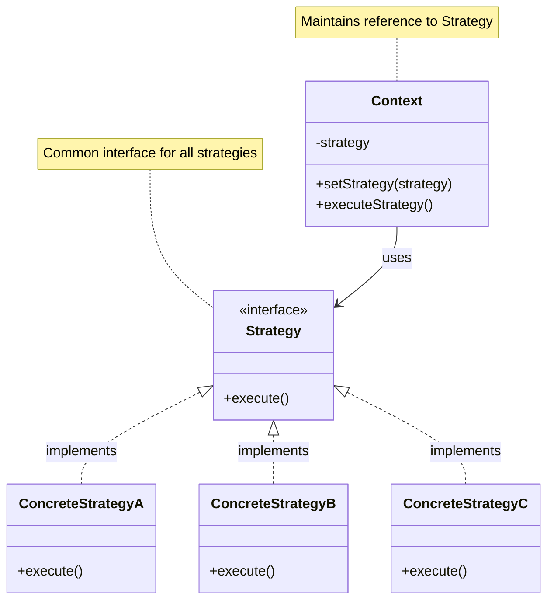
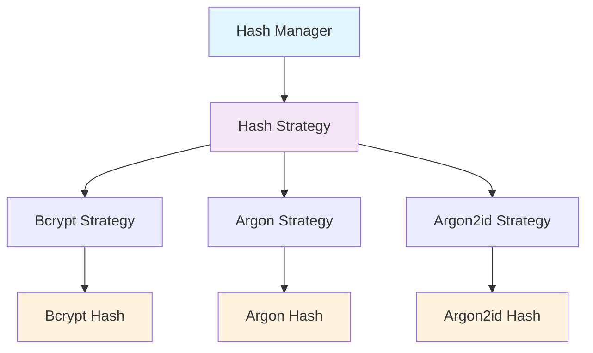

# Strategy Pattern

## Overview

Define a family of algorithms, encapsulate each one, and make them interchangeable. The Strategy pattern allows the algorithm to vary independently from clients that use it.

## Architecture Diagram

### Strategy Pattern Structure



### Laravel Hashing Strategy



## Implementation in Laravel

### 1. Hashing Strategies

Laravel uses the Strategy pattern for different hashing algorithms:

```php
// Illuminate\Hashing\HashManager.php
class HashManager extends Manager implements Hasher
{
    public function createBcryptDriver()
    {
        return new BcryptHasher($this->config->get('hashing.bcrypt') ?? []);
    }
    
    public function createArgonDriver()
    {
        return new ArgonHasher($this->config->get('hashing.argon') ?? []);
    }
    
    public function createArgon2idDriver()
    {
        return new Argon2IdHasher($this->config->get('hashing.argon') ?? []);
    }
}

// Strategy interface
interface Hasher
{
    public function make($value, array $options = []);
    public function check($value, $hashedValue, array $options = []);
    public function needsRehash($hashedValue, array $options = []);
}

// Concrete strategies
class BcryptHasher implements Hasher
{
    public function make($value, array $options = [])
    {
        $cost = $options['rounds'] ?? $this->rounds;
        
        $hash = password_hash($value, PASSWORD_BCRYPT, ['cost' => $cost]);
        
        if ($hash === false) {
            throw new RuntimeException('Bcrypt hashing not supported.');
        }
        
        return $hash;
    }
}

class ArgonHasher implements Hasher
{
    public function make($value, array $options = [])
    {
        $hash = password_hash($value, PASSWORD_ARGON2I, [
            'memory_cost' => $this->memory($options),
            'time_cost' => $this->time($options),
            'threads' => $this->threads($options),
        ]);
        
        if ($hash === false) {
            throw new RuntimeException('Argon hashing not supported.');
        }
        
        return $hash;
    }
}
```

### 2. File Storage Strategies

```php
// Different file storage strategies
interface FilesystemContract
{
    public function exists($path);
    public function get($path);
    public function put($path, $contents, $options = []);
    public function delete($paths);
}

class LocalFilesystem implements FilesystemContract
{
    public function put($path, $contents, $options = [])
    {
        return file_put_contents($path, $contents, LOCK_EX) !== false;
    }
}

class S3Filesystem implements FilesystemContract
{
    public function put($path, $contents, $options = [])
    {
        return $this->s3Client->putObject([
            'Bucket' => $this->bucket,
            'Key' => $path,
            'Body' => $contents,
        ]);
    }
}
```