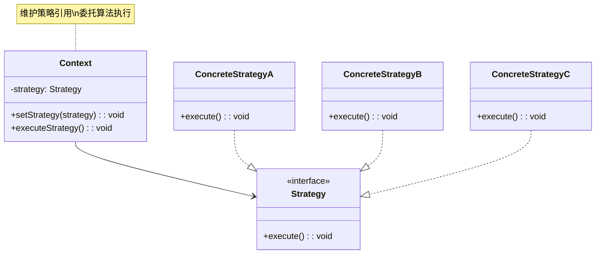
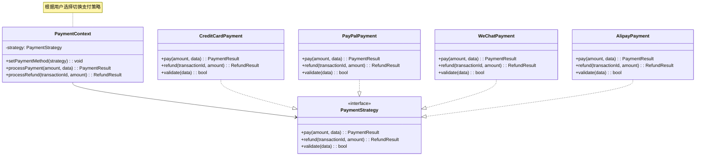
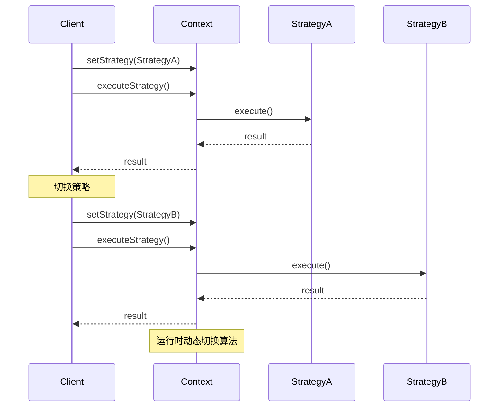
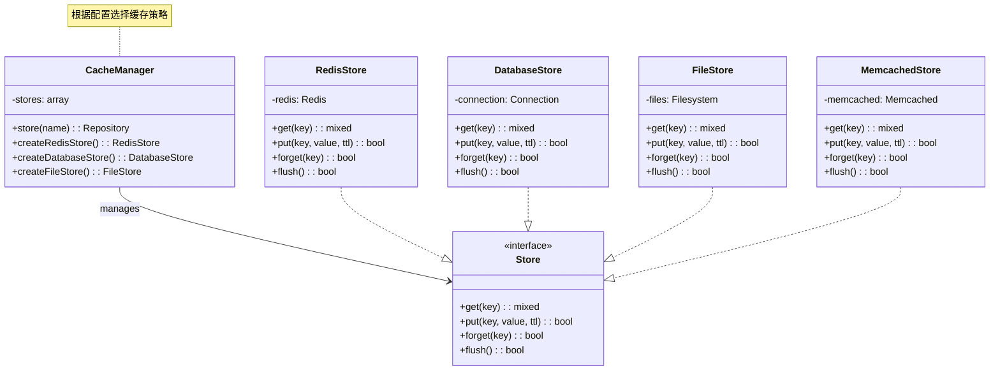
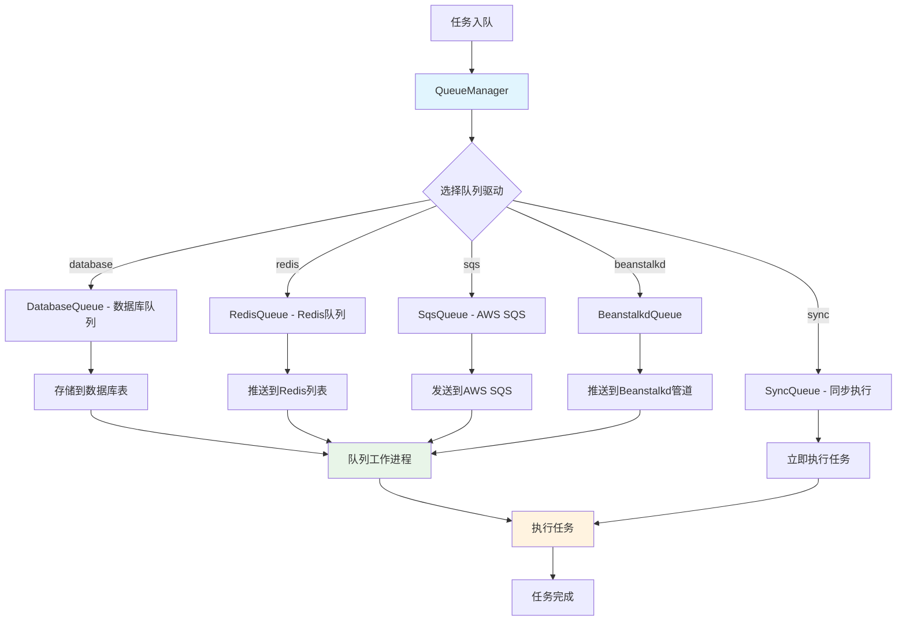
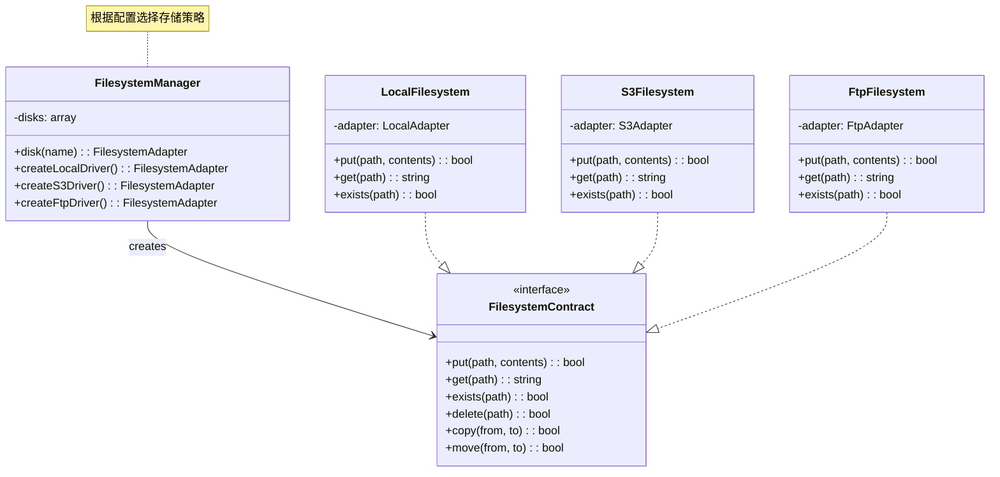
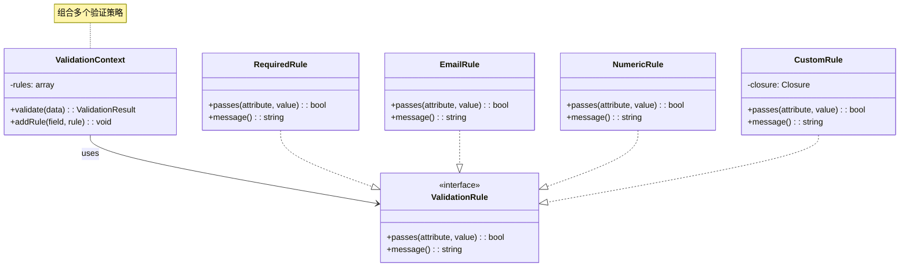

# 策略模式 (Strategy Pattern)

## 概述

策略模式定义了一系列算法，并将每个算法封装起来，使它们可以相互替换。策略模式让算法独立于使用它的客户而变化。

## 架构图

### 策略模式类图


### Laravel 支付策略架构


### 策略模式时序图


### Laravel 缓存策略架构


### 队列处理策略流程


### 文件存储策略架构


### 验证策略模式


## 设计意图

- **算法封装**：将算法封装在独立的策略类中
- **算法替换**：运行时动态选择算法
- **消除条件判断**：用多态代替复杂的条件判断
- **扩展性**：易于添加新的算法策略

## Laravel 中的实现

### 1. 支付策略管理

Laravel 中的支付系统使用策略模式支持多种支付方式：

```php
// 支付策略接口
interface PaymentStrategy
{
    public function pay($amount, array $data = []);
    public function refund($transactionId, $amount);
    public function validate($data);
}

// 具体支付策略类
class CreditCardPayment implements PaymentStrategy
{
    public function pay($amount, array $data = [])
    {
        // 验证信用卡信息
        $this->validate($data);
        
        // 调用信用卡支付API
        $response = $this->processCreditCardPayment($amount, $data);
        
        if ($response->isSuccessful()) {
            return new PaymentResult(true, $response->getTransactionId(), '信用卡支付成功');
        }
        
        return new PaymentResult(false, null, $response->getErrorMessage());
    }
    
    public function refund($transactionId, $amount)
    {
        // 调用信用卡退款API
        $response = $this->processCreditCardRefund($transactionId, $amount);
        
        if ($response->isSuccessful()) {
            return new RefundResult(true, $response->getRefundId(), '信用卡退款成功');
        }
        
        return new RefundResult(false, null, $response->getErrorMessage());
    }
    
    public function validate($data)
    {
        $validator = Validator::make($data, [
            'card_number' => 'required|credit_card',
            'expiry_date' => 'required|date_format:m/y|after:today',
            'cvv' => 'required|digits:3',
            'cardholder_name' => 'required|string|max:255'
        ]);
        
        if ($validator->fails()) {
            throw new PaymentValidationException($validator->errors());
        }
    }
    
    protected function processCreditCardPayment($amount, $data)
    {
        // 调用具体的信用卡支付网关
        $gateway = new CreditCardGateway(config('payment.credit_card'));
        return $gateway->charge($amount, $data);
    }
    
    protected function processCreditCardRefund($transactionId, $amount)
    {
        $gateway = new CreditCardGateway(config('payment.credit_card'));
        return $gateway->refund($transactionId, $amount);
    }
}

class PayPalPayment implements PaymentStrategy
{
    public function pay($amount, array $data = [])
    {
        $this->validate($data);
        
        // 调用PayPal支付API
        $response = $this->processPayPalPayment($amount, $data);
        
        if ($response->isSuccessful()) {
            return new PaymentResult(true, $response->getPaymentId(), 'PayPal支付成功');
        }
        
        return new PaymentResult(false, null, $response->getErrorMessage());
    }
    
    public function refund($transactionId, $amount)
    {
        $response = $this->processPayPalRefund($transactionId, $amount);
        
        if ($response->isSuccessful()) {
            return new RefundResult(true, $response->getRefundId(), 'PayPal退款成功');
        }
        
        return new RefundResult(false, null, $response->getErrorMessage());
    }
    
    public function validate($data)
    {
        $validator = Validator::make($data, [
            'email' => 'required|email',
            'return_url' => 'required|url',
            'cancel_url' => 'required|url'
        ]);
        
        if ($validator->fails()) {
            throw new PaymentValidationException($validator->errors());
        }
    }
    
    protected function processPayPalPayment($amount, $data)
    {
        $paypal = new PayPalClient(config('payment.paypal'));
        return $paypal->createOrder($amount, $data);
    }
    
    protected function processPayPalRefund($transactionId, $amount)
    {
        $paypal = new PayPalClient(config('payment.paypal'));
        return $paypal->refundOrder($transactionId, $amount);
    }
}

class AlipayPayment implements PaymentStrategy
{
    public function pay($amount, array $data = [])
    {
        $this->validate($data);
        
        $response = $this->processAlipayPayment($amount, $data);
        
        if ($response->isSuccessful()) {
            return new PaymentResult(true, $response->getTradeNo(), '支付宝支付成功');
        }
        
        return new PaymentResult(false, null, $response->getErrorMessage());
    }
    
    public function refund($transactionId, $amount)
    {
        $response = $this->processAlipayRefund($transactionId, $amount);
        
        if ($response->isSuccessful()) {
            return new RefundResult(true, $response->getRefundNo(), '支付宝退款成功');
        }
        
        return new RefundResult(false, null, $response->getErrorMessage());
    }
    
    public function validate($data)
    {
        $validator = Validator::make($data, [
            'buyer_id' => 'required|string',
            'subject' => 'required|string|max:256',
            'body' => 'sometimes|string|max:1000'
        ]);
        
        if ($validator->fails()) {
            throw new PaymentValidationException($validator->errors());
        }
    }
    
    protected function processAlipayPayment($amount, $data)
    {
        $alipay = new AlipayClient(config('payment.alipay'));
        return $alipay->createTrade($amount, $data);
    }
    
    protected function processAlipayRefund($transactionId, $amount)
    {
        $alipay = new AlipayClient(config('payment.alipay'));
        return $alipay->refundTrade($transactionId, $amount);
    }
}

// 支付上下文类
class PaymentContext
{
    protected $strategy;
    protected $logger;
    
    public function __construct(PaymentStrategy $strategy, LoggerInterface $logger = null)
    {
        $this->strategy = $strategy;
        $this->logger = $logger ?? app(LoggerInterface::class);
    }
    
    public function setStrategy(PaymentStrategy $strategy)
    {
        $this->strategy = $strategy;
    }
    
    public function pay($amount, array $data = [])
    {
        try {
            $this->logger->info('开始支付', ['amount' => $amount, 'method' => get_class($this->strategy)]);
            
            $result = $this->strategy->pay($amount, $data);
            
            if ($result->isSuccessful()) {
                $this->logger->info('支付成功', ['transaction_id' => $result->getTransactionId()]);
            } else {
                $this->logger->error('支付失败', ['error' => $result->getMessage()]);
            }
            
            return $result;
            
        } catch (PaymentValidationException $e) {
            $this->logger->error('支付验证失败', ['errors' => $e->getErrors()]);
            throw $e;
        } catch (Exception $e) {
            $this->logger->error('支付系统错误', ['error' => $e->getMessage()]);
            throw new PaymentException('支付系统暂时不可用', 0, $e);
        }
    }
    
    public function refund($transactionId, $amount)
    {
        try {
            $this->logger->info('开始退款', ['transaction_id' => $transactionId, 'amount' => $amount]);
            
            $result = $this->strategy->refund($transactionId, $amount);
            
            if ($result->isSuccessful()) {
                $this->logger->info('退款成功', ['refund_id' => $result->getRefundId()]);
            } else {
                $this->logger->error('退款失败', ['error' => $result->getMessage()]);
            }
            
            return $result;
            
        } catch (Exception $e) {
            $this->logger->error('退款系统错误', ['error' => $e->getMessage()]);
            throw new PaymentException('退款系统暂时不可用', 0, $e);
        }
    }
}

// 支付结果类
class PaymentResult
{
    protected $success;
    protected $transactionId;
    protected $message;
    
    public function __construct($success, $transactionId, $message)
    {
        $this->success = $success;
        $this->transactionId = $transactionId;
        $this->message = $message;
    }
    
    public function isSuccessful()
    {
        return $this->success;
    }
    
    public function getTransactionId()
    {
        return $this->transactionId;
    }
    
    public function getMessage()
    {
        return $this->message;
    }
}

class RefundResult
{
    protected $success;
    protected $refundId;
    protected $message;
    
    public function __construct($success, $refundId, $message)
    {
        $this->success = $success;
        $this->refundId = $refundId;
        $this->message = $message;
    }
    
    public function isSuccessful()
    {
        return $this->success;
    }
    
    public function getRefundId()
    {
        return $this->refundId;
    }
    
    public function getMessage()
    {
        return $this->message;
    }
}

// 使用示例
class PaymentController extends Controller
{
    public function pay(Request $request)
    {
        $validator = Validator::make($request->all(), [
            'amount' => 'required|numeric|min:0.01',
            'payment_method' => 'required|in:credit_card,paypal,alipay',
            'payment_data' => 'required|array'
        ]);
        
        if ($validator->fails()) {
            return response()->json(['errors' => $validator->errors()], 422);
        }
        
        $amount = $request->input('amount');
        $method = $request->input('payment_method');
        $data = $request->input('payment_data');
        
        // 根据支付方式选择策略
        $strategy = $this->createPaymentStrategy($method);
        $paymentContext = new PaymentContext($strategy);
        
        try {
            $result = $paymentContext->pay($amount, $data);
            
            if ($result->isSuccessful()) {
                return response()->json([
                    'success' => true,
                    'transaction_id' => $result->getTransactionId(),
                    'message' => $result->getMessage()
                ]);
            } else {
                return response()->json([
                    'success' => false,
                    'message' => $result->getMessage()
                ], 400);
            }
            
        } catch (PaymentValidationException $e) {
            return response()->json([
                'success' => false,
                'errors' => $e->getErrors()
            ], 422);
        } catch (PaymentException $e) {
            return response()->json([
                'success' => false,
                'message' => $e->getMessage()
            ], 500);
        }
    }
    
    public function refund(Request $request)
    {
        $validator = Validator::make($request->all(), [
            'transaction_id' => 'required|string',
            'amount' => 'required|numeric|min:0.01',
            'payment_method' => 'required|in:credit_card,paypal,alipay'
        ]);
        
        if ($validator->fails()) {
            return response()->json(['errors' => $validator->errors()], 422);
        }
        
        $transactionId = $request->input('transaction_id');
        $amount = $request->input('amount');
        $method = $request->input('payment_method');
        
        $strategy = $this->createPaymentStrategy($method);
        $paymentContext = new PaymentContext($strategy);
        
        try {
            $result = $paymentContext->refund($transactionId, $amount);
            
            if ($result->isSuccessful()) {
                return response()->json([
                    'success' => true,
                    'refund_id' => $result->getRefundId(),
                    'message' => $result->getMessage()
                ]);
            } else {
                return response()->json([
                    'success' => false,
                    'message' => $result->getMessage()
                ], 400);
            }
            
        } catch (PaymentException $e) {
            return response()->json([
                'success' => false,
                'message' => $e->getMessage()
            ], 500);
        }
    }
    
    protected function createPaymentStrategy($method)
    {
        switch ($method) {
            case 'credit_card':
                return new CreditCardPayment();
            case 'paypal':
                return new PayPalPayment();
            case 'alipay':
                return new AlipayPayment();
            default:
                throw new InvalidArgumentException("不支持的支付方式: {$method}");
        }
    }
}
```

### 2. 缓存策略管理

Laravel 缓存系统的策略模式实现：

```php
// 缓存策略接口
interface CacheStrategy
{
    public function get($key);
    public function put($key, $value, $ttl = null);
    public function forget($key);
    public function flush();
    public function has($key);
}

// 具体缓存策略类
class RedisCacheStrategy implements CacheStrategy
{
    protected $redis;
    protected $prefix;
    
    public function __construct($config)
    {
        $this->redis = new RedisClient($config);
        $this->prefix = $config['prefix'] ?? 'cache:';
    }
    
    public function get($key)
    {
        $value = $this->redis->get($this->prefix . $key);
        
        if ($value !== false) {
            return unserialize($value);
        }
        
        return null;
    }
    
    public function put($key, $value, $ttl = null)
    {
        $serialized = serialize($value);
        
        if ($ttl) {
            return $this->redis->setex($this->prefix . $key, $ttl, $serialized);
        } else {
            return $this->redis->set($this->prefix . $key, $serialized);
        }
    }
    
    public function forget($key)
    {
        return $this->redis->del($this->prefix . $key);
    }
    
    public function flush()
    {
        $keys = $this->redis->keys($this->prefix . '*');
        
        if (!empty($keys)) {
            return $this->redis->del($keys);
        }
        
        return 0;
    }
    
    public function has($key)
    {
        return $this->redis->exists($this->prefix . $key);
    }
}

class FileCacheStrategy implements CacheStrategy
{
    protected $directory;
    
    public function __construct($config)
    {
        $this->directory = $config['path'] ?? storage_path('framework/cache');
        
        if (!file_exists($this->directory)) {
            mkdir($this->directory, 0755, true);
        }
    }
    
    public function get($key)