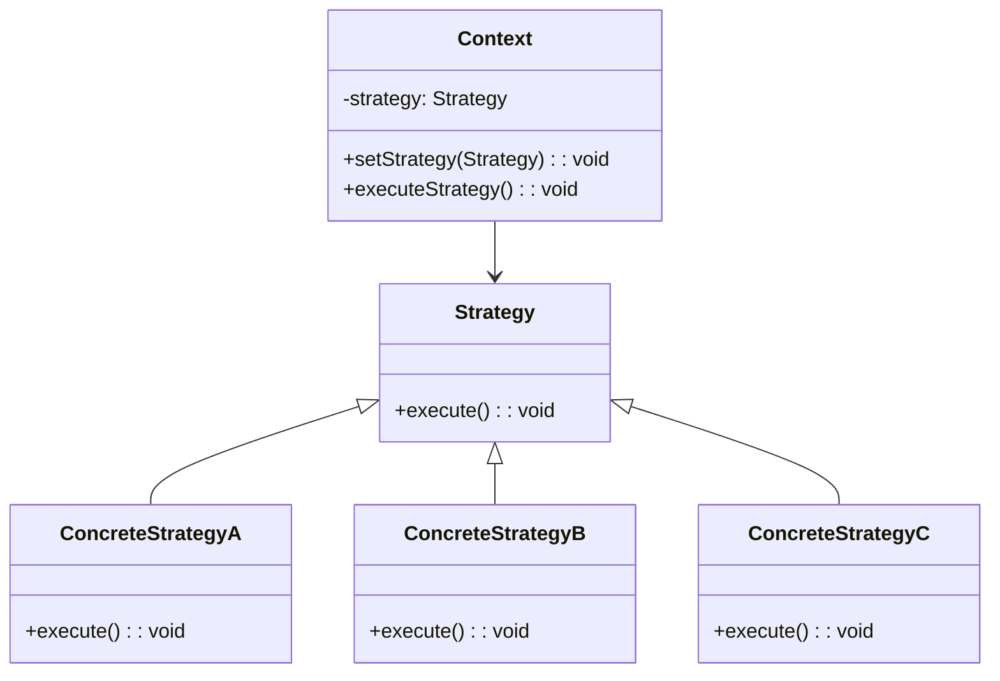
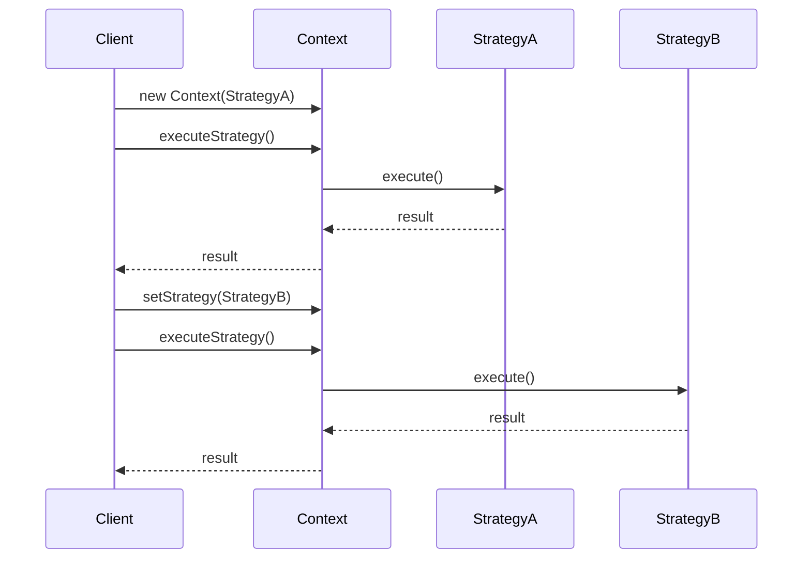

# 策略模式 (Strategy Pattern)

## 概述

策略模式定义了一系列算法，把它们一个个封装起来，并且使它们可相互替换。策略模式让算法的变化独立于使用算法的客户端。

## 问题场景

在Laravel应用中，我们经常需要：
- 不同的支付方式处理
- 多种数据导出格式
- 各种排序算法
- 不同的缓存策略
- 多种验证规则

## 解决方案

策略模式通过定义策略接口和具体策略类，让客户端可以动态选择算法。

## UML类图



## Laravel实现

### 1. 支付策略实现

```php
<?php

namespace App\Patterns\Strategy;

// 支付策略接口
interface PaymentStrategyInterface
{
    public function pay(float $amount, array $options = []): array;
    public function refund(string $transactionId, float $amount): array;
    public function getName(): string;
}

// 支付宝策略
class AlipayStrategy implements PaymentStrategyInterface
{
    private string $appId;
    private string $privateKey;
    
    public function __construct(string $appId, string $privateKey)
    {
        $this->appId = $appId;
        $this->privateKey = $privateKey;
    }
    
    public function pay(float $amount, array $options = []): array
    {
        // 模拟支付宝支付逻辑
        $orderId = $options['order_id'] ?? uniqid();
        $subject = $options['subject'] ?? '商品购买';
        
        return [
            'success' => true,
            'transaction_id' => 'alipay_' . uniqid(),
            'amount' => $amount,
            'method' => 'alipay',
            'order_id' => $orderId,
            'message' => "支付宝支付成功: ¥{$amount}",
            'redirect_url' => "https://openapi.alipay.com/gateway.do?order_id={$orderId}"
        ];
    }
    
    public function refund(string $transactionId, float $amount): array
    {
        return [
            'success' => true,
            'refund_id' => 'alipay_refund_' . uniqid(),
            'transaction_id' => $transactionId,
            'amount' => $amount,
            'message' => "支付宝退款成功: ¥{$amount}"
        ];
    }
    
    public function getName(): string
    {
        return 'alipay';
    }
}

// 微信支付策略
class WechatPayStrategy implements PaymentStrategyInterface
{
    private string $appId;
    private string $mchId;
    private string $key;
    
    public function __construct(string $appId, string $mchId, string $key)
    {
        $this->appId = $appId;
        $this->mchId = $mchId;
        $this->key = $key;
    }
    
    public function pay(float $amount, array $options = []): array
    {
        // 模拟微信支付逻辑
        $orderId = $options['order_id'] ?? uniqid();
        $body = $options['body'] ?? '商品购买';
        
        return [
            'success' => true,
            'transaction_id' => 'wechat_' . uniqid(),
            'amount' => $amount,
            'method' => 'wechat',
            'order_id' => $orderId,
            'message' => "微信支付成功: ¥{$amount}",
            'prepay_id' => 'prepay_id_' . uniqid()
        ];
    }
    
    public function refund(string $transactionId, float $amount): array
    {
        return [
            'success' => true,
            'refund_id' => 'wechat_refund_' . uniqid(),
            'transaction_id' => $transactionId,
            'amount' => $amount,
            'message' => "微信退款成功: ¥{$amount}"
        ];
    }
    
    public function getName(): string
    {
        return 'wechat';
    }
}

// 银行卡支付策略
class BankCardStrategy implements PaymentStrategyInterface
{
    private string $merchantId;
    private string $secretKey;
    
    public function __construct(string $merchantId, string $secretKey)
    {
        $this->merchantId = $merchantId;
        $this->secretKey = $secretKey;
    }
    
    public function pay(float $amount, array $options = []): array
    {
        // 模拟银行卡支付逻辑
        $orderId = $options['order_id'] ?? uniqid();
        $cardNumber = $options['card_number'] ?? '****1234';
        
        return [
            'success' => true,
            'transaction_id' => 'bank_' . uniqid(),
            'amount' => $amount,
            'method' => 'bank_card',
            'order_id' => $orderId,
            'message' => "银行卡支付成功: ¥{$amount}",
            'card_number' => $cardNumber
        ];
    }
    
    public function refund(string $transactionId, float $amount): array
    {
        return [
            'success' => true,
            'refund_id' => 'bank_refund_' . uniqid(),
            'transaction_id' => $transactionId,
            'amount' => $amount,
            'message' => "银行卡退款成功: ¥{$amount}"
        ];
    }
    
    public function getName(): string
    {
        return 'bank_card';
    }
}

// 支付上下文
class PaymentContext
{
    private PaymentStrategyInterface $strategy;
    
    public function __construct(PaymentStrategyInterface $strategy)
    {
        $this->strategy = $strategy;
    }
    
    public function setStrategy(PaymentStrategyInterface $strategy): void
    {
        $this->strategy = $strategy;
    }
    
    public function pay(float $amount, array $options = []): array
    {
        return $this->strategy->pay($amount, $options);
    }
    
    public function refund(string $transactionId, float $amount): array
    {
        return $this->strategy->refund($transactionId, $amount);
    }
    
    public function getStrategyName(): string
    {
        return $this->strategy->getName();
    }
}
```

### 2. 数据导出策略实现

```php
<?php

namespace App\Patterns\Strategy;

// 导出策略接口
interface ExportStrategyInterface
{
    public function export(array $data, array $headers = []): string;
    public function getContentType(): string;
    public function getFileExtension(): string;
}

// CSV导出策略
class CsvExportStrategy implements ExportStrategyInterface
{
    private string $delimiter;
    private string $enclosure;
    
    public function __construct(string $delimiter = ',', string $enclosure = '"')
    {
        $this->delimiter = $delimiter;
        $this->enclosure = $enclosure;
    }
    
    public function export(array $data, array $headers = []): string
    {
        $output = '';
        
        // 添加表头
        if (!empty($headers)) {
            $output .= $this->formatRow($headers);
        }
        
        // 添加数据行
        foreach ($data as $row) {
            if (is_array($row)) {
                $output .= $this->formatRow($row);
            } else {
                $output .= $this->formatRow([$row]);
            }
        }
        
        return $output;
    }
    
    private function formatRow(array $row): string
    {
        $formatted = [];
        foreach ($row as $field) {
            $formatted[] = $this->enclosure . str_replace($this->enclosure, $this->enclosure . $this->enclosure, $field) . $this->enclosure;
        }
        return implode($this->delimiter, $formatted) . "\n";
    }
    
    public function getContentType(): string
    {
        return 'text/csv';
    }
    
    public function getFileExtension(): string
    {
        return 'csv';
    }
}

// Excel导出策略
class ExcelExportStrategy implements ExportStrategyInterface
{
    public function export(array $data, array $headers = []): string
    {
        // 模拟Excel导出（实际应该使用PhpSpreadsheet等库）
        $xml = '<?xml version="1.0" encoding="UTF-8"?>' . "\n";
        $xml .= '<Workbook xmlns="urn:schemas-microsoft-com:office:spreadsheet">' . "\n";
        $xml .= '<Worksheet ss:Name="Sheet1">' . "\n";
        $xml .= '<Table>' . "\n";
        
        // 添加表头
        if (!empty($headers)) {
            $xml .= '<Row>' . "\n";
            foreach ($headers as $header) {
                $xml .= '<Cell><Data ss:Type="String">' . htmlspecialchars($header) . '</Data></Cell>' . "\n";
            }
            $xml .= '</Row>' . "\n";
        }
        
        // 添加数据行
        foreach ($data as $row) {
            $xml .= '<Row>' . "\n";
            if (is_array($row)) {
                foreach ($row as $cell) {
                    $xml .= '<Cell><Data ss:Type="String">' . htmlspecialchars($cell) . '</Data></Cell>' . "\n";
                }
            } else {
                $xml .= '<Cell><Data ss:Type="String">' . htmlspecialchars($row) . '</Data></Cell>' . "\n";
            }
            $xml .= '</Row>' . "\n";
        }
        
        $xml .= '</Table>' . "\n";
        $xml .= '</Worksheet>' . "\n";
        $xml .= '</Workbook>';
        
        return $xml;
    }
    
    public function getContentType(): string
    {
        return 'application/vnd.ms-excel';
    }
    
    public function getFileExtension(): string
    {
        return 'xls';
    }
}

// JSON导出策略
class JsonExportStrategy implements ExportStrategyInterface
{
    private bool $prettyPrint;
    
    public function __construct(bool $prettyPrint = true)
    {
        $this->prettyPrint = $prettyPrint;
    }
    
    public function export(array $data, array $headers = []): string
    {
        $exportData = [];
        
        if (!empty($headers) && !empty($data)) {
            // 如果有表头，将数据转换为关联数组
            foreach ($data as $row) {
                if (is_array($row) && count($row) === count($headers)) {
                    $exportData[] = array_combine($headers, $row);
                } else {
                    $exportData[] = $row;
                }
            }
        } else {
            $exportData = $data;
        }
        
        $flags = JSON_UNESCAPED_UNICODE;
        if ($this->prettyPrint) {
            $flags |= JSON_PRETTY_PRINT;
        }
        
        return json_encode($exportData, $flags);
    }
    
    public function getContentType(): string
    {
        return 'application/json';
    }
    
    public function getFileExtension(): string
    {
        return 'json';
    }
}

// XML导出策略
class XmlExportStrategy implements ExportStrategyInterface
{
    private string $rootElement;
    private string $rowElement;
    
    public function __construct(string $rootElement = 'data', string $rowElement = 'row')
    {
        $this->rootElement = $rootElement;
        $this->rowElement = $rowElement;
    }
    
    public function export(array $data, array $headers = []): string
    {
        $xml = '<?xml version="1.0" encoding="UTF-8"?>' . "\n";
        $xml .= "<{$this->rootElement}>" . "\n";
        
        foreach ($data as $index => $row) {
            $xml .= "  <{$this->rowElement}>" . "\n";
            
            if (is_array($row)) {
                if (!empty($headers) && count($row) === count($headers)) {
                    // 使用表头作为元素名
                    foreach ($headers as $i => $header) {
                        $elementName = preg_replace('/[^a-zA-Z0-9_]/', '_', $header);
                        $xml .= "    <{$elementName}>" . htmlspecialchars($row[$i] ?? '') . "</{$elementName}>" . "\n";
                    }
                } else {
                    // 使用数字索引
                    foreach ($row as $i => $value) {
                        $xml .= "    <field_{$i}>" . htmlspecialchars($value) . "</field_{$i}>" . "\n";
                    }
                }
            } else {
                $xml .= "    <value>" . htmlspecialchars($row) . "</value>" . "\n";
            }
            
            $xml .= "  </{$this->rowElement}>" . "\n";
        }
        
        $xml .= "</{$this->rootElement}>";
        
        return $xml;
    }
    
    public function getContentType(): string
    {
        return 'application/xml';
    }
    
    public function getFileExtension(): string
    {
        return 'xml';
    }
}

// 导出上下文
class ExportContext
{
    private ExportStrategyInterface $strategy;
    
    public function __construct(ExportStrategyInterface $strategy)
    {
        $this->strategy = $strategy;
    }
    
    public function setStrategy(ExportStrategyInterface $strategy): void
    {
        $this->strategy = $strategy;
    }
    
    public function export(array $data, array $headers = []): string
    {
        return $this->strategy->export($data, $headers);
    }
    
    public function getContentType(): string
    {
        return $this->strategy->getContentType();
    }
    
    public function getFileExtension(): string
    {
        return $this->strategy->getFileExtension();
    }
}
```

### 3. 排序策略实现

```php
<?php

namespace App\Patterns\Strategy;

// 排序策略接口
interface SortStrategyInterface
{
    public function sort(array $data): array;
    public function getName(): string;
}

// 冒泡排序策略
class BubbleSortStrategy implements SortStrategyInterface
{
    public function sort(array $data): array
    {
        $n = count($data);
        for ($i = 0; $i < $n - 1; $i++) {
            for ($j = 0; $j < $n - $i - 1; $j++) {
                if ($data[$j] > $data[$j + 1]) {
                    $temp = $data[$j];
                    $data[$j] = $data[$j + 1];
                    $data[$j + 1] = $temp;
                }
            }
        }
        return $data;
    }
    
    public function getName(): string
    {
        return 'bubble_sort';
    }
}

// 快速排序策略
class QuickSortStrategy implements SortStrategyInterface
{
    public function sort(array $data): array
    {
        if (count($data) <= 1) {
            return $data;
        }
        
        return $this->quickSort($data, 0, count($data) - 1);
    }
    
    private function quickSort(array $arr, int $low, int $high): array
    {
        if ($low < $high) {
            $pi = $this->partition($arr, $low, $high);
            $arr = $this->quickSort($arr, $low, $pi - 1);
            $arr = $this->quickSort($arr, $pi + 1, $high);
        }
        return $arr;
    }
    
    private function partition(array &$arr, int $low, int $high): int
    {
        $pivot = $arr[$high];
        $i = $low - 1;
        
        for ($j = $low; $j <= $high - 1; $j++) {
            if ($arr[$j] < $pivot) {
                $i++;
                $temp = $arr[$i];
                $arr[$i] = $arr[$j];
                $arr[$j] = $temp;
            }
        }
        
        $temp = $arr[$i + 1];
        $arr[$i + 1] = $arr[$high];
        $arr[$high] = $temp;
        
        return $i + 1;
    }
    
    public function getName(): string
    {
        return 'quick_sort';
    }
}

// 归并排序策略
class MergeSortStrategy implements SortStrategyInterface
{
    public function sort(array $data): array
    {
        if (count($data) <= 1) {
            return $data;
        }
        
        return $this->mergeSort($data);
    }
    
    private function mergeSort(array $arr): array
    {
        $length = count($arr);
        if ($length <= 1) {
            return $arr;
        }
        
        $mid = intval($length / 2);
        $left = array_slice($arr, 0, $mid);
        $right = array_slice($arr, $mid);
        
        $left = $this->mergeSort($left);
        $right = $this->mergeSort($right);
        
        return $this->merge($left, $right);
    }
    
    private function merge(array $left, array $right): array
    {
        $result = [];
        $leftIndex = 0;
        $rightIndex = 0;
        
        while ($leftIndex < count($left) && $rightIndex < count($right)) {
            if ($left[$leftIndex] <= $right[$rightIndex]) {
                $result[] = $left[$leftIndex];
                $leftIndex++;
            } else {
                $result[] = $right[$rightIndex];
                $rightIndex++;
            }
        }
        
        while ($leftIndex < count($left)) {
            $result[] = $left[$leftIndex];
            $leftIndex++;
        }
        
        while ($rightIndex < count($right)) {
            $result[] = $right[$rightIndex];
            $rightIndex++;
        }
        
        return $result;
    }
    
    public function getName(): string
    {
        return 'merge_sort';
    }
}

// 排序上下文
class SortContext
{
    private SortStrategyInterface $strategy;
    
    public function __construct(SortStrategyInterface $strategy)
    {
        $this->strategy = $strategy;
    }
    
    public function setStrategy(SortStrategyInterface $strategy): void
    {
        $this->strategy = $strategy;
    }
    
    public function sort(array $data): array
    {
        $startTime = microtime(true);
        $result = $this->strategy->sort($data);
        $endTime = microtime(true);
        
        echo "使用 {$this->strategy->getName()} 排序，耗时: " . round(($endTime - $startTime) * 1000, 2) . "ms\n";
        
        return $result;
    }
    
    public function getStrategyName(): string
    {
        return $this->strategy->getName();
    }
}
```

## 使用示例

### 支付策略使用

```php
<?php

// 创建不同的支付策略
$alipayStrategy = new AlipayStrategy('app_id_123', 'private_key_456');
$wechatStrategy = new WechatPayStrategy('wx_app_id', 'mch_id_123', 'key_456');
$bankStrategy = new BankCardStrategy('merchant_123', 'secret_key');

// 创建支付上下文
$paymentContext = new PaymentContext($alipayStrategy);

// 使用支付宝支付
$result = $paymentContext->pay(100.00, [
    'order_id' => 'ORDER_001',
    'subject' => '购买商品A'
]);
echo "支付结果: " . json_encode($result, JSON_UNESCAPED_UNICODE) . "\n";

// 切换到微信支付
$paymentContext->setStrategy($wechatStrategy);
$result = $paymentContext->pay(200.00, [
    'order_id' => 'ORDER_002',
    'body' => '购买商品B'
]);
echo "支付结果: " . json_encode($result, JSON_UNESCAPED_UNICODE) . "\n";

// 切换到银行卡支付
$paymentContext->setStrategy($bankStrategy);
$result = $paymentContext->pay(300.00, [
    'order_id' => 'ORDER_003',
    'card_number' => '6222021234567890'
]);
echo "支付结果: " . json_encode($result, JSON_UNESCAPED_UNICODE) . "\n";
```

### 数据导出策略使用

```php
<?php

// 准备测试数据
$data = [
    ['张三', '25', '北京'],
    ['李四', '30', '上海'],
    ['王五', '28', '广州']
];
$headers = ['姓名', '年龄', '城市'];

// 创建导出上下文
$exportContext = new ExportContext(new CsvExportStrategy());

// 导出为CSV
echo "=== CSV导出 ===\n";
$csvResult = $exportContext->export($data, $headers);
echo $csvResult . "\n";

// 切换到JSON导出
$exportContext->setStrategy(new JsonExportStrategy());
echo "=== JSON导出 ===\n";
$jsonResult = $exportContext->export($data, $headers);
echo $jsonResult . "\n";

// 切换到XML导出
$exportContext->setStrategy(new XmlExportStrategy());
echo "=== XML导出 ===\n";
$xmlResult = $exportContext->export($data, $headers);
echo $xmlResult . "\n";
```

### 排序策略使用

```php
<?php

// 准备测试数据
$data = [64, 34, 25, 12, 22, 11, 90];

// 创建排序上下文
$sortContext = new SortContext(new BubbleSortStrategy());

// 使用冒泡排序
echo "=== 冒泡排序 ===\n";
$result1 = $sortContext->sort($data);
echo "排序结果: " . implode(', ', $result1) . "\n";

// 切换到快速排序
$sortContext->setStrategy(new QuickSortStrategy());
echo "\n=== 快速排序 ===\n";
$result2 = $sortContext->sort($data);
echo "排序结果: " . implode(', ', $result2) . "\n";

// 切换到归并排序
$sortContext->setStrategy(new MergeSortStrategy());
echo "\n=== 归并排序 ===\n";
$result3 = $sortContext->sort($data);
echo "排序结果: " . implode(', ', $result3) . "\n";
```

## Laravel中的实际应用

### 1. 文件存储策略

```php
<?php

// Laravel的文件系统就使用了策略模式
// config/filesystems.php
'disks' => [
    'local' => [
        'driver' => 'local',
        'root' => storage_path('app'),
    ],
    's3' => [
        'driver' => 's3',
        'key' => env('AWS_ACCESS_KEY_ID'),
        'secret' => env('AWS_SECRET_ACCESS_KEY'),
        'region' => env('AWS_DEFAULT_REGION'),
        'bucket' => env('AWS_BUCKET'),
    ],
];

// 使用不同的存储策略
Storage::disk('local')->put('file.txt', 'content');
Storage::disk('s3')->put('file.txt', 'content');
```

### 2. 缓存策略

```php
<?php

// Laravel的缓存系统也使用了策略模式
// config/cache.php
'stores' => [
    'file' => [
        'driver' => 'file',
        'path' => storage_path('framework/cache/data'),
    ],
    'redis' => [
        'driver' => 'redis',
        'connection' => 'cache',
    ],
];

// 使用不同的缓存策略
Cache::store('file')->put('key', 'value');
Cache::store('redis')->put('key', 'value');
```

### 3. 队列策略

```php
<?php

// Laravel的队列系统
// config/queue.php
'connections' => [
    'sync' => [
        'driver' => 'sync',
    ],
    'database' => [
        'driver' => 'database',
        'table' => 'jobs',
        'queue' => 'default',
    ],
    'redis' => [
        'driver' => 'redis',
        'connection' => 'default',
        'queue' => env('REDIS_QUEUE', 'default'),
    ],
];

// 使用不同的队列策略
Queue::connection('database')->push(new SendEmail($user));
Queue::connection('redis')->push(new SendEmail($user));
```

## 时序图



## 优点

1. **算法可以自由切换**：通过策略模式可以自由切换算法
2. **避免使用多重条件判断**：避免使用多重if-else或switch语句
3. **扩展性良好**：增加新的策略很容易

## 缺点

1. **策略类数量增多**：每个策略都需要一个类
2. **客户端必须知道所有策略**：客户端需要了解各种策略的区别

## 适用场景

1. **多种算法实现同一功能**
2. **需要在运行时选择算法**
3. **算法的实现不应该暴露给客户端**

## 与其他模式的关系

- **状态模式**：策略模式关注算法替换，状态模式关注状态转换
- **模板方法模式**：策略模式使用组合，模板方法使用继承

策略模式在Laravel中应用广泛，特别是在需要支持多种实现方式的场景中。