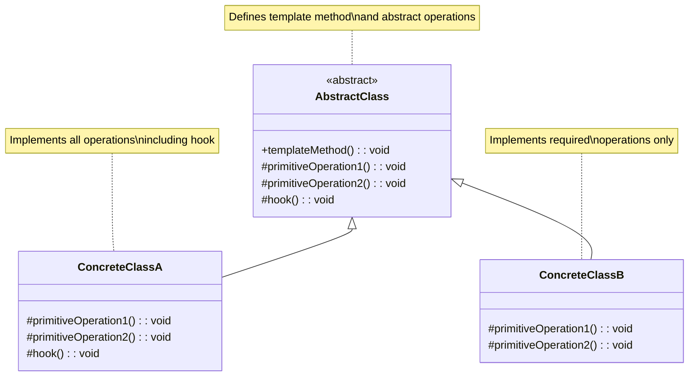
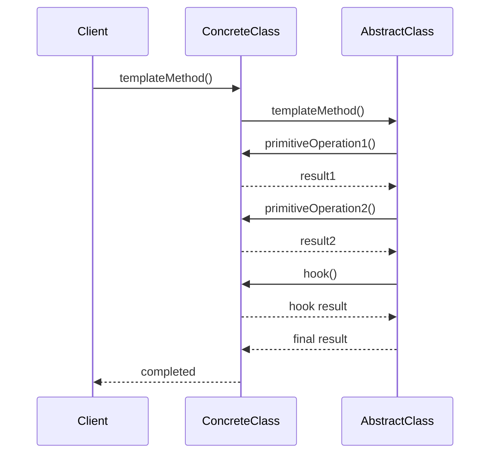
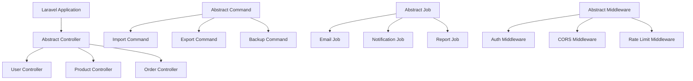

# Template Method Pattern

## Overview

The Template Method pattern defines the skeleton of an algorithm in an operation, deferring some steps to subclasses. Template Method lets subclasses redefine certain steps of an algorithm without changing the algorithm's structure.

## Architecture Diagrams

### Template Method Pattern Class Diagram


### Template Method Pattern Sequence Diagram


### Laravel Implementation Architecture


## Implementation in Laravel

### 1. Abstract Template Class

```php
<?php

namespace App\Patterns\TemplateMethod;

abstract class DataProcessor
{
    // Template method - defines the algorithm structure
    final public function processData(array $data): array
    {
        $this->validate($data);
        $cleanedData = $this->cleanData($data);
        $transformedData = $this->transformData($cleanedData);
        $processedData = $this->processSpecific($transformedData);
        $this->saveResults($processedData);
        $this->sendNotification($processedData);
        
        return $processedData;
    }
    
    // Concrete method - common validation logic
    protected function validate(array $data): void
    {
        if (empty($data)) {
            throw new InvalidArgumentException('Data cannot be empty');
        }
        
        if (!is_array($data)) {
            throw new InvalidArgumentException('Data must be an array');
        }
    }
    
    // Concrete method - common data cleaning
    protected function cleanData(array $data): array
    {
        return array_map(function ($item) {
            if (is_string($item)) {
                return trim($item);
            }
            return $item;
        }, $data);
    }
    
    // Abstract method - must be implemented by subclasses
    abstract protected function transformData(array $data): array;
    
    // Abstract method - specific processing logic
    abstract protected function processSpecific(array $data): array;
    
    // Hook method - can be overridden by subclasses
    protected function saveResults(array $data): void
    {
        // Default implementation - can be overridden
        logger()->info('Processing completed', ['count' => count($data)]);
    }
    
    // Hook method - optional notification
    protected function sendNotification(array $data): void
    {
        // Default implementation - do nothing
        // Subclasses can override to send notifications
    }
}
```

### 2. Concrete Template Implementations

```php
<?php

namespace App\Patterns\TemplateMethod;

use App\Models\User;
use App\Notifications\UserProcessingCompleted;
use Illuminate\Support\Facades\Hash;
use Illuminate\Support\Facades\Notification;

class UserDataProcessor extends DataProcessor
{
    protected function transformData(array $data): array
    {
        return array_map(function ($userData) {
            return [
                'name' => ucfirst(strtolower($userData['name'] ?? '')),
                'email' => strtolower($userData['email'] ?? ''),
                'password' => $userData['password'] ?? '',
                'role' => $userData['role'] ?? 'user',
                'status' => $userData['status'] ?? 'active',
                'created_at' => now(),
            ];
        }, $data);
    }
    
    protected function processSpecific(array $data): array
    {
        $processedUsers = [];
        
        foreach ($data as $userData) {
            // Hash password
            if (!empty($userData['password'])) {
                $userData['password'] = Hash::make($userData['password']);
            }
            
            // Check for existing user
            $existingUser = User::where('email', $userData['email'])->first();
            
            if ($existingUser) {
                // Update existing user
                $existingUser->update($userData);
                $processedUsers[] = $existingUser->toArray();
            } else {
                // Create new user
                $newUser = User::create($userData);
                $processedUsers[] = $newUser->toArray();
            }
        }
        
        return $processedUsers;
    }
    
    protected function saveResults(array $data): void
    {
        // Override parent method with specific logging
        logger()->info('User processing completed', [
            'users_processed' => count($data),
            'timestamp' => now()->toISOString()
        ]);
    }
    
    protected function sendNotification(array $data): void
    {
        // Send notification to admin
        $adminUsers = User::where('role', 'admin')->get();
        
        Notification::send($adminUsers, new UserProcessingCompleted([
            'count' => count($data),
            'processed_at' => now()
        ]));
    }
}

class ProductDataProcessor extends DataProcessor
{
    protected function transformData(array $data): array
    {
        return array_map(function ($productData) {
            return [
                'name' => ucwords(strtolower($productData['name'] ?? '')),
                'description' => $productData['description'] ?? '',
                'price' => (float)($productData['price'] ?? 0),
                'stock' => (int)($productData['stock'] ?? 0),
                'category_id' => $productData['category_id'] ?? null,
                'sku' => strtoupper($productData['sku'] ?? ''),
                'status' => $productData['status'] ?? 'active',
                'created_at' => now(),
            ];
        }, $data);
    }
    
    protected function processSpecific(array $data): array
    {
        $processedProducts = [];
        
        foreach ($data as $productData) {
            // Generate SKU if not provided
            if (empty($productData['sku'])) {
                $productData['sku'] = 'PRD-' . strtoupper(uniqid());
            }
            
            // Validate price
            if ($productData['price'] < 0) {
                $productData['price'] = 0;
            }
            
            // Check for existing product by SKU
            $existingProduct = \App\Models\Product::where('sku', $productData['sku'])->first();
            
            if ($existingProduct) {
                // Update existing product
                $existingProduct->update($productData);
                $processedProducts[] = $existingProduct->toArray();
            } else {
                // Create new product
                $newProduct = \App\Models\Product::create($productData);
                $processedProducts[] = $newProduct->toArray();
            }
        }
        
        return $processedProducts;
    }
    
    protected function sendNotification(array $data): void
    {
        // Send notification to inventory managers
        $inventoryManagers = User::where('role', 'inventory_manager')->get();
        
        if ($inventoryManagers->isNotEmpty()) {
            Notification::send($inventoryManagers, new \App\Notifications\ProductProcessingCompleted([
                'count' => count($data),
                'processed_at' => now()
            ]));
        }
    }
}

class OrderDataProcessor extends DataProcessor
{
    protected function transformData(array $data): array
    {
        return array_map(function ($orderData) {
            return [
                'order_number' => $orderData['order_number'] ?? 'ORD-' . strtoupper(uniqid()),
                'user_id' => $orderData['user_id'] ?? null,
                'total' => (float)($orderData['total'] ?? 0),
                'status' => $orderData['status'] ?? 'pending',
                'items' => $orderData['items'] ?? [],
                'shipping_address' => $orderData['shipping_address'] ?? [],
                'payment_method' => $orderData['payment_method'] ?? 'credit_card',
                'created_at' => now(),
            ];
        }, $data);
    }
    
    protected function processSpecific(array $data): array
    {
        $processedOrders = [];
        
        foreach ($data as $orderData) {
            // Validate user exists
            if ($orderData['user_id'] && !User::find($orderData['user_id'])) {
                continue; // Skip invalid orders
            }
            
            // Calculate total from items if not provided
            if (empty($orderData['total']) && !empty($orderData['items'])) {
                $orderData['total'] = array_sum(array_column($orderData['items'], 'total'));
            }
            
            // Create new order
            $newOrder = \App\Models\Order::create($orderData);
            
            // Process order items
            if (!empty($orderData['items'])) {
                foreach ($orderData['items'] as $item) {
                    $newOrder->items()->create($item);
                }
            }
            
            $processedOrders[] = $newOrder->load('items')->toArray();
        }
        
        return $processedOrders;
    }
    
    protected function sendNotification(array $data): void
    {
        // Send notification to sales team
        $salesTeam = User::where('role', 'sales')->get();
        
        if ($salesTeam->isNotEmpty()) {
            Notification::send($salesTeam, new \App\Notifications\OrderProcessingCompleted([
                'count' => count($data),
                'total_value' => array_sum(array_column($data, 'total')),
                'processed_at' => now()
            ]));
        }
    }
}
```

### 3. Laravel Command Template

```php
<?php

namespace App\Console\Commands;

use Illuminate\Console\Command;

abstract class BaseImportCommand extends Command
{
    // Template method
    final public function handle(): int
    {
        $this->info('Starting import process...');
        
        try {
            $this->validateInput();
            $data = $this->loadData();
            $validatedData = $this->validateData($data);
            $processedData = $this->processData($validatedData);
            $this->saveData($processedData);
            $this->generateReport($processedData);
            
            $this->info('Import completed successfully!');
            return 0;
            
        } catch (\Exception $e) {
            $this->error('Import failed: ' . $e->getMessage());
            $this->handleError($e);
            return 1;
        }
    }
    
    // Concrete method - common input validation
    protected function validateInput(): void
    {
        if (!$this->argument('file')) {
            throw new \InvalidArgumentException('File argument is required');
        }
        
        $file = $this->argument('file');
        if (!file_exists($file)) {
            throw new \InvalidArgumentException('File does not exist: ' . $file);
        }
    }
    
    // Abstract methods - must be implemented by subclasses
    abstract protected function loadData(): array;
    abstract protected function validateData(array $data): array;
    abstract protected function processData(array $data): array;
    abstract protected function saveData(array $data): void;
    
    // Hook methods - can be overridden
    protected function generateReport(array $data): void
    {
        $this->info('Processed ' . count($data) . ' records');
    }
    
    protected function handleError(\Exception $e): void
    {
        logger()->error('Import command failed', [
            'command' => static::class,
            'error' => $e->getMessage(),
            'trace' => $e->getTraceAsString()
        ]);
    }
}

// Concrete command implementations
class ImportUsersCommand extends BaseImportCommand
{
    protected $signature = 'import:users {file : CSV file path}';
    protected $description = 'Import users from CSV file';
    
    protected function loadData(): array
    {
        $file = $this->argument('file');
        $data = [];
        
        if (($handle = fopen($file, 'r')) !== false) {
            $headers = fgetcsv($handle);
            
            while (($row = fgetcsv($handle)) !== false) {
                $data[] = array_combine($headers, $row);
            }
            
            fclose($handle);
        }
        
        return $data;
    }
    
    protected function validateData(array $data): array
    {
        $validatedData = [];
        
        foreach ($data as $index => $row) {
            if (empty($row['name']) || empty($row['email'])) {
                $this->warn("Skipping row {$index}: missing required fields");
                continue;
            }
            
            if (!filter_var($row['email'], FILTER_VALIDATE_EMAIL)) {
                $this->warn("Skipping row {$index}: invalid email format");
                continue;
            }
            
            $validatedData[] = $row;
        }
        
        return $validatedData;
    }
    
    protected function processData(array $data): array
    {
        $processor = new \App\Patterns\TemplateMethod\UserDataProcessor();
        return $processor->processData($data);
    }
    
    protected function saveData(array $data): void
    {
        // Data is already saved in processData method
        $this->info('User data saved successfully');
    }
    
    protected function generateReport(array $data): void
    {
        parent::generateReport($data);
        
        $this->table(['Metric', 'Value'], [
            ['Total Users Processed', count($data)],
            ['New Users Created', count(array_filter($data, fn($user) => !isset($user['updated_at'])))],
            ['Existing Users Updated', count(array_filter($data, fn($user) => isset($user['updated_at'])))],
            ['Processing Time', now()->toTimeString()]
        ]);
    }
}
```

### 4. Laravel Job Template

```php
<?php

namespace App\Jobs;

use Illuminate\Bus\Queueable;
use Illuminate\Contracts\Queue\ShouldQueue;
use Illuminate\Foundation\Bus\Dispatchable;
use Illuminate\Queue\InteractsWithQueue;
use Illuminate\Queue\SerializesModels;

abstract class BaseProcessingJob implements ShouldQueue
{
    use Dispatchable, InteractsWithQueue, Queueable, SerializesModels;
    
    protected $data;
    protected $options;
    
    public function __construct(array $data, array $options = [])
    {
        $this->data = $data;
        $this->options = $options;
    }
    
    // Template method
    final public function handle(): void
    {
        try {
            $this->beforeProcessing();
            $this->validateInput();
            $processedData = $this->processData($this->data);
            $this->saveResults($processedData);
            $this->afterProcessing($processedData);
            $this->sendNotifications($processedData);
            
        } catch (\Exception $e) {
            $this->failed($e);
            throw $e;
        }
    }
    
    // Hook methods
    protected function beforeProcessing(): void
    {
        // Default implementation - can be overridden
    }
    
    protected function afterProcessing(array $results): void
    {
        // Default implementation - can be overridden
    }
    
    // Concrete method
    protected function validateInput(): void
    {
        if (empty($this->data)) {
            throw new \InvalidArgumentException('Data cannot be empty');
        }
    }
    
    // Abstract methods
    abstract protected function processData(array $data): array;
    abstract protected function saveResults(array $results): void;
    abstract protected function sendNotifications(array $results): void;
}

// Concrete job implementations
class ProcessEmailCampaignJob extends BaseProcessingJob
{
    protected function beforeProcessing(): void
    {
        logger()->info('Starting email campaign processing', [
            'recipients' => count($this->data),
            'campaign_id' => $this->options['campaign_id'] ?? null
        ]);
    }
    
    protected function processData(array $data): array
    {
        $results = [];
        
        foreach ($data as $recipient) {
            try {
                $emailResult = $this->sendEmail($recipient);
                $results[] = [
                    'recipient' => $recipient['email'],
                    'status' => 'sent',
                    'message_id' => $emailResult['message_id'],
                    'sent_at' => now()
                ];
            } catch (\Exception $e) {
                $results[] = [
                    'recipient' => $recipient['email'],
                    'status' => 'failed',
                    'error' => $e->getMessage(),
                    'failed_at' => now()
                ];
            }
        }
        
        return $results;
    }
    
    protected function saveResults(array $results): void
    {
        foreach ($results as $result) {
            \App\Models\EmailLog::create($result);
        }
    }
    
    protected function sendNotifications(array $results): void
    {
        $successCount = count(array_filter($results, fn($r) => $r['status'] === 'sent'));
        $failureCount = count(array_filter($results, fn($r) => $r['status'] === 'failed'));
        
        // Notify campaign manager
        if (isset($this->options['notify_user_id'])) {
            $user = \App\Models\User::find($this->options['notify_user_id']);
            if ($user) {
                $user->notify(new \App\Notifications\EmailCampaignCompleted([
                    'campaign_id' => $this->options['campaign_id'] ?? null,
                    'success_count' => $successCount,
                    'failure_count' => $failureCount,
                    'total_count' => count($results)
                ]));
            }
        }
    }
    
    private function sendEmail(array $recipient): array
    {
        // Implementation for sending email
        return ['message_id' => uniqid()];
    }
}
```

### 5. Laravel Middleware Template

```php
<?php

namespace App\Http\Middleware;

use Closure;
use Illuminate\Http\Request;

abstract class BaseAuthenticationMiddleware
{
    // Template method
    final public function handle(Request $request, Closure $next, ...$guards)
    {
        $this->beforeAuthentication($request);
        
        if (!$this->isAuthenticated($request, $guards)) {
            return $this->handleUnauthenticated($request);
        }
        
        if (!$this->isAuthorized($request)) {
            return $this->handleUnauthorized($request);
        }
        
        $this->afterAuthentication($request);
        
        $response = $next($request);
        
        $this->afterResponse($request, $response);
        
        return $response;
    }
    
    // Hook methods
    protected function beforeAuthentication(Request $request): void
    {
        // Default implementation - can be overridden
    }
    
    protected function afterAuthentication(Request $request): void
    {
        // Default implementation - can be overridden
    }
    
    protected function afterResponse(Request $request, $response): void
    {
        // Default implementation - can be overridden
    }
    
    // Abstract methods
    abstract protected function isAuthenticated(Request $request, array $guards): bool;
    abstract protected function isAuthorized(Request $request): bool;
    abstract protected function handleUnauthenticated(Request $request);
    abstract protected function handleUnauthorized(Request $request);
}

// Concrete middleware implementations
class ApiAuthenticationMiddleware extends BaseAuthenticationMiddleware
{
    protected function beforeAuthentication(Request $request): void
    {
        // Log API access attempt
        logger()->info('API authentication attempt', [
            'ip' => $request->ip(),
            'user_agent' => $request->userAgent(),
            'endpoint' => $request->path()
        ]);
    }
    
    protected function isAuthenticated(Request $request, array $guards): bool
    {
        $token = $request->bearerToken();
        
        if (!$token) {
            return false;
        }
        
        // Validate API token
        $user = \App\Models\User::where('api_token', hash('sha256', $token))->first();
        
        if (!$user) {
            return false;
        }
        
        // Set authenticated user
        auth()->setUser($user);
        return true;
    }
    
    protected function isAuthorized(Request $request): bool
    {
        $user = auth()->user();
        
        if (!$user) {
            return false;
        }
        
        // Check if user has API access
        return $user->hasPermission('api.access');
    }
    
    protected function handleUnauthenticated(Request $request)
    {
        return response()->json([
            'error' => 'Unauthenticated',
            'message' => 'Invalid API token'
        ], 401);
    }
    
    protected function handleUnauthorized(Request $request)
    {
        return response()->json([
            'error' => 'Unauthorized',
            'message' => 'Insufficient permissions for API access'
        ], 403);
    }
    
    protected function afterResponse(Request $request, $response): void
    {
        // Log API response
        logger()->info('API response sent', [
            'user_id' => auth()->id(),
            'endpoint' => $request->path(),
            'status_code' => $response->getStatusCode(),
            'response_time' => microtime(true) - LARAVEL_START
        ]);
    }
}
```

## Laravel Integration Examples

### 1. Controller Template

```php
<?php

namespace App\Http\Controllers;

use Illuminate\Http\Request;
use Illuminate\Http\JsonResponse;

abstract class BaseApiController extends Controller
{
    // Template method
    final public function processRequest(Request $request): JsonResponse
    {
        try {
            $this->beforeValidation($request);
            $validatedData = $this->validateRequest($request);
            $this->afterValidation($validatedData);
            
            $result = $this->processData($validatedData);
            $formattedResult = $this->formatResponse($result);
            
            $this->logSuccess($request, $result);
            
            return response()->json([
                'success' => true,
                'data' => $formattedResult
            ]);
            
        } catch (\Exception $e) {
            $this->logError($request, $e);
            return $this->handleError($e);
        }
    }
    
    // Hook methods
    protected function beforeValidation(Request $request): void {}
    protected function afterValidation(array $data): void {}
    
    // Abstract methods
    abstract protected function validateRequest(Request $request): array;
    abstract protected function processData(array $data): array;
    abstract protected function formatResponse(array $data): array;
    
    // Concrete methods
    protected function handleError(\Exception $e): JsonResponse
    {
        return response()->json([
            'success' => false,
            'error' => $e->getMessage()
        ], 500);
    }
    
    protected function logSuccess(Request $request, array $result): void
    {
        logger()->info('API request processed successfully', [
            'controller' => static::class,
            'method' => $request->method(),
            'path' => $request->path(),
            'user_id' => auth()->id(),
            'result_count' => count($result)
        ]);
    }
    
    protected function logError(Request $request, \Exception $e): void
    {
        logger()->error('API request failed', [
            'controller' => static::class,
            'method' => $request->method(),
            'path' => $request->path(),
            'user_id' => auth()->id(),
            'error' => $e->getMessage()
        ]);
    }
}
```

## Advantages

1. **Code Reuse**: Common algorithm structure is defined once and reused
2. **Flexibility**: Subclasses can customize specific steps without changing the overall algorithm
3. **Control**: Parent class controls the algorithm flow and can enforce certain constraints
4. **Maintainability**: Changes to the algorithm structure only need to be made in one place

## Disadvantages

1. **Inheritance Dependency**: Relies heavily on inheritance, which can lead to tight coupling
2. **Limited Flexibility**: The algorithm structure is fixed and cannot be changed by subclasses
3. **Complexity**: Can make the code more complex, especially with many hook methods
4. **Debugging Difficulty**: The flow between parent and child classes can be hard to follow

## When to Use

- When you have multiple classes that implement similar algorithms with minor variations
- When you want to control the algorithm structure and prevent subclasses from changing it
- When common behavior needs to be factored out to avoid code duplication
- When you want to implement the "Don't call us, we'll call you" principle (Hollywood Principle)

## Laravel-Specific Benefits

1. **Artisan Commands**: Perfect for creating command templates with common workflow
2. **Job Processing**: Template for background job processing with consistent error handling
3. **Middleware**: Common authentication/authorization patterns
4. **Form Requests**: Template for request validation and processing
5. **Event Listeners**: Common event handling patterns with customizable responses