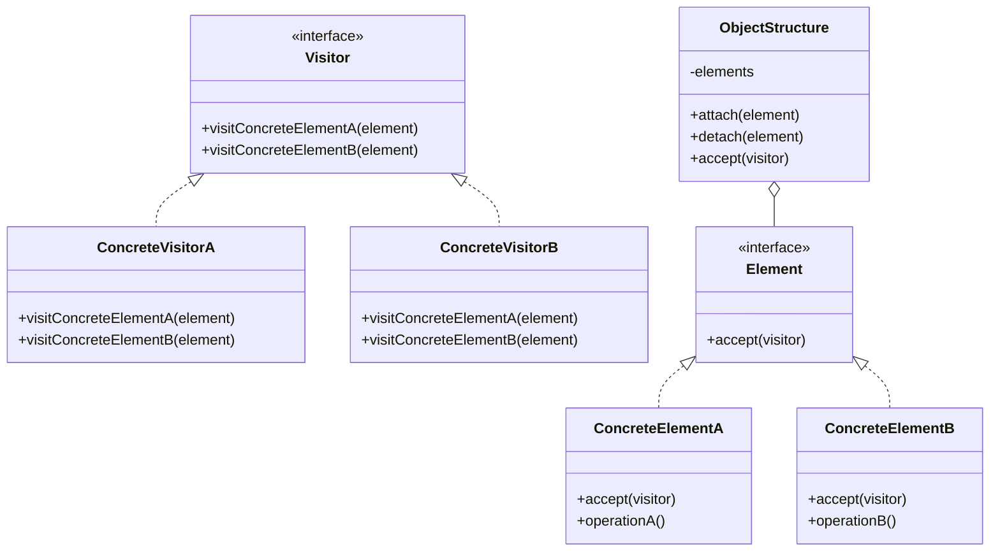
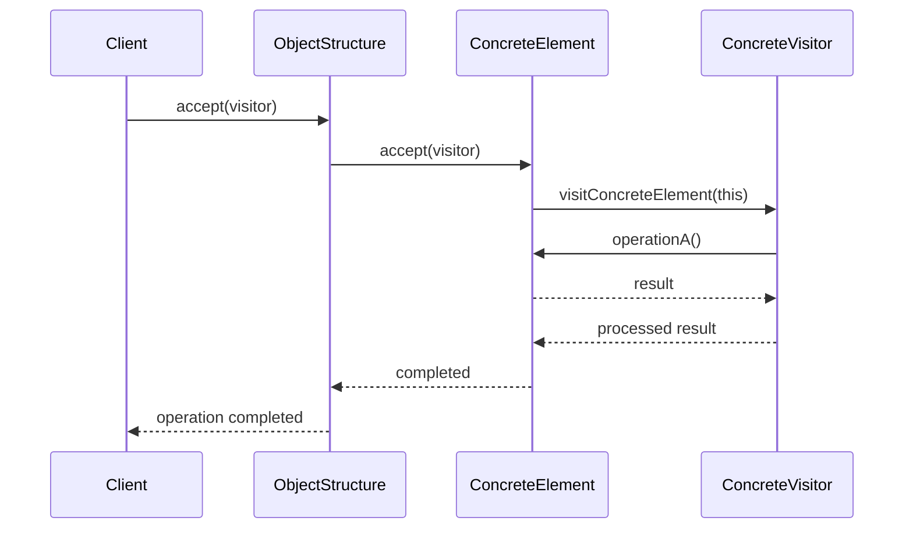
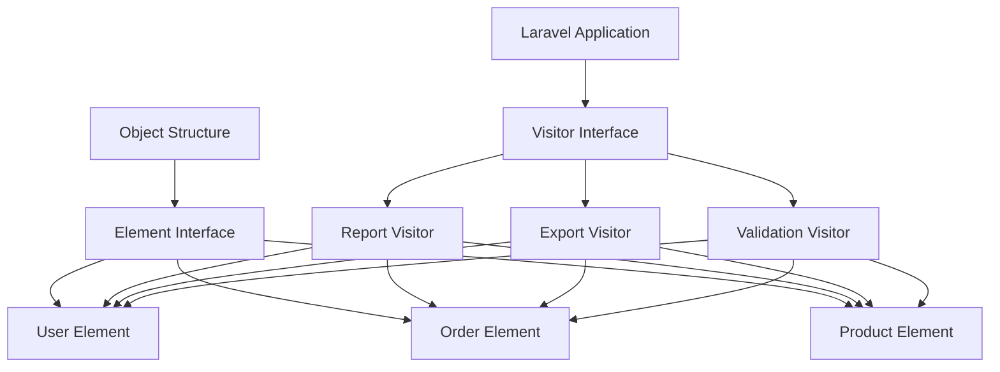

# Visitor Pattern

## Overview

The Visitor pattern is a design pattern that separates algorithms from object structures. It allows defining new operations without modifying existing object structures. The Visitor pattern achieves decoupling between operations and object structures by encapsulating operations in visitor objects.

## Architecture Diagrams

### Visitor Pattern Class Diagram


### Visitor Pattern Sequence Diagram


### Laravel Implementation Architecture


## Implementation in Laravel

### 1. Visitor Interface

```php
<?php

namespace App\Patterns\Visitor;

interface VisitorInterface
{
    public function visitUser(UserElement $user);
    public function visitOrder(OrderElement $order);
    public function visitProduct(ProductElement $product);
}
```

### 2. Element Interface

```php
<?php

namespace App\Patterns\Visitor;

interface ElementInterface
{
    public function accept(VisitorInterface $visitor);
}
```

### 3. Concrete Elements

```php
<?php

namespace App\Patterns\Visitor;

use App\Models\User;

class UserElement implements ElementInterface
{
    private User $user;
    
    public function __construct(User $user)
    {
        $this->user = $user;
    }
    
    public function accept(VisitorInterface $visitor)
    {
        $visitor->visitUser($this);
    }
    
    public function getUser(): User
    {
        return $this->user;
    }
    
    public function getUserData()
    {
        return [
            'id' => $this->user->id,
            'name' => $this->user->name,
            'email' => $this->user->email,
            'created_at' => $this->user->created_at,
        ];
    }
}

class OrderElement implements ElementInterface
{
    private $order;
    
    public function __construct($order)
    {
        $this->order = $order;
    }
    
    public function accept(VisitorInterface $visitor)
    {
        $visitor->visitOrder($this);
    }
    
    public function getOrder()
    {
        return $this->order;
    }
    
    public function getOrderData()
    {
        return [
            'id' => $this->order->id,
            'total' => $this->order->total,
            'status' => $this->order->status,
            'created_at' => $this->order->created_at,
        ];
    }
}

class ProductElement implements ElementInterface
{
    private $product;
    
    public function __construct($product)
    {
        $this->product = $product;
    }
    
    public function accept(VisitorInterface $visitor)
    {
        $visitor->visitProduct($this);
    }
    
    public function getProduct()
    {
        return $this->product;
    }
    
    public function getProductData()
    {
        return [
            'id' => $this->product->id,
            'name' => $this->product->name,
            'price' => $this->product->price,
            'stock' => $this->product->stock,
        ];
    }
}
```

### 4. Concrete Visitors

```php
<?php

namespace App\Patterns\Visitor;

class ReportVisitor implements VisitorInterface
{
    private array $report = [];
    
    public function visitUser(UserElement $user)
    {
        $userData = $user->getUserData();
        $this->report['users'][] = [
            'type' => 'user',
            'id' => $userData['id'],
            'name' => $userData['name'],
            'status' => 'active',
            'join_date' => $userData['created_at']->format('Y-m-d'),
        ];
    }
    
    public function visitOrder(OrderElement $order)
    {
        $orderData = $order->getOrderData();
        $this->report['orders'][] = [
            'type' => 'order',
            'id' => $orderData['id'],
            'amount' => $orderData['total'],
            'status' => $orderData['status'],
            'date' => $orderData['created_at']->format('Y-m-d'),
        ];
    }
    
    public function visitProduct(ProductElement $product)
    {
        $productData = $product->getProductData();
        $this->report['products'][] = [
            'type' => 'product',
            'id' => $productData['id'],
            'name' => $productData['name'],
            'price' => $productData['price'],
            'stock_status' => $productData['stock'] > 0 ? 'in_stock' : 'out_of_stock',
        ];
    }
    
    public function getReport()
    {
        return $this->report;
    }
}

class ExportVisitor implements VisitorInterface
{
    private array $exportData = [];
    
    public function visitUser(UserElement $user)
    {
        $userData = $user->getUserData();
        $this->exportData[] = [
            'type' => 'USER',
            'data' => implode(',', [
                $userData['id'],
                $userData['name'],
                $userData['email'],
                $userData['created_at']->format('Y-m-d H:i:s'),
            ])
        ];
    }
    
    public function visitOrder(OrderElement $order)
    {
        $orderData = $order->getOrderData();
        $this->exportData[] = [
            'type' => 'ORDER',
            'data' => implode(',', [
                $orderData['id'],
                $orderData['total'],
                $orderData['status'],
                $orderData['created_at']->format('Y-m-d H:i:s'),
            ])
        ];
    }
    
    public function visitProduct(ProductElement $product)
    {
        $productData = $product->getProductData();
        $this->exportData[] = [
            'type' => 'PRODUCT',
            'data' => implode(',', [
                $productData['id'],
                $productData['name'],
                $productData['price'],
                $productData['stock'],
            ])
        ];
    }
    
    public function getExportData()
    {
        return $this->exportData;
    }
}

class ValidationVisitor implements VisitorInterface
{
    private array $errors = [];
    
    public function visitUser(UserElement $user)
    {
        $userData = $user->getUserData();
        
        if (empty($userData['name'])) {
            $this->errors[] = "User {$userData['id']}: Name is required";
        }
        
        if (!filter_var($userData['email'], FILTER_VALIDATE_EMAIL)) {
            $this->errors[] = "User {$userData['id']}: Invalid email format";
        }
    }
    
    public function visitOrder(OrderElement $order)
    {
        $orderData = $order->getOrderData();
        
        if ($orderData['total'] <= 0) {
            $this->errors[] = "Order {$orderData['id']}: Total must be greater than 0";
        }
        
        if (!in_array($orderData['status'], ['pending', 'processing', 'completed', 'cancelled'])) {
            $this->errors[] = "Order {$orderData['id']}: Invalid status";
        }
    }
    
    public function visitProduct(ProductElement $product)
    {
        $productData = $product->getProductData();
        
        if (empty($productData['name'])) {
            $this->errors[] = "Product {$productData['id']}: Name is required";
        }
        
        if ($productData['price'] < 0) {
            $this->errors[] = "Product {$productData['id']}: Price cannot be negative";
        }
        
        if ($productData['stock'] < 0) {
            $this->errors[] = "Product {$productData['id']}: Stock cannot be negative";
        }
    }
    
    public function getErrors()
    {
        return $this->errors;
    }
    
    public function hasErrors()
    {
        return !empty($this->errors);
    }
}
```

### 5. Object Structure

```php
<?php

namespace App\Patterns\Visitor;

class DataStructure
{
    private array $elements = [];
    
    public function addElement(ElementInterface $element)
    {
        $this->elements[] = $element;
    }
    
    public function removeElement(ElementInterface $element)
    {
        $key = array_search($element, $this->elements, true);
        if ($key !== false) {
            unset($this->elements[$key]);
            $this->elements = array_values($this->elements);
        }
    }
    
    public function accept(VisitorInterface $visitor)
    {
        foreach ($this->elements as $element) {
            $element->accept($visitor);
        }
    }
    
    public function getElements()
    {
        return $this->elements;
    }
}
```

### 6. Laravel Service Implementation

```php
<?php

namespace App\Services;

use App\Patterns\Visitor\{
    DataStructure,
    UserElement,
    OrderElement,
    ProductElement,
    ReportVisitor,
    ExportVisitor,
    ValidationVisitor
};
use App\Models\{User, Order, Product};

class DataProcessingService
{
    private DataStructure $dataStructure;
    
    public function __construct()
    {
        $this->dataStructure = new DataStructure();
    }
    
    public function loadData()
    {
        // Load users
        $users = User::all();
        foreach ($users as $user) {
            $this->dataStructure->addElement(new UserElement($user));
        }
        
        // Load orders
        $orders = Order::all();
        foreach ($orders as $order) {
            $this->dataStructure->addElement(new OrderElement($order));
        }
        
        // Load products
        $products = Product::all();
        foreach ($products as $product) {
            $this->dataStructure->addElement(new ProductElement($product));
        }
    }
    
    public function generateReport()
    {
        $visitor = new ReportVisitor();
        $this->dataStructure->accept($visitor);
        return $visitor->getReport();
    }
    
    public function exportData()
    {
        $visitor = new ExportVisitor();
        $this->dataStructure->accept($visitor);
        return $visitor->getExportData();
    }
    
    public function validateData()
    {
        $visitor = new ValidationVisitor();
        $this->dataStructure->accept($visitor);
        return [
            'has_errors' => $visitor->hasErrors(),
            'errors' => $visitor->getErrors()
        ];
    }
}
```

### 7. Laravel Controller Usage

```php
<?php

namespace App\Http\Controllers;

use App\Services\DataProcessingService;
use Illuminate\Http\JsonResponse;

class DataController extends Controller
{
    private DataProcessingService $dataService;
    
    public function __construct(DataProcessingService $dataService)
    {
        $this->dataService = $dataService;
    }
    
    public function generateReport(): JsonResponse
    {
        $this->dataService->loadData();
        $report = $this->dataService->generateReport();
        
        return response()->json([
            'success' => true,
            'report' => $report
        ]);
    }
    
    public function exportData(): JsonResponse
    {
        $this->dataService->loadData();
        $exportData = $this->dataService->exportData();
        
        return response()->json([
            'success' => true,
            'export_data' => $exportData
        ]);
    }
    
    public function validateData(): JsonResponse
    {
        $this->dataService->loadData();
        $validation = $this->dataService->validateData();
        
        return response()->json([
            'success' => !$validation['has_errors'],
            'validation' => $validation
        ]);
    }
}
```

## Laravel Integration Examples

### 1. Artisan Command

```php
<?php

namespace App\Console\Commands;

use App\Services\DataProcessingService;
use Illuminate\Console\Command;

class ProcessDataCommand extends Command
{
    protected $signature = 'data:process {operation : report|export|validate}';
    protected $description = 'Process data using visitor pattern';
    
    public function handle(DataProcessingService $service)
    {
        $operation = $this->argument('operation');
        
        $this->info('Loading data...');
        $service->loadData();
        
        switch ($operation) {
            case 'report':
                $result = $service->generateReport();
                $this->info('Report generated:');
                $this->table(['Type', 'Count'], [
                    ['Users', count($result['users'] ?? [])],
                    ['Orders', count($result['orders'] ?? [])],
                    ['Products', count($result['products'] ?? [])]
                ]);
                break;
                
            case 'export':
                $result = $service->exportData();
                $this->info('Export completed:');
                $this->line(count($result) . ' records exported');
                break;
                
            case 'validate':
                $result = $service->validateData();
                if ($result['has_errors']) {
                    $this->error('Validation failed:');
                    foreach ($result['errors'] as $error) {
                        $this->line('- ' . $error);
                    }
                } else {
                    $this->info('All data is valid');
                }
                break;
                
            default:
                $this->error('Invalid operation');
                return 1;
        }
        
        return 0;
    }
}
```

### 2. Event Listener

```php
<?php

namespace App\Listeners;

use App\Events\DataUpdated;
use App\Services\DataProcessingService;
use Illuminate\Contracts\Queue\ShouldQueue;

class ValidateDataListener implements ShouldQueue
{
    private DataProcessingService $dataService;
    
    public function __construct(DataProcessingService $dataService)
    {
        $this->dataService = $dataService;
    }
    
    public function handle(DataUpdated $event)
    {
        $this->dataService->loadData();
        $validation = $this->dataService->validateData();
        
        if ($validation['has_errors']) {
            // Log errors or send notifications
            logger()->error('Data validation failed', $validation['errors']);
        }
    }
}
```

## Advantages

1. **Open/Closed Principle**: Easy to add new operations without modifying existing classes
2. **Single Responsibility**: Each visitor handles one specific operation
3. **Flexibility**: Can define different operations for the same object structure
4. **Separation of Concerns**: Separates algorithms from object structures

## Disadvantages

1. **Complexity**: Adds complexity to the codebase
2. **Difficult to Add New Elements**: Adding new element types requires updating all visitors
3. **Circular Dependencies**: Can create circular dependencies between visitors and elements
4. **Performance**: May have performance overhead due to double dispatch

## When to Use

- When you need to perform many unrelated operations on objects in an object structure
- When the object structure is stable but operations change frequently
- When you want to avoid polluting classes with unrelated operations
- When you need to gather information from a complex object structure

## Laravel-Specific Benefits

1. **Service Integration**: Easy integration with Laravel services and dependency injection
2. **Artisan Commands**: Perfect for data processing commands
3. **Event System**: Can be used with Laravel events for reactive programming
4. **Queue Integration**: Visitors can be easily queued for background processing
5. **Testing**: Easy to test individual visitors in isolation