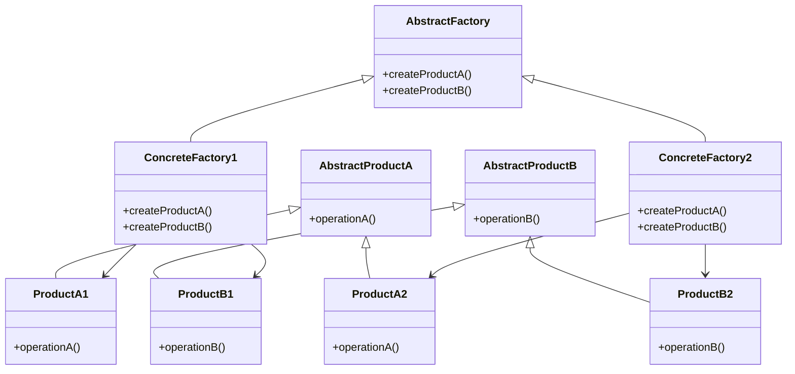
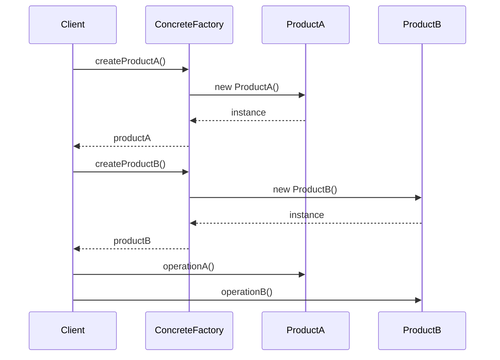

# 抽象工厂模式 (Abstract Factory Pattern)

## 概述

抽象工厂模式提供一个创建一系列相关或相互依赖对象的接口，而无需指定它们具体的类。它是工厂方法模式的升级版本，可以创建多个产品族。

## 问题场景

在Laravel应用中，我们经常需要：
- 创建一组相关的对象（如不同主题的UI组件）
- 支持多种数据库系统的完整解决方案
- 为不同平台提供一套完整的服务
- 创建不同风格的报表组件

## 解决方案

抽象工厂模式通过定义一个抽象工厂接口，让具体工厂实现这个接口来创建一族相关的产品对象。

## UML类图



## Laravel实现

### 1. UI主题工厂示例

```php
<?php

namespace App\Patterns\AbstractFactory;

// 按钮产品接口
interface ButtonInterface
{
    public function render(): string;
    public function onClick(): string;
}

// 输入框产品接口
interface InputInterface
{
    public function render(): string;
    public function getValue(): string;
}

// Bootstrap主题按钮
class BootstrapButton implements ButtonInterface
{
    private string $text;
    private string $type;
    
    public function __construct(string $text, string $type = 'primary')
    {
        $this->text = $text;
        $this->type = $type;
    }
    
    public function render(): string
    {
        return "<button class='btn btn-{$this->type}'>{$this->text}</button>";
    }
    
    public function onClick(): string
    {
        return "Bootstrap button clicked: {$this->text}";
    }
}

// Bootstrap主题输入框
class BootstrapInput implements InputInterface
{
    private string $name;
    private string $placeholder;
    
    public function __construct(string $name, string $placeholder = '')
    {
        $this->name = $name;
        $this->placeholder = $placeholder;
    }
    
    public function render(): string
    {
        return "<input class='form-control' name='{$this->name}' placeholder='{$this->placeholder}' />";
    }
    
    public function getValue(): string
    {
        return "Bootstrap input value for: {$this->name}";
    }
}

// Tailwind主题按钮
class TailwindButton implements ButtonInterface
{
    private string $text;
    private string $type;
    
    public function __construct(string $text, string $type = 'primary')
    {
        $this->text = $text;
        $this->type = $type;
    }
    
    public function render(): string
    {
        $classes = match ($this->type) {
            'primary' => 'bg-blue-500 hover:bg-blue-700 text-white',
            'secondary' => 'bg-gray-500 hover:bg-gray-700 text-white',
            'danger' => 'bg-red-500 hover:bg-red-700 text-white',
            default => 'bg-blue-500 hover:bg-blue-700 text-white'
        };
        
        return "<button class='px-4 py-2 rounded {$classes}'>{$this->text}</button>";
    }
    
    public function onClick(): string
    {
        return "Tailwind button clicked: {$this->text}";
    }
}

// Tailwind主题输入框
class TailwindInput implements InputInterface
{
    private string $name;
    private string $placeholder;
    
    public function __construct(string $name, string $placeholder = '')
    {
        $this->name = $name;
        $this->placeholder = $placeholder;
    }
    
    public function render(): string
    {
        return "<input class='border border-gray-300 rounded px-3 py-2 w-full' name='{$this->name}' placeholder='{$this->placeholder}' />";
    }
    
    public function getValue(): string
    {
        return "Tailwind input value for: {$this->name}";
    }
}

// 抽象UI工厂
interface UIFactoryInterface
{
    public function createButton(string $text, string $type = 'primary'): ButtonInterface;
    public function createInput(string $name, string $placeholder = ''): InputInterface;
}

// Bootstrap UI工厂
class BootstrapUIFactory implements UIFactoryInterface
{
    public function createButton(string $text, string $type = 'primary'): ButtonInterface
    {
        return new BootstrapButton($text, $type);
    }
    
    public function createInput(string $name, string $placeholder = ''): InputInterface
    {
        return new BootstrapInput($name, $placeholder);
    }
}

// Tailwind UI工厂
class TailwindUIFactory implements UIFactoryInterface
{
    public function createButton(string $text, string $type = 'primary'): ButtonInterface
    {
        return new TailwindButton($text, $type);
    }
    
    public function createInput(string $name, string $placeholder = ''): InputInterface
    {
        return new TailwindInput($name, $placeholder);
    }
}
```

### 2. 数据库抽象工厂示例

```php
<?php

namespace App\Patterns\AbstractFactory;

// 连接接口
interface ConnectionInterface
{
    public function connect(): void;
    public function disconnect(): void;
    public function isConnected(): bool;
}

// 查询构建器接口
interface QueryBuilderInterface
{
    public function select(array $columns = ['*']): self;
    public function from(string $table): self;
    public function where(string $column, string $operator, $value): self;
    public function toSql(): string;
}

// MySQL连接
class MysqlConnection implements ConnectionInterface
{
    private array $config;
    private bool $connected = false;
    
    public function __construct(array $config)
    {
        $this->config = $config;
    }
    
    public function connect(): void
    {
        echo "Connecting to MySQL: {$this->config['host']}:{$this->config['port']}\n";
        $this->connected = true;
    }
    
    public function disconnect(): void
    {
        echo "Disconnecting from MySQL\n";
        $this->connected = false;
    }
    
    public function isConnected(): bool
    {
        return $this->connected;
    }
}

// MySQL查询构建器
class MysqlQueryBuilder implements QueryBuilderInterface
{
    private array $select = ['*'];
    private string $from = '';
    private array $where = [];
    
    public function select(array $columns = ['*']): self
    {
        $this->select = $columns;
        return $this;
    }
    
    public function from(string $table): self
    {
        $this->from = $table;
        return $this;
    }
    
    public function where(string $column, string $operator, $value): self
    {
        $this->where[] = "{$column} {$operator} '{$value}'";
        return $this;
    }
    
    public function toSql(): string
    {
        $sql = 'SELECT ' . implode(', ', $this->select);
        $sql .= " FROM {$this->from}";
        
        if (!empty($this->where)) {
            $sql .= ' WHERE ' . implode(' AND ', $this->where);
        }
        
        return $sql;
    }
}

// PostgreSQL连接
class PostgresqlConnection implements ConnectionInterface
{
    private array $config;
    private bool $connected = false;
    
    public function __construct(array $config)
    {
        $this->config = $config;
    }
    
    public function connect(): void
    {
        echo "Connecting to PostgreSQL: {$this->config['host']}:{$this->config['port']}\n";
        $this->connected = true;
    }
    
    public function disconnect(): void
    {
        echo "Disconnecting from PostgreSQL\n";
        $this->connected = false;
    }
    
    public function isConnected(): bool
    {
        return $this->connected;
    }
}

// PostgreSQL查询构建器
class PostgresqlQueryBuilder implements QueryBuilderInterface
{
    private array $select = ['*'];
    private string $from = '';
    private array $where = [];
    
    public function select(array $columns = ['*']): self
    {
        $this->select = $columns;
        return $this;
    }
    
    public function from(string $table): self
    {
        $this->from = "\"{$table}\""; // PostgreSQL使用双引号
        return $this;
    }
    
    public function where(string $column, string $operator, $value): self
    {
        $this->where[] = "\"{$column}\" {$operator} '{$value}'";
        return $this;
    }
    
    public function toSql(): string
    {
        $sql = 'SELECT ' . implode(', ', $this->select);
        $sql .= " FROM {$this->from}";
        
        if (!empty($this->where)) {
            $sql .= ' WHERE ' . implode(' AND ', $this->where);
        }
        
        return $sql;
    }
}

// 抽象数据库工厂
interface DatabaseFactoryInterface
{
    public function createConnection(): ConnectionInterface;
    public function createQueryBuilder(): QueryBuilderInterface;
}

// MySQL数据库工厂
class MysqlDatabaseFactory implements DatabaseFactoryInterface
{
    private array $config;
    
    public function __construct(array $config)
    {
        $this->config = $config;
    }
    
    public function createConnection(): ConnectionInterface
    {
        return new MysqlConnection($this->config);
    }
    
    public function createQueryBuilder(): QueryBuilderInterface
    {
        return new MysqlQueryBuilder();
    }
}

// PostgreSQL数据库工厂
class PostgresqlDatabaseFactory implements DatabaseFactoryInterface
{
    private array $config;
    
    public function __construct(array $config)
    {
        $this->config = $config;
    }
    
    public function createConnection(): ConnectionInterface
    {
        return new PostgresqlConnection($this->config);
    }
    
    public function createQueryBuilder(): QueryBuilderInterface
    {
        return new PostgresqlQueryBuilder();
    }
}
```

## 使用示例

### UI主题工厂使用

```php
<?php

class UIManager
{
    private UIFactoryInterface $factory;
    
    public function __construct(UIFactoryInterface $factory)
    {
        $this->factory = $factory;
    }
    
    public function createLoginForm(): string
    {
        $usernameInput = $this->factory->createInput('username', '请输入用户名');
        $passwordInput = $this->factory->createInput('password', '请输入密码');
        $loginButton = $this->factory->createButton('登录', 'primary');
        $cancelButton = $this->factory->createButton('取消', 'secondary');
        
        $form = "<form>";
        $form .= $usernameInput->render();
        $form .= $passwordInput->render();
        $form .= $loginButton->render();
        $form .= $cancelButton->render();
        $form .= "</form>";
        
        return $form;
    }
}

// 使用Bootstrap主题
$bootstrapUI = new UIManager(new BootstrapUIFactory());
echo $bootstrapUI->createLoginForm();

// 使用Tailwind主题
$tailwindUI = new UIManager(new TailwindUIFactory());
echo $tailwindUI->createLoginForm();
```

### 数据库工厂使用

```php
<?php

class DatabaseManager
{
    private DatabaseFactoryInterface $factory;
    
    public function __construct(DatabaseFactoryInterface $factory)
    {
        $this->factory = $factory;
    }
    
    public function executeQuery(string $table, array $conditions = []): string
    {
        $connection = $this->factory->createConnection();
        $queryBuilder = $this->factory->createQueryBuilder();
        
        $connection->connect();
        
        $query = $queryBuilder->select(['id', 'name', 'email'])
                              ->from($table);
        
        foreach ($conditions as $column => $value) {
            $query->where($column, '=', $value);
        }
        
        $sql = $query->toSql();
        echo "Executing: {$sql}\n";
        
        $connection->disconnect();
        
        return $sql;
    }
}

// 使用MySQL
$mysqlConfig = ['host' => 'localhost', 'port' => 3306, 'database' => 'myapp'];
$mysqlManager = new DatabaseManager(new MysqlDatabaseFactory($mysqlConfig));
$mysqlManager->executeQuery('users', ['status' => 'active']);

// 使用PostgreSQL
$pgsqlConfig = ['host' => 'localhost', 'port' => 5432, 'database' => 'myapp'];
$pgsqlManager = new DatabaseManager(new PostgresqlDatabaseFactory($pgsqlConfig));
$pgsqlManager->executeQuery('users', ['status' => 'active']);
```

## Laravel中的实际应用

### 1. 缓存工厂

```php
<?php

// Laravel的缓存管理器使用抽象工厂模式
class CacheManager
{
    public function store($name = null)
    {
        $name = $name ?: $this->getDefaultDriver();
        
        return $this->stores[$name] ?? $this->stores[$name] = $this->resolve($name);
    }
    
    protected function resolve($name)
    {
        $config = $this->getConfig($name);
        
        return $this->getFactory($config['driver'])->create($config);
    }
    
    protected function getFactory($driver)
    {
        return match ($driver) {
            'redis' => new RedisCacheFactory(),
            'file' => new FileCacheFactory(),
            'database' => new DatabaseCacheFactory(),
        };
    }
}
```

### 2. 队列工厂

```php
<?php

// Laravel的队列管理器
class QueueManager
{
    public function connection($name = null)
    {
        $name = $name ?: $this->getDefaultDriver();
        
        return $this->connections[$name] ?? $this->connections[$name] = $this->resolve($name);
    }
    
    protected function resolve($name)
    {
        $config = $this->getConfig($name);
        
        return $this->getFactory($config['driver'])->create($config);
    }
    
    protected function getFactory($driver)
    {
        return match ($driver) {
            'redis' => new RedisQueueFactory(),
            'database' => new DatabaseQueueFactory(),
            'sqs' => new SqsQueueFactory(),
        };
    }
}
```

## 时序图



## 优点

1. **产品族一致性**：确保同一族的产品能够协同工作
2. **易于切换产品族**：只需要更换工厂即可切换整个产品族
3. **遵循开闭原则**：添加新的产品族不需要修改现有代码
4. **分离接口和实现**：客户端只依赖抽象接口

## 缺点

1. **扩展困难**：添加新的产品类型需要修改所有工厂
2. **复杂性增加**：引入了大量的类和接口
3. **理解难度**：概念相对复杂，需要理解产品族的概念

## 适用场景

1. **需要创建一族相关的产品对象**
2. **系统需要独立于产品的创建、组合和表示**
3. **需要在运行时切换产品族**
4. **产品族中的产品需要协同工作**

## 与其他模式的关系

- **工厂方法模式**：抽象工厂通常用工厂方法来实现
- **单例模式**：工厂通常设计为单例
- **原型模式**：可以用原型模式来实现产品的创建

抽象工厂模式在Laravel中应用广泛，特别是在需要支持多种驱动或平台的场景中。