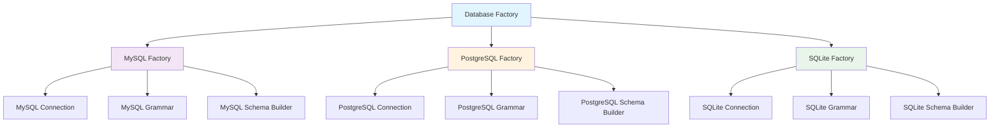
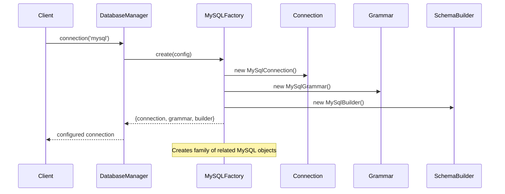
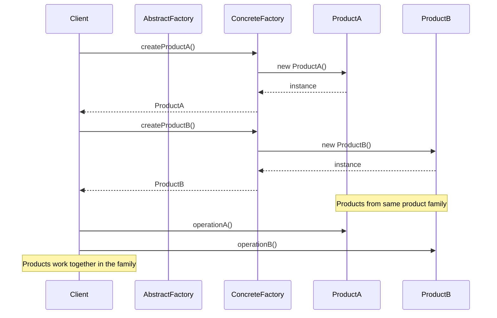
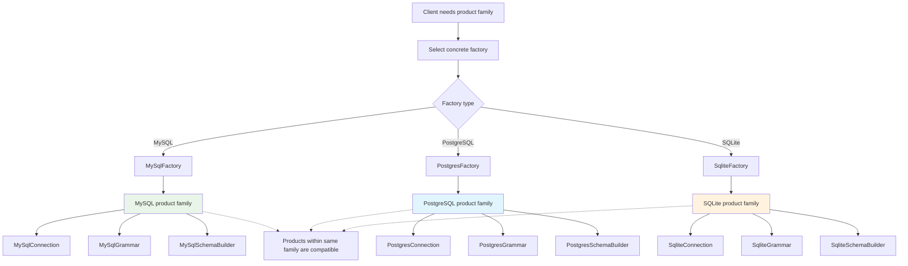

# Abstract Factory Pattern

## Overview

Provide an interface for creating families of related or dependent objects without specifying their concrete classes. The Abstract Factory pattern provides an interface for creating families of related products.

## Problem Scenarios

In Laravel applications, we often need:
- Create families of related objects
- Ensure compatibility between related products
- Support multiple product families
- Decouple client code from concrete product classes

## Solution

The Abstract Factory pattern provides an interface for creating families of related or dependent objects without specifying their concrete classes.

## Architecture Diagrams

### Laravel Database Factory Family



### Factory Creation Flow



### Abstract Factory Sequence Diagram


### Abstract Factory Product Family Relationship Diagram


## Design Intent

- **Product family creation**: Create a series of related product objects
- **Unified interface**: Provide a unified creation interface for different product families
- **Compatibility guarantee**: Ensure created products can work together
- **System decoupling**: Decouple client code from concrete product creation process

## Laravel Implementation

### 1. Database Abstract Factory

Laravel's database system is a typical application of Abstract Factory pattern. `DatabaseManager` acts as an abstract factory, creating the entire database product family:

```php
// Illuminate\Database\DatabaseManager.php
public function connection($name = null)
{
    // Abstract factory method: create database connection product
    $connection = $this->makeConnection($name);
    
    // Also create related query builder, grammar, and other products
    return $this->configure($connection);
}

protected function configure(Connection $connection)
{
    // Configure the entire database product family
    $connection->setReconnector(function ($connection) {
        $this->reconnect($connection->getName());
    });
    
    return $connection;
}
```

### 2. Queue System Abstract Factory

Queue system creates the entire queue processing product family:

```php
// Illuminate\Queue\QueueManager.php
public function connection($name = null)
{
    $name = $name ?: $this->getDefaultDriver();
    
    // Abstract factory: create queue connection and related products
    return $this->connections[$name] = $this->resolve($name);
}

protected function resolve($name)
{
    $config = $this->getConfig($name);
    
    // Create queue connection (main product)
    $connection = $this->getConnector($config['driver'])->connect($config);
    
    // Configure related products: failed queue, retry logic, etc.
    return $this->adapt($connection);
}
```

### 3. Mail System Abstract Factory

Mail system creates mail sending product family:

```php
// Illuminate\Mail\MailManager.php
public function mailer($name = null)
{
    $name = $name ?: $this->getDefaultMailer();
    
    // Abstract factory: create mail sender and related components
    return $this->mailers[$name] = $this->get($name);
}

protected function get($name)
{
    return $this->mailers[$name] ?? $this->resolve($name);
}

protected function resolve($name)
{
    $config = $this->getConfig($name);
    
    // Create mail sender (main product)
    $mailer = $this->createTransport($config);
    
    // Create related products: view renderer, message formatter, etc.
    return $this->configureMailer($mailer, $config);
}
```

## Practical Application Scenarios

### 1. Multi-Database Support Product Family

```php
// MySQL product family
$mysqlConnection = DB::connection('mysql');
$mysqlQuery = $mysqlConnection->query();        // MySQL query builder
$mysqlGrammar = $mysqlConnection->getQueryGrammar(); // MySQL grammar

// PostgreSQL product family  
$pgsqlConnection = DB::connection('pgsql');
$pgsqlQuery = $pgsqlConnection->query();        // PostgreSQL query builder
$pgsqlGrammar = $pgsqlConnection->getQueryGrammar(); // PostgreSQL grammar
```

### 2. Cache System Product Family

```php
// Redis cache product family
$redisStore = Cache::store('redis');
$redisTagged = $redisStore->tags(['users']);    // Redis tag support
$redisLock = $redisStore->lock('resource', 10); // Redis distributed lock

// Memcached cache product family
$memcachedStore = Cache::store('memcached');
$memcachedTagged = $memcachedStore->tags(['posts']); // Memcached tags
```

### 3. File System Product Family

```php
// Local storage product family
$localDisk = Storage::disk('local');
$localAdapter = $localDisk->getAdapter();       // Local adapter
$localVisibility = $localDisk->getVisibility(); // Local visibility control

// S3 storage product family
$s3Disk = Storage::disk('s3');
$s3Client = $s3Disk->getClient();               // S3 client
$s3Visibility = $s3Disk->getVisibility();       // S3 visibility control
```

## Source Code Analysis Points

### 1. Product Family Compatibility Guarantee

The core advantage of Abstract Factory pattern is ensuring product family compatibility. In Laravel, this compatibility is achieved through configuration-driven approach:

```php
// Ensure same product family uses same configuration
'redis' => [
    'driver' => 'redis',
    'connection' => 'default',
    'queue' => 'default',
    'retry_after' => 90,
    'block_for' => null,
],

'sync' => [
    'driver' => 'sync', // Synchronous driver product family
],
```

### 2. Abstract Factory Extension Mechanism

Laravel provides flexible extension mechanism, allowing users to add custom product families:

```php
// Extend custom database product family
DB::extend('custom', function ($config, $name) {
    // Return custom connection product
    $connection = new CustomConnection($config);
    
    // Configure related query builder, grammar, etc.
    $connection->setQueryGrammar(new CustomGrammar);
    $connection->setPostProcessor(new CustomProcessor);
    
    return $connection;
});
```

### 3. Product Family Lifecycle Management

Abstract factory is responsible for managing the entire product family lifecycle:

```php
// Database manager's product family management
public function __destruct()
{
    // Close all database connection products
    foreach ($this->connections as $connection) {
        $connection->disconnect();
    }
}
```

## Best Practices

### 1. Appropriate Use of Abstract Factory Pattern

**Applicable Scenarios:**
- System needs to be independent of product creation, composition, and representation
- System needs to configure one of multiple product families
- Need to emphasize design of a series of related product objects for joint use
- Need to provide a product library, showing only interfaces not implementations

**Not Applicable Scenarios:**
- Product family is unstable, frequently needing to add or remove products
- Products have large differences, difficult to abstract with unified interface

### 2. Abstract Factory Practice in Laravel

**Utilize Service Container for Dependency Injection:**
```php
// Register abstract factory in service provider
$this->app->singleton('db', function ($app) {
    return new DatabaseManager($app, $app['db.factory']);
});

// Register concrete product families
$this->app->bind('db.connection.mysql', function ($app, $config) {
    return new MySqlConnection($config);
});
```

**Configuration-Driven Product Family Selection:**
```php
// Select different product families based on environment
'default' => env('DB_CONNECTION', 'mysql'),

// Configure different product families for different environments
'connections' => [
    'testing' => [
        'driver' => 'sqlite',
        'database' => ':memory:',
    ],
    'production' => [
        'driver' => 'mysql',
        'host' => env('DB_HOST'),
        // Production environment product family configuration
    ],
],
```

### 3. Testing Abstract Factory

**Mock Entire Product Family:**
```php
// Replace entire product family in testing
Storage::fake('s3');

// Test product family compatibility
$disk = Storage::disk('s3');
$client = $disk->getClient(); // Should return mocked client
```

**Test Abstract Factory Creation Logic:**
```php
public function test_database_abstract_factory_creates_compatible_products()
{
    $manager = app('db');
    $connection = $manager->connection('mysql');
    
    $query = $connection->query();
    $grammar = $connection->getQueryGrammar();
    
    // Verify product family compatibility
    $this->assertInstanceOf(MySqlConnection::class, $connection);
    $this->assertInstanceOf(QueryBuilder::class, $query);
    $this->assertInstanceOf(MySqlGrammar::class, $grammar);
}
```

## Relationship with Other Patterns

### 1. With Factory Method Pattern

Abstract Factory pattern often uses Factory Method pattern for implementation:

```php
// Abstract factory uses factory method to create concrete products
protected function createConnection($config)
{
    // Factory method: create specific connection based on configuration
    $driver = $config['driver'];
    $method = 'create'.ucfirst($driver).'Connection';
    
    if (method_exists($this, $method)) {
        return $this->$method($config);
    }
    
    throw new InvalidArgumentException("Unsupported driver [{$driver}]");
}
```

### 2. With Singleton Pattern

Products created by abstract factory are typically managed as singletons:

```php
// Abstract factory maintains product instances as singletons
public function connection($name = null)
{
    $name = $name ?: $this->getDefaultConnection();
    
    // Singleton management: if product exists, return directly
    if (! isset($this->connections[$name])) {
        $this->connections[$name] = $this->makeConnection($name);
    }
    
    return $this->connections[$name];
}
```

### 3. With Builder Pattern

Abstract Factory focuses on product family creation, while Builder pattern focuses on step-by-step construction of complex objects:

```php
// Abstract factory creates product family
$dbProducts = DB::connection('mysql'); // Entire database product family

// Builder pattern constructs complex objects
$query = DB::table('users')
    ->select('name', 'email')
    ->where('active', true)
    ->orderBy('name')
    ->get(); // Step-by-step construction of query object
```

## Performance Considerations

### 1. Lazy Creation of Product Family

Abstract Factory pattern supports lazy creation, improving performance:

```php
// Create product family only when actually used
if (config('cache.default') === 'redis') {
    // Only then create Redis cache product family
    $value = Cache::get('key');
}
```

### 2. Caching Mechanism for Product Family

Laravel's abstract factory caches created product families:

```php
// First call creates entire product family
$products1 = Cache::store('redis');

// Second call returns cached product family
$products2 = Cache::store('redis'); // Returns $products1

// Can manually clear cache
Cache::purge('redis');
```

## Laravel 12 New Features

### 1. Attribute-Driven Abstract Factory

Laravel 12 introduces attribute-driven abstract factory configuration:

```php
use Illuminate\Database\Attributes\AsConnectionFactory;

#[AsConnectionFactory('custom')]
class CustomConnectionFactory
{
    public function make(array $config): Connection
    {
        return new CustomConnection($config);
    }
    
    public function getSupportedDrivers()
    {
        return ['custom'];
    }
}
```

### 2. Interface-Based Abstract Factory

New interface abstraction makes abstract factory more flexible:

```php
interface ConnectionFactory
{
    public function make(array $config): Connection;
    public function getSupportedDrivers();
}
```

## Summary

Abstract Factory pattern is an important component in Laravel framework architecture, especially when dealing with multi-driver, multi-configuration system components. Through Abstract Factory pattern, Laravel achieves:

1. **Unified management of product families**: Ensure compatibility and consistency of related products
2. **Configuration-driven flexibility**: Support multiple drivers and configuration schemes
3. **System extensibility**: Easy to add new product families
4. **Performance optimization**: Support lazy creation and caching mechanisms

Understanding Abstract Factory pattern is crucial for mastering Laravel's core architecture, especially in the design and implementation of system components like database, cache, queue, and mail. This pattern embodies the essence of "Dependency Inversion Principle": high-level modules should not depend on low-level modules, both should depend on abstractions.
