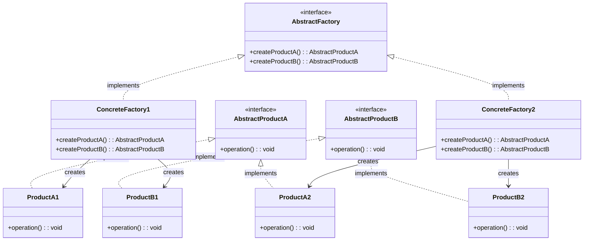
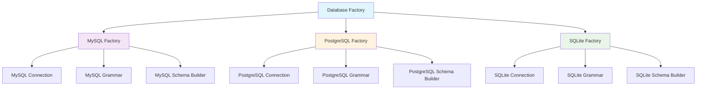
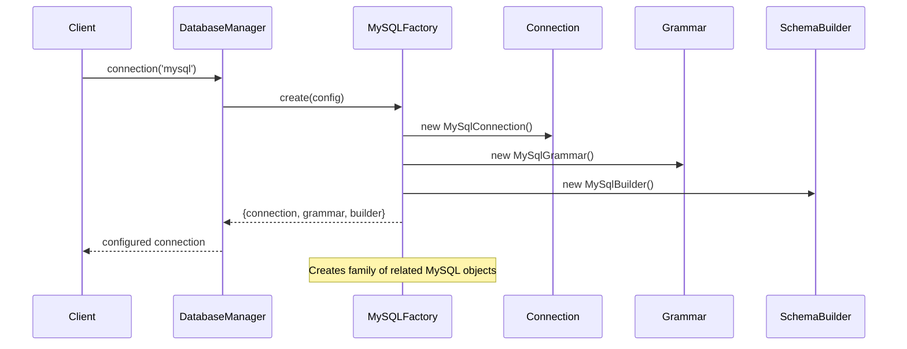

# Abstract Factory Pattern

## Overview

Provide an interface for creating families of related or dependent objects without specifying their concrete classes. The Abstract Factory pattern provides an interface for creating families of related products.

## Architecture Diagram

### Abstract Factory Pattern Structure



### Laravel Database Factory Family



### Factory Creation Flow



## Implementation in Laravel

### 1. Database Connection Factory

Laravel's database system uses Abstract Factory pattern to create families of database-related objects:

```php
// Illuminate\Database\Connectors\ConnectionFactory.php
class ConnectionFactory
{
    public function make(array $config, $name = null)
    {
        $config = $this->parseConfig($config, $name);
        
        if (isset($config['read'])) {
            return $this->createReadWriteConnection($config);
        }
        
        return $this->createSingleConnection($config);
    }
    
    protected function createConnection($driver, $connection, $database, $prefix = '', array $config = [])
    {
        if ($resolver = Connection::getResolver($driver)) {
            return $resolver($connection, $database, $prefix, $config);
        }
        
        switch ($driver) {
            case 'mysql':
                return new MySqlConnection($connection, $database, $prefix, $config);
            case 'pgsql':
                return new PostgresConnection($connection, $database, $prefix, $config);
            case 'sqlite':
                return new SQLiteConnection($connection, $database, $prefix, $config);
        }
    }
}
```

### 2. Validation Factory

```php
// Illuminate\Validation\Factory.php
class Factory implements FactoryContract
{
    public function make(array $data, array $rules, array $messages = [], array $customAttributes = [])
    {
        $validator = $this->resolve($data, $rules, $messages, $customAttributes);
        
        if (! is_null($this->verifier)) {
            $validator->setPresenceVerifier($this->verifier);
        }
        
        if (! is_null($this->container)) {
            $validator->setContainer($this->container);
        }
        
        $this->addExtensions($validator);
        
        return $validator;
    }
    
    protected function resolve(array $data, array $rules, array $messages, array $customAttributes)
    {
        if (is_null($this->resolver)) {
            return new Validator($this->translator, $data, $rules, $messages, $customAttributes);
        }
        
        return call_user_func($this->resolver, $this->translator, $data, $rules, $messages, $customAttributes);
    }
}
```

### 3. Broadcasting Factory

```php
// Illuminate\Broadcasting\BroadcastManager.php
class BroadcastManager extends Manager
{
    protected function createPusherDriver(array $config)
    {
        return new PusherBroadcaster(
            new Pusher(
                $config['key'],
                $config['secret'],
                $config['app_id'],
                $config['options'] ?? []
            )
        );
    }
    
    protected function createRedisDriver(array $config)
    {
        return new RedisBroadcaster(
            $this->app->make('redis'), $config['connection'] ?? null
        );
    }
}
```