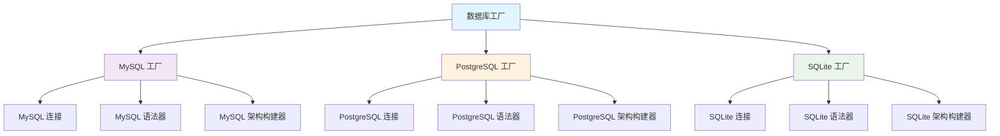
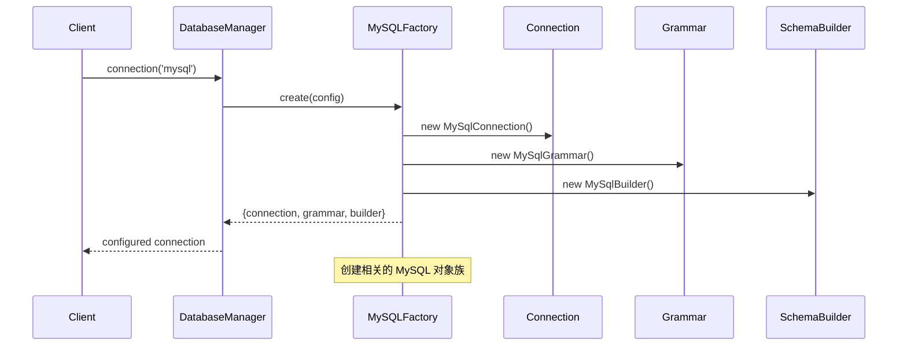
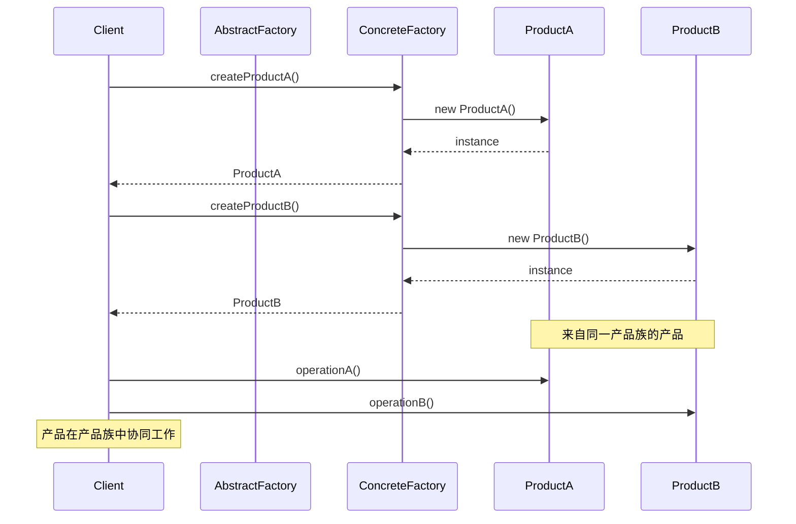
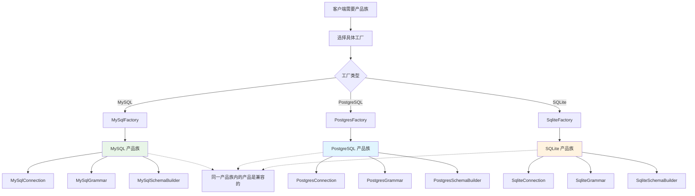

# 抽象工厂模式 (Abstract Factory Pattern)

## 概述

抽象工厂模式提供一个创建一系列相关或相互依赖对象的接口，而无需指定它们具体的类。它强调产品族的创建，能够确保创建的产品相互兼容。

## 架构图

### Laravel 数据库工厂产品族



### 工厂创建流程



### 抽象工厂时序图


### 抽象工厂产品族关系图


## 设计意图

- **产品族创建**：创建一系列相关的产品对象
- **接口统一**：为不同的产品族提供统一的创建接口
- **兼容性保证**：确保创建的产品能够协同工作
- **系统解耦**：将客户端与具体产品的创建过程解耦

## Laravel 中的实现

### 1. 数据库抽象工厂

Laravel 的数据库系统是抽象工厂模式的典型应用。`DatabaseManager` 作为抽象工厂，创建整个数据库产品族：

```php
// Illuminate\Database\DatabaseManager.php
public function connection($name = null)
{
    // 抽象工厂方法：创建数据库连接产品
    $connection = $this->makeConnection($name);
    
    // 同时创建相关的查询构建器、语法器等产品
    return $this->configure($connection);
}

protected function configure(Connection $connection)
{
    // 配置整个数据库产品族
    $connection->setReconnector(function ($connection) {
        $this->reconnect($connection->getName());
    });
    
    return $connection;
}
```

### 2. 队列系统抽象工厂

队列系统创建整个队列处理产品族：

```php
// Illuminate\Queue\QueueManager.php
public function connection($name = null)
{
    $name = $name ?: $this->getDefaultDriver();
    
    // 抽象工厂：创建队列连接及相关产品
    return $this->connections[$name] = $this->resolve($name);
}

protected function resolve($name)
{
    $config = $this->getConfig($name);
    
    // 创建队列连接（主要产品）
    $connection = $this->getConnector($config['driver'])->connect($config);
    
    // 配置相关产品：失败队列、重试逻辑等
    return $this->adapt($connection);
}
```

### 3. 邮件系统抽象工厂

邮件系统创建邮件发送产品族：

```php
// Illuminate\Mail\MailManager.php
public function mailer($name = null)
{
    $name = $name ?: $this->getDefaultMailer();
    
    // 抽象工厂：创建邮件发送器及相关组件
    return $this->mailers[$name] = $this->get($name);
}

protected function get($name)
{
    return $this->mailers[$name] ?? $this->resolve($name);
}

protected function resolve($name)
{
    $config = $this->getConfig($name);
    
    // 创建邮件发送器（主要产品）
    $mailer = $this->createTransport($config);
    
    // 创建相关产品：视图渲染器、消息格式化器等
    return $this->configureMailer($mailer, $config);
}
```

## 实际应用场景

### 1. 多数据库支持的产品族

```php
// MySQL 产品族
$mysqlConnection = DB::connection('mysql');
$mysqlQuery = $mysqlConnection->query();        // MySQL 查询构建器
$mysqlGrammar = $mysqlConnection->getQueryGrammar(); // MySQL 语法器

// PostgreSQL 产品族  
$pgsqlConnection = DB::connection('pgsql');
$pgsqlQuery = $pgsqlConnection->query();        // PostgreSQL 查询构建器
$pgsqlGrammar = $pgsqlConnection->getQueryGrammar(); // PostgreSQL 语法器
```

### 2. 缓存系统产品族

```php
// Redis 缓存产品族
$redisStore = Cache::store('redis');
$redisTagged = $redisStore->tags(['users']);    // Redis 标签支持
$redisLock = $redisStore->lock('resource', 10); // Redis 分布式锁

// Memcached 缓存产品族
$memcachedStore = Cache::store('memcached');
$memcachedTagged = $memcachedStore->tags(['posts']); // Memcached 标签
```

### 3. 文件系统产品族

```php
// 本地存储产品族
$localDisk = Storage::disk('local');
$localAdapter = $localDisk->getAdapter();       // 本地适配器
$localVisibility = $localDisk->getVisibility(); // 本地可见性控制

// S3 存储产品族
$s3Disk = Storage::disk('s3');
$s3Client = $s3Disk->getClient();               // S3 客户端
$s3Visibility = $s3Disk->getVisibility();       // S3 可见性控制
```

## 源码分析要点

### 1. 产品族的兼容性保证

抽象工厂模式的核心优势是确保产品族的兼容性。在 Laravel 中，这种兼容性通过配置驱动实现：

```php
// 确保同一产品族使用相同的配置
'redis' => [
    'driver' => 'redis',
    'connection' => 'default',
    'queue' => 'default',
    'retry_after' => 90,
    'block_for' => null,
],

'sync' => [
    'driver' => 'sync', // 同步驱动产品族
],
```

### 2. 抽象工厂的扩展机制

Laravel 提供了灵活的扩展机制，允许用户添加自定义的产品族：

```php
// 扩展自定义数据库产品族
DB::extend('custom', function ($config, $name) {
    // 返回自定义连接产品
    $connection = new CustomConnection($config);
    
    // 配置相关的查询构建器、语法器等
    $connection->setQueryGrammar(new CustomGrammar);
    $connection->setPostProcessor(new CustomProcessor);
    
    return $connection;
});
```

### 3. 产品族的生命周期管理

抽象工厂负责管理整个产品族的生命周期：

```php
// 数据库管理器的产品族管理
public function __destruct()
{
    // 关闭所有数据库连接产品
    foreach ($this->connections as $connection) {
        $connection->disconnect();
    }
}
```

## 最佳实践

### 1. 合理使用抽象工厂模式

**适用场景：**
- 系统需要独立于产品的创建、组合和表示
- 系统需要配置多个产品族中的一个
- 需要强调一系列相关产品对象的设计以便进行联合使用
- 需要提供一个产品类库，只显示接口而不是实现

**不适用场景：**
- 产品族不稳定，经常需要添加或删除产品
- 产品之间的差异很大，难以用统一的接口抽象

### 2. Laravel 中的抽象工厂实践

**利用服务容器进行依赖注入：**
```php
// 在服务提供者中注册抽象工厂
$this->app->singleton('db', function ($app) {
    return new DatabaseManager($app, $app['db.factory']);
});

// 注册具体的产品族
$this->app->bind('db.connection.mysql', function ($app, $config) {
    return new MySqlConnection($config);
});
```

**配置驱动的产品族选择：**
```php
// 根据环境选择不同的产品族
'default' => env('DB_CONNECTION', 'mysql'),

// 为不同环境配置不同的产品族
'connections' => [
    'testing' => [
        'driver' => 'sqlite',
        'database' => ':memory:',
    ],
    'production' => [
        'driver' => 'mysql',
        'host' => env('DB_HOST'),
        // 生产环境产品族配置
    ],
],
```

### 3. 测试中的抽象工厂

**模拟整个产品族：**
```php
// 在测试中替换整个产品族
Storage::fake('s3');

// 测试产品族的兼容性
$disk = Storage::disk('s3');
$client = $disk->getClient(); // 应该返回模拟的客户端
```

**测试抽象工厂的创建逻辑：**
```php
public function test_database_abstract_factory_creates_compatible_products()
{
    $manager = app('db');
    $connection = $manager->connection('mysql');
    
    $query = $connection->query();
    $grammar = $connection->getQueryGrammar();
    
    // 验证产品族的兼容性
    $this->assertInstanceOf(MySqlConnection::class, $connection);
    $this->assertInstanceOf(QueryBuilder::class, $query);
    $this->assertInstanceOf(MySqlGrammar::class, $grammar);
}
```

## 与其他模式的关系

### 1. 与工厂方法模式

抽象工厂模式通常使用工厂方法模式来实现：

```php
// 抽象工厂使用工厂方法创建具体产品
protected function createConnection($config)
{
    // 工厂方法：根据配置创建具体的连接
    $driver = $config['driver'];
    $method = 'create'.ucfirst($driver).'Connection';
    
    if (method_exists($this, $method)) {
        return $this->$method($config);
    }
    
    throw new InvalidArgumentException("Unsupported driver [{$driver}]");
}
```

### 2. 与单例模式

抽象工厂创建的产品通常被管理为单例：

```php
// 抽象工厂维护产品实例的单例
public function connection($name = null)
{
    $name = $name ?: $this->getDefaultConnection();
    
    // 单例管理：如果产品已存在，直接返回
    if (! isset($this->connections[$name])) {
        $this->connections[$name] = $this->makeConnection($name);
    }
    
    return $this->connections[$name];
}
```

### 3. 与建造者模式

抽象工厂关注产品族的创建，而建造者模式关注复杂对象的逐步构建：

```php
// 抽象工厂创建产品族
$dbProducts = DB::connection('mysql'); // 整个数据库产品族

// 建造者模式构建复杂对象
$query = DB::table('users')
    ->select('name', 'email')
    ->where('active', true)
    ->orderBy('name')
    ->get(); // 逐步构建查询对象
```

## 性能考虑

### 1. 产品族的延迟创建

抽象工厂模式支持延迟创建，提高性能：

```php
// 只有在实际使用时才创建产品族
if (config('cache.default') === 'redis') {
    // 此时才会创建 Redis 缓存产品族
    $value = Cache::get('key');
}
```

### 2. 产品族的缓存机制

Laravel 的抽象工厂会缓存已创建的产品族：

```php
// 第一次调用创建整个产品族
$products1 = Cache::store('redis');

// 第二次调用返回已缓存的产品族
$products2 = Cache::store('redis'); // 返回 $products1

// 可以手动清除缓存
Cache::purge('redis');
```

## Laravel 12 新特性

### 1. 属性驱动的抽象工厂

Laravel 12 引入了属性驱动的抽象工厂配置：

```php
use Illuminate\Database\Attributes\AsConnectionFactory;

#[AsConnectionFactory('custom')]
class CustomConnectionFactory
{
    public function make(array $config): Connection
    {
        return new CustomConnection($config);
    }
    
    public function getSupportedDrivers()
    {
        return ['custom'];
    }
}
```

### 2. 基于接口的抽象工厂

新的接口抽象让抽象工厂更加灵活：

```php
interface ConnectionFactory
{
    public function make(array $config): Connection;
    public function getSupportedDrivers();
}
```

## 总结

抽象工厂模式是 Laravel 框架架构中的重要组成部分，特别是在处理多驱动、多配置的系统组件时。通过抽象工厂模式，Laravel 实现了：

1. **产品族的统一管理**：确保相关产品的兼容性和一致性
2. **配置驱动的灵活性**：支持多种驱动和配置方案
3. **系统的可扩展性**：易于添加新的产品族
4. **性能优化**：支持延迟创建和缓存机制

理解抽象工厂模式对于掌握 Laravel 的核心架构至关重要，特别是在数据库、缓存、队列、邮件等系统组件的设计和实现中。这种模式体现了"依赖倒置原则"的精髓：高层模块不应该依赖低层模块，二者都应该依赖抽象。
