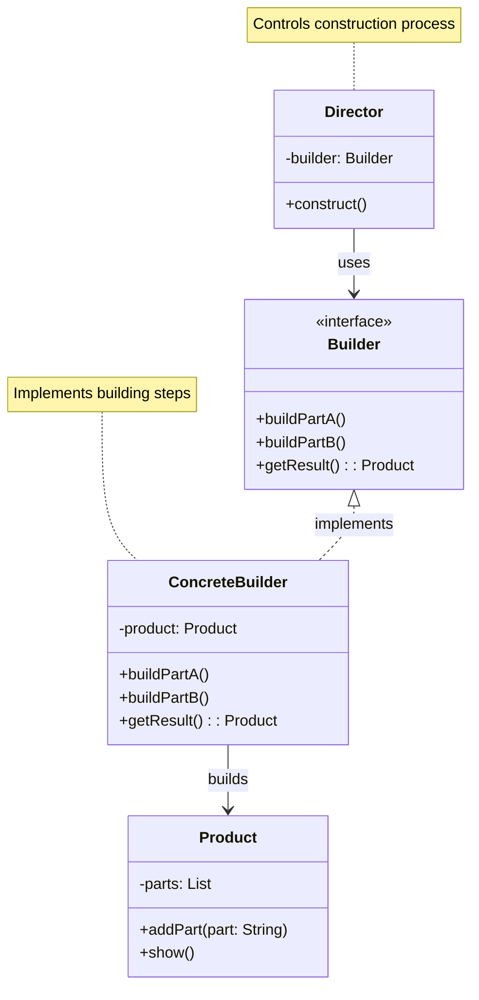
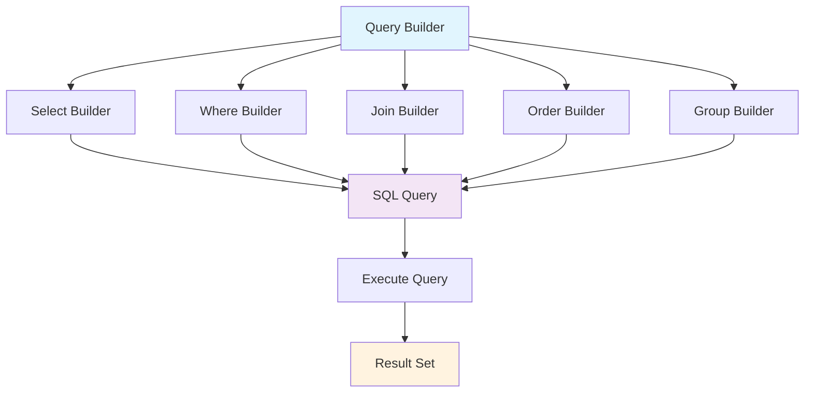
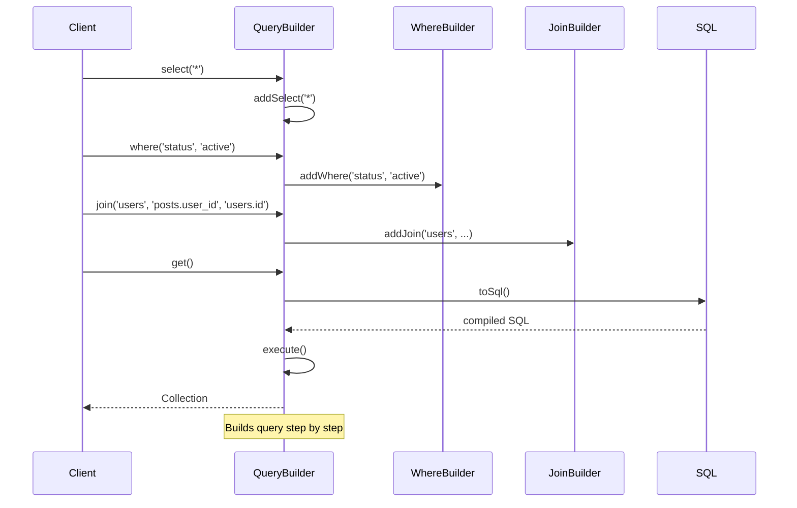

# Builder Pattern

## Overview

Separate the construction of a complex object from its representation so that the same construction process can create different representations. The Builder pattern allows you to construct complex objects step by step.

## Architecture Diagram

### Builder Pattern Structure



### Laravel Query Builder Architecture



### Builder Construction Flow



## Implementation in Laravel

### 1. Eloquent Query Builder

Laravel's Query Builder is a perfect example of the Builder pattern:

```php
// Illuminate\Database\Query\Builder.php
class Builder
{
    public $columns;
    public $wheres = [];
    public $joins = [];
    public $orders = [];
    public $groups = [];
    
    public function select($columns = ['*'])
    {
        $this->columns = is_array($columns) ? $columns : func_get_args();
        return $this;
    }
    
    public function where($column, $operator = null, $value = null, $boolean = 'and')
    {
        if ($column instanceof Closure) {
            return $this->whereNested($column, $boolean);
        }
        
        $this->wheres[] = compact('type', 'column', 'operator', 'value', 'boolean');
        
        return $this;
    }
    
    public function join($table, $first, $operator = null, $second = null, $type = 'inner', $where = false)
    {
        $join = new JoinClause($this, $type, $table);
        
        if ($first instanceof Closure) {
            call_user_func($first, $join);
            $this->joins[] = $join;
        } else {
            $this->joins[] = $join->on($first, $operator, $second, 'and', $where);
        }
        
        return $this;
    }
}
```

### 2. HTTP Response Builder

```php
// Illuminate\Http\Response.php
class Response
{
    protected $content;
    protected $statusCode = 200;
    protected $headers;
    
    public function setContent($content)
    {
        $this->content = $content;
        return $this;
    }
    
    public function setStatusCode($code, $text = null)
    {
        $this->statusCode = $code;
        return $this;
    }
    
    public function header($key, $values, $replace = true)
    {
        $this->headers->set($key, $values, $replace);
        return $this;
    }
}

// Usage
$response = response()
    ->setContent('Hello World')
    ->setStatusCode(200)
    ->header('Content-Type', 'text/plain');
```

### 3. Validation Rule Builder

```php
// Illuminate\Validation\Rule.php
class Rule
{
    public static function exists($table, $column = 'NULL')
    {
        return new Exists($table, $column);
    }
    
    public static function unique($table, $column = 'NULL')
    {
        return new Unique($table, $column);
    }
    
    public static function in($values)
    {
        return new In($values);
    }
}

// Usage
$rules = [
    'email' => [
        'required',
        Rule::unique('users')->ignore($user->id),
        Rule::exists('domains', 'name')->where('active', 1)
    ]
];
```