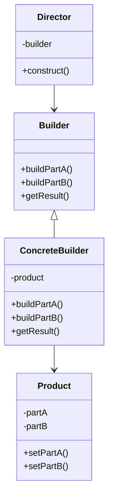
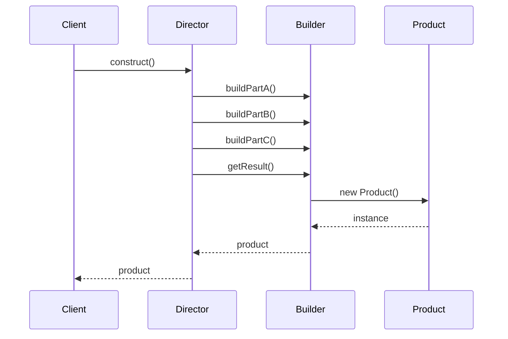

# 建造者模式 (Builder Pattern)

## 概述

建造者模式将一个复杂对象的构建与它的表示分离，使得同样的构建过程可以创建不同的表示。它允许用户只通过指定复杂对象的类型和内容就可以构建它们，用户不需要知道内部的具体构建细节。

## 问题场景

在Laravel应用中，我们经常需要：
- 创建复杂的配置对象
- 构建复杂的查询语句
- 创建多步骤的表单
- 构建复杂的邮件内容
- 创建多层级的菜单结构

## 解决方案

建造者模式通过提供一个建造者类来逐步构建复杂对象，将构建过程和最终的产品分离。

## UML类图



## Laravel实现

### 1. 查询构建器示例

```php
<?php

namespace App\Patterns\Builder;

// 查询产品类
class Query
{
    private array $select = [];
    private string $from = '';
    private array $joins = [];
    private array $where = [];
    private array $orderBy = [];
    private array $groupBy = [];
    private ?int $limit = null;
    private ?int $offset = null;
    
    public function setSelect(array $select): void
    {
        $this->select = $select;
    }
    
    public function setFrom(string $from): void
    {
        $this->from = $from;
    }
    
    public function addJoin(string $join): void
    {
        $this->joins[] = $join;
    }
    
    public function addWhere(string $where): void
    {
        $this->where[] = $where;
    }
    
    public function addOrderBy(string $orderBy): void
    {
        $this->orderBy[] = $orderBy;
    }
    
    public function addGroupBy(string $groupBy): void
    {
        $this->groupBy[] = $groupBy;
    }
    
    public function setLimit(int $limit): void
    {
        $this->limit = $limit;
    }
    
    public function setOffset(int $offset): void
    {
        $this->offset = $offset;
    }
    
    public function toSql(): string
    {
        $sql = 'SELECT ' . implode(', ', $this->select);
        $sql .= " FROM {$this->from}";
        
        foreach ($this->joins as $join) {
            $sql .= " {$join}";
        }
        
        if (!empty($this->where)) {
            $sql .= ' WHERE ' . implode(' AND ', $this->where);
        }
        
        if (!empty($this->groupBy)) {
            $sql .= ' GROUP BY ' . implode(', ', $this->groupBy);
        }
        
        if (!empty($this->orderBy)) {
            $sql .= ' ORDER BY ' . implode(', ', $this->orderBy);
        }
        
        if ($this->limit !== null) {
            $sql .= " LIMIT {$this->limit}";
        }
        
        if ($this->offset !== null) {
            $sql .= " OFFSET {$this->offset}";
        }
        
        return $sql;
    }
}

// 抽象查询建造者
abstract class QueryBuilder
{
    protected Query $query;
    
    public function __construct()
    {
        $this->reset();
    }
    
    public function reset(): void
    {
        $this->query = new Query();
    }
    
    abstract public function select(array $columns): self;
    abstract public function from(string $table): self;
    abstract public function where(string $column, string $operator, $value): self;
    abstract public function join(string $table, string $on): self;
    abstract public function orderBy(string $column, string $direction = 'ASC'): self;
    abstract public function limit(int $limit): self;
    abstract public function offset(int $offset): self;
    
    public function getQuery(): Query
    {
        $result = $this->query;
        $this->reset();
        return $result;
    }
}

// MySQL查询建造者
class MysqlQueryBuilder extends QueryBuilder
{
    public function select(array $columns): self
    {
        $this->query->setSelect($columns);
        return $this;
    }
    
    public function from(string $table): self
    {
        $this->query->setFrom("`{$table}`");
        return $this;
    }
    
    public function where(string $column, string $operator, $value): self
    {
        $value = is_string($value) ? "'{$value}'" : $value;
        $this->query->addWhere("`{$column}` {$operator} {$value}");
        return $this;
    }
    
    public function join(string $table, string $on): self
    {
        $this->query->addJoin("JOIN `{$table}` ON {$on}");
        return $this;
    }
    
    public function orderBy(string $column, string $direction = 'ASC'): self
    {
        $this->query->addOrderBy("`{$column}` {$direction}");
        return $this;
    }
    
    public function limit(int $limit): self
    {
        $this->query->setLimit($limit);
        return $this;
    }
    
    public function offset(int $offset): self
    {
        $this->query->setOffset($offset);
        return $this;
    }
}

// PostgreSQL查询建造者
class PostgresqlQueryBuilder extends QueryBuilder
{
    public function select(array $columns): self
    {
        $this->query->setSelect($columns);
        return $this;
    }
    
    public function from(string $table): self
    {
        $this->query->setFrom("\"{$table}\"");
        return $this;
    }
    
    public function where(string $column, string $operator, $value): self
    {
        $value = is_string($value) ? "'{$value}'" : $value;
        $this->query->addWhere("\"{$column}\" {$operator} {$value}");
        return $this;
    }
    
    public function join(string $table, string $on): self
    {
        $this->query->addJoin("JOIN \"{$table}\" ON {$on}");
        return $this;
    }
    
    public function orderBy(string $column, string $direction = 'ASC'): self
    {
        $this->query->addOrderBy("\"{$column}\" {$direction}");
        return $this;
    }
    
    public function limit(int $limit): self
    {
        $this->query->setLimit($limit);
        return $this;
    }
    
    public function offset(int $offset): self
    {
        $this->query->setOffset($offset);
        return $this;
    }
}
```

### 2. 邮件建造者示例

```php
<?php

namespace App\Patterns\Builder;

// 邮件产品类
class Email
{
    private string $to = '';
    private string $from = '';
    private string $subject = '';
    private string $body = '';
    private array $attachments = [];
    private array $headers = [];
    private bool $isHtml = false;
    
    public function setTo(string $to): void
    {
        $this->to = $to;
    }
    
    public function setFrom(string $from): void
    {
        $this->from = $from;
    }
    
    public function setSubject(string $subject): void
    {
        $this->subject = $subject;
    }
    
    public function setBody(string $body): void
    {
        $this->body = $body;
    }
    
    public function addAttachment(string $attachment): void
    {
        $this->attachments[] = $attachment;
    }
    
    public function addHeader(string $name, string $value): void
    {
        $this->headers[$name] = $value;
    }
    
    public function setIsHtml(bool $isHtml): void
    {
        $this->isHtml = $isHtml;
    }
    
    public function send(): string
    {
        $message = "Sending email:\n";
        $message .= "To: {$this->to}\n";
        $message .= "From: {$this->from}\n";
        $message .= "Subject: {$this->subject}\n";
        $message .= "Body: {$this->body}\n";
        $message .= "HTML: " . ($this->isHtml ? 'Yes' : 'No') . "\n";
        
        if (!empty($this->attachments)) {
            $message .= "Attachments: " . implode(', ', $this->attachments) . "\n";
        }
        
        if (!empty($this->headers)) {
            $message .= "Headers: " . json_encode($this->headers) . "\n";
        }
        
        return $message;
    }
}

// 邮件建造者接口
interface EmailBuilderInterface
{
    public function to(string $email): self;
    public function from(string $email): self;
    public function subject(string $subject): self;
    public function body(string $body): self;
    public function attachment(string $file): self;
    public function header(string $name, string $value): self;
    public function html(bool $isHtml = true): self;
    public function build(): Email;
}

// 具体邮件建造者
class EmailBuilder implements EmailBuilderInterface
{
    private Email $email;
    
    public function __construct()
    {
        $this->reset();
    }
    
    public function reset(): void
    {
        $this->email = new Email();
    }
    
    public function to(string $email): self
    {
        $this->email->setTo($email);
        return $this;
    }
    
    public function from(string $email): self
    {
        $this->email->setFrom($email);
        return $this;
    }
    
    public function subject(string $subject): self
    {
        $this->email->setSubject($subject);
        return $this;
    }
    
    public function body(string $body): self
    {
        $this->email->setBody($body);
        return $this;
    }
    
    public function attachment(string $file): self
    {
        $this->email->addAttachment($file);
        return $this;
    }
    
    public function header(string $name, string $value): self
    {
        $this->email->addHeader($name, $value);
        return $this;
    }
    
    public function html(bool $isHtml = true): self
    {
        $this->email->setIsHtml($isHtml);
        return $this;
    }
    
    public function build(): Email
    {
        $result = $this->email;
        $this->reset();
        return $result;
    }
}

// 邮件指挥者
class EmailDirector
{
    private EmailBuilderInterface $builder;
    
    public function __construct(EmailBuilderInterface $builder)
    {
        $this->builder = $builder;
    }
    
    public function buildWelcomeEmail(string $to, string $name): Email
    {
        return $this->builder
            ->to($to)
            ->from('noreply@example.com')
            ->subject('欢迎加入我们！')
            ->body("<h1>欢迎 {$name}！</h1><p>感谢您注册我们的服务。</p>")
            ->html(true)
            ->header('X-Priority', '1')
            ->build();
    }
    
    public function buildPasswordResetEmail(string $to, string $token): Email
    {
        return $this->builder
            ->to($to)
            ->from('security@example.com')
            ->subject('密码重置请求')
            ->body("您的密码重置令牌是：{$token}")
            ->html(false)
            ->header('X-Priority', '1')
            ->build();
    }
    
    public function buildInvoiceEmail(string $to, string $invoicePath): Email
    {
        return $this->builder
            ->to($to)
            ->from('billing@example.com')
            ->subject('您的发票')
            ->body('<p>请查看附件中的发票。</p>')
            ->html(true)
            ->attachment($invoicePath)
            ->build();
    }
}
```

### 3. 表单建造者示例

```php
<?php

namespace App\Patterns\Builder;

// 表单元素基类
abstract class FormElement
{
    protected string $name;
    protected string $label;
    protected array $attributes = [];
    
    public function __construct(string $name, string $label = '')
    {
        $this->name = $name;
        $this->label = $label;
    }
    
    public function setAttribute(string $name, string $value): self
    {
        $this->attributes[$name] = $value;
        return $this;
    }
    
    abstract public function render(): string;
}

// 输入框元素
class InputElement extends FormElement
{
    private string $type = 'text';
    private string $value = '';
    
    public function setType(string $type): self
    {
        $this->type = $type;
        return $this;
    }
    
    public function setValue(string $value): self
    {
        $this->value = $value;
        return $this;
    }
    
    public function render(): string
    {
        $attrs = '';
        foreach ($this->attributes as $name => $value) {
            $attrs .= " {$name}=\"{$value}\"";
        }
        
        $html = '';
        if ($this->label) {
            $html .= "<label for=\"{$this->name}\">{$this->label}</label>";
        }
        $html .= "<input type=\"{$this->type}\" name=\"{$this->name}\" id=\"{$this->name}\" value=\"{$this->value}\"{$attrs}>";
        
        return $html;
    }
}

// 选择框元素
class SelectElement extends FormElement
{
    private array $options = [];
    private string $selected = '';
    
    public function addOption(string $value, string $text): self
    {
        $this->options[$value] = $text;
        return $this;
    }
    
    public function setSelected(string $selected): self
    {
        $this->selected = $selected;
        return $this;
    }
    
    public function render(): string
    {
        $attrs = '';
        foreach ($this->attributes as $name => $value) {
            $attrs .= " {$name}=\"{$value}\"";
        }
        
        $html = '';
        if ($this->label) {
            $html .= "<label for=\"{$this->name}\">{$this->label}</label>";
        }
        $html .= "<select name=\"{$this->name}\" id=\"{$this->name}\"{$attrs}>";
        
        foreach ($this->options as $value => $text) {
            $selected = $value === $this->selected ? ' selected' : '';
            $html .= "<option value=\"{$value}\"{$selected}>{$text}</option>";
        }
        
        $html .= "</select>";
        
        return $html;
    }
}

// 表单产品类
class Form
{
    private string $action = '';
    private string $method = 'POST';
    private array $elements = [];
    private array $attributes = [];
    
    public function setAction(string $action): void
    {
        $this->action = $action;
    }
    
    public function setMethod(string $method): void
    {
        $this->method = $method;
    }
    
    public function addElement(FormElement $element): void
    {
        $this->elements[] = $element;
    }
    
    public function setAttribute(string $name, string $value): void
    {
        $this->attributes[$name] = $value;
    }
    
    public function render(): string
    {
        $attrs = '';
        foreach ($this->attributes as $name => $value) {
            $attrs .= " {$name}=\"{$value}\"";
        }
        
        $html = "<form action=\"{$this->action}\" method=\"{$this->method}\"{$attrs}>";
        
        foreach ($this->elements as $element) {
            $html .= "<div class=\"form-group\">";
            $html .= $element->render();
            $html .= "</div>";
        }
        
        $html .= "</form>";
        
        return $html;
    }
}

// 表单建造者
class FormBuilder
{
    private Form $form;
    
    public function __construct()
    {
        $this->reset();
    }
    
    public function reset(): void
    {
        $this->form = new Form();
    }
    
    public function action(string $action): self
    {
        $this->form->setAction($action);
        return $this;
    }
    
    public function method(string $method): self
    {
        $this->form->setMethod($method);
        return $this;
    }
    
    public function attribute(string $name, string $value): self
    {
        $this->form->setAttribute($name, $value);
        return $this;
    }
    
    public function input(string $name, string $label = '', string $type = 'text'): self
    {
        $element = new InputElement($name, $label);
        $element->setType($type);
        $this->form->addElement($element);
        return $this;
    }
    
    public function select(string $name, string $label = '', array $options = []): self
    {
        $element = new SelectElement($name, $label);
        foreach ($options as $value => $text) {
            $element->addOption($value, $text);
        }
        $this->form->addElement($element);
        return $this;
    }
    
    public function build(): Form
    {
        $result = $this->form;
        $this->reset();
        return $result;
    }
}
```

## 使用示例

### 查询建造者使用

```php
<?php

// MySQL查询构建
$mysqlBuilder = new MysqlQueryBuilder();
$query = $mysqlBuilder
    ->select(['id', 'name', 'email'])
    ->from('users')
    ->where('status', '=', 'active')
    ->where('age', '>', 18)
    ->join('profiles', 'users.id = profiles.user_id')
    ->orderBy('created_at', 'DESC')
    ->limit(10)
    ->getQuery();

echo "MySQL Query: " . $query->toSql() . "\n";

// PostgreSQL查询构建
$pgsqlBuilder = new PostgresqlQueryBuilder();
$query = $pgsqlBuilder
    ->select(['id', 'name', 'email'])
    ->from('users')
    ->where('status', '=', 'active')
    ->orderBy('name', 'ASC')
    ->limit(5)
    ->getQuery();

echo "PostgreSQL Query: " . $query->toSql() . "\n";
```

### 邮件建造者使用

```php
<?php

$emailBuilder = new EmailBuilder();
$director = new EmailDirector($emailBuilder);

// 构建欢迎邮件
$welcomeEmail = $director->buildWelcomeEmail('user@example.com', '张三');
echo $welcomeEmail->send();

// 构建密码重置邮件
$resetEmail = $director->buildPasswordResetEmail('user@example.com', 'abc123');
echo $resetEmail->send();

// 构建发票邮件
$invoiceEmail = $director->buildInvoiceEmail('user@example.com', '/path/to/invoice.pdf');
echo $invoiceEmail->send();

// 自定义邮件构建
$customEmail = $emailBuilder
    ->to('admin@example.com')
    ->from('system@example.com')
    ->subject('系统报告')
    ->body('<h2>系统运行正常</h2><p>所有服务运行正常。</p>')
    ->html(true)
    ->header('X-Priority', '3')
    ->build();

echo $customEmail->send();
```

### 表单建造者使用

```php
<?php

$formBuilder = new FormBuilder();

// 构建登录表单
$loginForm = $formBuilder
    ->action('/login')
    ->method('POST')
    ->attribute('class', 'login-form')
    ->input('username', '用户名', 'text')
    ->input('password', '密码', 'password')
    ->build();

echo $loginForm->render();

// 构建注册表单
$registerForm = $formBuilder
    ->action('/register')
    ->method('POST')
    ->input('name', '姓名', 'text')
    ->input('email', '邮箱', 'email')
    ->input('password', '密码', 'password')
    ->select('gender', '性别', ['male' => '男', 'female' => '女'])
    ->build();

echo $registerForm->render();
```

## Laravel中的实际应用

### 1. Eloquent查询构建器

```php
<?php

// Laravel的查询构建器就是建造者模式的典型应用
$users = DB::table('users')
    ->select('name', 'email')
    ->where('active', 1)
    ->where('age', '>', 18)
    ->orderBy('created_at', 'desc')
    ->limit(10)
    ->get();

// Eloquent模型查询
$posts = Post::where('published', true)
    ->with('author')
    ->orderBy('created_at', 'desc')
    ->paginate(15);
```

### 2. 路由构建器

```php
<?php

// Laravel的路由定义也使用了建造者模式
Route::get('/users/{id}', [UserController::class, 'show'])
    ->name('users.show')
    ->middleware('auth')
    ->where('id', '[0-9]+');

Route::group(['prefix' => 'api', 'middleware' => 'api'], function () {
    Route::resource('posts', PostController::class);
});
```

### 3. 验证规则构建器

```php
<?php

// Laravel的验证规则构建
$validator = Validator::make($request->all(), [
    'name' => 'required|string|max:255',
    'email' => 'required|email|unique:users',
    'password' => 'required|min:8|confirmed',
]);

// 使用Rule类构建复杂规则
$rules = [
    'email' => [
        'required',
        'email',
        Rule::unique('users')->ignore($user->id),
    ],
];
```

## 时序图



## 优点

1. **分离构建和表示**：构建过程和最终产品分离
2. **精细控制构建过程**：可以逐步构建复杂对象
3. **代码复用**：同一个构建过程可以创建不同的产品
4. **易于扩展**：可以独立地扩展构建过程

## 缺点

1. **增加复杂性**：引入了额外的建造者类
2. **产品结构相似**：要求产品有足够的共同点

## 适用场景

1. **创建复杂对象时**
2. **构建过程必须允许不同的表示**
3. **需要逐步构建对象时**
4. **构建过程需要精细控制时**

## 与其他模式的关系

- **抽象工厂模式**：建造者关注逐步构建，抽象工厂关注产品族
- **组合模式**：建造者常用来创建组合模式的复杂结构
- **模板方法模式**：建造者的构建过程可以使用模板方法

建造者模式在Laravel中应用广泛，特别是在需要逐步构建复杂对象的场景中。