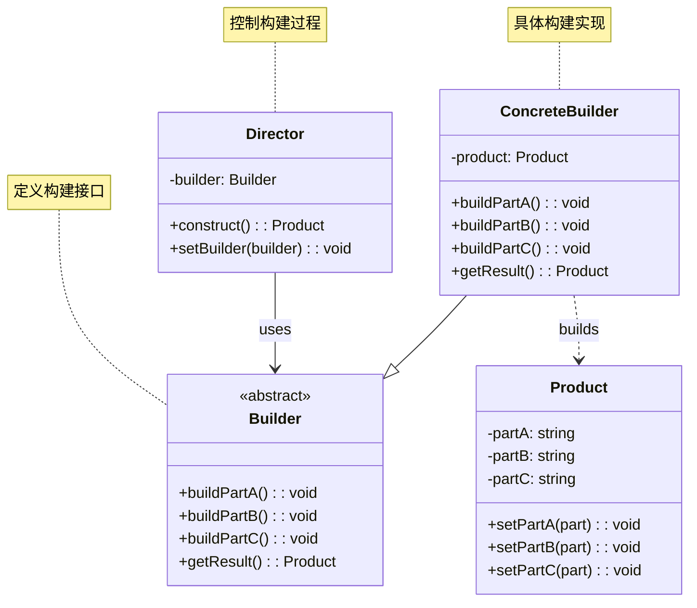
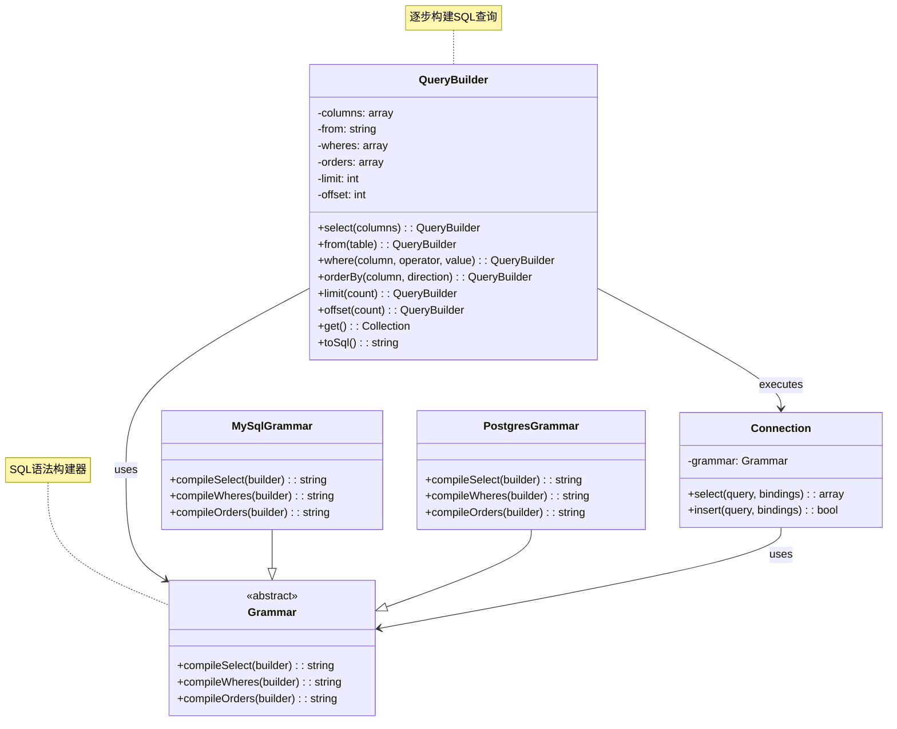
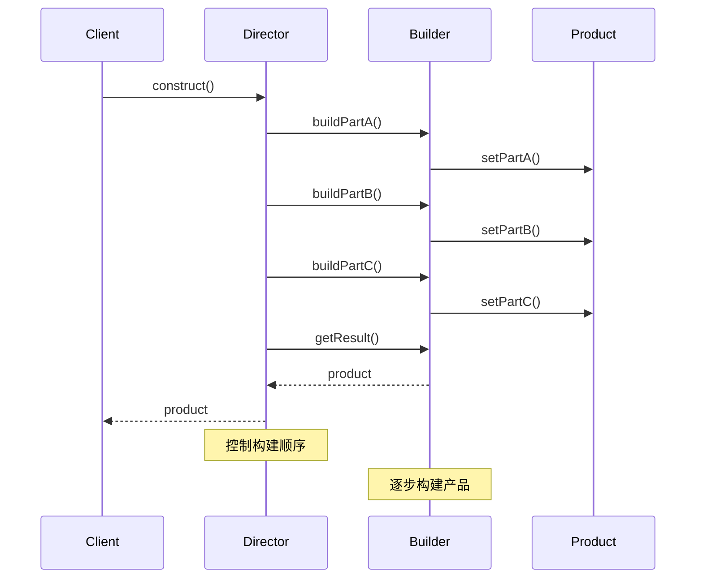
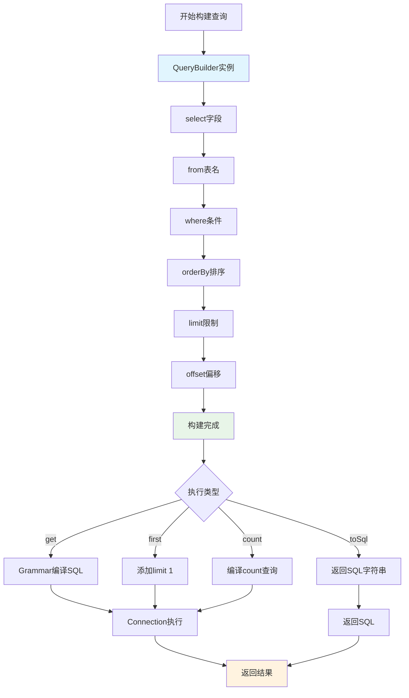
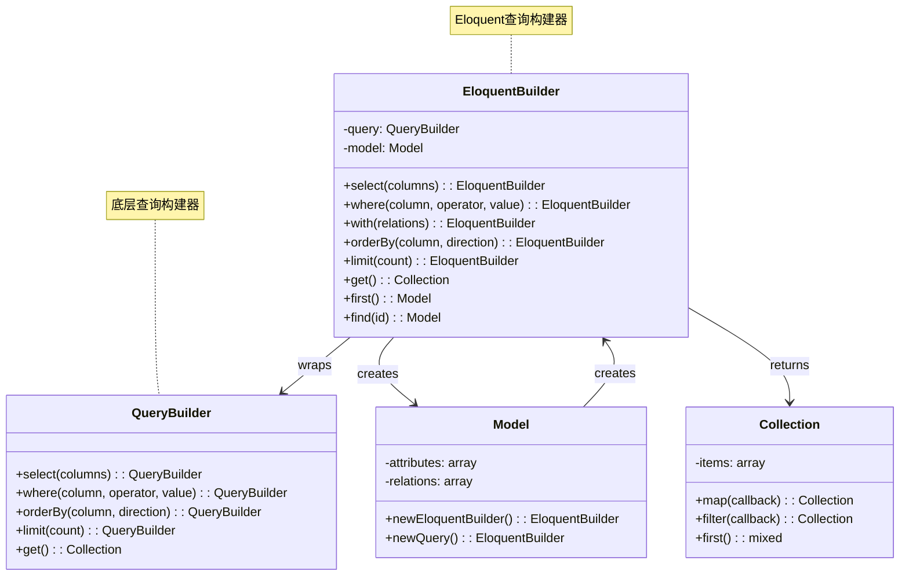
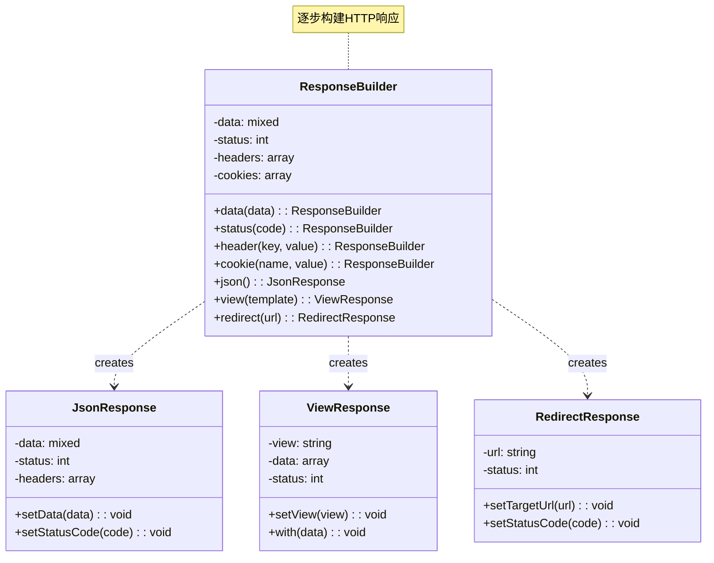
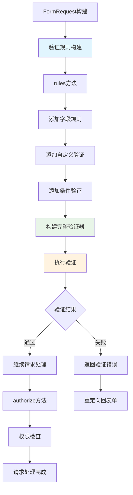

# 建造者模式 (Builder Pattern)

## 概述

建造者模式将一个复杂对象的构建与它的表示分离，使得同样的构建过程可以创建不同的表示。它通过一步一步构建复杂对象，最终返回完整的对象。

## 架构图

### 建造者模式类图


### Laravel 查询构建器架构


### 建造者模式时序图


### Laravel 查询构建流程


### Eloquent 查询构建器架构


### 响应构建器模式


### 表单请求构建器


## 设计意图

- **分离构建过程**：将复杂对象的构建过程与对象本身分离
- **逐步构建**：允许通过多个步骤构建复杂对象
- **灵活性**：相同的构建过程可以创建不同的产品
- **控制构建顺序**：确保对象构建的正确顺序

## Laravel 中的实现

### 1. 查询构建器 (Query Builder)

Laravel 的数据库查询构建器是建造者模式的经典实现：

```php
// Illuminate\Database\Query\Builder.php
class Builder
{
    protected $columns;
    protected $from;
    protected $wheres = [];
    protected $orders = [];
    protected $limit;
    protected $offset;
    
    // 逐步构建查询
    public function select($columns = ['*'])
    {
        $this->columns = is_array($columns) ? $columns : func_get_args();
        return $this;
    }
    
    public function from($table)
    {
        $this->from = $table;
        return $this;
    }
    
    public function where($column, $operator = null, $value = null, $boolean = 'and')
    {
        $this->wheres[] = compact('column', 'operator', 'value', 'boolean');
        return $this;
    }
    
    public function orderBy($column, $direction = 'asc')
    {
        $this->orders[] = compact('column', 'direction');
        return $this;
    }
    
    public function limit($value)
    {
        $this->limit = $value;
        return $this;
    }
    
    // 最终构建并执行查询
    public function get()
    {
        return $this->connection->select($this->toSql(), $this->getBindings());
    }
    
    public function toSql()
    {
        // 构建完整的 SQL 语句
        return $this->grammar->compileSelect($this);
    }
}
```

### 2. HTTP 客户端构建器

Laravel 的 HTTP 客户端也使用了建造者模式：

```php
// Illuminate\Http\Client\PendingRequest.php
class PendingRequest
{
    protected $baseUrl;
    protected $headers = [];
    protected $options = [];
    protected $cookies;
    
    public function baseUrl(string $url)
    {
        $this->baseUrl = $url;
        return $this;
    }
    
    public function withHeaders(array $headers)
    {
        $this->headers = array_merge($this->headers, $headers);
        return $this;
    }
    
    public function withOptions(array $options)
    {
        $this->options = array_merge($this->options, $options);
        return $this;
    }
    
    public function withCookies(array $cookies)
    {
        $this->cookies = $cookies;
        return $this;
    }
    
    // 最终构建并发送请求
    public function get(string $url, $query = null)
    {
        return $this->send('GET', $url, ['query' => $query]);
    }
    
    public function post(string $url, array $data = [])
    {
        return $this->send('POST', $url, ['form_params' => $data]);
    }
}
```

### 3. 邮件构建器

Laravel 的邮件系统使用了建造者模式来构建邮件消息：

```php
// Illuminate\Mail\Message.php
class Message
{
    protected $from;
    protected $to;
    protected $subject;
    protected $body;
    
    public function from($address, $name = null)
    {
        $this->from = compact('address', 'name');
        return $this;
    }
    
    public function to($address, $name = null)
    {
        $this->to = compact('address', 'name');
        return $this;
    }
    
    public function subject($subject)
    {
        $this->subject = $subject;
        return $this;
    }
    
    public function body($body)
    {
        $this->body = $body;
        return $this;
    }
    
    // 构建最终的邮件消息
    public function build()
    {
        return new Swift_Message($this->subject, $this->body);
    }
}
```

## 实际应用场景

### 1. 表单构建器

Laravel 的表单构建器使用了建造者模式：

```php
// Illuminate\Html\FormBuilder.php
class FormBuilder
{
    protected $model;
    protected $errors;
    
    public function open(array $options = [])
    {
        // 开始构建表单
        return '<form'.$this->html->attributes($options).'>';
    }
    
    public function text($name, $value = null, $options = [])
    {
        // 构建文本输入框
        return $this->input('text', $name, $value, $options);
    }
    
    public function select($name, $list = [], $selected = null, $options = [])
    {
        // 构建下拉选择框
        $options = $this->html->attributes($options);
        $html = [];
        
        foreach ($list as $value => $display) {
            $html[] = $this->getSelectOption($display, $value, $selected);
        }
        
        return '<select name="'.$name.'"'.$options.'>'.implode('', $html).'</select>';
    }
    
    public function close()
    {
        // 结束表单构建
        return '</form>';
    }
}
```

### 2. 路由构建器

Laravel 的路由系统使用了建造者模式：

```php
// Illuminate\Routing\RouteRegistrar.php
class RouteRegistrar
{
    protected $router;
    protected $attributes = [];
    
    public function prefix($prefix)
    {
        $this->attributes['prefix'] = $prefix;
        return $this;
    }
    
    public function middleware($middleware)
    {
        $this->attributes['middleware'] = $middleware;
        return $this;
    }
    
    public function namespace($namespace)
    {
        $this->attributes['namespace'] = $namespace;
        return $this;
    }
    
    public function name($name)
    {
        $this->attributes['name'] = $name;
        return $this;
    }
    
    // 最终注册路由
    public function group($callback)
    {
        $this->router->group($this->attributes, $callback);
    }
}
```

### 3. 配置构建器

配置系统的构建器模式：

```php
// Illuminate\Config\Repository.php
class Repository implements ArrayAccess
{
    protected $items = [];
    
    public function set($key, $value = null)
    {
        if (is_array($key)) {
            foreach ($key as $innerKey => $innerValue) {
                $this->set($innerKey, $innerValue);
            }
        } else {
            $this->items[$key] = $value;
        }
        
        return $this;
    }
    
    public function prepend($key, $value)
    {
        $array = $this->get($key, []);
        array_unshift($array, $value);
        $this->set($key, $array);
        
        return $this;
    }
    
    public function push($key, $value)
    {
        $array = $this->get($key, []);
        $array[] = $value;
        $this->set($key, $array);
        
        return $this;
    }
}
```

## 源码分析要点

### 1. 流式接口 (Fluent Interface)

建造者模式在 Laravel 中通常表现为流式接口：

```php
// 流式调用示例
$query = DB::table('users')
    ->select('name', 'email')
    ->where('active', true)
    ->orderBy('name')
    ->limit(10)
    ->get();
```

### 2. 方法链的实现原理

每个构建方法都返回 `$this`，实现方法链：

```php
public function method1()
{
    // 执行操作
    return $this; // 返回自身以实现链式调用
}

public function method2()
{
    // 执行操作
    return $this;
}
```

### 3. 最终构建方法

建造者模式通常有一个最终构建方法：

```php
public function build()
{
    // 验证构建参数
    $this->validate();
    
    // 创建最终对象
    return new Product($this->attributes);
}
```

## 最佳实践

### 1. 合理使用建造者模式

**适用场景：**
- 创建复杂对象，需要多个步骤
- 对象有多个可选参数
- 希望提供清晰的构建接口
- 需要控制构建过程

**不适用场景：**
- 对象构建过程简单
- 对象参数较少且固定

### 2. Laravel 中的建造者实践

**利用方法链：**
```php
class ProductBuilder
{
    public function withName($name)
    {
        $this->name = $name;
        return $this;
    }
    
    public function withPrice($price)
    {
        $this->price = $price;
        return $this;
    }
    
    public function build()
    {
        return new Product($this->name, $this->price);
    }
}

// 使用示例
$product = (new ProductBuilder())
    ->withName('Laptop')
    ->withPrice(999.99)
    ->build();
```

**提供默认值：**
```php
class ConfigBuilder
{
    protected $config = [
        'timeout' => 30,
        'retries' => 3,
        'debug' => false,
    ];
    
    public function withTimeout($timeout)
    {
        $this->config['timeout'] = $timeout;
        return $this;
    }
    
    public function build()
    {
        return new Config($this->config);
    }
}
```

### 3. 测试建造者模式

**测试构建过程：**
```php
public function test_builder_creates_correct_product()
{
    $builder = new ProductBuilder();
    
    $product = $builder
        ->withName('Test Product')
        ->withPrice(100)
        ->build();
    
    $this->assertEquals('Test Product', $product->getName());
    $this->assertEquals(100, $product->getPrice());
}
```

**测试方法链：**
```php
public function test_builder_method_chaining()
{
    $builder = new ProductBuilder();
    
    $result = $builder
        ->withName('Product')
        ->withPrice(50);
    
    $this->assertInstanceOf(ProductBuilder::class, $result);
}
```

## 与其他模式的关系

### 1. 与工厂模式

建造者模式关注构建过程，工厂模式关注产品创建：

```php
// 工厂模式：直接创建产品
class ProductFactory 
{
    public function create($type) 
    {
        return new $type();
    }
}

// 建造者模式：逐步构建产品
class ProductBuilder 
{
    public function build() 
    {
        // 复杂的构建逻辑
        return new Product($this->attributes);
    }
}
```

### 2. 与组合模式

建造者模式可以用于构建组合对象：

```php
class CompositeBuilder 
{
    protected $components = [];
    
    public function addComponent($component) 
    {
        $this->components[] = $component;
        return $this;
    }
    
    public function build() 
    {
        $composite = new Composite();
        
        foreach ($this->components as $component) {
            $composite->add($component);
        }
        
        return $composite;
    }
}
```

### 3. 与原型模式

建造者模式可以与原型模式结合：

```php
class PrototypeBuilder 
{
    protected $prototype;
    
    public function __construct(Prototype $prototype) 
    {
        $this->prototype = $prototype;
    }
    
    public function customize($properties) 
    {
        foreach ($properties as $key => $value) {
            $this->prototype->$key = $value;
        }
        return $this;
    }
    
    public function build() 
    {
        return clone $this->prototype;
    }
}
```

## 性能考虑

### 1. 对象创建开销

建造者模式涉及多次方法调用，在性能敏感的场景需要注意：

```php
// 优化：批量设置属性
class OptimizedBuilder 
{
    protected $attributes = [];
    
    public function withAttributes(array $attributes) 
    {
        $this->attributes = array_merge($this->attributes, $attributes);
        return $this;
    }
    
    public function build() 
    {
        return new Product($this->attributes);
    }
}
```

### 2. 内存使用

建造者模式在构建过程中会占用额外内存：

```php
// 使用轻量级构建器
class LightweightBuilder 
{
    public static function createProduct($name, $price) 
    {
        // 直接创建，避免构建器实例
        return new Product($name, $price);
    }
}
```

## 总结

建造者模式是 Laravel 框架中非常重要的设计模式，特别是在查询构建器、HTTP客户端、邮件系统等组件中。它通过提供清晰的流式接口，使得复杂对象的构建过程变得简单直观。

建造者模式的优势在于：
- **清晰的构建过程**：逐步构建，易于理解
- **灵活性**：可以创建不同的产品变体
- **可维护性**：构建逻辑集中管理
- **可测试性**：易于测试构建过程

在 Laravel 开发中，合理使用建造者模式可以创建出优雅、易用的 API，特别是在需要构建复杂对象或配置的场景中。