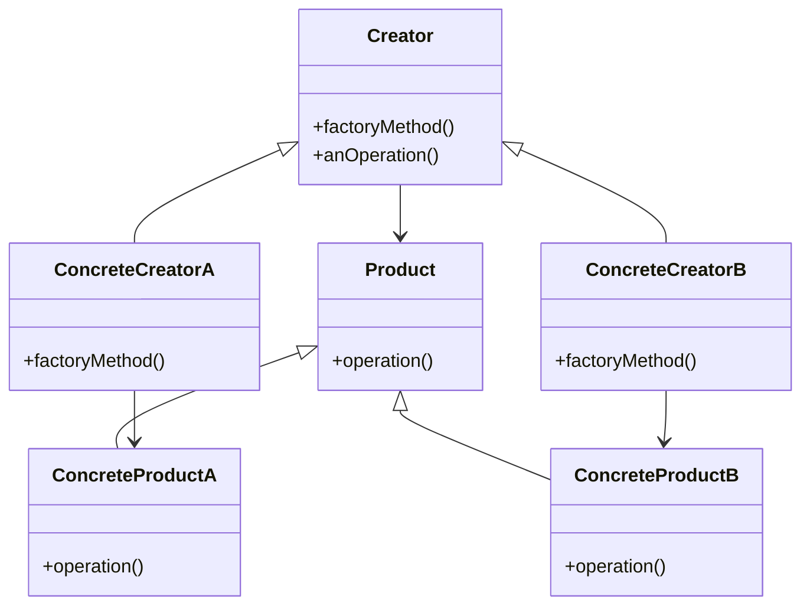
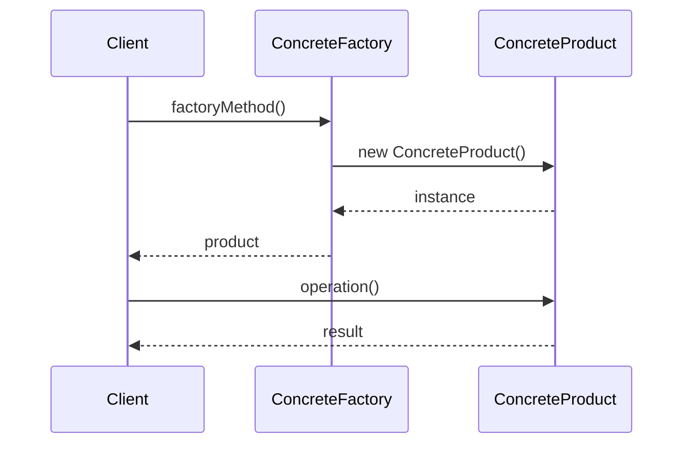

# 工厂方法模式 (Factory Method Pattern)

## 概述

工厂方法模式定义了一个创建对象的接口，但由子类决定要实例化的类是哪一个。工厂方法让类把实例化推迟到子类。

## 问题场景

在Laravel应用中，我们经常需要：
- 根据不同条件创建不同类型的对象
- 创建复杂对象时需要封装创建逻辑
- 需要在运行时决定创建哪种类型的对象
- 希望将对象创建和使用分离

## 解决方案

工厂方法模式通过定义一个创建对象的接口，让子类决定实例化哪个类，从而将对象的创建延迟到子类中。

## UML类图



## Laravel实现

### 1. 通知工厂示例

```php
<?php

namespace App\Patterns\FactoryMethod;

// 通知产品接口
interface NotificationInterface
{
    public function send(string $message, string $recipient): bool;
    public function getType(): string;
}

// 邮件通知产品
class EmailNotification implements NotificationInterface
{
    public function send(string $message, string $recipient): bool
    {
        echo "Sending email to {$recipient}: {$message}\n";
        
        // 使用Laravel的邮件功能
        \Mail::raw($message, function ($mail) use ($recipient) {
            $mail->to($recipient)->subject('通知');
        });
        
        return true;
    }
    
    public function getType(): string
    {
        return 'email';
    }
}

// 短信通知产品
class SmsNotification implements NotificationInterface
{
    public function send(string $message, string $recipient): bool
    {
        echo "Sending SMS to {$recipient}: {$message}\n";
        
        // 调用短信服务API
        // SmsService::send($recipient, $message);
        
        return true;
    }
    
    public function getType(): string
    {
        return 'sms';
    }
}

// 推送通知产品
class PushNotification implements NotificationInterface
{
    public function send(string $message, string $recipient): bool
    {
        echo "Sending push notification to {$recipient}: {$message}\n";
        
        // 调用推送服务
        // PushService::send($recipient, $message);
        
        return true;
    }
    
    public function getType(): string
    {
        return 'push';
    }
}

// 抽象通知工厂
abstract class NotificationFactory
{
    // 工厂方法 - 由子类实现
    abstract public function createNotification(): NotificationInterface;
    
    // 模板方法 - 使用工厂方法
    public function notify(string $message, string $recipient): bool
    {
        $notification = $this->createNotification();
        
        echo "Using {$notification->getType()} notification factory\n";
        
        return $notification->send($message, $recipient);
    }
}

// 邮件通知工厂
class EmailNotificationFactory extends NotificationFactory
{
    public function createNotification(): NotificationInterface
    {
        return new EmailNotification();
    }
}

// 短信通知工厂
class SmsNotificationFactory extends NotificationFactory
{
    public function createNotification(): NotificationInterface
    {
        return new SmsNotification();
    }
}

// 推送通知工厂
class PushNotificationFactory extends NotificationFactory
{
    public function createNotification(): NotificationInterface
    {
        return new PushNotification();
    }
}
```

### 2. 支付处理器工厂示例

```php
<?php

namespace App\Patterns\FactoryMethod;

// 支付处理器接口
interface PaymentProcessorInterface
{
    public function processPayment(float $amount, array $paymentData): array;
    public function refund(string $transactionId, float $amount): array;
    public function getProviderName(): string;
}

// 支付宝处理器
class AlipayProcessor implements PaymentProcessorInterface
{
    private string $appId;
    private string $privateKey;
    
    public function __construct(string $appId, string $privateKey)
    {
        $this->appId = $appId;
        $this->privateKey = $privateKey;
    }
    
    public function processPayment(float $amount, array $paymentData): array
    {
        echo "Processing Alipay payment: ¥{$amount}\n";
        
        // 支付宝支付逻辑
        return [
            'status' => 'success',
            'transaction_id' => 'alipay_' . uniqid(),
            'amount' => $amount,
            'provider' => 'alipay'
        ];
    }
    
    public function refund(string $transactionId, float $amount): array
    {
        echo "Processing Alipay refund: {$transactionId}, ¥{$amount}\n";
        
        return [
            'status' => 'success',
            'refund_id' => 'refund_' . uniqid(),
            'amount' => $amount
        ];
    }
    
    public function getProviderName(): string
    {
        return 'Alipay';
    }
}

// 微信支付处理器
class WechatPayProcessor implements PaymentProcessorInterface
{
    private string $merchantId;
    private string $apiKey;
    
    public function __construct(string $merchantId, string $apiKey)
    {
        $this->merchantId = $merchantId;
        $this->apiKey = $apiKey;
    }
    
    public function processPayment(float $amount, array $paymentData): array
    {
        echo "Processing WeChat Pay payment: ¥{$amount}\n";
        
        // 微信支付逻辑
        return [
            'status' => 'success',
            'transaction_id' => 'wechat_' . uniqid(),
            'amount' => $amount,
            'provider' => 'wechat'
        ];
    }
    
    public function refund(string $transactionId, float $amount): array
    {
        echo "Processing WeChat Pay refund: {$transactionId}, ¥{$amount}\n";
        
        return [
            'status' => 'success',
            'refund_id' => 'refund_' . uniqid(),
            'amount' => $amount
        ];
    }
    
    public function getProviderName(): string
    {
        return 'WeChat Pay';
    }
}

// PayPal处理器
class PaypalProcessor implements PaymentProcessorInterface
{
    private string $clientId;
    private string $clientSecret;
    
    public function __construct(string $clientId, string $clientSecret)
    {
        $this->clientId = $clientId;
        $this->clientSecret = $clientSecret;
    }
    
    public function processPayment(float $amount, array $paymentData): array
    {
        echo "Processing PayPal payment: \${$amount}\n";
        
        // PayPal支付逻辑
        return [
            'status' => 'success',
            'transaction_id' => 'paypal_' . uniqid(),
            'amount' => $amount,
            'provider' => 'paypal'
        ];
    }
    
    public function refund(string $transactionId, float $amount): array
    {
        echo "Processing PayPal refund: {$transactionId}, \${$amount}\n";
        
        return [
            'status' => 'success',
            'refund_id' => 'refund_' . uniqid(),
            'amount' => $amount
        ];
    }
    
    public function getProviderName(): string
    {
        return 'PayPal';
    }
}

// 抽象支付工厂
abstract class PaymentProcessorFactory
{
    // 工厂方法
    abstract public function createProcessor(): PaymentProcessorInterface;
    
    // 处理支付的模板方法
    public function processPayment(float $amount, array $paymentData): array
    {
        $processor = $this->createProcessor();
        
        echo "Using {$processor->getProviderName()} payment processor\n";
        
        // 可以在这里添加通用的支付前后处理逻辑
        $this->logPaymentAttempt($amount, $processor->getProviderName());
        
        $result = $processor->processPayment($amount, $paymentData);
        
        $this->logPaymentResult($result);
        
        return $result;
    }
    
    protected function logPaymentAttempt(float $amount, string $provider): void
    {
        \Log::info("Payment attempt", [
            'amount' => $amount,
            'provider' => $provider,
            'timestamp' => now()
        ]);
    }
    
    protected function logPaymentResult(array $result): void
    {
        \Log::info("Payment result", $result);
    }
}

// 支付宝工厂
class AlipayProcessorFactory extends PaymentProcessorFactory
{
    public function createProcessor(): PaymentProcessorInterface
    {
        return new AlipayProcessor(
            config('payment.alipay.app_id'),
            config('payment.alipay.private_key')
        );
    }
}

// 微信支付工厂
class WechatPayProcessorFactory extends PaymentProcessorFactory
{
    public function createProcessor(): PaymentProcessorInterface
    {
        return new WechatPayProcessor(
            config('payment.wechat.merchant_id'),
            config('payment.wechat.api_key')
        );
    }
}

// PayPal工厂
class PaypalProcessorFactory extends PaymentProcessorFactory
{
    public function createProcessor(): PaymentProcessorInterface
    {
        return new PaypalProcessor(
            config('payment.paypal.client_id'),
            config('payment.paypal.client_secret')
        );
    }
}
```

### 3. 数据库连接工厂示例

```php
<?php

namespace App\Patterns\FactoryMethod;

// 数据库连接接口
interface DatabaseConnectionInterface
{
    public function connect(): void;
    public function query(string $sql): array;
    public function close(): void;
    public function getConnectionInfo(): array;
}

// MySQL连接
class MysqlConnection implements DatabaseConnectionInterface
{
    private array $config;
    private $connection = null;
    
    public function __construct(array $config)
    {
        $this->config = $config;
    }
    
    public function connect(): void
    {
        echo "Connecting to MySQL database...\n";
        
        $dsn = "mysql:host={$this->config['host']};dbname={$this->config['database']};charset=utf8mb4";
        $this->connection = new \PDO($dsn, $this->config['username'], $this->config['password']);
        
        echo "MySQL connection established\n";
    }
    
    public function query(string $sql): array
    {
        echo "Executing MySQL query: {$sql}\n";
        
        if (!$this->connection) {
            $this->connect();
        }
        
        $stmt = $this->connection->prepare($sql);
        $stmt->execute();
        
        return $stmt->fetchAll(\PDO::FETCH_ASSOC);
    }
    
    public function close(): void
    {
        $this->connection = null;
        echo "MySQL connection closed\n";
    }
    
    public function getConnectionInfo(): array
    {
        return [
            'type' => 'mysql',
            'host' => $this->config['host'],
            'database' => $this->config['database']
        ];
    }
}

// PostgreSQL连接
class PostgresqlConnection implements DatabaseConnectionInterface
{
    private array $config;
    private $connection = null;
    
    public function __construct(array $config)
    {
        $this->config = $config;
    }
    
    public function connect(): void
    {
        echo "Connecting to PostgreSQL database...\n";
        
        $dsn = "pgsql:host={$this->config['host']};dbname={$this->config['database']}";
        $this->connection = new \PDO($dsn, $this->config['username'], $this->config['password']);
        
        echo "PostgreSQL connection established\n";
    }
    
    public function query(string $sql): array
    {
        echo "Executing PostgreSQL query: {$sql}\n";
        
        if (!$this->connection) {
            $this->connect();
        }
        
        $stmt = $this->connection->prepare($sql);
        $stmt->execute();
        
        return $stmt->fetchAll(\PDO::FETCH_ASSOC);
    }
    
    public function close(): void
    {
        $this->connection = null;
        echo "PostgreSQL connection closed\n";
    }
    
    public function getConnectionInfo(): array
    {
        return [
            'type' => 'postgresql',
            'host' => $this->config['host'],
            'database' => $this->config['database']
        ];
    }
}

// SQLite连接
class SqliteConnection implements DatabaseConnectionInterface
{
    private array $config;
    private $connection = null;
    
    public function __construct(array $config)
    {
        $this->config = $config;
    }
    
    public function connect(): void
    {
        echo "Connecting to SQLite database...\n";
        
        $this->connection = new \PDO("sqlite:{$this->config['database']}");
        
        echo "SQLite connection established\n";
    }
    
    public function query(string $sql): array
    {
        echo "Executing SQLite query: {$sql}\n";
        
        if (!$this->connection) {
            $this->connect();
        }
        
        $stmt = $this->connection->prepare($sql);
        $stmt->execute();
        
        return $stmt->fetchAll(\PDO::FETCH_ASSOC);
    }
    
    public function close(): void
    {
        $this->connection = null;
        echo "SQLite connection closed\n";
    }
    
    public function getConnectionInfo(): array
    {
        return [
            'type' => 'sqlite',
            'database' => $this->config['database']
        ];
    }
}

// 抽象数据库工厂
abstract class DatabaseConnectionFactory
{
    // 工厂方法
    abstract public function createConnection(): DatabaseConnectionInterface;
    
    // 执行查询的模板方法
    public function executeQuery(string $sql): array
    {
        $connection = $this->createConnection();
        $info = $connection->getConnectionInfo();
        
        echo "Using {$info['type']} database connection\n";
        
        try {
            $result = $connection->query($sql);
            return $result;
        } finally {
            $connection->close();
        }
    }
}

// MySQL工厂
class MysqlConnectionFactory extends DatabaseConnectionFactory
{
    public function createConnection(): DatabaseConnectionInterface
    {
        return new MysqlConnection(config('database.connections.mysql'));
    }
}

// PostgreSQL工厂
class PostgresqlConnectionFactory extends DatabaseConnectionFactory
{
    public function createConnection(): DatabaseConnectionInterface
    {
        return new PostgresqlConnection(config('database.connections.pgsql'));
    }
}

// SQLite工厂
class SqliteConnectionFactory extends DatabaseConnectionFactory
{
    public function createConnection(): DatabaseConnectionInterface
    {
        return new SqliteConnection(config('database.connections.sqlite'));
    }
}
```

## 使用示例

### 通知工厂使用

```php
<?php

// 根据用户偏好选择通知方式
function sendNotification(string $type, string $message, string $recipient)
{
    $factory = match ($type) {
        'email' => new EmailNotificationFactory(),
        'sms' => new SmsNotificationFactory(),
        'push' => new PushNotificationFactory(),
        default => throw new \InvalidArgumentException("Unknown notification type: {$type}")
    };
    
    return $factory->notify($message, $recipient);
}

// 使用示例
sendNotification('email', 'Hello World!', 'user@example.com');
sendNotification('sms', 'Urgent notification', '+1234567890');
sendNotification('push', 'New message', 'user123');
```

### 支付处理器使用

```php
<?php

class PaymentService
{
    public function processPayment(string $provider, float $amount, array $paymentData): array
    {
        $factory = $this->getPaymentFactory($provider);
        
        return $factory->processPayment($amount, $paymentData);
    }
    
    private function getPaymentFactory(string $provider): PaymentProcessorFactory
    {
        return match ($provider) {
            'alipay' => new AlipayProcessorFactory(),
            'wechat' => new WechatPayProcessorFactory(),
            'paypal' => new PaypalProcessorFactory(),
            default => throw new \InvalidArgumentException("Unsupported payment provider: {$provider}")
        };
    }
}

// 使用示例
$paymentService = new PaymentService();

$result1 = $paymentService->processPayment('alipay', 100.00, ['order_id' => '12345']);
$result2 = $paymentService->processPayment('wechat', 50.00, ['order_id' => '12346']);
$result3 = $paymentService->processPayment('paypal', 75.00, ['order_id' => '12347']);
```

### 数据库连接使用

```php
<?php

class DatabaseService
{
    public function queryData(string $dbType, string $sql): array
    {
        $factory = $this->getDatabaseFactory($dbType);
        
        return $factory->executeQuery($sql);
    }
    
    private function getDatabaseFactory(string $dbType): DatabaseConnectionFactory
    {
        return match ($dbType) {
            'mysql' => new MysqlConnectionFactory(),
            'postgresql' => new PostgresqlConnectionFactory(),
            'sqlite' => new SqliteConnectionFactory(),
            default => throw new \InvalidArgumentException("Unsupported database type: {$dbType}")
        };
    }
}

// 使用示例
$dbService = new DatabaseService();

$users = $dbService->queryData('mysql', 'SELECT * FROM users LIMIT 10');
$posts = $dbService->queryData('postgresql', 'SELECT * FROM posts WHERE published = true');
$logs = $dbService->queryData('sqlite', 'SELECT * FROM logs ORDER BY created_at DESC LIMIT 100');
```

## Laravel中的实际应用

### 1. 服务容器和绑定

```php
<?php

// Laravel的服务容器使用工厂方法模式
app()->bind('payment.processor', function ($app) {
    $provider = config('payment.default');
    
    return match ($provider) {
        'alipay' => new AlipayProcessor(/* config */),
        'wechat' => new WechatPayProcessor(/* config */),
        'paypal' => new PaypalProcessor(/* config */),
    };
});

// 使用
$processor = app('payment.processor');
```

### 2. 数据库连接管理

```php
<?php

// Laravel的数据库管理器使用工厂方法
class DatabaseManager
{
    public function connection($name = null)
    {
        $name = $name ?: $this->getDefaultConnection();
        
        return $this->makeConnection($name);
    }
    
    protected function makeConnection($name)
    {
        $config = $this->getConfig($name);
        
        return match ($config['driver']) {
            'mysql' => $this->createMysqlConnection($config),
            'pgsql' => $this->createPostgresConnection($config),
            'sqlite' => $this->createSqliteConnection($config),
        };
    }
}
```

### 3. 邮件驱动工厂

```php
<?php

// Laravel的邮件管理器
class MailManager
{
    public function driver($driver = null)
    {
        $driver = $driver ?: $this->getDefaultDriver();
        
        return $this->createDriver($driver);
    }
    
    protected function createDriver($driver)
    {
        $config = $this->getConfig($driver);
        
        return match ($driver) {
            'smtp' => $this->createSmtpDriver($config),
            'mailgun' => $this->createMailgunDriver($config),
            'ses' => $this->createSesDriver($config),
        };
    }
}
```

## 时序图



## 优点

1. **解耦创建和使用**：客户端不需要知道具体产品类
2. **遵循开闭原则**：添加新产品时不需要修改现有代码
3. **单一职责**：每个工厂负责创建一种产品
4. **易于扩展**：可以轻松添加新的产品类型

## 缺点

1. **增加类的数量**：每个产品都需要对应的工厂类
2. **增加系统复杂性**：引入了额外的抽象层

## 适用场景

1. **需要在运行时决定创建哪种对象**
2. **系统需要独立于产品的创建过程**
3. **需要提供一组相关对象的创建**
4. **希望将对象创建的责任委托给子类**

## 与其他模式的关系

- **抽象工厂模式**：工厂方法创建一种产品，抽象工厂创建一族产品
- **模板方法模式**：工厂方法常作为模板方法的一部分
- **原型模式**：可以用原型模式来实现工厂方法

工厂方法模式在Laravel中应用极其广泛，是框架设计的核心模式之一。