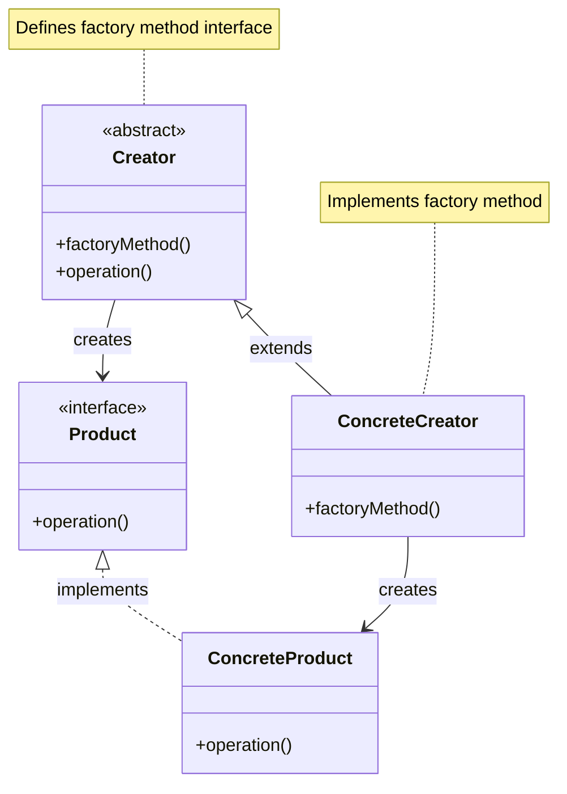
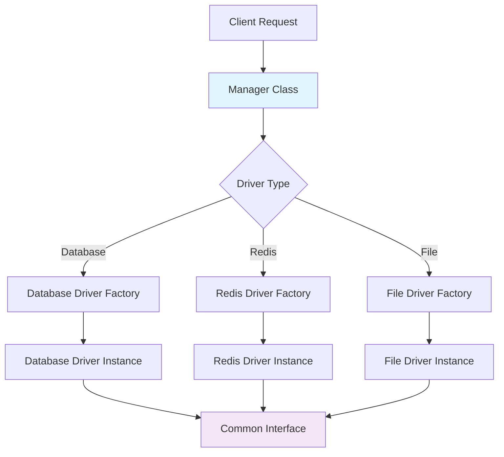

# Factory Method Pattern

## Overview

Define an interface for creating an object, but let subclasses decide which class to instantiate. The Factory Method pattern provides a way to delegate the instantiation logic to child classes.

## Architecture Diagram

### Factory Method Pattern Structure



### Laravel Manager Pattern Implementation



### Factory Method Flow

```mermaid
sequenceDiagram
    participant Client
    participant CacheManager
    participant RedisFactory
    participant RedisStore
    
    Client->>CacheManager: store('redis')
    CacheManager->>CacheManager: createRedisDriver()
    CacheManager->>RedisFactory: create(config)
    RedisFactory->>RedisStore: new RedisStore()
    RedisStore-->>RedisFactory: instance
    RedisFactory-->>CacheManager: driver instance
    CacheManager-->>Client: cache store
    
    note over RedisFactory method creates specific driver
```

## Implementation in Laravel

### 1. Cache Manager Factory

Laravel's Cache Manager uses the Factory Method pattern to create different cache drivers:

```php
// Illuminate\Cache\CacheManager.php
abstract class Manager
{
    abstract protected function createDriver($driver);
    
    public function driver($driver = null)
    {
        $driver = $driver ?: $this->getDefaultDriver();
        
        if (is_null($driver)) {
            throw new InvalidArgumentException(sprintf(
                'Unable to resolve NULL driver for [%s].', static::class
            ));
        }
        
        if (! isset($this->drivers[$driver])) {
            $this->drivers[$driver] = $this->createDriver($driver);
        }
        
        return $this->drivers[$driver];
    }
}

class CacheManager extends Manager implements FactoryContract
{
    protected function createRedisDriver(array $config)
    {
        $redis = $this->app['redis'];
        $connection = $config['connection'] ?? 'default';
        
        return $this->repository(new RedisStore($redis, $this->getPrefix($config), $connection));
    }
    
    protected function createFileDriver(array $config)
    {
        return $this->repository(new FileStore($this->app['files'], $config['path']));
    }
}
```

### 2. Database Manager Factory

```php
// Illuminate\Database\DatabaseManager.php
class DatabaseManager implements ConnectionResolverInterface
{
    protected function makeConnection($name)
    {
        $config = $this->configuration($name);
        
        if (isset($this->extensions[$name])) {
            return call_user_func($this->extensions[$name], $config, $name);
        }
        
        if (isset($this->extensions[$driver = $config['driver']])) {
            return call_user_func($this->extensions[$driver], $config, $name);
        }
        
        return $this->factory->make($config, $name);
    }
}
```

### 3. Notification Channel Factory

```php
// Illuminate\Notifications\ChannelManager.php
class ChannelManager extends Manager
{
    protected function createMailDriver()
    {
        return $this->app->make(MailChannel::class);
    }
    
    protected function createDatabaseDriver()
    {
        return $this->app->make(DatabaseChannel::class);
    }
    
    protected function createSlackDriver()
    {
        return new SlackChannel(
            new Client, $this->app->make(LoggerInterface::class)
        );
    }
}
```