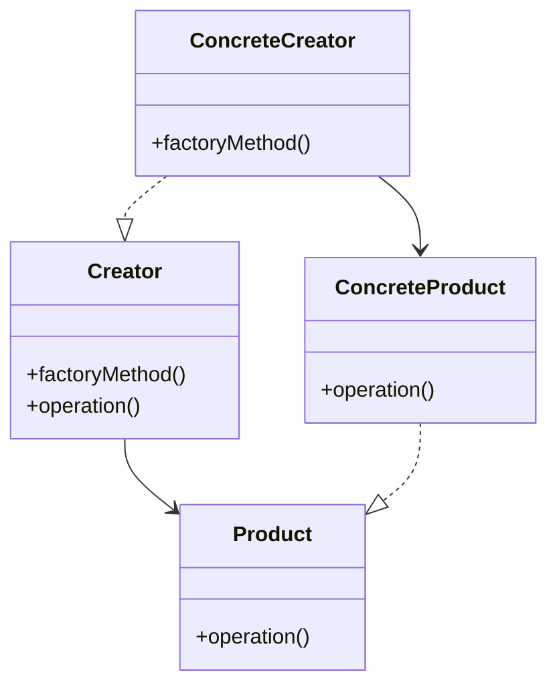
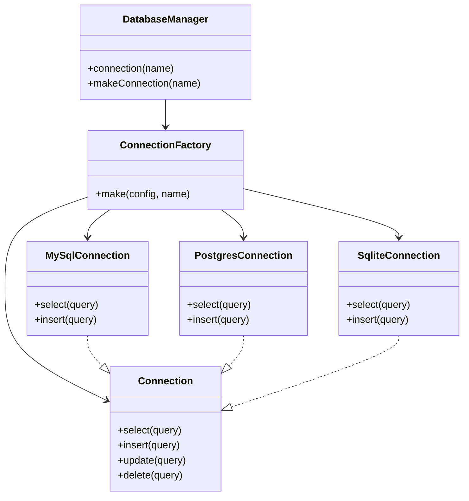
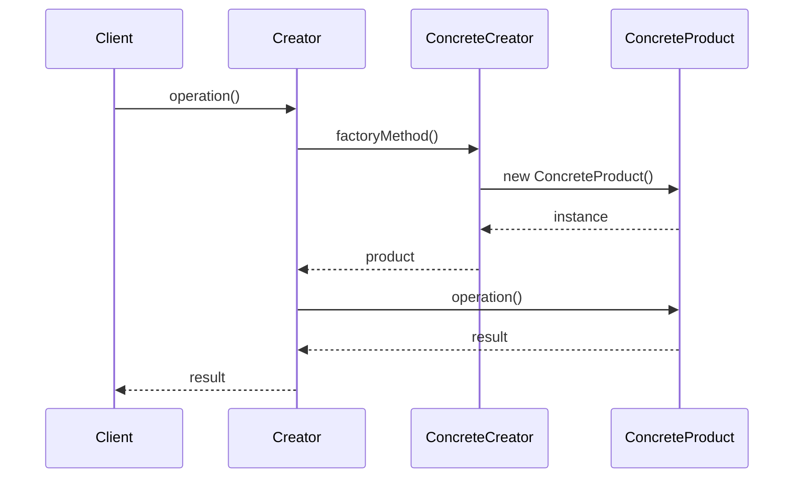
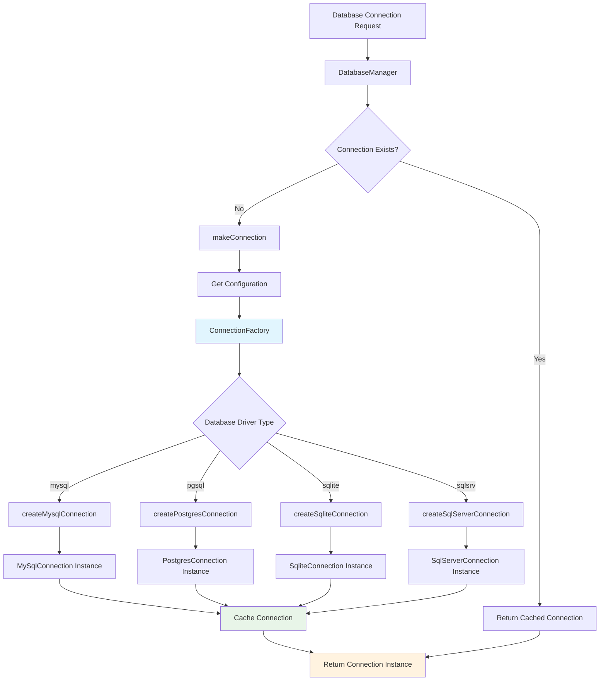
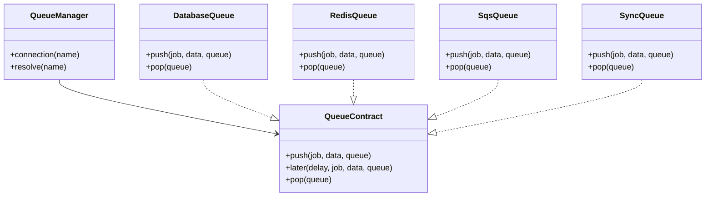

# Factory Method Pattern

## Overview

Factory Method pattern defines an interface for creating an object, but lets subclasses decide which class to instantiate. Factory Method lets a class defer instantiation to subclasses.

## Problem Scenarios

In Laravel applications, we often need:
- Create different types of objects based on different conditions
- Encapsulate creation logic when creating complex objects
- Decide which type of object to create at runtime
- Separate object creation from usage

## Solution

Factory Method pattern defines an interface for creating objects and lets subclasses decide which class to instantiate, thereby deferring object creation to subclasses.

## Architecture Diagrams

### Factory Method Pattern Class Diagram


### Laravel Database Connection Factory Architecture


## Laravel Implementation

### 1. Notification Factory Example

```php
<?php

namespace App\Patterns\FactoryMethod;

// Notification product interface
interface NotificationInterface
{
    public function send(string $message, string $recipient): bool;
    public function getType(): string;
}

// Email notification product
class EmailNotification implements NotificationInterface
{
    public function send(string $message, string $recipient): bool
    {
        echo "Sending email to {$recipient}: {$message}\n";
        
        // Use Laravel's mail functionality
        \Mail::raw($message, function ($mail) use ($recipient) {
            $mail->to($recipient)->subject('Notification');
        });
        
        return true;
    }
    
    public function getType(): string
    {
        return 'email';
    }
}

// SMS notification product
class SmsNotification implements NotificationInterface
{
    public function send(string $message, string $recipient): bool
    {
        echo "Sending SMS to {$recipient}: {$message}\n";
        
        // Call SMS service API
        // SmsService::send($recipient, $message);
        
        return true;
    }
    
    public function getType(): string
    {
        return 'sms';
    }
}

// Abstract notification factory
abstract class NotificationFactory
{
    // Factory method - implemented by subclasses
    abstract public function createNotification(): NotificationInterface;
    
    // Template method - uses factory method
    public function notify(string $message, string $recipient): bool
    {
        $notification = $this->createNotification();
        
        echo "Using {$notification->getType()} notification factory\n";
        
        return $notification->send($message, $recipient);
    }
}

// Email notification factory
class EmailNotificationFactory extends NotificationFactory
{
    public function createNotification(): NotificationInterface
    {
        return new EmailNotification();
    }
}

// SMS notification factory
class SmsNotificationFactory extends NotificationFactory
{
    public function createNotification(): NotificationInterface
    {
        return new SmsNotification();
    }
}
```

### 2. Payment Processor Factory Example

```php
<?php

namespace App\Patterns\FactoryMethod;

// Payment processor interface
interface PaymentProcessorInterface
{
    public function processPayment(float $amount, array $paymentData): array;
    public function getProviderName(): string;
}

// Alipay processor
class AlipayProcessor implements PaymentProcessorInterface
{
    public function processPayment(float $amount, array $paymentData): array
    {
        echo "Processing Alipay payment: ¥{$amount}\n";
        
        return [
            'status' => 'success',
            'transaction_id' => 'alipay_' . uniqid(),
            'amount' => $amount,
            'provider' => 'alipay'
        ];
    }
    
    public function getProviderName(): string
    {
        return 'Alipay';
    }
}

// WeChat Pay processor
class WechatPayProcessor implements PaymentProcessorInterface
{
    public function processPayment(float $amount, array $paymentData): array
    {
        echo "Processing WeChat Pay payment: ¥{$amount}\n";
        
        return [
            'status' => 'success',
            'transaction_id' => 'wechat_' . uniqid(),
            'amount' => $amount,
            'provider' => 'wechat'
        ];
    }
    
    public function getProviderName(): string
    {
        return 'WeChat Pay';
    }
}

// Abstract payment factory
abstract class PaymentProcessorFactory
{
    // Factory method
    abstract public function createProcessor(): PaymentProcessorInterface;
    
    // Template method for processing payment
    public function processPayment(float $amount, array $paymentData): array
    {
        $processor = $this->createProcessor();
        
        echo "Using {$processor->getProviderName()} payment processor\n";
        
        return $processor->processPayment($amount, $paymentData);
    }
}

// Alipay factory
class AlipayProcessorFactory extends PaymentProcessorFactory
{
    public function createProcessor(): PaymentProcessorInterface
    {
        return new AlipayProcessor();
    }
}

// WeChat Pay factory
class WechatPayProcessorFactory extends PaymentProcessorFactory
{
    public function createProcessor(): PaymentProcessorInterface
    {
        return new WechatPayProcessor();
    }
}
```

## Usage Examples

### Notification Factory Usage

```php
<?php

// Select notification method based on user preference
function sendNotification(string $type, string $message, string $recipient)
{
    $factory = match ($type) {
        'email' => new EmailNotificationFactory(),
        'sms' => new SmsNotificationFactory(),
        default => throw new \InvalidArgumentException("Unknown notification type: {$type}")
    };
    
    return $factory->notify($message, $recipient);
}

// Usage examples
sendNotification('email', 'Hello World!', 'user@example.com');
sendNotification('sms', 'Urgent notification', '+1234567890');
```

### Payment Processor Usage

```php
<?php

class PaymentService
{
    public function processPayment(string $provider, float $amount, array $paymentData): array
    {
        $factory = $this->getPaymentFactory($provider);
        
        return $factory->processPayment($amount, $paymentData);
    }
    
    private function getPaymentFactory(string $provider): PaymentProcessorFactory
    {
        return match ($provider) {
            'alipay' => new AlipayProcessorFactory(),
            'wechat' => new WechatPayProcessorFactory(),
            default => throw new \InvalidArgumentException("Unsupported payment provider: {$provider}")
        };
    }
}

// Usage examples
$paymentService = new PaymentService();

$result1 = $paymentService->processPayment('alipay', 100.00, ['order_id' => '12345']);
$result2 = $paymentService->processPayment('wechat', 50.00, ['order_id' => '12346']);
```

## Practical Applications in Laravel

### 1. Service Container and Binding

```php
<?php

// Laravel's service container uses Factory Method pattern
app()->bind('payment.processor', function ($app) {
    $provider = config('payment.default');
    
    return match ($provider) {
        'alipay' => new AlipayProcessor(),
        'wechat' => new WechatPayProcessor(),
    };
});

// Usage
$processor = app('payment.processor');
```

### 2. Database Connection Management

```php
<?php

// Laravel's database manager uses Factory Method pattern
class DatabaseManager
{
    public function connection($name = null)
    {
        $name = $name ?: $this->getDefaultConnection();
        
        return $this->makeConnection($name);
    }
    
    protected function makeConnection($name)
    {
        $config = $this->getConfig($name);
        
        return match ($config['driver']) {
            'mysql' => $this->createMysqlConnection($config),
            'pgsql' => $this->createPostgresConnection($config),
            'sqlite' => $this->createSqliteConnection($config),
        };
    }
}
```

### 3. Mail Driver Factory

```php
<?php

// Laravel's mail manager
class MailManager
{
    public function driver($driver = null)
    {
        $driver = $driver ?: $this->getDefaultDriver();
        
        return $this->createDriver($driver);
    }
    
    protected function createDriver($driver)
    {
        $config = $this->getConfig($driver);
        
        return match ($driver) {
            'smtp' => $this->createSmtpDriver($config),
            'mailgun' => $this->createMailgunDriver($config),
            'ses' => $this->createSesDriver($config),
        };
    }
}
```

### Factory Method Sequence Diagram


### Laravel Connection Creation Flow


### Queue Driver Factory Architecture


## Advantages

1. **Decouples creation and usage**: Client doesn't need to know specific product classes
2. **Follows Open/Closed Principle**: Adding new products doesn't require modifying existing code
3. **Single Responsibility**: Each factory is responsible for creating one type of product
4. **Easy to extend**: Can easily add new product types

## Disadvantages

1. **Increases number of classes**: Each product needs corresponding factory class
2. **Increases system complexity**: Introduces additional abstraction layer

## Applicable Scenarios

1. **Need to decide which object to create at runtime**
2. **System needs to be independent of product creation process**
3. **Need to provide creation of a group of related objects**
4. **Want to delegate object creation responsibility to subclasses**

## Relationship with Other Patterns

- **Abstract Factory Pattern**: Factory Method creates one product, Abstract Factory creates a family of products
- **Template Method Pattern**: Factory Method is often part of Template Method
- **Prototype Pattern**: Can use Prototype pattern to implement Factory Method

Factory Method pattern is extremely widely used in Laravel and is one of the core patterns of framework design.