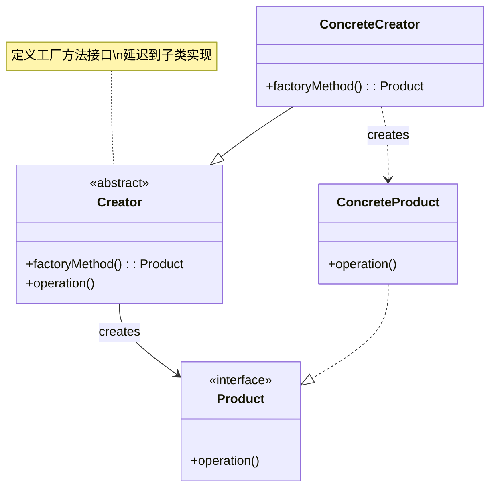
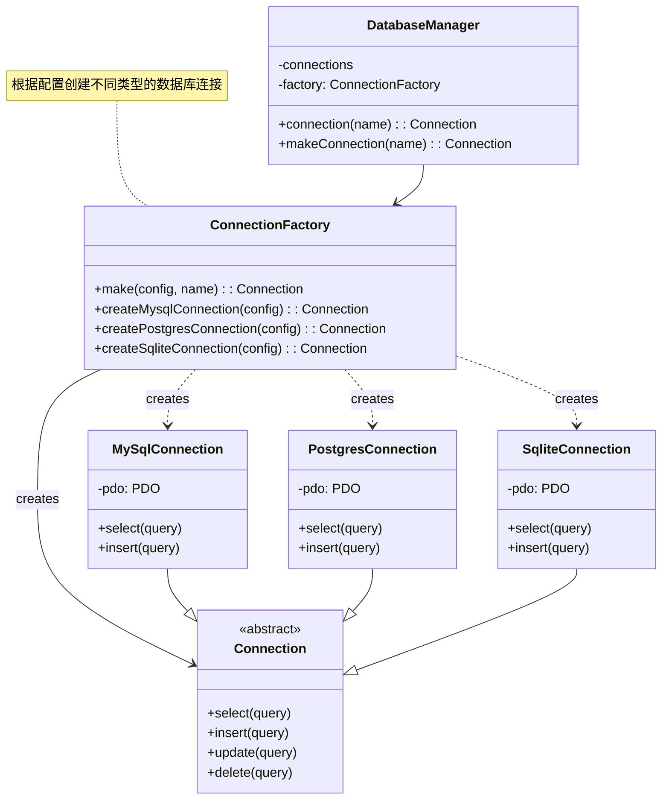
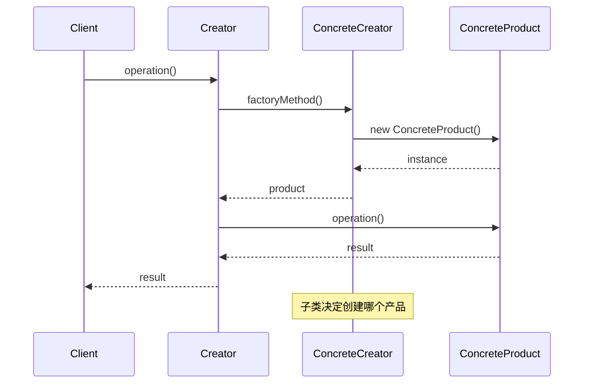
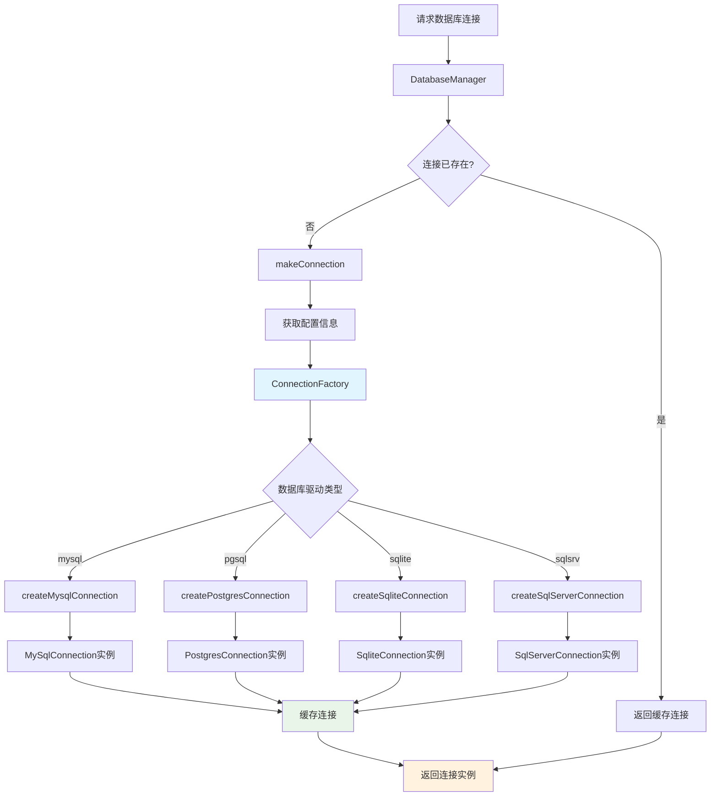
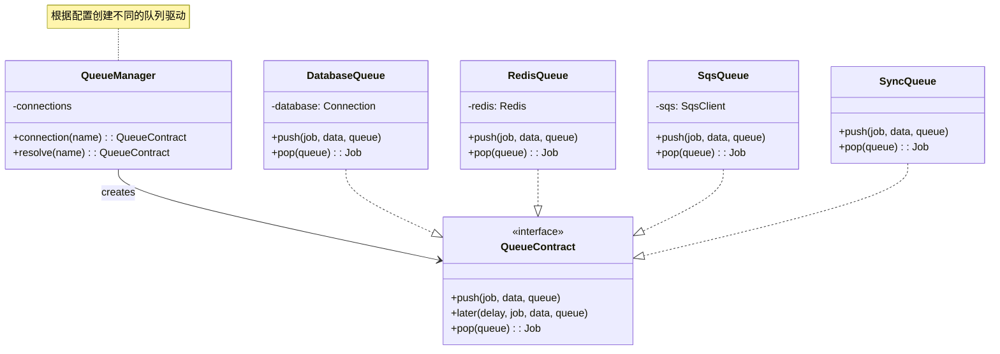

# 工厂方法模式 (Factory Method Pattern)

## 概述

工厂方法模式定义了一个创建对象的接口，但让子类决定实例化哪个类。工厂方法让类的实例化延迟到子类，实现了创建者与具体产品的解耦。

## 架构图

### 工厂方法模式类图


### Laravel 数据库连接工厂架构


### 工厂方法时序图


### Laravel 连接创建流程


### 队列驱动工厂架构


## 设计意图

- **解耦创建逻辑**：将对象的创建与使用分离
- **扩展性**：易于添加新的产品类型
- **灵活性**：客户端代码不依赖于具体产品类
- **统一接口**：为产品族提供统一的创建接口

## Laravel 中的实现

### 1. 数据库连接工厂

Laravel 的数据库系统是工厂方法模式的典型应用。`DatabaseManager` 作为抽象创建者，根据配置创建不同的数据库连接：

```php
// Illuminate\Database\DatabaseManager.php
public function connection($name = null)
{
    $name = $name ?: $this->getDefaultConnection();
    
    if (! isset($this->connections[$name])) {
        $this->connections[$name] = $this->makeConnection($name);
    }
    
    return $this->connections[$name];
}

protected function makeConnection($name)
{
    $config = $this->configuration($name);
    
    // 根据驱动类型创建不同的连接
    return $this->factory->make($config, $name);
}
```

### 2. 连接工厂的具体实现

`ConnectionFactory` 是具体的工厂类，负责创建不同类型的数据库连接：

```php
// Illuminate\Database\Connectors\ConnectionFactory.php
public function make(array $config, $name = null)
{
    $config = $this->parseConfig($config, $name);
    
    // 根据驱动类型选择具体的连接类
    if (isset($config['read'])) {
        return $this->createReadWriteConnection($config);
    }
    
    return $this->createSingleConnection($config);
}

protected function createConnector(array $config)
{
    if (! isset($config['driver'])) {
        throw new InvalidArgumentException('A driver must be specified.');
    }
    
    // 工厂方法：根据驱动创建不同的连接器
    if ($this->container->bound($key = "db.connector.{$config['driver']}")) {
        return $this->container->make($key);
    }
    
    switch ($config['driver']) {
        case 'mysql':
            return new MySqlConnector;
        case 'pgsql':
            return new PostgresConnector;
        case 'sqlite':
            return new SQLiteConnector;
        case 'sqlsrv':
            return new SqlServerConnector;
    }
    
    throw new InvalidArgumentException("Unsupported driver [{$config['driver']}]");
}
```

### 3. 邮件传输工厂

Laravel 的邮件系统也使用了工厂方法模式来创建不同的邮件传输：

```php
// Illuminate\Mail\TransportManager.php
public function driver($driver = null)
{
    $driver = $driver ?: $this->getDefaultDriver();
    
    if (! isset($this->drivers[$driver])) {
        $this->drivers[$driver] = $this->createDriver($driver);
    }
    
    return $this->drivers[$driver];
}

protected function createDriver($driver)
{
    // 工厂方法：根据驱动类型创建不同的邮件传输
    $method = 'create'.Str::studly($driver).'Driver';
    
    if (method_exists($this, $method)) {
        return $this->$method();
    }
    
    throw new InvalidArgumentException("Driver [$driver] not supported.");
}
```

## 实际应用场景

### 1. 队列连接工厂

```php
// Illuminate\Queue\QueueManager.php
public function connection($name = null)
{
    $name = $name ?: $this->getDefaultDriver();
    
    if (! isset($this->connections[$name])) {
        $this->connections[$name] = $this->resolve($name);
    }
    
    return $this->connections[$name];
}

protected function resolve($name)
{
    $config = $this->getConfig($name);
    
    // 工厂方法：根据队列驱动创建不同的队列连接
    return $this->getConnector($config['driver'])->connect($config);
}
```

### 2. 缓存驱动工厂

```php
// Illuminate\Cache\CacheManager.php
public function store($name = null)
{
    $name = $name ?: $this->getDefaultDriver();
    
    return $this->stores[$name] = $this->get($name);
}

protected function get($name)
{
    return $this->stores[$name] ?? $this->resolve($name);
}

protected function resolve($name)
{
    $config = $this->getConfig($name);
    
    // 工厂方法：根据驱动类型创建不同的缓存存储
    $driverMethod = 'create'.ucfirst($config['driver']).'Driver';
    
    if (method_exists($this, $driverMethod)) {
        return $this->{$driverMethod}($config);
    }
    
    throw new InvalidArgumentException("Driver [{$config['driver']}] is not supported.");
}
```

### 3. 文件系统工厂

```php
// Illuminate\Filesystem\FilesystemManager.php
public function disk($name = null)
{
    $name = $name ?: $this->getDefaultDriver();
    
    return $this->drivers[$name] = $this->get($name);
}

protected function get($name)
{
    return $this->drivers[$name] ?? $this->resolve($name);
}

protected function resolve($name)
{
    $config = $this->getConfig($name);
    
    // 工厂方法：根据磁盘类型创建不同的文件系统适配器
    $driverMethod = 'create'.ucfirst($config['driver']).'Driver';
    
    if (method_exists($this, $driverMethod)) {
        return $this->{$driverMethod}($config);
    }
    
    throw new InvalidArgumentException("Driver [{$config['driver']}] is not supported.");
}
```

## 源码分析要点

### 1. 工厂方法模式的核心特征

在 Laravel 中，工厂方法模式通常表现为：

- **管理器类**（如 `DatabaseManager`, `CacheManager`）作为抽象创建者
- **配置驱动**：通过配置文件决定具体产品类型
- **延迟创建**：只有在需要时才创建具体产品
- **连接池管理**：维护已创建的产品实例

### 2. 配置驱动的工厂实现

Laravel 的工厂方法模式高度依赖配置文件：

```php
// config/database.php
'connections' => [
    'mysql' => [
        'driver' => 'mysql',
        'host' => env('DB_HOST', '127.0.0.1'),
        // ... 其他配置
    ],
    'pgsql' => [
        'driver' => 'pgsql',
        'host' => env('DB_HOST', '127.0.0.1'),
        // ... 其他配置
    ],
],
```

### 3. 扩展机制

Laravel 提供了灵活的扩展机制，允许用户添加自定义的工厂产品：

```php
// 扩展自定义数据库驱动
DB::extend('custom', function ($config) {
    return new CustomConnection($config);
});
```

## 最佳实践

### 1. 合理使用工厂方法模式

**适用场景：**
- 需要创建一系列相关或依赖的对象
- 希望将产品的创建逻辑与使用逻辑分离
- 系统需要支持多种产品变体

**不适用场景：**
- 产品类型固定，不需要扩展
- 创建逻辑简单，直接实例化即可

### 2. Laravel 中的工厂方法实践

**利用服务容器：**
```php
// 在服务提供者中注册工厂
$this->app->bind(ConnectionFactory::class, function ($app) {
    return new ConnectionFactory($app);
});
```

**配置驱动的最佳实践：**
```php
// 使用环境变量配置驱动类型
'default' => env('DB_CONNECTION', 'mysql'),

// 为不同环境配置不同的驱动
'connections' => [
    'testing' => [
        'driver' => 'sqlite',
        'database' => ':memory:',
    ],
    'production' => [
        'driver' => 'mysql',
        'host' => env('DB_HOST'),
        // ... 生产环境配置
    ],
],
```

### 3. 测试中的工厂方法

**模拟工厂产品：**
```php
// 在测试中替换工厂产品
Cache::shouldReceive('store')
    ->with('redis')
    ->andReturn($mockRedisStore);
```

**测试工厂方法：**
```php
public function test_database_factory_creates_correct_connection()
{
    $factory = new ConnectionFactory(app());
    $config = ['driver' => 'mysql'];
    
    $connection = $factory->make($config);
    
    $this->assertInstanceOf(MySqlConnection::class, $connection);
}
```

## 与其他模式的关系

### 1. 与抽象工厂模式

工厂方法模式关注单个产品的创建，而抽象工厂模式关注产品族的创建。在 Laravel 中，两者经常结合使用：

```php
// 抽象工厂：创建数据库连接产品族
$connection = DB::connection(); // 工厂方法
$query = $connection->query();  // 抽象工厂的产品

// 抽象工厂：创建缓存存储产品族  
$store = Cache::store();        // 工厂方法
$item = $store->get('key');     // 抽象工厂的产品
```

### 2. 与单例模式

工厂方法模式常与单例模式结合，确保工厂实例的唯一性：

```php
// DatabaseManager 本身是单例
$db = app('db'); // 获取数据库管理器单例

// 但创建的连接可能是单例也可能是多例
$connection1 = $db->connection();
$connection2 = $db->connection(); // 返回同一个连接实例
```

### 3. 与策略模式

工厂方法模式可以看作是创建层面的策略模式：

```php
// 根据配置选择不同的策略（驱动）
$strategy = $this->createDriver($config['driver']);

// 策略模式在运行时选择算法
$result = $strategy->execute($data);
```

## 性能考虑

### 1. 延迟创建的优势

工厂方法模式的延迟创建特性带来了性能优势：

```php
// 只有在实际使用时才创建连接
if (config('queue.default') === 'redis') {
    // 此时才会创建 Redis 队列连接
    Queue::push(new ProcessPodcast);
}
```

### 2. 连接池的管理

Laravel 的工厂管理器维护连接池，避免重复创建：

```php
// 第一次调用创建连接
$connection1 = DB::connection();

// 第二次调用返回已存在的连接
$connection2 = DB::connection(); // 返回 $connection1

// 可以手动重新连接
$connection3 = DB::connection()->reconnect();
```

## 总结

工厂方法模式是 Laravel 框架架构的基石之一。通过将对象的创建逻辑封装在工厂类中，Laravel 实现了高度的灵活性和可扩展性。理解这一模式对于掌握 Laravel 的核心机制至关重要，特别是在处理多驱动、多配置的系统组件时。

工厂方法模式体现了"开闭原则"的精髓：对扩展开放，对修改关闭。当需要添加新的驱动或存储类型时，只需要扩展工厂类，而不需要修改现有的客户端代码。