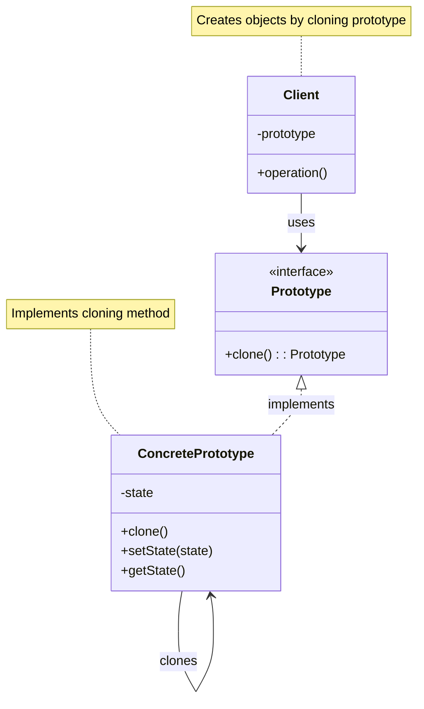
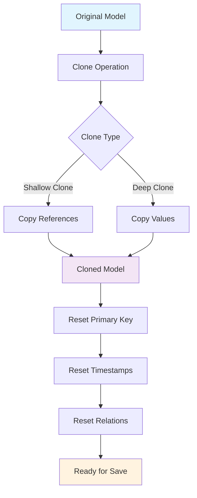
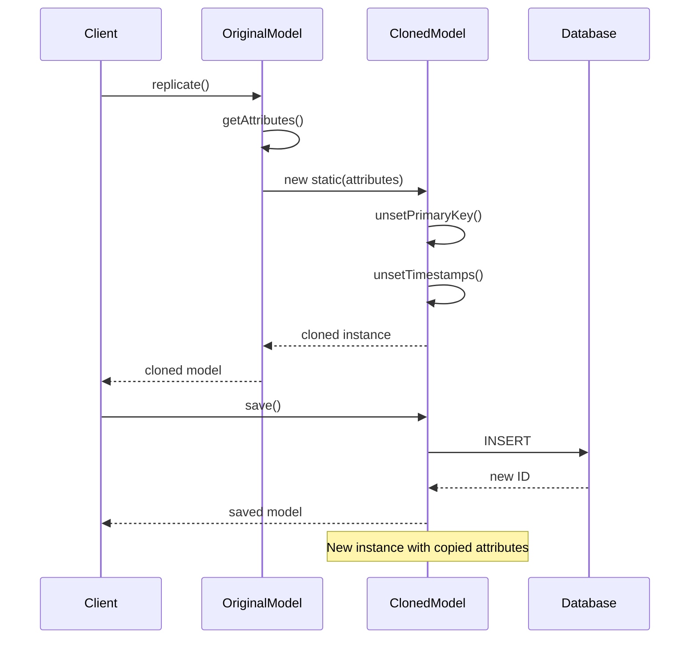

# Prototype Pattern

## Overview

Specify the kinds of objects to create using a prototypical instance, and create new objects by copying this prototype. The Prototype pattern is used when the cost of creating a new instance is more expensive than copying an existing instance.

## Architecture Diagram

### Prototype Pattern Structure



### Laravel Model Replication



### Model Cloning Flow



## Implementation in Laravel

### 1. Eloquent Model Replication

Laravel's Eloquent models implement a form of the Prototype pattern through the `replicate()` method:

```php
// Illuminate\Database\Eloquent\Model.php
class Model implements ArrayAccess, Arrayable, Jsonable, JsonSerializable, QueueableEntity, UrlRoutable
{
    public function replicate(array $except = null)
    {
        $defaults = [
            $this->getKeyName(),
            $this->getCreatedAtColumn(),
            $this->getUpdatedAtColumn(),
        ];
        
        $attributes = Arr::except(
            $this->getAttributes(), $except ? array_unique(array_merge($except, $defaults)) : $defaults
        );
        
        return tap(new static, function ($instance) use ($attributes) {
            $instance->setRawAttributes($attributes);
            $instance->setRelations($this->relations);
            $instance->fireModelEvent('replicating', false);
        });
    }
    
    public function __clone()
    {
        $this->relations = collect($this->relations)->map(function ($relation) {
            return clone $relation;
        })->all();
    }
}

// Usage
$user = User::find(1);
$newUser = $user->replicate();
$newUser->email = 'new@example.com';
$newUser->save();
```

### 2. Request Cloning

```php
// Illuminate\Http\Request.php
class Request extends SymfonyRequest implements Arrayable, ArrayAccess
{
    public function duplicate(array $query = null, array $request = null, array $attributes = null, array $cookies = null, array $files = null, array $server = null)
    {
        return parent::duplicate($query, $request, $attributes, $cookies, $this->filterFiles($files), $server);
    }
    
    public function __clone()
    {
        $this->query = clone $this->query;
        $this->request = clone $this->request;
        $this->attributes = clone $this->attributes;
        $this->cookies = clone $this->cookies;
        $this->files = clone $this->files;
        $this->server = clone $this->server;
        $this->headers = clone $this->headers;
    }
}
```

### 3. Collection Cloning

```php
// Illuminate\Support\Collection.php
class Collection implements ArrayAccess, Arrayable, Countable, IteratorAggregate, Jsonable, JsonSerializable
{
    public function __clone()
    {
        $this->items = array_map(function ($item) {
            return is_object($item) ? clone $item : $item;
        }, $this->items);
    }
    
    public function duplicate()
    {
        return clone $this;
    }
}

// Usage
$originalCollection = collect([1, 2, 3]);
$clonedCollection = clone $originalCollection;
$duplicatedCollection = $originalCollection->duplicate();
```

### 4. Configuration Cloning

```php
// Custom implementation for configuration prototypes
class ConfigurationPrototype
{
    protected $settings = [];
    
    public function __construct(array $settings = [])
    {
        $this->settings = $settings;
    }
    
    public function __clone()
    {
        $this->settings = array_map(function ($setting) {
            return is_object($setting) ? clone $setting : $setting;
        }, $this->settings);
    }
    
    public function createVariant(array $overrides = [])
    {
        $clone = clone $this;
        $clone->settings = array_merge($clone->settings, $overrides);
        return $clone;
    }
}

// Usage
$baseConfig = new ConfigurationPrototype([
    'database' => 'mysql',
    'cache' => 'redis',
    'queue' => 'database'
]);

$testConfig = $baseConfig->createVariant([
    'database' => 'sqlite',
    'cache' => 'array'
]);
```