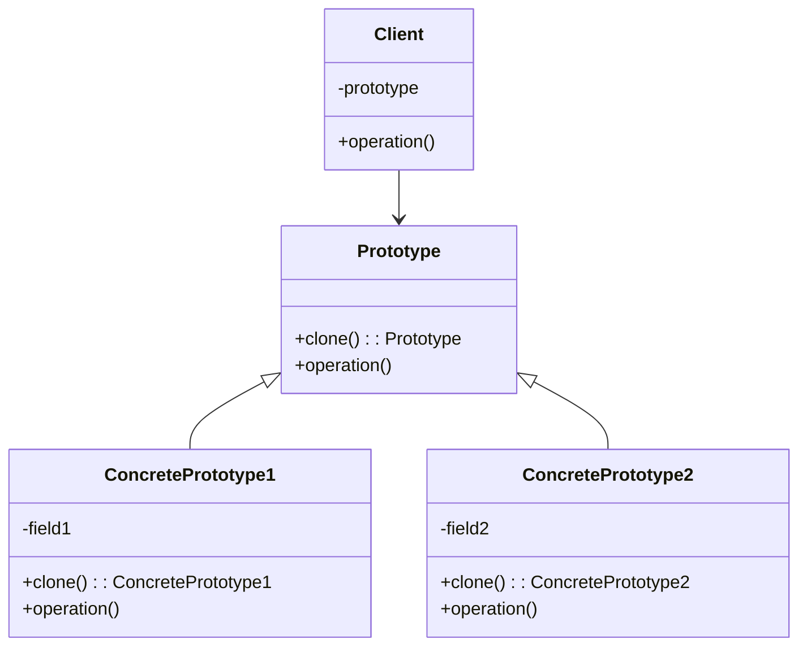
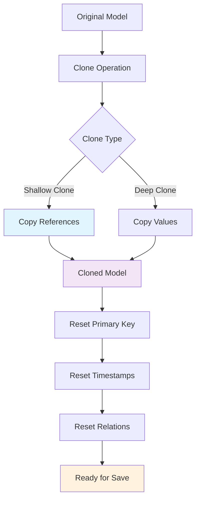
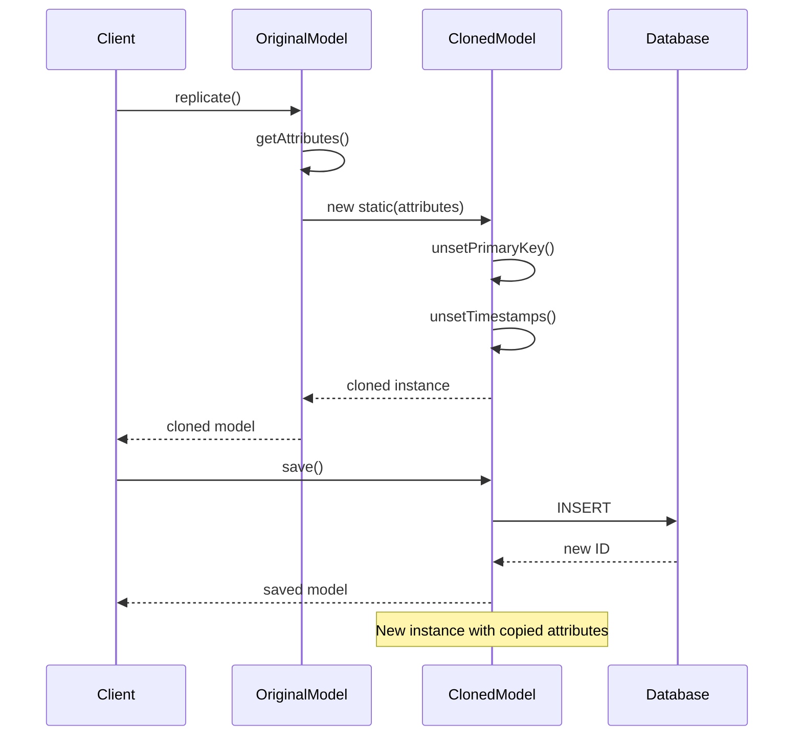
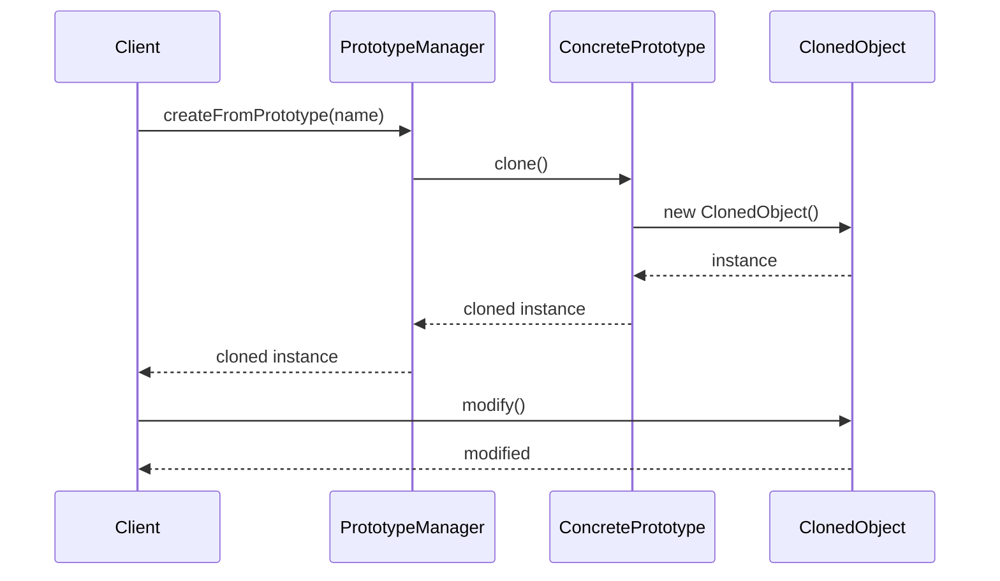

# Prototype Pattern

## Overview

Specify the kinds of objects to create using a prototypical instance, and create new objects by copying this prototype. The Prototype pattern is used when the cost of creating a new instance is more expensive than copying an existing instance.

## Problem Scenarios

In Laravel applications, we often need:
- Copy complex configuration objects
- Clone database records
- Duplicate form templates
- Create similar model instances
- Clone complex query builders

## Solution

The Prototype pattern allows objects to copy themselves by implementing a cloning interface.

## Architecture Diagram

### UML Class Diagram



### Laravel Model Replication



### Model Cloning Flow



## Laravel Implementation

### 1. Basic Prototype Interface

```php
<?php

namespace App\Patterns\Prototype;

// Prototype interface
interface PrototypeInterface
{
    public function clone(): self;
}

// Abstract prototype class
abstract class Prototype implements PrototypeInterface
{
    protected array $data = [];
    
    public function __construct(array $data = [])
    {
        $this->data = $data;
    }
    
    public function clone(): self
    {
        return clone $this;
    }
    
    public function setData(string $key, $value): void
    {
        $this->data[$key] = $value;
    }
    
    public function getData(string $key = null)
    {
        if ($key === null) {
            return $this->data;
        }
        
        return $this->data[$key] ?? null;
    }
}
```

### 2. User Prototype Implementation

```php
<?php

namespace App\Patterns\Prototype;

// User prototype class
class UserPrototype extends Prototype
{
    private string $name;
    private string $email;
    private array $permissions = [];
    private array $preferences = [];
    
    public function __construct(string $name, string $email, array $permissions = [], array $preferences = [])
    {
        $this->name = $name;
        $this->email = $email;
        $this->permissions = $permissions;
        $this->preferences = $preferences;
        
        parent::__construct([
            'name' => $name,
            'email' => $email,
            'permissions' => $permissions,
            'preferences' => $preferences,
        ]);
    }
    
    public function clone(): self
    {
        $cloned = new self(
            $this->name,
            $this->email,
            $this->permissions,
            $this->preferences
        );
        
        // Deep copy complex properties
        $cloned->permissions = array_merge([], $this->permissions);
        $cloned->preferences = array_merge([], $this->preferences);
        
        return $cloned;
    }
    
    public function setName(string $name): void
    {
        $this->name = $name;
        $this->data['name'] = $name;
    }
    
    public function getName(): string
    {
        return $this->name;
    }
    
    public function setEmail(string $email): void
    {
        $this->email = $email;
        $this->data['email'] = $email;
    }
    
    public function getEmail(): string
    {
        return $this->email;
    }
    
    public function addPermission(string $permission): void
    {
        if (!in_array($permission, $this->permissions)) {
            $this->permissions[] = $permission;
            $this->data['permissions'] = $this->permissions;
        }
    }
    
    public function removePermission(string $permission): void
    {
        $key = array_search($permission, $this->permissions);
        if ($key !== false) {
            unset($this->permissions[$key]);
            $this->permissions = array_values($this->permissions);
            $this->data['permissions'] = $this->permissions;
        }
    }
    
    public function getPermissions(): array
    {
        return $this->permissions;
    }
    
    public function setPreference(string $key, $value): void
    {
        $this->preferences[$key] = $value;
        $this->data['preferences'] = $this->preferences;
    }
    
    public function getPreference(string $key, $default = null)
    {
        return $this->preferences[$key] ?? $default;
    }
    
    public function getPreferences(): array
    {
        return $this->preferences;
    }
    
    public function toArray(): array
    {
        return [
            'name' => $this->name,
            'email' => $this->email,
            'permissions' => $this->permissions,
            'preferences' => $this->preferences,
        ];
    }
}
```

### 3. Document Prototype Implementation

```php
<?php

namespace App\Patterns\Prototype;

// Document prototype class
class DocumentPrototype extends Prototype
{
    private string $title;
    private string $content;
    private array $metadata = [];
    private array $sections = [];
    private string $template;
    
    public function __construct(
        string $title = '',
        string $content = '',
        array $metadata = [],
        array $sections = [],
        string $template = 'default'
    ) {
        $this->title = $title;
        $this->content = $content;
        $this->metadata = $metadata;
        $this->sections = $sections;
        $this->template = $template;
        
        parent::__construct([
            'title' => $title,
            'content' => $content,
            'metadata' => $metadata,
            'sections' => $sections,
            'template' => $template,
        ]);
    }
    
    public function clone(): self
    {
        $cloned = new self(
            $this->title,
            $this->content,
            $this->metadata,
            $this->sections,
            $this->template
        );
        
        // Deep copy complex properties
        $cloned->metadata = $this->deepCopy($this->metadata);
        $cloned->sections = $this->deepCopy($this->sections);
        
        return $cloned;
    }
    
    private function deepCopy(array $array): array
    {
        $result = [];
        foreach ($array as $key => $value) {
            if (is_array($value)) {
                $result[$key] = $this->deepCopy($value);
            } elseif (is_object($value)) {
                $result[$key] = clone $value;
            } else {
                $result[$key] = $value;
            }
        }
        return $result;
    }
    
    public function setTitle(string $title): void
    {
        $this->title = $title;
        $this->data['title'] = $title;
    }
    
    public function getTitle(): string
    {
        return $this->title;
    }
    
    public function setContent(string $content): void
    {
        $this->content = $content;
        $this->data['content'] = $content;
    }
    
    public function getContent(): string
    {
        return $this->content;
    }
    
    public function setMetadata(string $key, $value): void
    {
        $this->metadata[$key] = $value;
        $this->data['metadata'] = $this->metadata;
    }
    
    public function getMetadata(string $key = null)
    {
        if ($key === null) {
            return $this->metadata;
        }
        
        return $this->metadata[$key] ?? null;
    }
    
    public function addSection(string $title, string $content): void
    {
        $this->sections[] = [
            'title' => $title,
            'content' => $content,
            'created_at' => date('Y-m-d H:i:s'),
        ];
        $this->data['sections'] = $this->sections;
    }
    
    public function getSections(): array
    {
        return $this->sections;
    }
    
    public function setTemplate(string $template): void
    {
        $this->template = $template;
        $this->data['template'] = $template;
    }
    
    public function getTemplate(): string
    {
        return $this->template;
    }
    
    public function render(): string
    {
        $output = "=== {$this->title} ===\n\n";
        $output .= "Template: {$this->template}\n";
        $output .= "Content: {$this->content}\n\n";
        
        if (!empty($this->sections)) {
            $output .= "Sections:\n";
            foreach ($this->sections as $index => $section) {
                $output .= ($index + 1) . ". {$section['title']}\n";
                $output .= "   {$section['content']}\n";
            }
        }
        
        if (!empty($this->metadata)) {
            $output .= "\nMetadata:\n";
            foreach ($this->metadata as $key => $value) {
                $output .= "- {$key}: {$value}\n";
            }
        }
        
        return $output;
    }
}
```

### 4. Query Prototype Implementation

```php
<?php

namespace App\Patterns\Prototype;

use Illuminate\Database\Query\Builder;

// Query prototype class
class QueryPrototype extends Prototype
{
    private string $table;
    private array $select = ['*'];
    private array $where = [];
    private array $joins = [];
    private array $orderBy = [];
    private ?int $limit = null;
    private ?int $offset = null;
    
    public function __construct(string $table)
    {
        $this->table = $table;
        
        parent::__construct([
            'table' => $table,
            'select' => $this->select,
            'where' => $this->where,
            'joins' => $this->joins,
            'orderBy' => $this->orderBy,
            'limit' => $this->limit,
            'offset' => $this->offset,
        ]);
    }
    
    public function clone(): self
    {
        $cloned = new self($this->table);
        $cloned->select = array_merge([], $this->select);
        $cloned->where = array_merge([], $this->where);
        $cloned->joins = array_merge([], $this->joins);
        $cloned->orderBy = array_merge([], $this->orderBy);
        $cloned->limit = $this->limit;
        $cloned->offset = $this->offset;
        
        return $cloned;
    }
    
    public function select(array $columns): self
    {
        $this->select = $columns;
        $this->data['select'] = $this->select;
        return $this;
    }
    
    public function where(string $column, string $operator, $value): self
    {
        $this->where[] = [$column, $operator, $value];
        $this->data['where'] = $this->where;
        return $this;
    }
    
    public function join(string $table, string $first, string $operator, string $second): self
    {
        $this->joins[] = ['table' => $table, 'first' => $first, 'operator' => $operator, 'second' => $second];
        $this->data['joins'] = $this->joins;
        return $this;
    }
    
    public function orderBy(string $column, string $direction = 'asc'): self
    {
        $this->orderBy[] = [$column, $direction];
        $this->data['orderBy'] = $this->orderBy;
        return $this;
    }
    
    public function limit(int $limit): self
    {
        $this->limit = $limit;
        $this->data['limit'] = $this->limit;
        return $this;
    }
    
    public function offset(int $offset): self
    {
        $this->offset = $offset;
        $this->data['offset'] = $this->offset;
        return $this;
    }
    
    public function toSql(): string
    {
        $sql = 'SELECT ' . implode(', ', $this->select);
        $sql .= " FROM {$this->table}";
        
        foreach ($this->joins as $join) {
            $sql .= " JOIN {$join['table']} ON {$join['first']} {$join['operator']} {$join['second']}";
        }
        
        if (!empty($this->where)) {
            $conditions = [];
            foreach ($this->where as $condition) {
                $value = is_string($condition[2]) ? "'{$condition[2]}'" : $condition[2];
                $conditions[] = "{$condition[0]} {$condition[1]} {$value}";
            }
            $sql .= ' WHERE ' . implode(' AND ', $conditions);
        }
        
        if (!empty($this->orderBy)) {
            $orders = [];
            foreach ($this->orderBy as $order) {
                $orders[] = "{$order[0]} {$order[1]}";
            }
            $sql .= ' ORDER BY ' . implode(', ', $orders);
        }
        
        if ($this->limit !== null) {
            $sql .= " LIMIT {$this->limit}";
        }
        
        if ($this->offset !== null) {
            $sql .= " OFFSET {$this->offset}";
        }
        
        return $sql;
    }
    
    public function getTable(): string
    {
        return $this->table;
    }
}
```

### 5. Prototype Manager

```php
<?php

namespace App\Patterns\Prototype;

// Prototype manager
class PrototypeManager
{
    private array $prototypes = [];
    
    public function addPrototype(string $name, PrototypeInterface $prototype): void
    {
        $this->prototypes[$name] = $prototype;
    }
    
    public function getPrototype(string $name): ?PrototypeInterface
    {
        return $this->prototypes[$name] ?? null;
    }
    
    public function createFromPrototype(string $name): ?PrototypeInterface
    {
        $prototype = $this->getPrototype($name);
        
        if ($prototype === null) {
            return null;
        }
        
        return $prototype->clone();
    }
    
    public function removePrototype(string $name): void
    {
        unset($this->prototypes[$name]);
    }
    
    public function hasPrototype(string $name): bool
    {
        return isset($this->prototypes[$name]);
    }
    
    public function listPrototypes(): array
    {
        return array_keys($this->prototypes);
    }
    
    public function clearPrototypes(): void
    {
        $this->prototypes = [];
    }
}
```

### 6. Laravel Model Prototype

```php
<?php

namespace App\Patterns\Prototype;

use Illuminate\Database\Eloquent\Model;

// Laravel model prototype trait
trait PrototypeTrait
{
    public function createPrototype(): self
    {
        $attributes = $this->getAttributes();
        
        // Remove primary key and timestamps
        unset($attributes['id']);
        unset($attributes['created_at']);
        unset($attributes['updated_at']);
        
        return new static($attributes);
    }
    
    public function cloneWithRelations(array $relations = []): self
    {
        $clone = $this->createPrototype();
        
        foreach ($relations as $relation) {
            if ($this->relationLoaded($relation)) {
                $relationData = $this->getRelation($relation);
                
                if ($relationData instanceof \Illuminate\Database\Eloquent\Collection) {
                    $clonedRelation = $relationData->map(function ($item) {
                        return $item->createPrototype();
                    });
                    $clone->setRelation($relation, $clonedRelation);
                } elseif ($relationData instanceof Model) {
                    $clone->setRelation($relation, $relationData->createPrototype());
                }
            }
        }
        
        return $clone;
    }
}

// Example user model
class User extends Model
{
    use PrototypeTrait;
    
    protected $fillable = ['name', 'email', 'status', 'role'];
    
    public function profile()
    {
        return $this->hasOne(UserProfile::class);
    }
    
    public function posts()
    {
        return $this->hasMany(Post::class);
    }
}

// Example user profile model
class UserProfile extends Model
{
    use PrototypeTrait;
    
    protected $fillable = ['user_id', 'bio', 'avatar', 'preferences'];
    
    protected $casts = [
        'preferences' => 'array',
    ];
}

// Example post model
class Post extends Model
{
    use PrototypeTrait;
    
    protected $fillable = ['user_id', 'title', 'content', 'status'];
}
```

## Usage Examples

### User Prototype Usage

```php
<?php

// Create original user
$originalUser = new UserPrototype(
    'John Doe',
    'john@example.com',
    ['read', 'write'],
    ['theme' => 'dark', 'language' => 'en']
);

// Clone user and modify
$clonedUser = $originalUser->clone();
$clonedUser->setName('Jane Smith');
$clonedUser->setEmail('jane@example.com');
$clonedUser->addPermission('admin');
$clonedUser->setPreference('theme', 'light');

echo "Original user: " . $originalUser->getName() . "\n";
echo "Cloned user: " . $clonedUser->getName() . "\n";
echo "Original user permissions: " . implode(', ', $originalUser->getPermissions()) . "\n";
echo "Cloned user permissions: " . implode(', ', $clonedUser->getPermissions()) . "\n";
```

### Document Prototype Usage

```php
<?php

// Create document template
$template = new DocumentPrototype(
    'Project Document Template',
    'This is a project document template content.',
    ['author' => 'System', 'version' => '1.0'],
    [],
    'project'
);
$template->addSection('Overview', 'Project overview content');
$template->addSection('Features', 'Feature description content');

// Create new document based on template
$projectDoc = $template->clone();
$projectDoc->setTitle('Laravel Design Patterns Project Document');
$projectDoc->setContent('This is the detailed document for Laravel Design Patterns project.');
$projectDoc->setMetadata('author', 'Development Team');
$projectDoc->setMetadata('project', 'Laravel DP');
$projectDoc->addSection('Installation', 'Installation steps description');

echo $projectDoc->render();
```

### Query Prototype Usage

```php
<?php

// Create base query template
$baseQuery = new QueryPrototype('users');
$baseQuery->select(['id', 'name', 'email'])
          ->where('status', '=', 'active')
          ->orderBy('created_at', 'desc');

// Create specific queries based on template
$adminQuery = $baseQuery->clone();
$adminQuery->where('role', '=', 'admin')
           ->limit(10);

$recentQuery = $baseQuery->clone();
$recentQuery->where('created_at', '>', '2023-01-01')
            ->limit(20);

echo "Admin query: " . $adminQuery->toSql() . "\n";
echo "Recent users query: " . $recentQuery->toSql() . "\n";
```

### Prototype Manager Usage

```php
<?php

$manager = new PrototypeManager();

// Register prototypes
$manager->addPrototype('admin_user', new UserPrototype(
    'Administrator',
    'admin@example.com',
    ['read', 'write', 'admin'],
    ['theme' => 'dark']
));

$manager->addPrototype('guest_user', new UserPrototype(
    'Guest',
    'guest@example.com',
    ['read'],
    ['theme' => 'light']
));

// Create instances from prototypes
$newAdmin = $manager->createFromPrototype('admin_user');
$newAdmin->setName('New Administrator');
$newAdmin->setEmail('newadmin@example.com');

$newGuest = $manager->createFromPrototype('guest_user');
$newGuest->setName('New Guest');

echo "Created admin: " . $newAdmin->getName() . "\n";
echo "Created guest: " . $newGuest->getName() . "\n";
```

### Laravel Model Prototype Usage

```php
<?php

// Create user template
$userTemplate = new User([
    'name' => 'Template User',
    'email' => 'template@example.com',
    'status' => 'active',
    'role' => 'user'
]);

// Create user profile
$userTemplate->profile()->create([
    'bio' => 'This is user profile template',
    'preferences' => ['theme' => 'default', 'notifications' => true]
]);

// Create new user based on template
$newUser = $userTemplate->createPrototype();
$newUser->name = 'Actual User';
$newUser->email = 'real@example.com';
$newUser->save();

// Clone user with relations
$userWithRelations = User::with('profile', 'posts')->find(1);
$clonedUser = $userWithRelations->cloneWithRelations(['profile', 'posts']);
$clonedUser->name = 'Cloned User';
$clonedUser->email = 'cloned@example.com';
$clonedUser->save();
```

## Practical Application in Laravel

### 1. Model Replication

```php
<?php

// Laravel's replicate method is an application of Prototype pattern
$user = User::find(1);
$newUser = $user->replicate();
$newUser->email = 'new@example.com';
$newUser->save();

// Replicate model with relations
$post = Post::with('comments')->find(1);
$newPost = $post->replicate();
$newPost->title = 'Replicated Post';
$newPost->save();

// Replicate relations
foreach ($post->comments as $comment) {
    $newComment = $comment->replicate();
    $newComment->post_id = $newPost->id;
    $newComment->save();
}
```

### 2. Configuration Replication

```php
<?php

// Deep copy of configuration arrays
$defaultConfig = config('app');
$customConfig = array_merge_recursive($defaultConfig, [
    'name' => 'Custom App',
    'debug' => true,
]);

// Using configuration prototype
class ConfigPrototype
{
    private array $config;
    
    public function __construct(array $config)
    {
        $this->config = $config;
    }
    
    public function clone(): self
    {
        return new self($this->deepCopy($this->config));
    }
    
    private function deepCopy(array $array): array
    {
        return json_decode(json_encode($array), true);
    }
}
```

### 3. Request Replication

```php
<?php

// Replicate HTTP request
class RequestPrototype
{
    private array $data;
    private array $headers;
    
    public function __construct(Request $request)
    {
        $this->data = $request->all();
        $this->headers = $request->headers->all();
    }
    
    public function clone(): Request
    {
        $newRequest = new Request($this->data);
        
        foreach ($this->headers as $key => $value) {
            $newRequest->headers->set($key, $value);
        }
        
        return $newRequest;
    }
}
```

## Sequence Diagram



## Advantages

1. **Performance improvement**: Avoid repeated initialization processes
2. **Simplify object creation**: Create objects by cloning instead of construction
3. **Dynamic configuration**: Add and remove prototypes at runtime
4. **Reduce subclasses**: Avoid class explosion in factory method pattern

## Disadvantages

1. **Complex object cloning difficulty**: Deep copying complex objects can be difficult
2. **Circular reference issues**: Circular references between objects may cause problems
3. **Clone method maintenance**: Need to maintain the correctness of clone method

## Applicable Scenarios

1. **High creation cost objects**
2. **Scenarios requiring avoidance of complex initialization**
3. **When creating large numbers of similar objects**
4. **When system needs to be independent of product creation, composition and representation**

## Relationship with Other Patterns

- **Factory Method Pattern**: Prototype can replace factory method
- **Memento Pattern**: Prototype can implement memento functionality
- **Decorator Pattern**: Decorators can be cloned

## Best Practices

1. **Implement deep copy**: Ensure correct cloning of complex objects
2. **Handle circular references**: Avoid infinite recursion during cloning
3. **Optimize cloning performance**: Consider lazy loading cloning for large objects
4. **Use prototype manager**: Centralized management of prototype instances

The Prototype pattern is very useful when creating large numbers of similar objects or avoiding complex initialization processes. Laravel's model replication functionality is a good application example.