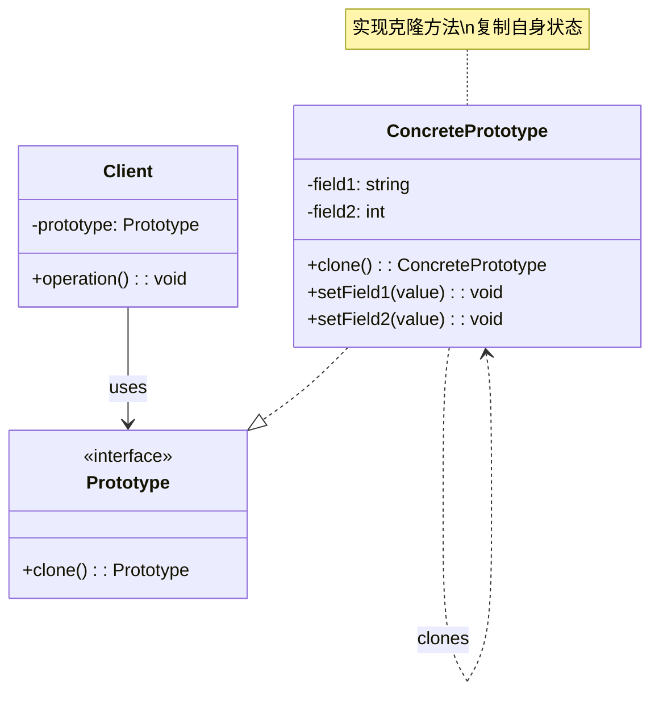
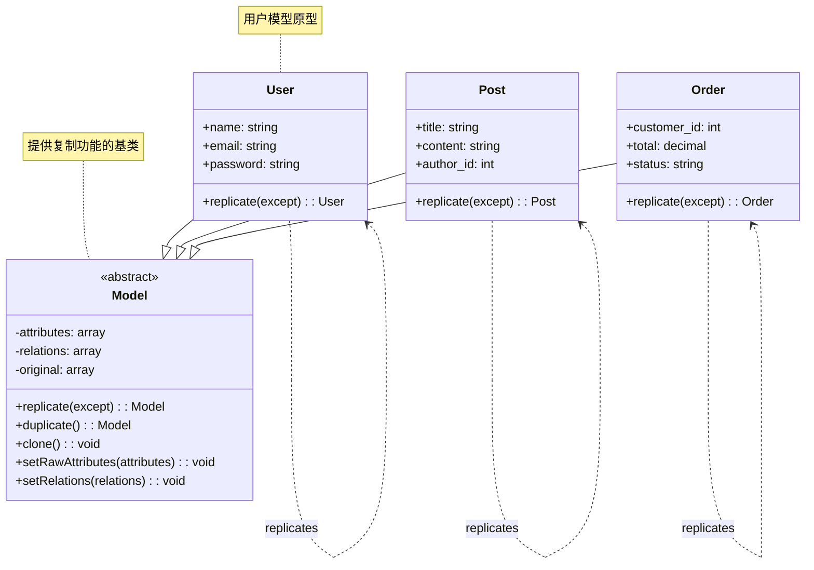
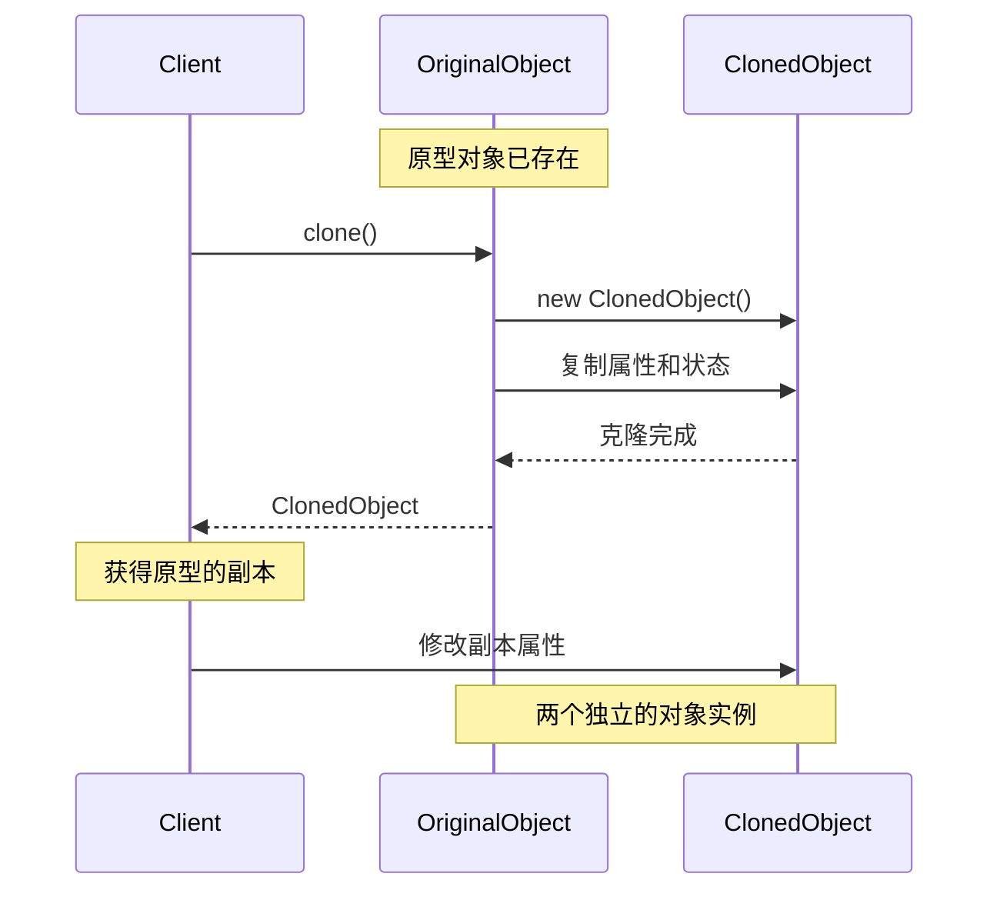
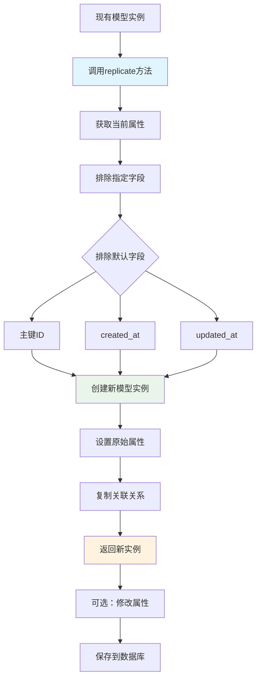
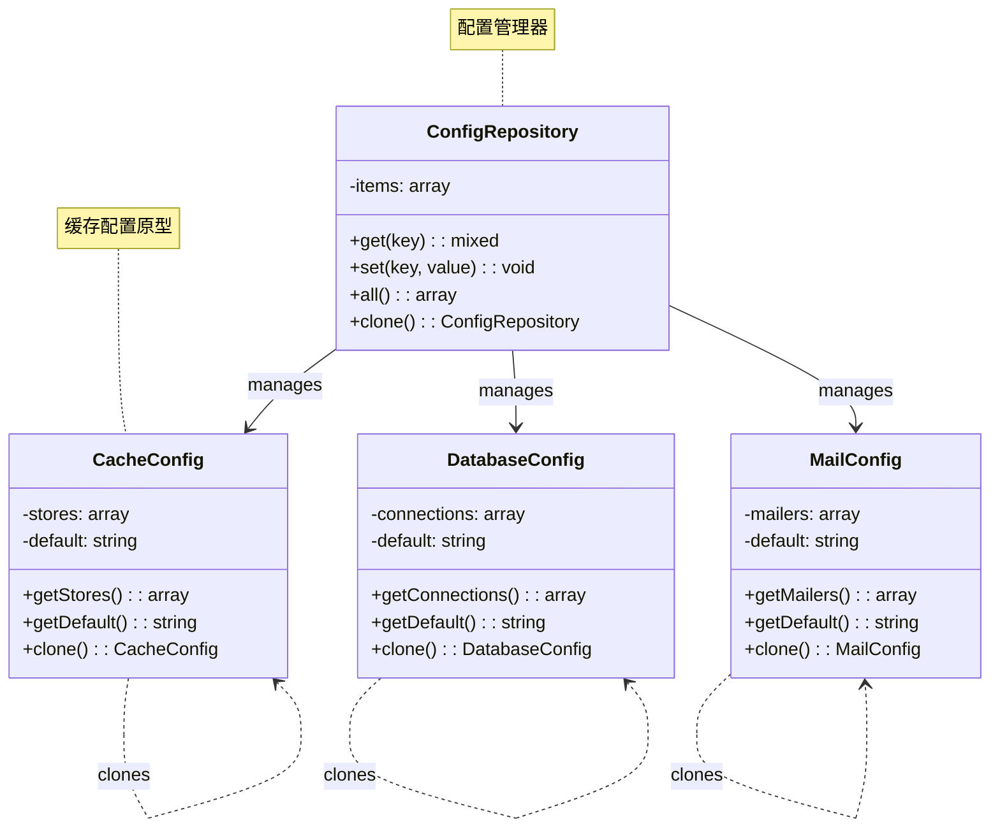
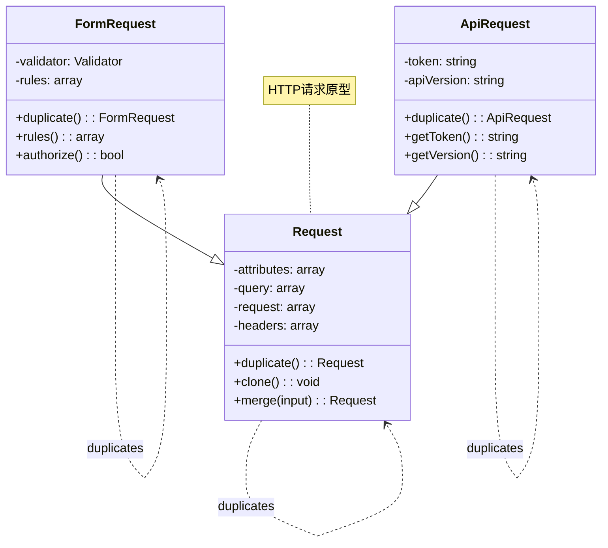
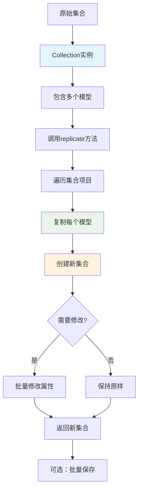

# 原型模式 (Prototype Pattern)

## 概述

原型模式用原型实例指定创建对象的种类，并且通过拷贝这些原型创建新的对象。它允许通过复制现有对象来创建新对象，而不是通过实例化类。

## 架构图

### 原型模式类图


### Laravel 模型原型架构


### 原型模式时序图


### Laravel 模型复制流程


### 配置原型模式


### 请求原型模式


### 集合原型模式


## 设计意图

- **对象复制**：通过复制现有对象来创建新对象
- **性能优化**：避免昂贵的对象创建过程
- **灵活性**：运行时动态创建对象
- **配置简化**：通过复制预配置的对象来创建新对象

## Laravel 中的实现

### 1. 模型原型复制

Laravel 的 Eloquent 模型支持原型模式，可以通过复制现有模型实例来创建新对象：

```php
// Illuminate\Database\Eloquent\Model.php
class Model implements ArrayAccess, Jsonable, JsonSerializable
{
    // 原型模式：复制模型实例
    public function replicate(array $except = null)
    {
        $defaults = [
            $this->getKeyName(),
            $this->getCreatedAtColumn(),
            $this->getUpdatedAtColumn(),
        ];
        
        $attributes = Arr::except(
            $this->attributes,
            $except ? array_unique(array_merge($except, $defaults)) : $defaults
        );
        
        return tap(new static, function ($instance) use ($attributes) {
            $instance->setRawAttributes($attributes);
            $instance->setRelations($this->relations);
        });
    }
}
```

### 2. 配置原型复制

Laravel 的配置系统使用了原型模式来复制配置实例：

```php
// Illuminate\Config\Repository.php
class Repository implements ArrayAccess
{
    protected $items = [];
    
    // 原型模式：复制配置实例
    public function copy()
    {
        $copy = new static;
        $copy->items = $this->items;
        return $copy;
    }
    
    public function withOverride(array $overrides)
    {
        $copy = $this->copy();
        $copy->set($overrides);
        return $copy;
    }
}
```

### 3. 请求原型复制

HTTP 请求对象也支持原型模式：

```php
// Illuminate\Http\Request.php
class Request extends SymfonyRequest implements Arrayable, ArrayAccess
{
    // 原型模式：复制请求对象
    public function duplicate(array $query = null, array $request = null, array $attributes = null, array $cookies = null, array $files = null, array $server = null)
    {
        return parent::duplicate($query, $request, $attributes, $cookies, $files, $server);
    }
    
    public function withHeaders(array $headers)
    {
        $new = $this->duplicate();
        $new->headers->add($headers);
        return $new;
    }
}
```

## 实际应用场景

### 1. 表单请求原型

表单请求处理中的原型模式应用：

```php
// 自定义表单请求类
class CreateUserRequest extends FormRequest
{
    public function rules()
    {
        return [
            'name' => 'required|string|max:255',
            'email' => 'required|email|unique:users',
            'password' => 'required|min:8',
        ];
    }
    
    // 原型模式：创建修改后的请求副本
    public function withAdditionalRules(array $additionalRules)
    {
        $newRequest = $this->duplicate();
        $newRequest->merge(['_additional_rules' => $additionalRules]);
        return $newRequest;
    }
}

// 使用示例
$request = new CreateUserRequest();
$modifiedRequest = $request->withAdditionalRules([
    'phone' => 'required|phone'
]);
```

### 2. 视图组件原型

Blade 组件中的原型模式应用：

```php
// Illuminate\View\Component.php
class Component
{
    protected $data;
    
    // 原型模式：复制组件实例
    public function with(array $data)
    {
        $clone = clone $this;
        $clone->data = array_merge($this->data, $data);
        return $clone;
    }
    
    public function render()
    {
        return view('components.'.$this->componentName, $this->data);
    }
}

// 使用示例
$button = new ButtonComponent(['type' => 'primary']);
$secondaryButton = $button->with(['type' => 'secondary']);
```

### 3. 数据库连接原型

数据库连接配置的原型模式：

```php
// Illuminate\Database\Connectors\ConnectionFactory.php
class ConnectionFactory
{
    // 原型模式：基于现有连接创建新连接
    public function createFromExisting(Connection $existing, array $newConfig)
    {
        $config = array_merge($existing->getConfig(), $newConfig);
        return $this->make($config);
    }
}
```

## 源码分析要点

### 1. 浅拷贝与深拷贝

Laravel 中的原型模式需要注意拷贝的深度：

```php
// 浅拷贝示例
public function shallowCopy()
{
    $copy = clone $this;
    return $copy;
}

// 深拷贝示例  
public function deepCopy()
{
    $copy = clone $this;
    $copy->relations = unserialize(serialize($this->relations));
    return $copy;
}
```

### 2. clone 关键字的使用

PHP 的 `clone` 关键字是原型模式的核心：

```php
class PrototypeExample
{
    public function createCopy()
    {
        // 使用 clone 创建对象副本
        return clone $this;
    }
    
    // __clone 魔术方法，在克隆时调用
    public function __clone()
    {
        // 深拷贝需要的资源
        $this->resource = clone $this->resource;
    }
}
```

### 3. 配置保留与排除

原型复制时通常需要排除某些属性：

```php
public function replicate(array $except = [])
{
    $defaultExcept = ['id', 'created_at', 'updated_at'];
    $attributesToExclude = array_merge($defaultExcept, $except);
    
    $copy = clone $this;
    foreach ($attributesToExclude as $attribute) {
        unset($copy->$attribute);
    }
    
    return $copy;
}
```

## 最佳实践

### 1. 合理使用原型模式

**适用场景：**
- 对象创建成本高昂
- 需要创建相似但略有不同的对象
- 系统需要动态创建对象
- 对象配置复杂，希望通过复制简化

**不适用场景：**
- 对象结构简单，直接实例化即可
- 对象差异很大，复制没有意义

### 2. Laravel 中的原型实践

**利用模型复制：**
```php
// 创建用户模型的副本
$user = User::find(1);
$newUser = $user->replicate();
$newUser->email = 'new@example.com';
$newUser->save();
```

**配置对象复制：**
```php
// 复制配置对象并修改
$config = config('database.connections.mysql');
$newConfig = array_merge($config, [
    'database' => 'new_database',
    'username' => 'new_user'
]);
```

**请求对象复制：**
```php
// 复制请求对象并添加头部
$newRequest = $request->duplicate()->headers->add([
    'X-Custom-Header' => 'value'
]);
```

### 3. 测试原型模式

**测试对象复制：**
```php
public function test_prototype_replication()
{
    $original = new Product(['name' => 'Original', 'price' => 100]);
    $copy = $original->replicate();
    
    $this->assertEquals($original->name, $copy->name);
    $this->assertNull($copy->id); // ID 应该被排除
    $this->assertNotSame($original, $copy);
}
```

**测试深拷贝：**
```php
public function test_deep_copy_creates_new_references()
{
    $original = new Container(['items' => new Collection([1, 2, 3])]);
    $copy = $original->deepCopy();
    
    $this->assertNotSame($original->items, $copy->items);
}
```

## 与其他模式的关系

### 1. 与工厂模式

原型模式关注对象复制，工厂模式关注对象创建：

```php
// 工厂模式：通过类创建对象
class Factory 
{
    public function create($type) 
    {
        return new $type();
    }
}

// 原型模式：通过复制创建对象
class PrototypeRegistry 
{
    protected $prototypes = [];
    
    public function getCopy($key) 
    {
        return clone $this->prototypes[$key];
    }
}
```

### 2. 与单例模式

原型模式与单例模式可以结合使用：

```php
class PrototypeSingleton 
{
    private static $instance;
    
    private function __construct() {}
    
    public static function getInstance() 
    {
        if (self::$instance === null) {
            self::$instance = new self();
        }
        return clone self::$instance; // 返回副本而不是单例
    }
}
```

### 3. 与备忘录模式

原型模式可以用于实现备忘录模式：

```php
class Originator 
{
    private $state;
    
    public function save() 
    {
        return clone $this; // 创建状态副本
    }
    
    public function restore(Originator $memento) 
    {
        $this->state = $memento->state;
    }
}
```

## 性能考虑

### 1. 复制开销

原型模式的对象复制可能有性能开销：

```php
// 优化：延迟复制
class LazyPrototype 
{
    protected $original;
    protected $modified = [];
    
    public function __construct($original) 
    {
        $this->original = $original;
    }
    
    public function __get($property) 
    {
        return $this->modified[$property] ?? $this->original->$property;
    }
    
    public function __set($property, $value) 
    {
        $this->modified[$property] = $value;
    }
    
    public function build() 
    {
        // 只在需要时创建完整副本
        $copy = clone $this->original;
        foreach ($this->modified as $property => $value) {
            $copy->$property = $value;
        }
        return $copy;
    }
}
```

### 2. 内存使用

原型模式可能增加内存使用：

```php
// 使用轻量级原型
class LightweightPrototype 
{
    protected $data;
    
    public function __construct(array $data) 
    {
        $this->data = $data;
    }
    
    public function copy() 
    {
        // 只复制必要的数据
        return new static($this->data);
    }
}
```

## 总结

原型模式在 Laravel 框架中有着重要的应用，特别是在模型复制、配置管理和请求处理等场景。它通过对象复制的方式创建新对象，避免了昂贵的对象创建过程，提高了系统性能。

原型模式的优势在于：
- **性能优化**：避免重复的对象初始化
- **灵活性**：动态创建配置不同的对象
- **简化配置**：通过复制预配置对象简化新对象创建
- **一致性**：确保新对象与原型具有相同的状态

在 Laravel 开发中，合理使用原型模式可以优化对象创建过程，特别是在需要创建相似对象或需要对象配置复用的场景中。