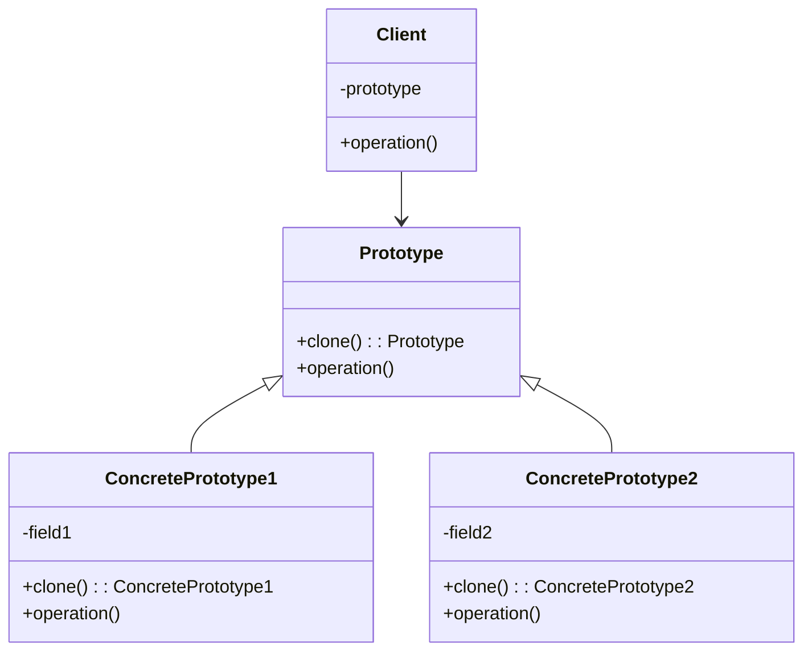
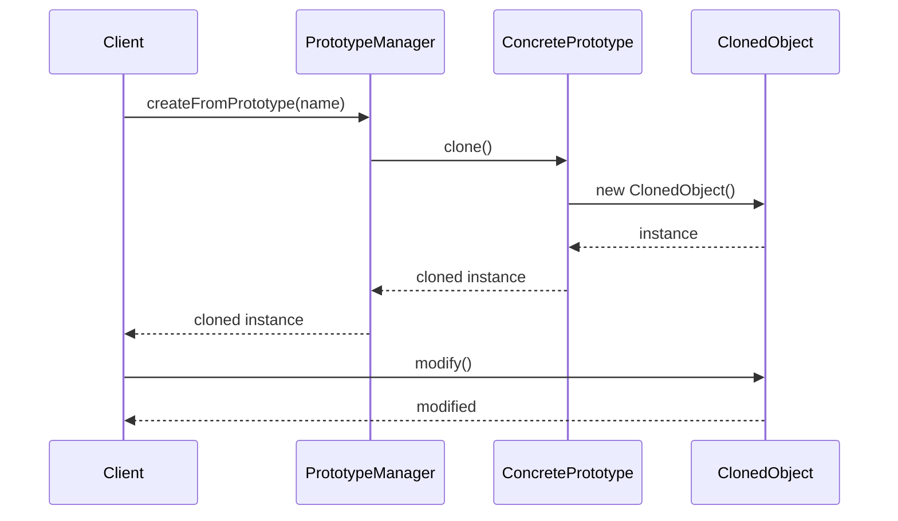

# 原型模式 (Prototype Pattern)

## 概述

原型模式通过复制现有的实例来创建新的实例，而不是通过实例化类。这种模式特别适用于创建复杂对象的成本较高，或者需要避免创建对象时的复杂初始化过程的场景。

## 问题场景

在Laravel应用中，我们经常需要：
- 复制复杂的配置对象
- 克隆数据库记录
- 复制表单模板
- 创建相似的模型实例
- 克隆复杂的查询构建器

## 解决方案

原型模式通过实现克隆接口，允许对象复制自身，创建新的实例。

## UML类图



## Laravel实现

### 1. 基础原型接口

```php
<?php

namespace App\Patterns\Prototype;

// 原型接口
interface PrototypeInterface
{
    public function clone(): self;
}

// 抽象原型类
abstract class Prototype implements PrototypeInterface
{
    protected array $data = [];
    
    public function __construct(array $data = [])
    {
        $this->data = $data;
    }
    
    public function clone(): self
    {
        return clone $this;
    }
    
    public function setData(string $key, $value): void
    {
        $this->data[$key] = $value;
    }
    
    public function getData(string $key = null)
    {
        if ($key === null) {
            return $this->data;
        }
        
        return $this->data[$key] ?? null;
    }
}
```

### 2. 用户原型实现

```php
<?php

namespace App\Patterns\Prototype;

// 用户原型类
class UserPrototype extends Prototype
{
    private string $name;
    private string $email;
    private array $permissions = [];
    private array $preferences = [];
    
    public function __construct(string $name, string $email, array $permissions = [], array $preferences = [])
    {
        $this->name = $name;
        $this->email = $email;
        $this->permissions = $permissions;
        $this->preferences = $preferences;
        
        parent::__construct([
            'name' => $name,
            'email' => $email,
            'permissions' => $permissions,
            'preferences' => $preferences,
        ]);
    }
    
    public function clone(): self
    {
        $cloned = new self(
            $this->name,
            $this->email,
            $this->permissions,
            $this->preferences
        );
        
        // 深拷贝复杂属性
        $cloned->permissions = array_merge([], $this->permissions);
        $cloned->preferences = array_merge([], $this->preferences);
        
        return $cloned;
    }
    
    public function setName(string $name): void
    {
        $this->name = $name;
        $this->data['name'] = $name;
    }
    
    public function getName(): string
    {
        return $this->name;
    }
    
    public function setEmail(string $email): void
    {
        $this->email = $email;
        $this->data['email'] = $email;
    }
    
    public function getEmail(): string
    {
        return $this->email;
    }
    
    public function addPermission(string $permission): void
    {
        if (!in_array($permission, $this->permissions)) {
            $this->permissions[] = $permission;
            $this->data['permissions'] = $this->permissions;
        }
    }
    
    public function removePermission(string $permission): void
    {
        $key = array_search($permission, $this->permissions);
        if ($key !== false) {
            unset($this->permissions[$key]);
            $this->permissions = array_values($this->permissions);
            $this->data['permissions'] = $this->permissions;
        }
    }
    
    public function getPermissions(): array
    {
        return $this->permissions;
    }
    
    public function setPreference(string $key, $value): void
    {
        $this->preferences[$key] = $value;
        $this->data['preferences'] = $this->preferences;
    }
    
    public function getPreference(string $key, $default = null)
    {
        return $this->preferences[$key] ?? $default;
    }
    
    public function getPreferences(): array
    {
        return $this->preferences;
    }
    
    public function toArray(): array
    {
        return [
            'name' => $this->name,
            'email' => $this->email,
            'permissions' => $this->permissions,
            'preferences' => $this->preferences,
        ];
    }
}
```

### 3. 文档原型实现

```php
<?php

namespace App\Patterns\Prototype;

// 文档原型类
class DocumentPrototype extends Prototype
{
    private string $title;
    private string $content;
    private array $metadata = [];
    private array $sections = [];
    private string $template;
    
    public function __construct(
        string $title = '',
        string $content = '',
        array $metadata = [],
        array $sections = [],
        string $template = 'default'
    ) {
        $this->title = $title;
        $this->content = $content;
        $this->metadata = $metadata;
        $this->sections = $sections;
        $this->template = $template;
        
        parent::__construct([
            'title' => $title,
            'content' => $content,
            'metadata' => $metadata,
            'sections' => $sections,
            'template' => $template,
        ]);
    }
    
    public function clone(): self
    {
        $cloned = new self(
            $this->title,
            $this->content,
            $this->metadata,
            $this->sections,
            $this->template
        );
        
        // 深拷贝复杂属性
        $cloned->metadata = $this->deepCopy($this->metadata);
        $cloned->sections = $this->deepCopy($this->sections);
        
        return $cloned;
    }
    
    private function deepCopy(array $array): array
    {
        $result = [];
        foreach ($array as $key => $value) {
            if (is_array($value)) {
                $result[$key] = $this->deepCopy($value);
            } elseif (is_object($value)) {
                $result[$key] = clone $value;
            } else {
                $result[$key] = $value;
            }
        }
        return $result;
    }
    
    public function setTitle(string $title): void
    {
        $this->title = $title;
        $this->data['title'] = $title;
    }
    
    public function getTitle(): string
    {
        return $this->title;
    }
    
    public function setContent(string $content): void
    {
        $this->content = $content;
        $this->data['content'] = $content;
    }
    
    public function getContent(): string
    {
        return $this->content;
    }
    
    public function setMetadata(string $key, $value): void
    {
        $this->metadata[$key] = $value;
        $this->data['metadata'] = $this->metadata;
    }
    
    public function getMetadata(string $key = null)
    {
        if ($key === null) {
            return $this->metadata;
        }
        
        return $this->metadata[$key] ?? null;
    }
    
    public function addSection(string $title, string $content): void
    {
        $this->sections[] = [
            'title' => $title,
            'content' => $content,
            'created_at' => date('Y-m-d H:i:s'),
        ];
        $this->data['sections'] = $this->sections;
    }
    
    public function getSections(): array
    {
        return $this->sections;
    }
    
    public function setTemplate(string $template): void
    {
        $this->template = $template;
        $this->data['template'] = $template;
    }
    
    public function getTemplate(): string
    {
        return $this->template;
    }
    
    public function render(): string
    {
        $output = "=== {$this->title} ===\n\n";
        $output .= "模板: {$this->template}\n";
        $output .= "内容: {$this->content}\n\n";
        
        if (!empty($this->sections)) {
            $output .= "章节:\n";
            foreach ($this->sections as $index => $section) {
                $output .= ($index + 1) . ". {$section['title']}\n";
                $output .= "   {$section['content']}\n";
            }
        }
        
        if (!empty($this->metadata)) {
            $output .= "\n元数据:\n";
            foreach ($this->metadata as $key => $value) {
                $output .= "- {$key}: {$value}\n";
            }
        }
        
        return $output;
    }
}
```

### 4. 查询原型实现

```php
<?php

namespace App\Patterns\Prototype;

use Illuminate\Database\Query\Builder;

// 查询原型类
class QueryPrototype extends Prototype
{
    private string $table;
    private array $select = ['*'];
    private array $where = [];
    private array $joins = [];
    private array $orderBy = [];
    private ?int $limit = null;
    private ?int $offset = null;
    
    public function __construct(string $table)
    {
        $this->table = $table;
        
        parent::__construct([
            'table' => $table,
            'select' => $this->select,
            'where' => $this->where,
            'joins' => $this->joins,
            'orderBy' => $this->orderBy,
            'limit' => $this->limit,
            'offset' => $this->offset,
        ]);
    }
    
    public function clone(): self
    {
        $cloned = new self($this->table);
        $cloned->select = array_merge([], $this->select);
        $cloned->where = array_merge([], $this->where);
        $cloned->joins = array_merge([], $this->joins);
        $cloned->orderBy = array_merge([], $this->orderBy);
        $cloned->limit = $this->limit;
        $cloned->offset = $this->offset;
        
        return $cloned;
    }
    
    public function select(array $columns): self
    {
        $this->select = $columns;
        $this->data['select'] = $this->select;
        return $this;
    }
    
    public function where(string $column, string $operator, $value): self
    {
        $this->where[] = [$column, $operator, $value];
        $this->data['where'] = $this->where;
        return $this;
    }
    
    public function join(string $table, string $first, string $operator, string $second): self
    {
        $this->joins[] = ['table' => $table, 'first' => $first, 'operator' => $operator, 'second' => $second];
        $this->data['joins'] = $this->joins;
        return $this;
    }
    
    public function orderBy(string $column, string $direction = 'asc'): self
    {
        $this->orderBy[] = [$column, $direction];
        $this->data['orderBy'] = $this->orderBy;
        return $this;
    }
    
    public function limit(int $limit): self
    {
        $this->limit = $limit;
        $this->data['limit'] = $this->limit;
        return $this;
    }
    
    public function offset(int $offset): self
    {
        $this->offset = $offset;
        $this->data['offset'] = $this->offset;
        return $this;
    }
    
    public function toSql(): string
    {
        $sql = 'SELECT ' . implode(', ', $this->select);
        $sql .= " FROM {$this->table}";
        
        foreach ($this->joins as $join) {
            $sql .= " JOIN {$join['table']} ON {$join['first']} {$join['operator']} {$join['second']}";
        }
        
        if (!empty($this->where)) {
            $conditions = [];
            foreach ($this->where as $condition) {
                $value = is_string($condition[2]) ? "'{$condition[2]}'" : $condition[2];
                $conditions[] = "{$condition[0]} {$condition[1]} {$value}";
            }
            $sql .= ' WHERE ' . implode(' AND ', $conditions);
        }
        
        if (!empty($this->orderBy)) {
            $orders = [];
            foreach ($this->orderBy as $order) {
                $orders[] = "{$order[0]} {$order[1]}";
            }
            $sql .= ' ORDER BY ' . implode(', ', $orders);
        }
        
        if ($this->limit !== null) {
            $sql .= " LIMIT {$this->limit}";
        }
        
        if ($this->offset !== null) {
            $sql .= " OFFSET {$this->offset}";
        }
        
        return $sql;
    }
    
    public function getTable(): string
    {
        return $this->table;
    }
}
```

### 5. 原型管理器

```php
<?php

namespace App\Patterns\Prototype;

// 原型管理器
class PrototypeManager
{
    private array $prototypes = [];
    
    public function addPrototype(string $name, PrototypeInterface $prototype): void
    {
        $this->prototypes[$name] = $prototype;
    }
    
    public function getPrototype(string $name): ?PrototypeInterface
    {
        return $this->prototypes[$name] ?? null;
    }
    
    public function createFromPrototype(string $name): ?PrototypeInterface
    {
        $prototype = $this->getPrototype($name);
        
        if ($prototype === null) {
            return null;
        }
        
        return $prototype->clone();
    }
    
    public function removePrototype(string $name): void
    {
        unset($this->prototypes[$name]);
    }
    
    public function hasPrototype(string $name): bool
    {
        return isset($this->prototypes[$name]);
    }
    
    public function listPrototypes(): array
    {
        return array_keys($this->prototypes);
    }
    
    public function clearPrototypes(): void
    {
        $this->prototypes = [];
    }
}
```

### 6. Laravel模型原型

```php
<?php

namespace App\Patterns\Prototype;

use Illuminate\Database\Eloquent\Model;

// Laravel模型原型特征
trait PrototypeTrait
{
    public function createPrototype(): self
    {
        $attributes = $this->getAttributes();
        
        // 移除主键和时间戳
        unset($attributes['id']);
        unset($attributes['created_at']);
        unset($attributes['updated_at']);
        
        return new static($attributes);
    }
    
    public function cloneWithRelations(array $relations = []): self
    {
        $clone = $this->createPrototype();
        
        foreach ($relations as $relation) {
            if ($this->relationLoaded($relation)) {
                $relationData = $this->getRelation($relation);
                
                if ($relationData instanceof \Illuminate\Database\Eloquent\Collection) {
                    $clonedRelation = $relationData->map(function ($item) {
                        return $item->createPrototype();
                    });
                    $clone->setRelation($relation, $clonedRelation);
                } elseif ($relationData instanceof Model) {
                    $clone->setRelation($relation, $relationData->createPrototype());
                }
            }
        }
        
        return $clone;
    }
}

// 示例用户模型
class User extends Model
{
    use PrototypeTrait;
    
    protected $fillable = ['name', 'email', 'status', 'role'];
    
    public function profile()
    {
        return $this->hasOne(UserProfile::class);
    }
    
    public function posts()
    {
        return $this->hasMany(Post::class);
    }
}

// 示例用户资料模型
class UserProfile extends Model
{
    use PrototypeTrait;
    
    protected $fillable = ['user_id', 'bio', 'avatar', 'preferences'];
    
    protected $casts = [
        'preferences' => 'array',
    ];
}

// 示例文章模型
class Post extends Model
{
    use PrototypeTrait;
    
    protected $fillable = ['user_id', 'title', 'content', 'status'];
}
```

## 使用示例

### 用户原型使用

```php
<?php

// 创建原始用户
$originalUser = new UserPrototype(
    '张三',
    'zhangsan@example.com',
    ['read', 'write'],
    ['theme' => 'dark', 'language' => 'zh']
);

// 克隆用户并修改
$clonedUser = $originalUser->clone();
$clonedUser->setName('李四');
$clonedUser->setEmail('lisi@example.com');
$clonedUser->addPermission('admin');
$clonedUser->setPreference('theme', 'light');

echo "原始用户: " . $originalUser->getName() . "\n";
echo "克隆用户: " . $clonedUser->getName() . "\n";
echo "原始用户权限: " . implode(', ', $originalUser->getPermissions()) . "\n";
echo "克隆用户权限: " . implode(', ', $clonedUser->getPermissions()) . "\n";
```

### 文档原型使用

```php
<?php

// 创建文档模板
$template = new DocumentPrototype(
    '项目文档模板',
    '这是一个项目文档的模板内容。',
    ['author' => '系统', 'version' => '1.0'],
    [],
    'project'
);
$template->addSection('概述', '项目概述内容');
$template->addSection('功能', '功能描述内容');

// 基于模板创建新文档
$projectDoc = $template->clone();
$projectDoc->setTitle('Laravel设计模式项目文档');
$projectDoc->setContent('这是Laravel设计模式项目的详细文档。');
$projectDoc->setMetadata('author', '开发团队');
$projectDoc->setMetadata('project', 'Laravel DP');
$projectDoc->addSection('安装', '安装步骤说明');

echo $projectDoc->render();
```

### 查询原型使用

```php
<?php

// 创建基础查询模板
$baseQuery = new QueryPrototype('users');
$baseQuery->select(['id', 'name', 'email'])
          ->where('status', '=', 'active')
          ->orderBy('created_at', 'desc');

// 基于模板创建具体查询
$adminQuery = $baseQuery->clone();
$adminQuery->where('role', '=', 'admin')
           ->limit(10);

$recentQuery = $baseQuery->clone();
$recentQuery->where('created_at', '>', '2023-01-01')
            ->limit(20);

echo "管理员查询: " . $adminQuery->toSql() . "\n";
echo "最近用户查询: " . $recentQuery->toSql() . "\n";
```

### 原型管理器使用

```php
<?php

$manager = new PrototypeManager();

// 注册原型
$manager->addPrototype('admin_user', new UserPrototype(
    '管理员',
    'admin@example.com',
    ['read', 'write', 'admin'],
    ['theme' => 'dark']
));

$manager->addPrototype('guest_user', new UserPrototype(
    '访客',
    'guest@example.com',
    ['read'],
    ['theme' => 'light']
));

// 从原型创建实例
$newAdmin = $manager->createFromPrototype('admin_user');
$newAdmin->setName('新管理员');
$newAdmin->setEmail('newadmin@example.com');

$newGuest = $manager->createFromPrototype('guest_user');
$newGuest->setName('新访客');

echo "创建的管理员: " . $newAdmin->getName() . "\n";
echo "创建的访客: " . $newGuest->getName() . "\n";
```

### Laravel模型原型使用

```php
<?php

// 创建用户模板
$userTemplate = new User([
    'name' => '模板用户',
    'email' => 'template@example.com',
    'status' => 'active',
    'role' => 'user'
]);

// 创建用户资料
$userTemplate->profile()->create([
    'bio' => '这是用户简介模板',
    'preferences' => ['theme' => 'default', 'notifications' => true]
]);

// 基于模板创建新用户
$newUser = $userTemplate->createPrototype();
$newUser->name = '实际用户';
$newUser->email = 'real@example.com';
$newUser->save();

// 克隆包含关联的用户
$userWithRelations = User::with('profile', 'posts')->find(1);
$clonedUser = $userWithRelations->cloneWithRelations(['profile', 'posts']);
$clonedUser->name = '克隆用户';
$clonedUser->email = 'cloned@example.com';
$clonedUser->save();
```

## Laravel中的实际应用

### 1. 模型复制

```php
<?php

// Laravel的replicate方法就是原型模式的应用
$user = User::find(1);
$newUser = $user->replicate();
$newUser->email = 'new@example.com';
$newUser->save();

// 复制包含关联的模型
$post = Post::with('comments')->find(1);
$newPost = $post->replicate();
$newPost->title = '复制的文章';
$newPost->save();

// 复制关联
foreach ($post->comments as $comment) {
    $newComment = $comment->replicate();
    $newComment->post_id = $newPost->id;
    $newComment->save();
}
```

### 2. 配置复制

```php
<?php

// 配置数组的深拷贝
$defaultConfig = config('app');
$customConfig = array_merge_recursive($defaultConfig, [
    'name' => 'Custom App',
    'debug' => true,
]);

// 使用配置原型
class ConfigPrototype
{
    private array $config;
    
    public function __construct(array $config)
    {
        $this->config = $config;
    }
    
    public function clone(): self
    {
        return new self($this->deepCopy($this->config));
    }
    
    private function deepCopy(array $array): array
    {
        return json_decode(json_encode($array), true);
    }
}
```

### 3. 请求复制

```php
<?php

// 复制HTTP请求
class RequestPrototype
{
    private array $data;
    private array $headers;
    
    public function __construct(Request $request)
    {
        $this->data = $request->all();
        $this->headers = $request->headers->all();
    }
    
    public function clone(): Request
    {
        $newRequest = new Request($this->data);
        
        foreach ($this->headers as $key => $value) {
            $newRequest->headers->set($key, $value);
        }
        
        return $newRequest;
    }
}
```

## 时序图



## 优点

1. **性能提升**：避免重复的初始化过程
2. **简化对象创建**：通过克隆而不是构造创建对象
3. **动态配置**：运行时添加和移除原型
4. **减少子类**：避免工厂方法模式的类爆炸

## 缺点

1. **复杂对象克隆困难**：深拷贝复杂对象可能很困难
2. **循环引用问题**：对象间的循环引用可能导致问题
3. **克隆方法维护**：需要维护clone方法的正确性

## 适用场景

1. **创建成本高的对象**
2. **需要避免复杂初始化的场景**
3. **需要创建大量相似对象时**
4. **系统需要独立于产品创建、构成和表示时**

## 与其他模式的关系

- **工厂方法模式**：原型可以替代工厂方法
- **备忘录模式**：原型可以实现备忘录的功能
- **装饰器模式**：装饰器可以被克隆

## 最佳实践

1. **实现深拷贝**：确保复杂对象的正确克隆
2. **处理循环引用**：避免克隆时的无限递归
3. **优化克隆性能**：对于大对象考虑懒加载克隆
4. **使用原型管理器**：集中管理原型实例

原型模式在需要创建大量相似对象或避免复杂初始化过程时非常有用，Laravel的模型复制功能就是很好的应用实例。