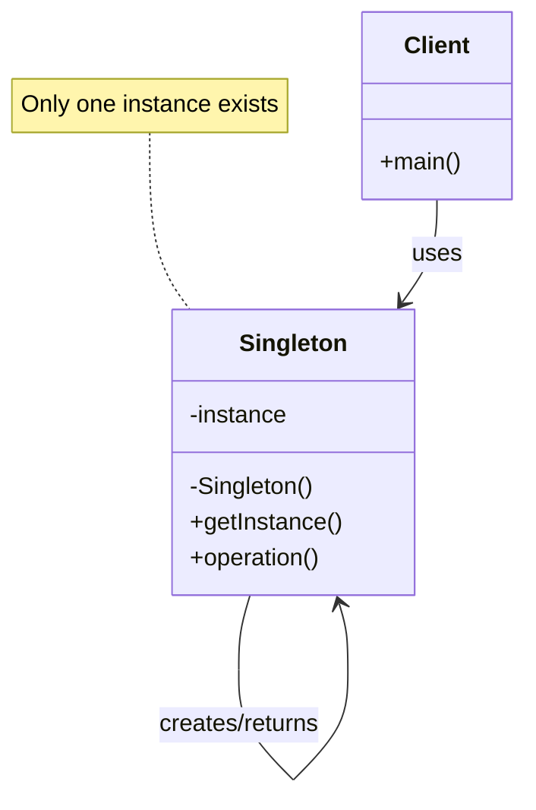
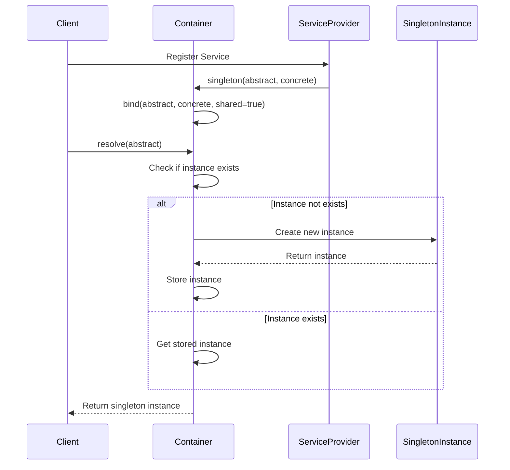

# Singleton Pattern

## Overview

The Singleton pattern ensures that a class has only one instance and provides a global point of access to it. This pattern is very useful when you need to control resource access, coordinate system behavior, or ensure that only one object instance exists.

## Problem Scenarios

In Laravel applications, we often need:
- Database connection management
- Configuration manager
- Logger
- Cache manager
- Application state management

## Solution

The Singleton pattern achieves uniqueness by privatizing the constructor and providing a static method to get the unique instance.

## Architecture Diagram

### Singleton Pattern Structure




### Singleton Lifecycle in Laravel



## Laravel Implementation

### 1. Basic Singleton Pattern

```php
<?php

namespace App\Patterns\Singleton;

// Basic singleton class
class BasicSingleton
{
    private static ?self $instance = null;
    
    // Private constructor to prevent external instantiation
    private function __construct()
    {
        // Initialization code
    }
    
    // Prevent cloning
    private function __clone() {}
    
    // Prevent unserialization
    public function __wakeup()
    {
        throw new \Exception("Cannot unserialize singleton");
    }
    
    // Static method to get instance
    public static function getInstance(): self
    {
        if (self::$instance === null) {
            self::$instance = new self();
        }
        
        return self::$instance;
    }
    
    public function operation(): string
    {
        return "Execute singleton operation";
    }
}
```

### 2. Thread-Safe Singleton Pattern

```php
<?php

namespace App\Patterns\Singleton;

// Thread-safe singleton class
class ThreadSafeSingleton
{
    private static ?self $instance = null;
    private static $lock = false;
    
    private function __construct() {}
    private function __clone() {}
    
    public function __wakeup()
    {
        throw new \Exception("Cannot unserialize singleton");
    }
    
    public static function getInstance(): self
    {
        if (self::$instance === null) {
            // Double-checked locking
            if (self::$lock === false) {
                self::$lock = true;
                
                if (self::$instance === null) {
                    self::$instance = new self();
                }
                
                self::$lock = false;
            }
        }
        
        return self::$instance;
    }
    
    public function operation(): string
    {
        return "Execute thread-safe singleton operation";
    }
}
```

### 3. Configuration Manager Singleton

```php
<?php

namespace App\Patterns\Singleton;

// Configuration manager singleton
class ConfigManager
{
    private static ?self $instance = null;
    private array $config = [];
    
    private function __construct()
    {
        // Load configuration files
        $this->loadConfig();
    }
    
    private function __clone() {}
    
    public function __wakeup()
    {
        throw new \Exception("Cannot unserialize singleton");
    }
    
    public static function getInstance(): self
    {
        if (self::$instance === null) {
            self::$instance = new self();
        }
        
        return self::$instance;
    }
    
    private function loadConfig(): void
    {
        // Simulate loading configuration
        $this->config = [
            'app' => [
                'name' => 'Laravel Design Patterns',
                'env' => 'production',
                'debug' => false,
            ],
            'database' => [
                'host' => 'localhost',
                'port' => 3306,
                'name' => 'laravel_dp',
            ],
            'cache' => [
                'driver' => 'redis',
                'ttl' => 3600,
            ],
        ];
    }
    
    public function get(string $key, $default = null)
    {
        $keys = explode('.', $key);
        $value = $this->config;
        
        foreach ($keys as $k) {
            if (!isset($value[$k])) {
                return $default;
            }
            $value = $value[$k];
        }
        
        return $value;
    }
    
    public function set(string $key, $value): void
    {
        $keys = explode('.', $key);
        $config = &$this->config;
        
        foreach ($keys as $k) {
            if (!isset($config[$k]) || !is_array($config[$k])) {
                $config[$k] = [];
            }
            $config = &$config[$k];
        }
        
        $config = $value;
    }
    
    public function has(string $key): bool
    {
        return $this->get($key) !== null;
    }
    
    public function all(): array
    {
        return $this->config;
    }
}
```

### 4. Logger Singleton

```php
<?php

namespace App\Patterns\Singleton;

// Logger singleton
class Logger
{
    private static ?self $instance = null;
    private string $logFile;
    private array $logs = [];
    
    private function __construct()
    {
        $this->logFile = storage_path('logs/singleton.log');
    }
    
    private function __clone() {}
    
    public function __wakeup()
    {
        throw new \Exception("Cannot unserialize singleton");
    }
    
    public static function getInstance(): self
    {
        if (self::$instance === null) {
            self::$instance = new self();
        }
        
        return self::$instance;
    }
    
    public function log(string $level, string $message, array $context = []): void
    {
        $timestamp = date('Y-m-d H:i:s');
        $contextStr = !empty($context) ? json_encode($context) : '';
        $logEntry = "[{$timestamp}] {$level}: {$message} {$contextStr}";
        
        // Store in memory
        $this->logs[] = $logEntry;
        
        // Write to file
        file_put_contents($this->logFile, $logEntry . PHP_EOL, FILE_APPEND | LOCK_EX);
    }
    
    public function info(string $message, array $context = []): void
    {
        $this->log('INFO', $message, $context);
    }
    
    public function warning(string $message, array $context = []): void
    {
        $this->log('WARNING', $message, $context);
    }
    
    public function error(string $message, array $context = []): void
    {
        $this->log('ERROR', $message, $context);
    }
    
    public function debug(string $message, array $context = []): void
    {
        $this->log('DEBUG', $message, $context);
    }
    
    public function getLogs(): array
    {
        return $this->logs;
    }
    
    public function clearLogs(): void
    {
        $this->logs = [];
        file_put_contents($this->logFile, '');
    }
}
```

### 5. Database Connection Singleton

```php
<?php

namespace App\Patterns\Singleton;

use PDO;
use PDOException;

// Database connection singleton
class DatabaseConnection
{
    private static ?self $instance = null;
    private ?PDO $connection = null;
    private array $config;
    
    private function __construct()
    {
        $this->config = [
            'host' => env('DB_HOST', 'localhost'),
            'port' => env('DB_PORT', '3306'),
            'database' => env('DB_DATABASE', 'laravel_dp'),
            'username' => env('DB_USERNAME', 'root'),
            'password' => env('DB_PASSWORD', ''),
            'charset' => 'utf8mb4',
        ];
        
        $this->connect();
    }
    
    private function __clone() {}
    
    public function __wakeup()
    {
        throw new \Exception("Cannot unserialize singleton");
    }
    
    public static function getInstance(): self
    {
        if (self::$instance === null) {
            self::$instance = new self();
        }
        
        return self::$instance;
    }
    
    private function connect(): void
    {
        try {
            $dsn = "mysql:host={$this->config['host']};port={$this->config['port']};dbname={$this->config['database']};charset={$this->config['charset']}";
            
            $this->connection = new PDO(
                $dsn,
                $this->config['username'],
                $this->config['password'],
                [
                    PDO::ATTR_ERRMODE => PDO::ERRMODE_EXCEPTION,
                    PDO::ATTR_DEFAULT_FETCH_MODE => PDO::FETCH_ASSOC,
                    PDO::ATTR_EMULATE_PREPARES => false,
                ]
            );
        } catch (PDOException $e) {
            throw new \Exception("Database connection failed: " . $e->getMessage());
        }
    }
    
    public function getConnection(): PDO
    {
        if ($this->connection === null) {
            $this->connect();
        }
        
        return $this->connection;
    }
    
    public function query(string $sql, array $params = []): array
    {
        try {
            $stmt = $this->connection->prepare($sql);
            $stmt->execute($params);
            return $stmt->fetchAll();
        } catch (PDOException $e) {
            throw new \Exception("Query execution failed: " . $e->getMessage());
        }
    }
    
    public function execute(string $sql, array $params = []): int
    {
        try {
            $stmt = $this->connection->prepare($sql);
            $stmt->execute($params);
            return $stmt->rowCount();
        } catch (PDOException $e) {
            throw new \Exception("Statement execution failed: " . $e->getMessage());
        }
    }
    
    public function lastInsertId(): string
    {
        return $this->connection->lastInsertId();
    }
    
    public function beginTransaction(): bool
    {
        return $this->connection->beginTransaction();
    }
    
    public function commit(): bool
    {
        return $this->connection->commit();
    }
    
    public function rollback(): bool
    {
        return $this->connection->rollback();
    }
}
```

### 6. Cache Manager Singleton

```php
<?php

namespace App\Patterns\Singleton;

// Cache manager singleton
class CacheManager
{
    private static ?self $instance = null;
    private array $cache = [];
    private int $defaultTtl = 3600; // 1 hour
    
    private function __construct() {}
    private function __clone() {}
    
    public function __wakeup()
    {
        throw new \Exception("Cannot unserialize singleton");
    }
    
    public static function getInstance(): self
    {
        if (self::$instance === null) {
            self::$instance = new self();
        }
        
        return self::$instance;
    }
    
    public function set(string $key, $value, ?int $ttl = null): void
    {
        $ttl = $ttl ?? $this->defaultTtl;
        $expireTime = time() + $ttl;
        
        $this->cache[$key] = [
            'value' => $value,
            'expire_time' => $expireTime,
        ];
    }
    
    public function get(string $key, $default = null)
    {
        if (!$this->has($key)) {
            return $default;
        }
        
        return $this->cache[$key]['value'];
    }
    
    public function has(string $key): bool
    {
        if (!isset($this->cache[$key])) {
            return false;
        }
        
        // Check if expired
        if (time() > $this->cache[$key]['expire_time']) {
            unset($this->cache[$key]);
            return false;
        }
        
        return true;
    }
    
    public function forget(string $key): void
    {
        unset($this->cache[$key]);
    }
    
    public function flush(): void
    {
        $this->cache = [];
    }
    
    public function remember(string $key, callable $callback, ?int $ttl = null)
    {
        if ($this->has($key)) {
            return $this->get($key);
        }
        
        $value = $callback();
        $this->set($key, $value, $ttl);
        
        return $value;
    }
    
    public function increment(string $key, int $value = 1): int
    {
        $current = $this->get($key, 0);
        $new = $current + $value;
        $this->set($key, $new);
        
        return $new;
    }
    
    public function decrement(string $key, int $value = 1): int
    {
        return $this->increment($key, -$value);
    }
    
    public function getStats(): array
    {
        $total = count($this->cache);
        $expired = 0;
        $valid = 0;
        
        foreach ($this->cache as $item) {
            if (time() > $item['expire_time']) {
                $expired++;
            } else {
                $valid++;
            }
        }
        
        return [
            'total' => $total,
            'valid' => $valid,
            'expired' => $expired,
        ];
    }
}
```

## Usage Examples

### Basic Singleton Usage

```php
<?php

// Get singleton instance
$singleton1 = BasicSingleton::getInstance();
$singleton2 = BasicSingleton::getInstance();

// Verify it's the same instance
var_dump($singleton1 === $singleton2); // true

echo $singleton1->operation(); // Execute singleton operation
```

### Configuration Manager Usage

```php
<?php

$config = ConfigManager::getInstance();

// Get configuration
echo $config->get('app.name'); // Laravel Design Patterns
echo $config->get('database.host'); // localhost
echo $config->get('cache.driver'); // redis

// Set configuration
$config->set('app.version', '1.0.0');
$config->set('features.api', true);

// Check if configuration exists
if ($config->has('database.host')) {
    echo "Database host is configured";
}

// Get all configuration
$allConfig = $config->all();
print_r($allConfig);
```

### Logger Usage

```php
<?php

$logger = Logger::getInstance();

// Log different levels
$logger->info('Application started', ['user_id' => 123]);
$logger->warning('High memory usage', ['memory' => '85%']);
$logger->error('Database connection failed', ['error' => 'Connection timeout']);
$logger->debug('Debug information', ['step' => 'validation']);

// Get logs from memory
$logs = $logger->getLogs();
foreach ($logs as $log) {
    echo $log . "\n";
}

// Clear logs
$logger->clearLogs();
```

### Database Connection Usage

```php
<?php

$db = DatabaseConnection::getInstance();

// Execute query
$users = $db->query('SELECT * FROM users WHERE active = ?', [1]);

// Execute insert
$db->execute('INSERT INTO users (name, email) VALUES (?, ?)', ['John', 'john@example.com']);
$userId = $db->lastInsertId();

// Transaction processing
$db->beginTransaction();
try {
    $db->execute('UPDATE users SET status = ? WHERE id = ?', ['inactive', $userId]);
    $db->execute('INSERT INTO user_logs (user_id, action) VALUES (?, ?)', [$userId, 'deactivated']);
    $db->commit();
} catch (Exception $e) {
    $db->rollback();
    throw $e;
}
```

### Cache Manager Usage

```php
<?php

$cache = CacheManager::getInstance();

// Set cache
$cache->set('user:123', ['name' => 'John', 'email' => 'john@example.com'], 1800);

// Get cache
$user = $cache->get('user:123');
if ($user) {
    echo "User name: " . $user['name'];
}

// Remember cache
$expensiveData = $cache->remember('expensive_calculation', function() {
    // Simulate expensive calculation
    sleep(2);
    return ['result' => rand(1, 1000)];
}, 3600);

// Counter
$cache->increment('page_views');
$cache->increment('api_calls', 5);

// Get statistics
$stats = $cache->getStats();
echo "Cache statistics: " . json_encode($stats);
```

## Practical Application in Laravel

### 1. Service Container

```php
<?php

// Laravel's service container itself is a singleton
$app = app(); // Get application instance
$config = app('config'); // Get configuration instance
$db = app('db'); // Get database instance
```

### 2. Singleton in Facade Pattern

```php
<?php

// Laravel's Facade pattern uses singleton underneath
use Illuminate\Support\Facades\DB;
use Illuminate\Support\Facades\Cache;
use Illuminate\Support\Facades\Log;

// These Facades are backed by singleton instances
DB::table('users')->get();
Cache::get('key');
Log::info('message');
```

### 3. Custom Singleton Service

```php
<?php

// Register singleton in service provider
class AppServiceProvider extends ServiceProvider
{
    public function register()
    {
        $this->app->singleton('config.manager', function ($app) {
            return new ConfigManager();
        });
        
        $this->app->singleton('logger', function ($app) {
            return new Logger();
        });
    }
}

// Usage
$configManager = app('config.manager');
$logger = app('logger');
```

## Advantages

1. **Control instance count**: Ensure only one instance exists
2. **Global access point**: Provide global access method
3. **Lazy initialization**: Create instance only when needed
4. **Resource saving**: Avoid creating duplicate objects

## Disadvantages

1. **Violates single responsibility principle**: Manages both instance and business logic
2. **Difficult to test**: Global state is hard to mock and test
3. **Hidden dependencies**: Users can't see dependency relationships
4. **Thread safety issues**: Requires special handling in multi-threaded environments

## Applicable Scenarios

1. **Resource management**: Database connections, file systems, etc.
2. **Configuration management**: Application configuration, system settings, etc.
3. **Logging**: Unified log management
4. **Cache management**: Global cache access

## Relationship with Other Patterns

- **Factory pattern**: Singleton can be used as factory implementation
- **Facade pattern**: Facade classes are often implemented as singletons
- **State pattern**: State objects are often implemented as singletons

## Best Practices

1. **Use dependency injection**: Avoid directly calling getInstance()
2. **Consider thread safety**: Ensure safety in multi-threaded environments
3. **Use cautiously**: Avoid overusing singleton pattern
4. **Test-friendly**: Provide reset or cleanup methods

The Singleton pattern is widely used in Laravel, but should be used cautiously, preferring more flexible approaches like dependency injection when possible.