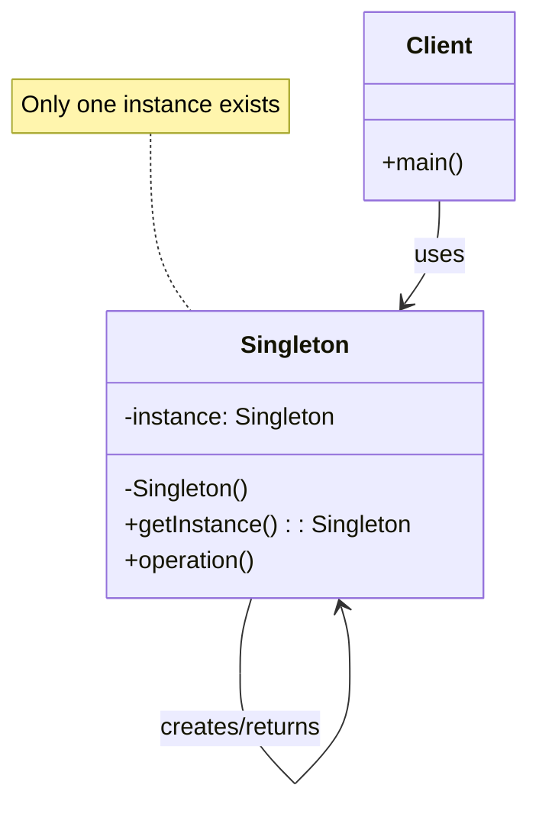
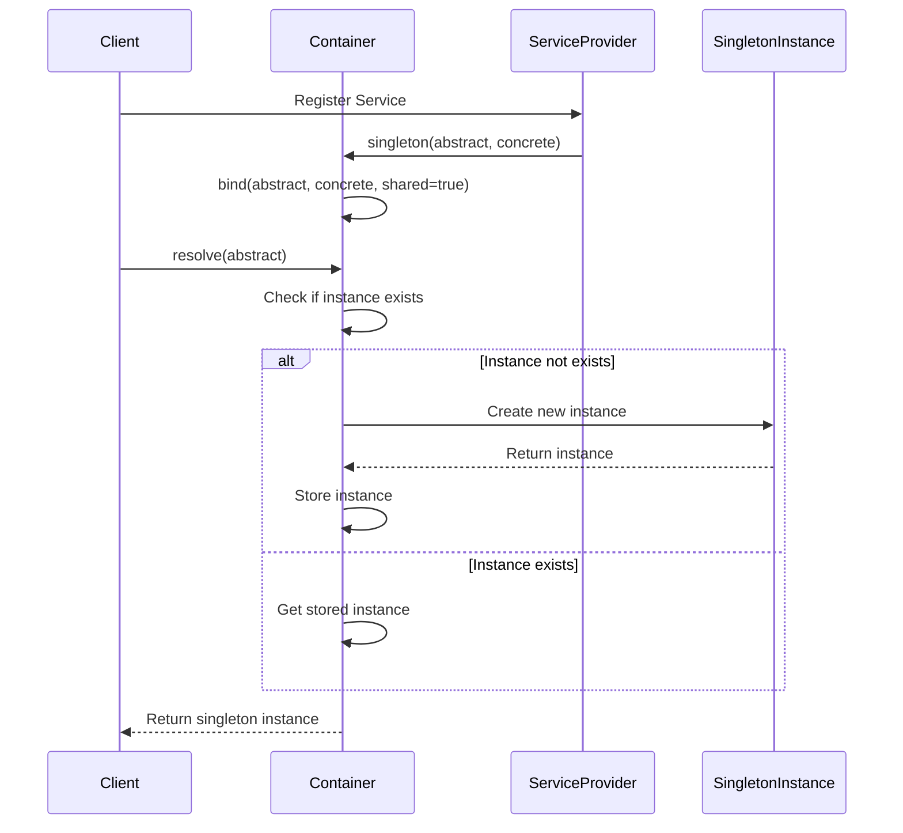

# Singleton Pattern

## Overview

The Singleton pattern ensures that a class has only one instance and provides a global point of access to it. This is one of the most commonly used design patterns, particularly suitable for scenarios that require globally unique instances, such as configuration management, database connections, and loggers.

## Architecture Diagram

### Singleton Pattern Structure



### Laravel Container Singleton Implementation

```mermaid
graph TB
    A[Client Request] --> B[Container::singleton()]
    B --> C{Instance Exists?}
    C -->|No| D[Create New Instance]
    C -->|Yes| E[Return Existing Instance]
    D --> F[Store in Container]
    F --> E
    E --> G[Return Instance to Client]
    
    style D fill:#e1f5fe
    style E fill:#f3e5f5
    style F fill:#fff3e0
```

### Singleton Lifecycle in Laravel



## Design Intent

- **Uniqueness**: Ensure only one instance of a class exists
- **Global Access**: Provide a unified access point
- **Resource Control**: Avoid redundant object creation, saving system resources
- **State Sharing**: Facilitate state information sharing across the system

## Implementation in Laravel

### 1. Container-Level Singleton Pattern

Laravel's service container itself is a typical implementation of the Singleton pattern. The container maintains a globally unique instance through the static variable `$instance`:

```php
// Illuminate\Container\Container.php
protected static $instance;

public static function getInstance()
{
    return static::$instance ??= new static;
}
```

### 2. Singleton Registration in Service Binding

In service providers, you can use the `singleton` method to register singleton services:

```php
// Register singleton in service provider
$this->app->singleton(ChannelManager::class, fn ($app) => new ChannelManager($app));
```

Implementation principle of the `singleton` method:

```php
public function singleton($abstract, $concrete = null)
{
    $this->bind($abstract, $concrete, true); // Third parameter true indicates shared instance
}
```

### 3. Core Implementation Mechanism of Singleton Pattern

In the `bind` method, when the `$shared` parameter is `true`, the service is registered as a singleton:

```php
public function bind($abstract, $concrete = null, $shared = false)
{
    // ... Parameter processing logic
    
    $this->bindings[$abstract] = ['concrete' => $concrete, 'shared' => $shared];
    
    // ... Other logic
}
```

When resolving services, the container checks if it's a singleton and returns the existing instance if available:

```php
protected function resolve($abstract, $parameters = [], $raiseEvents = true)
{
    // If singleton and already resolved, return the instance directly
    if (isset($this->instances[$abstract])) {
        return $this->instances[$abstract];
    }
    
    // ... Resolution logic
}
```

### 4. Global Access Points

Laravel provides multiple ways to access singleton instances:

**Through app() helper function:**
```php
$app = app(); // Get container singleton
$config = app('config'); // Get configuration singleton
```

**Through Container::getInstance():**
```php
use Illuminate\Container\Container;

$container = Container::getInstance();
$logger = $container->make('log');
```

**Through Facade pattern:**
```php
use Illuminate\Support\Facades\Config;

$value = Config::get('app.name');
```

## Practical Application Scenarios

### 1. Configuration Management
```php
// Service registration in config/app.php
'singletons' => [
    'config' => [Illuminate\Config\Repository::class, []],
],

// Usage
$value = config('app.timezone');
```

### 2. Event Dispatcher
```php
// Registration in EventServiceProvider
$this->app->singleton('events', function ($app) {
    return new Dispatcher($app);
});

// Usage
event(new UserRegistered($user));
```

### 3. Logging System
```php
// Registration in LogServiceProvider
$this->app->singleton('log', fn ($app) => new LogManager($app));

// Usage
logger()->info('User logged in', ['user_id' => $user->id]);
```

### 4. Database Connection
```php
// Database manager singleton
$this->app->singleton('db', function ($app) {
    return new DatabaseManager($app, $app['db.factory']);
});
```

## Source Code Analysis Points

### 1. Singleton Lifecycle Management

Laravel container maintains singleton instances through the `instances` array:

```php
protected $instances = [];
```

When a service is resolved as a singleton, the instance is stored in this array, and subsequent requests return the same instance.

### 2. Singleton Reset Mechanism

In testing or specific scenarios, you may need to reset singleton instances:

```php
public function forgetInstance($abstract)
{
    unset($this->instances[$abstract], $this->aliases[$abstract]);
}
```

### 3. Attribute-Level Singleton Support

Laravel 12 introduced attribute-level singleton declaration:

```php
use Illuminate\Container\Attributes\Singleton;

#[Singleton]
class CacheManager
{
    // This class will be automatically registered as a singleton
}
```

## Best Practices

1. **Use Singletons Appropriately**: Only use singleton pattern when you truly need globally unique instances
2. **Avoid State Pollution**: Singleton objects should remain stateless or read-only when possible
3. **Consider Testability**: Singletons may increase testing complexity; use dependency injection appropriately
4. **Thread Safety**: Ensure singleton thread safety in concurrent environments

## Relationship with Other Patterns

- **With Factory Pattern**: Singleton pattern often combines with factory pattern to ensure factory instance uniqueness
- **With Facade Pattern**: Facade pattern typically provides simplified interfaces based on singleton services
- **With Dependency Injection**: Singleton pattern is an important feature of dependency injection containers

## Summary

Laravel's implementation of the Singleton pattern reflects the essence of framework design: unified management of object lifecycles through the service container, ensuring both flexibility and performance optimization. Understanding this pattern is crucial for mastering Laravel architecture.