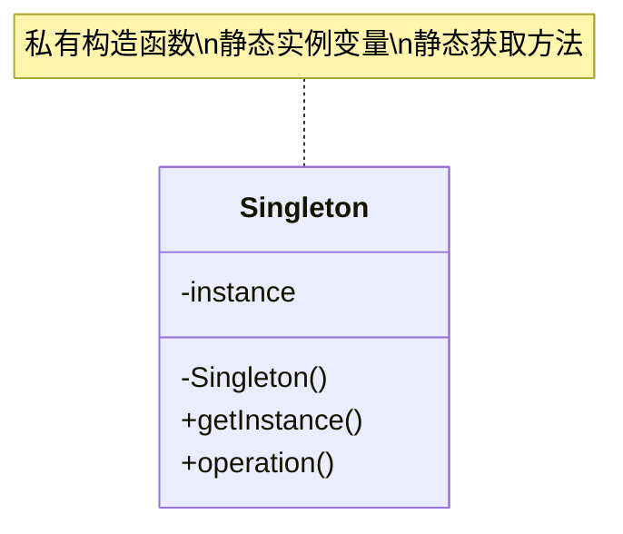
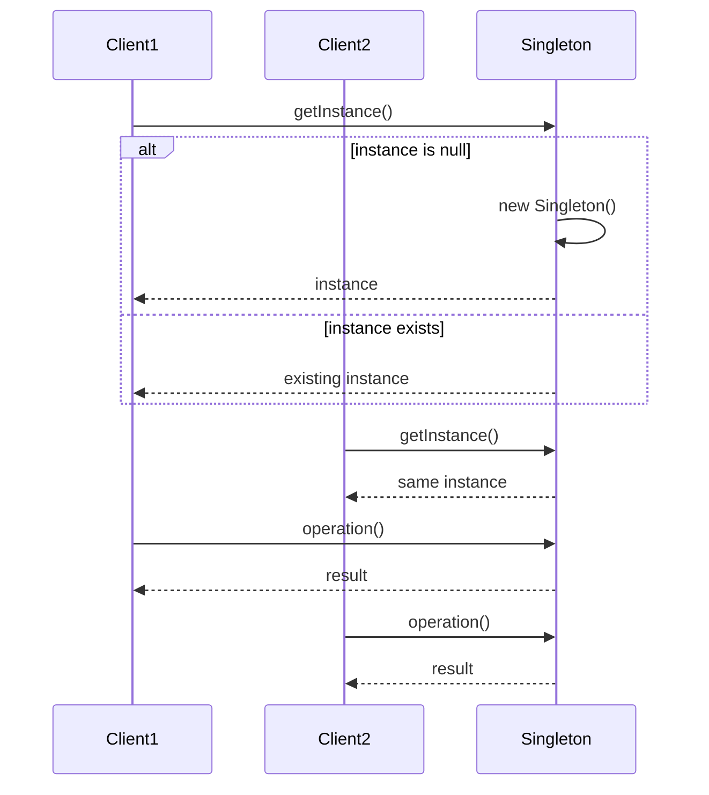

# 单例模式 (Singleton Pattern)

## 概述

单例模式确保一个类只有一个实例，并提供一个全局访问点。这个模式在需要控制资源访问、协调系统行为或者确保只有一个对象实例时非常有用。

## 问题场景

在Laravel应用中，我们经常需要：
- 数据库连接管理
- 配置管理器
- 日志记录器
- 缓存管理器
- 应用状态管理

## 解决方案

单例模式通过私有化构造函数，提供静态方法来获取唯一实例。

## UML类图



## Laravel实现

### 1. 基础单例模式

```php
<?php

namespace App\Patterns\Singleton;

// 基础单例类
class BasicSingleton
{
    private static ?self $instance = null;
    
    // 私有构造函数，防止外部实例化
    private function __construct()
    {
        // 初始化代码
    }
    
    // 防止克隆
    private function __clone() {}
    
    // 防止反序列化
    public function __wakeup()
    {
        throw new \Exception("Cannot unserialize singleton");
    }
    
    // 获取实例的静态方法
    public static function getInstance(): self
    {
        if (self::$instance === null) {
            self::$instance = new self();
        }
        
        return self::$instance;
    }
    
    public function operation(): string
    {
        return "执行单例操作";
    }
}
```

### 2. 线程安全的单例模式

```php
<?php

namespace App\Patterns\Singleton;

// 线程安全的单例类
class ThreadSafeSingleton
{
    private static ?self $instance = null;
    private static $lock = false;
    
    private function __construct() {}
    private function __clone() {}
    
    public function __wakeup()
    {
        throw new \Exception("Cannot unserialize singleton");
    }
    
    public static function getInstance(): self
    {
        if (self::$instance === null) {
            // 双重检查锁定
            if (self::$lock === false) {
                self::$lock = true;
                
                if (self::$instance === null) {
                    self::$instance = new self();
                }
                
                self::$lock = false;
            }
        }
        
        return self::$instance;
    }
    
    public function operation(): string
    {
        return "执行线程安全的单例操作";
    }
}
```

### 3. 配置管理器单例

```php
<?php

namespace App\Patterns\Singleton;

// 配置管理器单例
class ConfigManager
{
    private static ?self $instance = null;
    private array $config = [];
    
    private function __construct()
    {
        // 加载配置文件
        $this->loadConfig();
    }
    
    private function __clone() {}
    
    public function __wakeup()
    {
        throw new \Exception("Cannot unserialize singleton");
    }
    
    public static function getInstance(): self
    {
        if (self::$instance === null) {
            self::$instance = new self();
        }
        
        return self::$instance;
    }
    
    private function loadConfig(): void
    {
        // 模拟加载配置
        $this->config = [
            'app' => [
                'name' => 'Laravel Design Patterns',
                'env' => 'production',
                'debug' => false,
            ],
            'database' => [
                'host' => 'localhost',
                'port' => 3306,
                'name' => 'laravel_dp',
            ],
            'cache' => [
                'driver' => 'redis',
                'ttl' => 3600,
            ],
        ];
    }
    
    public function get(string $key, $default = null)
    {
        $keys = explode('.', $key);
        $value = $this->config;
        
        foreach ($keys as $k) {
            if (!isset($value[$k])) {
                return $default;
            }
            $value = $value[$k];
        }
        
        return $value;
    }
    
    public function set(string $key, $value): void
    {
        $keys = explode('.', $key);
        $config = &$this->config;
        
        foreach ($keys as $k) {
            if (!isset($config[$k]) || !is_array($config[$k])) {
                $config[$k] = [];
            }
            $config = &$config[$k];
        }
        
        $config = $value;
    }
    
    public function has(string $key): bool
    {
        return $this->get($key) !== null;
    }
    
    public function all(): array
    {
        return $this->config;
    }
}
```

### 4. 日志管理器单例

```php
<?php

namespace App\Patterns\Singleton;

// 日志管理器单例
class Logger
{
    private static ?self $instance = null;
    private string $logFile;
    private array $logs = [];
    
    private function __construct()
    {
        $this->logFile = storage_path('logs/singleton.log');
    }
    
    private function __clone() {}
    
    public function __wakeup()
    {
        throw new \Exception("Cannot unserialize singleton");
    }
    
    public static function getInstance(): self
    {
        if (self::$instance === null) {
            self::$instance = new self();
        }
        
        return self::$instance;
    }
    
    public function log(string $level, string $message, array $context = []): void
    {
        $timestamp = date('Y-m-d H:i:s');
        $contextStr = !empty($context) ? json_encode($context) : '';
        $logEntry = "[{$timestamp}] {$level}: {$message} {$contextStr}";
        
        // 存储到内存
        $this->logs[] = $logEntry;
        
        // 写入文件
        file_put_contents($this->logFile, $logEntry . PHP_EOL, FILE_APPEND | LOCK_EX);
    }
    
    public function info(string $message, array $context = []): void
    {
        $this->log('INFO', $message, $context);
    }
    
    public function warning(string $message, array $context = []): void
    {
        $this->log('WARNING', $message, $context);
    }
    
    public function error(string $message, array $context = []): void
    {
        $this->log('ERROR', $message, $context);
    }
    
    public function debug(string $message, array $context = []): void
    {
        $this->log('DEBUG', $message, $context);
    }
    
    public function getLogs(): array
    {
        return $this->logs;
    }
    
    public function clearLogs(): void
    {
        $this->logs = [];
        file_put_contents($this->logFile, '');
    }
}
```

### 5. 数据库连接单例

```php
<?php

namespace App\Patterns\Singleton;

use PDO;
use PDOException;

// 数据库连接单例
class DatabaseConnection
{
    private static ?self $instance = null;
    private ?PDO $connection = null;
    private array $config;
    
    private function __construct()
    {
        $this->config = [
            'host' => env('DB_HOST', 'localhost'),
            'port' => env('DB_PORT', '3306'),
            'database' => env('DB_DATABASE', 'laravel_dp'),
            'username' => env('DB_USERNAME', 'root'),
            'password' => env('DB_PASSWORD', ''),
            'charset' => 'utf8mb4',
        ];
        
        $this->connect();
    }
    
    private function __clone() {}
    
    public function __wakeup()
    {
        throw new \Exception("Cannot unserialize singleton");
    }
    
    public static function getInstance(): self
    {
        if (self::$instance === null) {
            self::$instance = new self();
        }
        
        return self::$instance;
    }
    
    private function connect(): void
    {
        try {
            $dsn = "mysql:host={$this->config['host']};port={$this->config['port']};dbname={$this->config['database']};charset={$this->config['charset']}";
            
            $this->connection = new PDO(
                $dsn,
                $this->config['username'],
                $this->config['password'],
                [
                    PDO::ATTR_ERRMODE => PDO::ERRMODE_EXCEPTION,
                    PDO::ATTR_DEFAULT_FETCH_MODE => PDO::FETCH_ASSOC,
                    PDO::ATTR_EMULATE_PREPARES => false,
                ]
            );
        } catch (PDOException $e) {
            throw new \Exception("数据库连接失败: " . $e->getMessage());
        }
    }
    
    public function getConnection(): PDO
    {
        if ($this->connection === null) {
            $this->connect();
        }
        
        return $this->connection;
    }
    
    public function query(string $sql, array $params = []): array
    {
        try {
            $stmt = $this->connection->prepare($sql);
            $stmt->execute($params);
            return $stmt->fetchAll();
        } catch (PDOException $e) {
            throw new \Exception("查询执行失败: " . $e->getMessage());
        }
    }
    
    public function execute(string $sql, array $params = []): int
    {
        try {
            $stmt = $this->connection->prepare($sql);
            $stmt->execute($params);
            return $stmt->rowCount();
        } catch (PDOException $e) {
            throw new \Exception("语句执行失败: " . $e->getMessage());
        }
    }
    
    public function lastInsertId(): string
    {
        return $this->connection->lastInsertId();
    }
    
    public function beginTransaction(): bool
    {
        return $this->connection->beginTransaction();
    }
    
    public function commit(): bool
    {
        return $this->connection->commit();
    }
    
    public function rollback(): bool
    {
        return $this->connection->rollback();
    }
}
```

### 6. 缓存管理器单例

```php
<?php

namespace App\Patterns\Singleton;

// 缓存管理器单例
class CacheManager
{
    private static ?self $instance = null;
    private array $cache = [];
    private int $defaultTtl = 3600; // 1小时
    
    private function __construct() {}
    private function __clone() {}
    
    public function __wakeup()
    {
        throw new \Exception("Cannot unserialize singleton");
    }
    
    public static function getInstance(): self
    {
        if (self::$instance === null) {
            self::$instance = new self();
        }
        
        return self::$instance;
    }
    
    public function set(string $key, $value, ?int $ttl = null): void
    {
        $ttl = $ttl ?? $this->defaultTtl;
        $expireTime = time() + $ttl;
        
        $this->cache[$key] = [
            'value' => $value,
            'expire_time' => $expireTime,
        ];
    }
    
    public function get(string $key, $default = null)
    {
        if (!$this->has($key)) {
            return $default;
        }
        
        return $this->cache[$key]['value'];
    }
    
    public function has(string $key): bool
    {
        if (!isset($this->cache[$key])) {
            return false;
        }
        
        // 检查是否过期
        if (time() > $this->cache[$key]['expire_time']) {
            unset($this->cache[$key]);
            return false;
        }
        
        return true;
    }
    
    public function forget(string $key): void
    {
        unset($this->cache[$key]);
    }
    
    public function flush(): void
    {
        $this->cache = [];
    }
    
    public function remember(string $key, callable $callback, ?int $ttl = null)
    {
        if ($this->has($key)) {
            return $this->get($key);
        }
        
        $value = $callback();
        $this->set($key, $value, $ttl);
        
        return $value;
    }
    
    public function increment(string $key, int $value = 1): int
    {
        $current = $this->get($key, 0);
        $new = $current + $value;
        $this->set($key, $new);
        
        return $new;
    }
    
    public function decrement(string $key, int $value = 1): int
    {
        return $this->increment($key, -$value);
    }
    
    public function getStats(): array
    {
        $total = count($this->cache);
        $expired = 0;
        $valid = 0;
        
        foreach ($this->cache as $item) {
            if (time() > $item['expire_time']) {
                $expired++;
            } else {
                $valid++;
            }
        }
        
        return [
            'total' => $total,
            'valid' => $valid,
            'expired' => $expired,
        ];
    }
}
```

## 使用示例

### 基础单例使用

```php
<?php

// 获取单例实例
$singleton1 = BasicSingleton::getInstance();
$singleton2 = BasicSingleton::getInstance();

// 验证是同一个实例
var_dump($singleton1 === $singleton2); // true

echo $singleton1->operation(); // 执行单例操作
```

### 配置管理器使用

```php
<?php

$config = ConfigManager::getInstance();

// 获取配置
echo $config->get('app.name'); // Laravel Design Patterns
echo $config->get('database.host'); // localhost
echo $config->get('cache.driver'); // redis

// 设置配置
$config->set('app.version', '1.0.0');
$config->set('features.api', true);

// 检查配置是否存在
if ($config->has('database.host')) {
    echo "数据库主机已配置";
}

// 获取所有配置
$allConfig = $config->all();
print_r($allConfig);
```

### 日志管理器使用

```php
<?php

$logger = Logger::getInstance();

// 记录不同级别的日志
$logger->info('应用启动', ['user_id' => 123]);
$logger->warning('内存使用率较高', ['memory' => '85%']);
$logger->error('数据库连接失败', ['error' => 'Connection timeout']);
$logger->debug('调试信息', ['step' => 'validation']);

// 获取内存中的日志
$logs = $logger->getLogs();
foreach ($logs as $log) {
    echo $log . "\n";
}

// 清除日志
$logger->clearLogs();
```

### 数据库连接使用

```php
<?php

$db = DatabaseConnection::getInstance();

// 执行查询
$users = $db->query('SELECT * FROM users WHERE active = ?', [1]);

// 执行插入
$db->execute('INSERT INTO users (name, email) VALUES (?, ?)', ['张三', 'zhangsan@example.com']);
$userId = $db->lastInsertId();

// 事务处理
$db->beginTransaction();
try {
    $db->execute('UPDATE users SET status = ? WHERE id = ?', ['inactive', $userId]);
    $db->execute('INSERT INTO user_logs (user_id, action) VALUES (?, ?)', [$userId, 'deactivated']);
    $db->commit();
} catch (Exception $e) {
    $db->rollback();
    throw $e;
}
```

### 缓存管理器使用

```php
<?php

$cache = CacheManager::getInstance();

// 设置缓存
$cache->set('user:123', ['name' => '张三', 'email' => 'zhangsan@example.com'], 1800);

// 获取缓存
$user = $cache->get('user:123');
if ($user) {
    echo "用户姓名: " . $user['name'];
}

// 记忆缓存
$expensiveData = $cache->remember('expensive_calculation', function() {
    // 模拟耗时计算
    sleep(2);
    return ['result' => rand(1, 1000)];
}, 3600);

// 计数器
$cache->increment('page_views');
$cache->increment('api_calls', 5);

// 获取统计信息
$stats = $cache->getStats();
echo "缓存统计: " . json_encode($stats);
```

## Laravel中的实际应用

### 1. 服务容器

```php
<?php

// Laravel的服务容器本身就是单例
$app = app(); // 获取应用实例
$config = app('config'); // 获取配置实例
$db = app('db'); // 获取数据库实例
```

### 2. Facade模式中的单例

```php
<?php

// Laravel的Facade底层使用单例
use Illuminate\Support\Facades\DB;
use Illuminate\Support\Facades\Cache;
use Illuminate\Support\Facades\Log;

// 这些Facade背后都是单例实例
DB::table('users')->get();
Cache::get('key');
Log::info('message');
```

### 3. 自定义单例服务

```php
<?php

// 在服务提供者中注册单例
class AppServiceProvider extends ServiceProvider
{
    public function register()
    {
        $this->app->singleton('config.manager', function ($app) {
            return new ConfigManager();
        });
        
        $this->app->singleton('logger', function ($app) {
            return new Logger();
        });
    }
}

// 使用
$configManager = app('config.manager');
$logger = app('logger');
```

## 时序图



## 优点

1. **控制实例数量**：确保只有一个实例
2. **全局访问点**：提供全局访问方式
3. **延迟初始化**：只在需要时创建实例
4. **节省资源**：避免重复创建相同对象

## 缺点

1. **违反单一职责原则**：既管理实例又处理业务逻辑
2. **难以测试**：全局状态难以模拟和测试
3. **隐藏依赖**：使用者看不到依赖关系
4. **线程安全问题**：多线程环境需要特殊处理

## 适用场景

1. **资源管理**：数据库连接、文件系统等
2. **配置管理**：应用配置、系统设置等
3. **日志记录**：统一的日志管理
4. **缓存管理**：全局缓存访问

## 与其他模式的关系

- **工厂模式**：单例可以作为工厂的实现方式
- **外观模式**：外观类通常实现为单例
- **状态模式**：状态对象通常实现为单例

## 最佳实践

1. **使用依赖注入**：避免直接调用getInstance()
2. **考虑线程安全**：多线程环境下的安全性
3. **谨慎使用**：避免过度使用单例模式
4. **测试友好**：提供重置或清理方法

单例模式在Laravel中有广泛应用，但应该谨慎使用，优先考虑依赖注入等更灵活的方式。