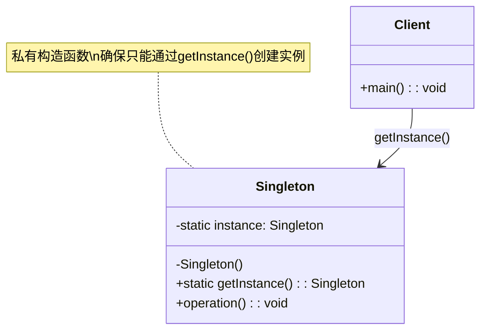
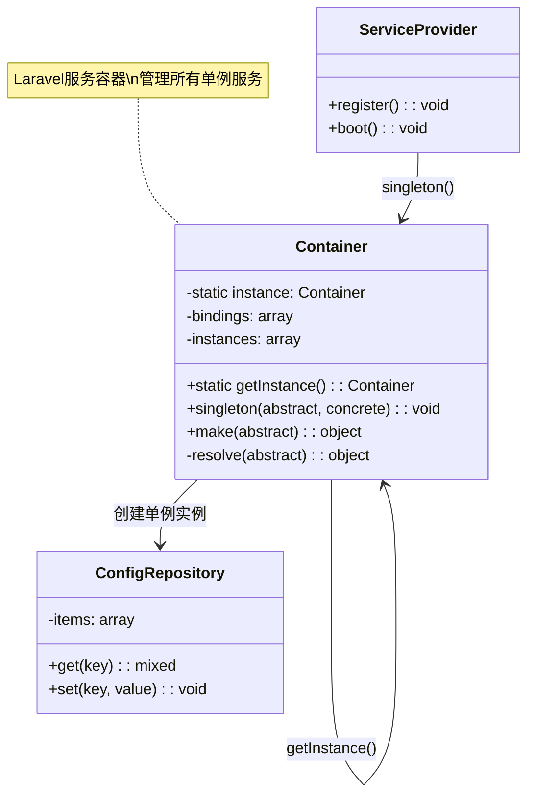
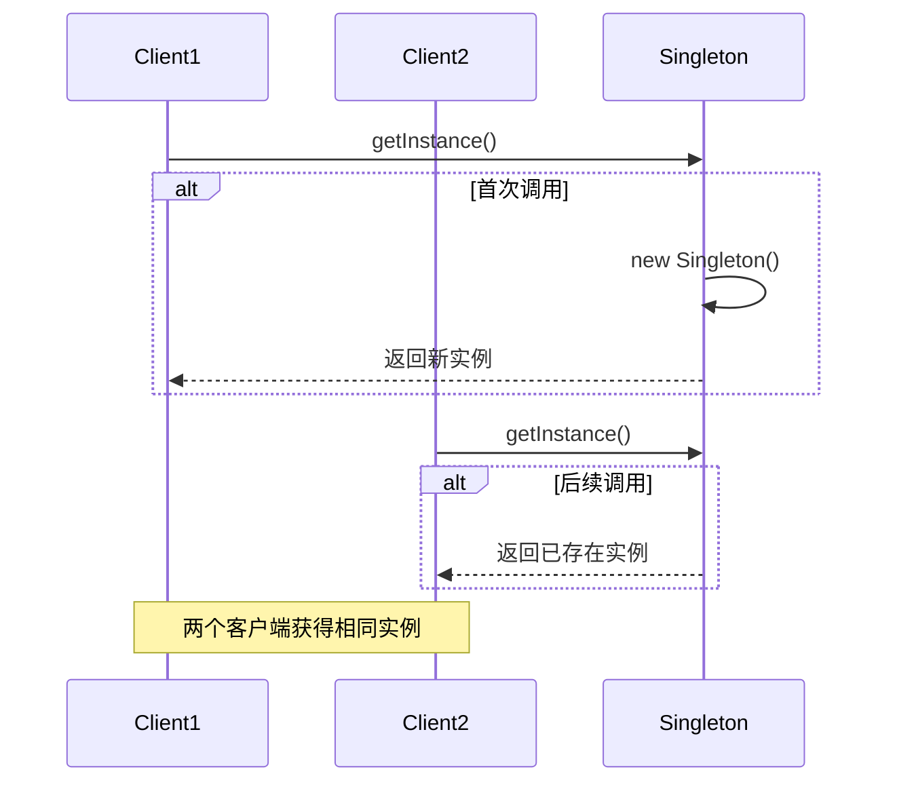
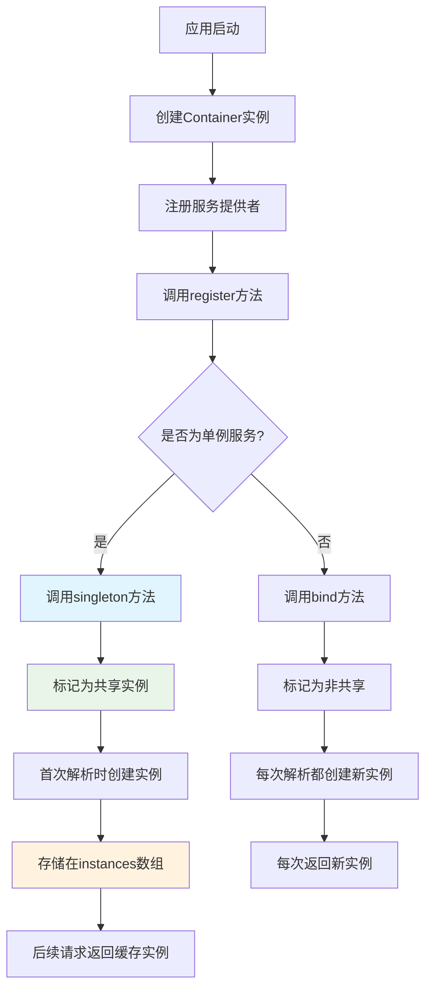

# 单例模式 (Singleton Pattern)

## 概述

单例模式确保一个类只有一个实例，并提供一个全局访问点。这是最常用的设计模式之一，特别适用于需要全局唯一实例的场景，如配置管理、数据库连接、日志记录器等。

## 架构图

### 单例模式类图


### Laravel 容器单例实现


### 单例模式时序图


### Laravel 服务容器单例流程


## 设计意图

- **唯一性**：确保类只有一个实例存在
- **全局访问**：提供统一的访问入口
- **资源控制**：避免重复创建对象，节省系统资源
- **状态共享**：便于在系统各处共享状态信息

## Laravel 中的实现

### 1. 容器级别的单例模式

Laravel 的服务容器本身就是单例模式的典型实现。容器通过静态变量 `$instance` 来维护全局唯一的实例：

```php
// Illuminate\Container\Container.php
protected static $instance;

public static function getInstance()
{
    return static::$instance ??= new static;
}
```

### 2. 服务绑定中的单例注册

在服务提供者中，可以使用 `singleton` 方法注册单例服务：

```php
// 在服务提供者中注册单例
$this->app->singleton(ChannelManager::class, fn ($app) => new ChannelManager($app));
```

`singleton` 方法的实现原理：

```php
public function singleton($abstract, $concrete = null)
{
    $this->bind($abstract, $concrete, true); // 第三个参数 true 表示共享实例
}
```

### 3. 单例模式的核心实现机制

在 `bind` 方法中，当 `$shared` 参数为 `true` 时，服务会被注册为单例：

```php
public function bind($abstract, $concrete = null, $shared = false)
{
    // ... 参数处理逻辑
    
    $this->bindings[$abstract] = ['concrete' => $concrete, 'shared' => $shared];
    
    // ... 其他逻辑
}
```

当解析服务时，容器会检查是否为单例，如果是则返回已存在的实例：

```php
protected function resolve($abstract, $parameters = [], $raiseEvents = true)
{
    // 如果是单例且已解析过，直接返回实例
    if (isset($this->instances[$abstract])) {
        return $this->instances[$abstract];
    }
    
    // ... 解析逻辑
}
```

### 4. 全局访问点

Laravel 提供了多种访问单例实例的方式：

**通过 app() 辅助函数：**
```php
$app = app(); // 获取容器单例
$config = app('config'); // 获取配置单例
```

**通过 Container::getInstance()：**
```php
use Illuminate\Container\Container;

$container = Container::getInstance();
$logger = $container->make('log');
```

**通过门面模式：**
```php
use Illuminate\Support\Facades\Config;

$value = Config::get('app.name');
```

## 实际应用场景

### 1. 配置管理
```php
// config/app.php 中的服务注册
'singletons' => [
    'config' => [Illuminate\Config\Repository::class, []],
],

// 使用方式
$value = config('app.timezone');
```

### 2. 事件调度器
```php
// EventServiceProvider 中的注册
$this->app->singleton('events', function ($app) {
    return new Dispatcher($app);
});

// 使用方式
event(new UserRegistered($user));
```

### 3. 日志系统
```php
// LogServiceProvider 中的注册
$this->app->singleton('log', fn ($app) => new LogManager($app));

// 使用方式
logger()->info('User logged in', ['user_id' => $user->id]);
```

### 4. 数据库连接
```php
// 数据库管理器单例
$this->app->singleton('db', function ($app) {
    return new DatabaseManager($app, $app['db.factory']);
});
```

## 源码分析要点

### 1. 单例的生命周期管理

Laravel 容器通过 `instances` 数组来维护单例实例：

```php
protected $instances = [];
```

当服务被解析为单例时，实例会被存储在这个数组中，后续请求都会返回同一个实例。

### 2. 单例的重置机制

在测试或特定场景下，可能需要重置单例实例：

```php
public function forgetInstance($abstract)
{
    unset($this->instances[$abstract], $this->aliases[$abstract]);
}
```

### 3. 属性级别的单例支持

Laravel 12 引入了属性级别的单例声明：

```php
use Illuminate\Container\Attributes\Singleton;

#[Singleton]
class CacheManager
{
    // 这个类会自动被注册为单例
}
```

## 最佳实践

1. **合理使用单例**：只在真正需要全局唯一实例时使用单例模式
2. **避免状态污染**：单例对象应尽量保持无状态或只读状态
3. **考虑测试性**：单例可能增加测试复杂度，合理使用依赖注入
4. **线程安全**：在并发环境下确保单例的线程安全性

## 与其他模式的关系

- **与工厂模式**：单例模式常与工厂模式结合，确保工厂实例的唯一性
- **与门面模式**：门面模式通常基于单例服务提供简化接口
- **与依赖注入**：单例模式是依赖注入容器的重要特性

## 总结

Laravel 的单例模式实现体现了框架设计的精髓：通过服务容器统一管理对象生命周期，既保证了灵活性，又提供了性能优化。理解这一模式对于深入掌握 Laravel 架构至关重要。