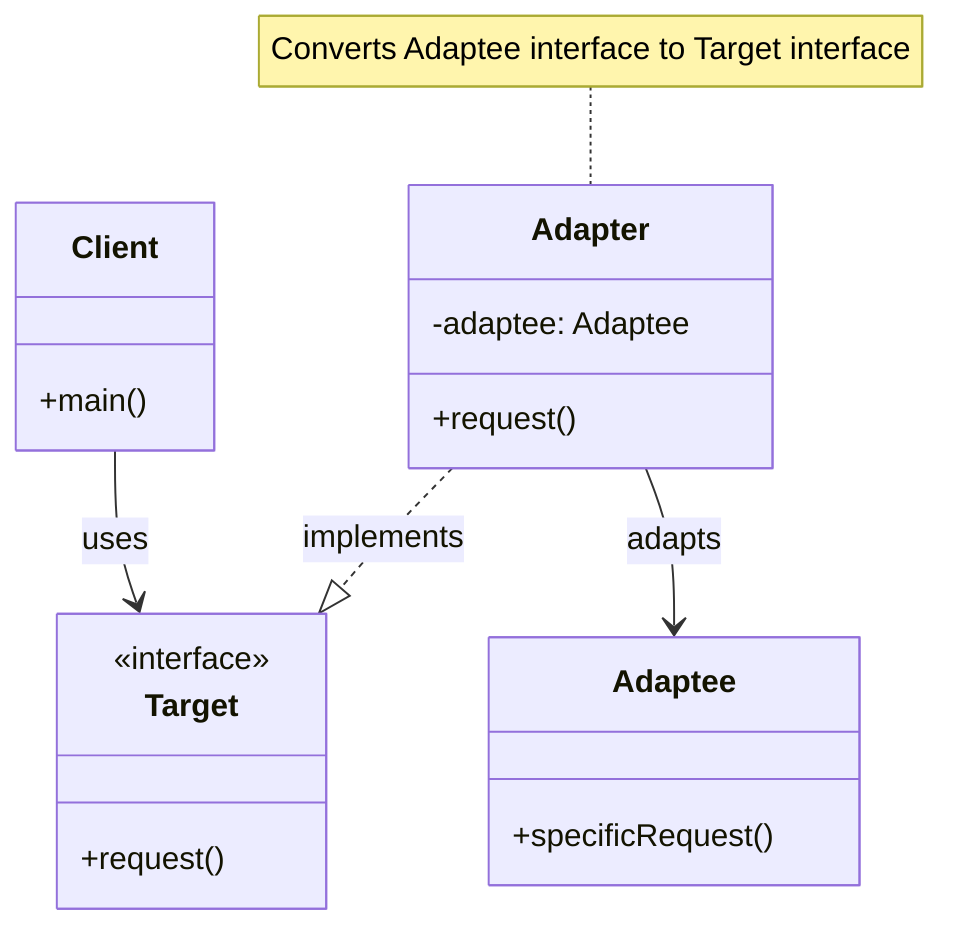
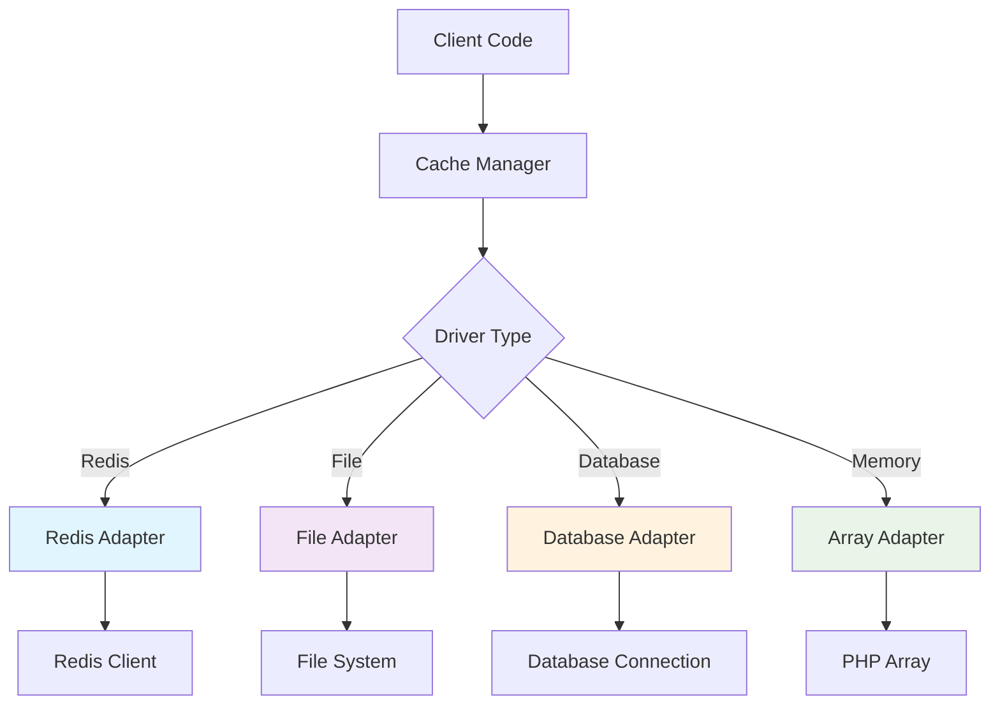
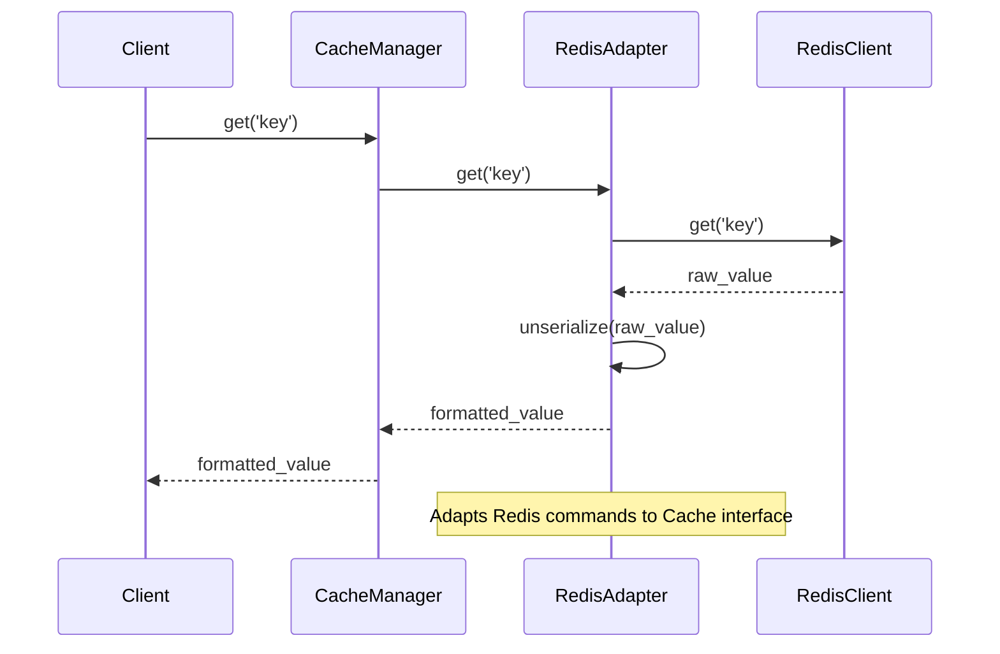

# Adapter Pattern

## Overview

Convert the interface of a class into another interface clients expect. The Adapter pattern allows classes to work together that couldn't otherwise because of incompatible interfaces.

## Architecture Diagram

### Adapter Pattern Structure



### Laravel Cache Adapter Implementation



### Adapter Pattern Flow



## Implementation in Laravel

### 1. Cache System Adapters

Laravel's cache system uses the Adapter pattern to support multiple storage backends:

```php
// Illuminate\Cache\CacheManager.php
class CacheManager implements FactoryContract
{
    protected function createRedisDriver(array $config)
    {
        $redis = $this->app['redis'];
        $connection = $config['connection'] ?? 'default';
        
        return $this->repository(new RedisStore($redis, $this->getPrefix($config), $connection));
    }
    
    protected function createFileDriver(array $config)
    {
        return $this->repository(new FileStore($this->app['files'], $config['path']));
    }
}
```

### 2. Database Query Builder Adapters

Laravel provides adapters for different database systems:

```php
// Different database adapters implementing the same interface
class MySqlGrammar extends Grammar
{
    public function compileSelect(Builder $query)
    {
        // MySQL-specific SQL generation
    }
}

class PostgresGrammar extends Grammar  
{
    public function compileSelect(Builder $query)
    {
        // PostgreSQL-specific SQL generation
    }
}
```

### 3. Session Storage Adapters

```php
// Session storage adapters
class FileSessionHandler implements SessionHandlerInterface
{
    public function read($sessionId)
    {
        return $this->files->get($this->path.'/'.$sessionId, '');
    }
}

class DatabaseSessionHandler implements SessionHandlerInterface
{
    public function read($sessionId)
    {
        $session = $this->getQuery()->find($sessionId);
        return $session ? base64_decode($session->payload) : '';
    }
}
```