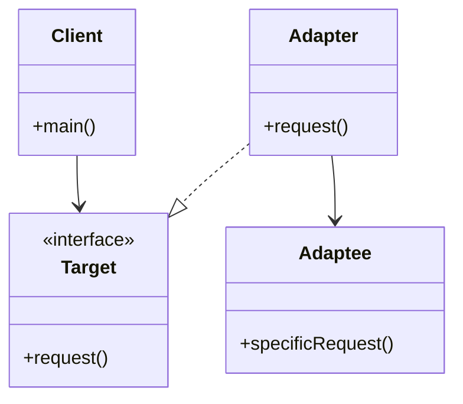
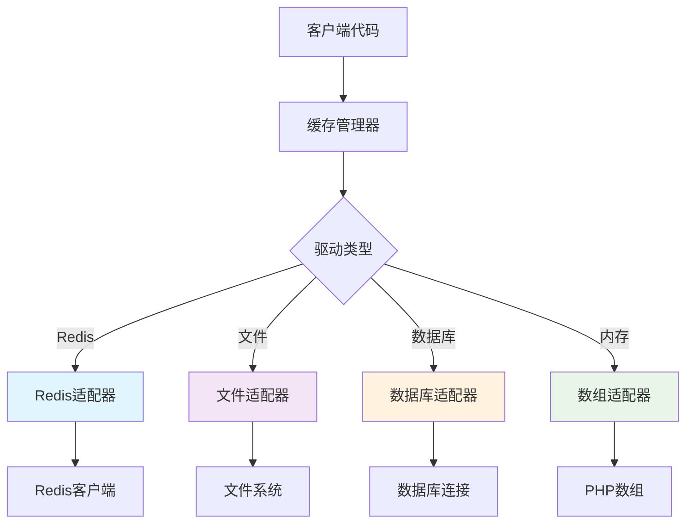
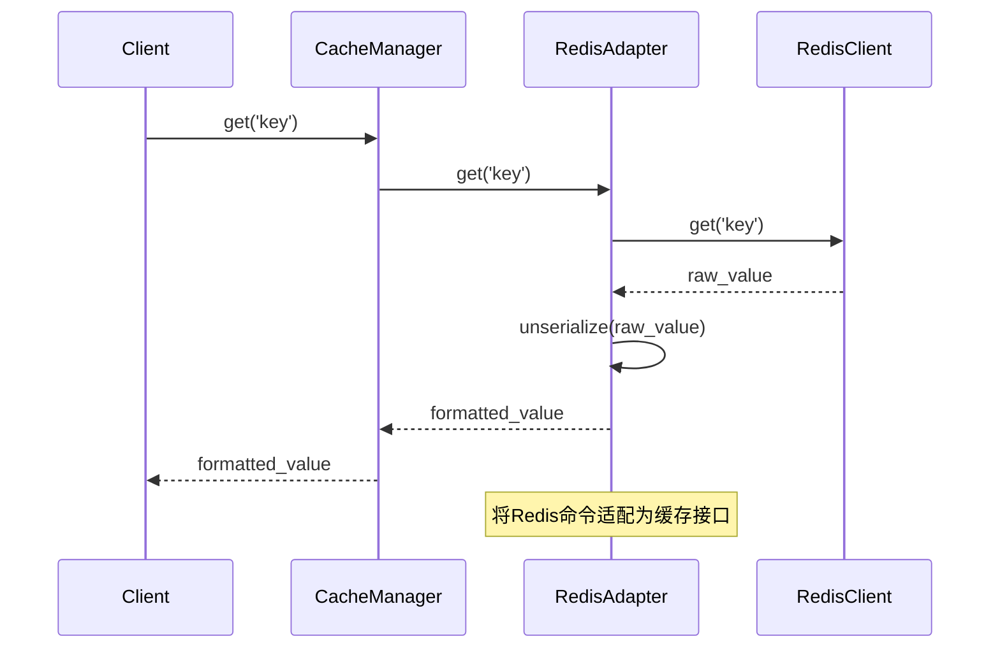

# 适配器模式 (Adapter Pattern)

## 概述

将一个类的接口转换成客户期望的另一个接口。适配器模式使得原本由于接口不兼容而不能一起工作的类可以协同工作。

## 架构图

### 适配器模式结构



### Laravel缓存适配器实现



### 适配器模式流程



## Laravel中的实现

### 1. 缓存系统适配器

Laravel的缓存系统使用适配器模式支持多种存储后端：

```php
// Illuminate\Cache\CacheManager.php
class CacheManager implements FactoryContract
{
    protected function createRedisDriver(array $config)
    {
        $redis = $this->app['redis'];
        $connection = $config['connection'] ?? 'default';
        
        return $this->repository(new RedisStore($redis, $this->getPrefix($config), $connection));
    }
    
    protected function createFileDriver(array $config)
    {
        return $this->repository(new FileStore($this->app['files'], $config['path']));
    }
}
```

### 2. 数据库查询构建器适配器

Laravel为不同的数据库系统提供适配器：

```php
// 实现相同接口的不同数据库适配器
class MySqlGrammar extends Grammar
{
    public function compileSelect(Builder $query)
    {
        // MySQL特定的SQL生成
    }
}

class PostgresGrammar extends Grammar  
{
    public function compileSelect(Builder $query)
    {
        // PostgreSQL特定的SQL生成
    }
}
```

### 3. 会话存储适配器

```php
// 会话存储适配器
class FileSessionHandler implements SessionHandlerInterface
{
    public function read($sessionId)
    {
        return $this->files->get($this->path.'/'.$sessionId, '');
    }
}

class DatabaseSessionHandler implements SessionHandlerInterface
{
    public function read($sessionId)
    {
        $session = $this->getQuery()->find($sessionId);
        return $session ? base64_decode($session->payload) : '';
    }
}
```

## 使用场景

- **接口兼容性**：当需要让现有类与不兼容接口的代码协同工作时
- **第三方库集成**：集成第三方库时，需要适配其接口到现有系统
- **多后端支持**：支持多种存储后端（如缓存、数据库、文件系统）

## 优点

- **灵活性**：可以在不修改现有代码的情况下添加新的适配器
- **复用性**：现有类可以在新系统中复用
- **解耦**：客户端代码与具体实现解耦

## 缺点

- **复杂性**：增加了额外的适配器类
- **性能开销**：额外的调用层次可能带来轻微性能影响