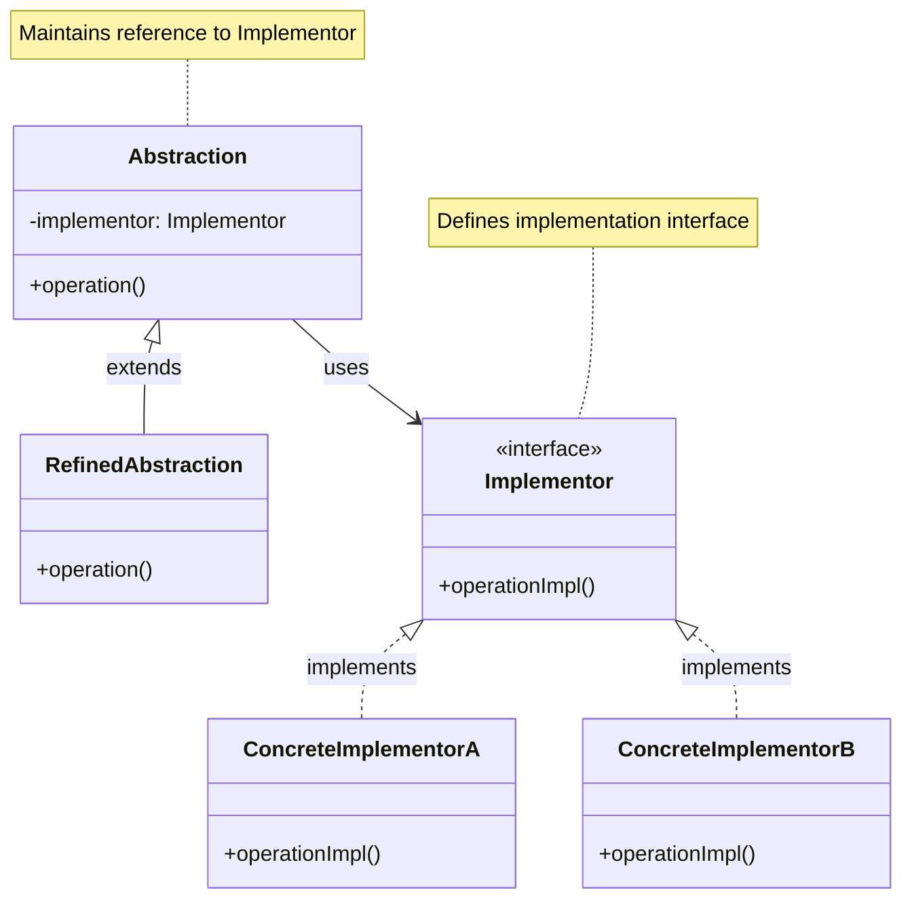
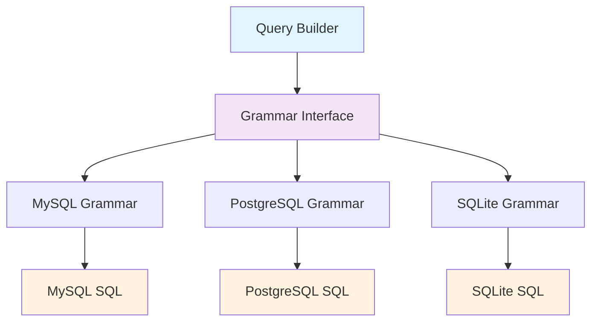

# Bridge Pattern

## Overview

Decouple an abstraction from its implementation so that the two can vary independently. The Bridge pattern separates an abstraction from its implementation so that both can be modified independently.

## Architecture Diagram

### Bridge Pattern Structure



### Laravel Database Bridge



## Implementation in Laravel

### 1. Database Query Grammar Bridge

Laravel uses the Bridge pattern to separate query building from SQL generation:

```php
// Illuminate\Database\Query\Builder.php (Abstraction)
class Builder
{
    protected $grammar;
    protected $processor;
    
    public function __construct(ConnectionInterface $connection, Grammar $grammar = null, Processor $processor = null)
    {
        $this->connection = $connection;
        $this->grammar = $grammar ?: $connection->getQueryGrammar();
        $this->processor = $processor ?: $connection->getPostProcessor();
    }
    
    public function toSql()
    {
        return $this->grammar->compileSelect($this);
    }
}

// Illuminate\Database\Query\Grammars\Grammar.php (Implementor)
abstract class Grammar
{
    abstract public function compileSelect(Builder $query);
    abstract public function compileInsert(Builder $query, array $values);
    abstract public function compileUpdate(Builder $query, array $values);
    abstract public function compileDelete(Builder $query);
}

// Concrete implementations
class MySqlGrammar extends Grammar
{
    public function compileSelect(Builder $query)
    {
        // MySQL-specific SQL generation
        return trim($this->concatenate($this->compileComponents($query)));
    }
}

class PostgresGrammar extends Grammar
{
    public function compileSelect(Builder $query)
    {
        // PostgreSQL-specific SQL generation
        return trim($this->concatenate($this->compileComponents($query)));
    }
}
```

### 2. Cache Store Bridge

```php
// Cache manager bridges different storage implementations
class CacheManager extends Manager implements FactoryContract
{
    protected function createRedisDriver(array $config)
    {
        $redis = $this->app['redis'];
        $connection = $config['connection'] ?? 'default';
        
        return $this->repository(new RedisStore($redis, $this->getPrefix($config), $connection));
    }
    
    protected function createFileDriver(array $config)
    {
        return $this->repository(new FileStore($this->app['files'], $config['path']));
    }
}
```