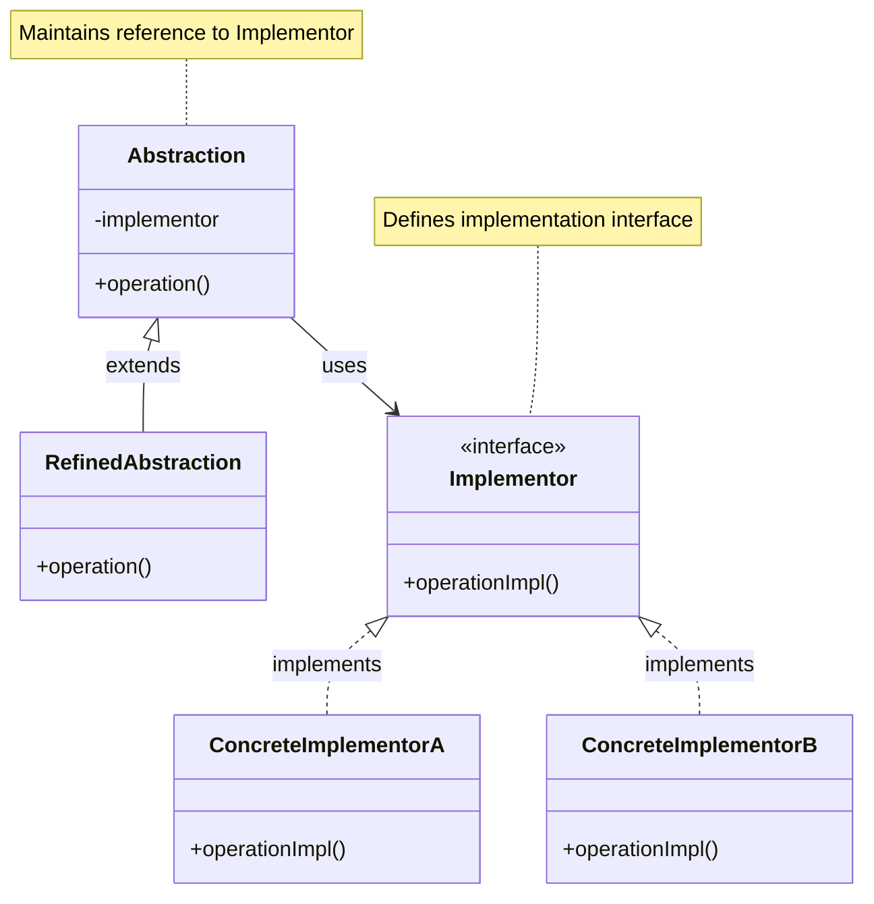
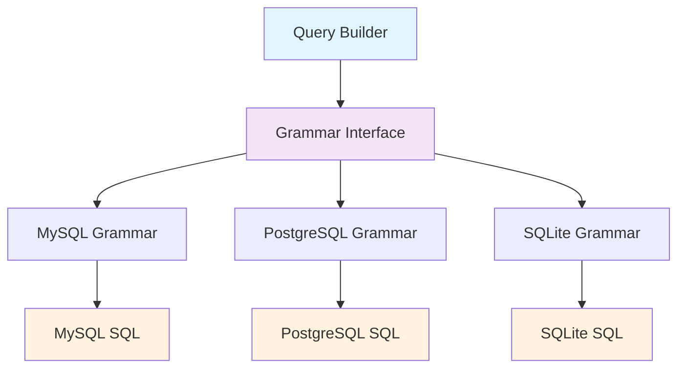
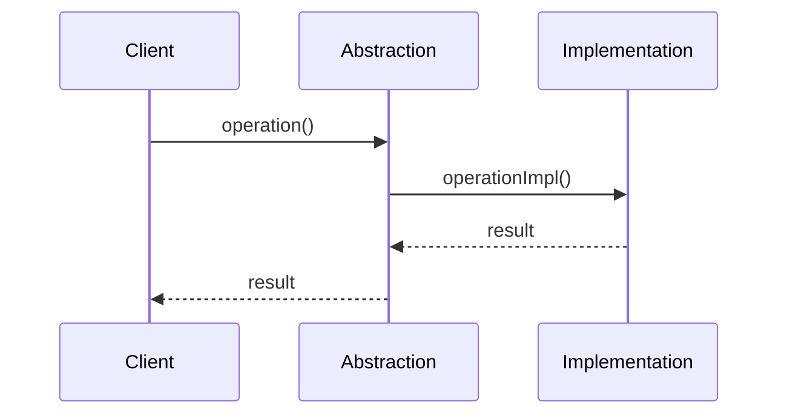

# Bridge Pattern {#bridge-pattern}

## Overview {#overview}

Decouple an abstraction from its implementation so that the two can vary independently. The Bridge pattern separates an abstraction from its implementation so that both can be modified independently.

## Architecture Diagram {#architecture-diagram}

### Bridge Pattern Structure {#bridge-pattern-structure}



### Laravel Database Bridge {#laravel-database-bridge}



### Bridge Pattern Sequence Diagram {#bridge-pattern-sequence-diagram}



## Problem Scenario {#problem-scenario}

In Laravel applications, we often need to handle different data storage methods (MySQL, Redis, files, etc.) or different notification methods (email, SMS, push notifications, etc.). If inheritance is used directly, it can lead to an explosive growth in the number of classes.

## Solution {#solution}

The Bridge pattern separates abstraction from implementation, allowing them to vary independently.

## Laravel Implementation {#laravel-implementation}

### 1. Notification System Example {#notification-system-example}

```php
<?php

namespace App\Patterns\Bridge;

// Implementation interface
interface NotificationImplementation
{
    public function send(string $message, string $recipient): bool;
}

// Concrete implementation - Email
class EmailImplementation implements NotificationImplementation
{
    public function send(string $message, string $recipient): bool
    {
        // Email sending logic
        \Mail::raw($message, function ($mail) use ($recipient) {
            $mail->to($recipient);
        });
        
        return true;
    }
}

// Concrete implementation - SMS
class SmsImplementation implements NotificationImplementation
{
    public function send(string $message, string $recipient): bool
    {
        // SMS sending logic
        // Call SMS service API
        return true;
    }
}

// Concrete implementation - Push
class PushImplementation implements NotificationImplementation
{
    public function send(string $message, string $recipient): bool
    {
        // Push notification logic
        return true;
    }
}

// Abstract class
abstract class Notification
{
    protected NotificationImplementation $implementation;
    
    public function __construct(NotificationImplementation $implementation)
    {
        $this->implementation = $implementation;
    }
    
    abstract public function send(string $message, string $recipient): bool;
}

// Refined abstraction - Simple notification
class SimpleNotification extends Notification
{
    public function send(string $message, string $recipient): bool
    {
        return $this->implementation->send($message, $recipient);
    }
}

// Refined abstraction - Encrypted notification
class EncryptedNotification extends Notification
{
    public function send(string $message, string $recipient): bool
    {
        $encryptedMessage = encrypt($message);
        return $this->implementation->send($encryptedMessage, $recipient);
    }
}

// Refined abstraction - Delayed notification
class DelayedNotification extends Notification
{
    private int $delay;
    
    public function __construct(NotificationImplementation $implementation, int $delay = 60)
    {
        parent::__construct($implementation);
        $this->delay = $delay;
    }
    
    public function send(string $message, string $recipient): bool
    {
        // Use queue for delayed sending
        \Queue::later($this->delay, function () use ($message, $recipient) {
            return $this->implementation->send($message, $recipient);
        });
        
        return true;
    }
}
```

### 2. Data Storage Example {#data-storage-example}

```php
<?php

namespace App\Patterns\Bridge;

// Storage implementation interface
interface StorageImplementation
{
    public function save(string $key, $data): bool;
    public function load(string $key);
    public function delete(string $key): bool;
}

// File storage implementation
class FileStorageImplementation implements StorageImplementation
{
    private string $basePath;
    
    public function __construct(string $basePath = 'storage/app')
    {
        $this->basePath = $basePath;
    }
    
    public function save(string $key, $data): bool
    {
        $path = $this->basePath . '/' . $key;
        return file_put_contents($path, serialize($data)) !== false;
    }
    
    public function load(string $key)
    {
        $path = $this->basePath . '/' . $key;
        if (!file_exists($path)) {
            return null;
        }
        return unserialize(file_get_contents($path));
    }
    
    public function delete(string $key): bool
    {
        $path = $this->basePath . '/' . $key;
        return file_exists($path) ? unlink($path) : true;
    }
}

// Redis storage implementation
class RedisStorageImplementation implements StorageImplementation
{
    private $redis;
    
    public function __construct()
    {
        $this->redis = \Redis::connection();
    }
    
    public function save(string $key, $data): bool
    {
        return $this->redis->set($key, serialize($data));
    }
    
    public function load(string $key)
    {
        $data = $this->redis->get($key);
        return $data ? unserialize($data) : null;
    }
    
    public function delete(string $key): bool
    {
        return $this->redis->del($key) > 0;
    }
}

// Database storage implementation
class DatabaseStorageImplementation implements StorageImplementation
{
    public function save(string $key, $data): bool
    {
        return \DB::table('storage')->updateOrInsert(
            ['key' => $key],
            ['data' => serialize($data), 'updated_at' => now()]
        );
    }
    
    public function load(string $key)
    {
        $record = \DB::table('storage')->where('key', $key)->first();
        return $record ? unserialize($record->data) : null;
    }
    
    public function delete(string $key): bool
    {
        return \DB::table('storage')->where('key', $key)->delete() > 0;
    }
}

// Abstract storage class
abstract class Storage
{
    protected StorageImplementation $implementation;
    
    public function __construct(StorageImplementation $implementation)
    {
        $this->implementation = $implementation;
    }
    
    abstract public function store(string $key, $data): bool;
    abstract public function retrieve(string $key);
    abstract public function remove(string $key): bool;
}

// Simple storage
class SimpleStorage extends Storage
{
    public function store(string $key, $data): bool
    {
        return $this->implementation->save($key, $data);
    }
    
    public function retrieve(string $key)
    {
        return $this->implementation->load($key);
    }
    
    public function remove(string $key): bool
    {
        return $this->implementation->delete($key);
    }
}

// Cached storage (with TTL)
class CachedStorage extends Storage
{
    private int $ttl;
    
    public function __construct(StorageImplementation $implementation, int $ttl = 3600)
    {
        parent::__construct($implementation);
        $this->ttl = $ttl;
    }
    
    public function store(string $key, $data): bool
    {
        $dataWithTtl = [
            'data' => $data,
            'expires_at' => time() + $this->ttl
        ];
        return $this->implementation->save($key, $dataWithTtl);
    }
    
    public function retrieve(string $key)
    {
        $stored = $this->implementation->load($key);
        
        if (!$stored || !isset($stored['expires_at'])) {
            return null;
        }
        
        if (time() > $stored['expires_at']) {
            $this->implementation->delete($key);
            return null;
        }
        
        return $stored['data'];
    }
    
    public function remove(string $key): bool
    {
        return $this->implementation->delete($key);
    }
}
```

## Usage Examples {#usage-examples}

### Notification System Usage {#notification-system-usage}

```php
<?php

// Use different implementations to send notifications
$emailNotification = new SimpleNotification(new EmailImplementation());
$emailNotification->send('Hello World', 'user@example.com');

$smsNotification = new EncryptedNotification(new SmsImplementation());
$smsNotification->send('Secret Message', '1234567890');

$delayedPushNotification = new DelayedNotification(new PushImplementation(), 300);
$delayedPushNotification->send('Delayed Message', 'user123');
```

### Storage System Usage {#storage-system-usage}

```php
<?php

// Use different storage implementations
$fileStorage = new SimpleStorage(new FileStorageImplementation());
$fileStorage->store('user_data', ['name' => 'John', 'age' => 30]);

$redisStorage = new CachedStorage(new RedisStorageImplementation(), 1800);
$redisStorage->store('session_data', ['user_id' => 123, 'role' => 'admin']);

$dbStorage = new SimpleStorage(new DatabaseStorageImplementation());
$dbStorage->store('config', ['theme' => 'dark', 'language' => 'zh']);
```

## Practical Applications in Laravel {#practical-applications-in-laravel}

### 1. Queue System {#queue-system}

Laravel's queue system is a typical application of the Bridge pattern:

```php
// Abstraction layer
Queue::push(new SendEmailJob($user));

// Can use different implementations
// config/queue.php
'connections' => [
    'sync' => ['driver' => 'sync'],
    'database' => ['driver' => 'database'],
    'redis' => ['driver' => 'redis'],
    'sqs' => ['driver' => 'sqs'],
]
```

### 2. Cache System {#cache-system}

```php
// Abstraction layer
Cache::put('key', 'value', 3600);

// Different implementations
// config/cache.php
'stores' => [
    'file' => ['driver' => 'file'],
    'redis' => ['driver' => 'redis'],
    'memcached' => ['driver' => 'memcached'],
]
```

### 3. File System {#file-system}

```php
// Abstraction layer
Storage::put('file.txt', 'content');

// Different implementations
// config/filesystems.php
'disks' => [
    'local' => ['driver' => 'local'],
    's3' => ['driver' => 's3'],
    'ftp' => ['driver' => 'ftp'],
]
```

## Database Query Grammar Bridge {#database-query-grammar-bridge}

Laravel uses the Bridge pattern to separate query building from SQL generation:

```php
// Illuminate\Database\Query\Builder.php (Abstraction)
class Builder
{
    protected $grammar;
    protected $processor;
    
    public function __construct(ConnectionInterface $connection, Grammar $grammar = null, Processor $processor = null)
    {
        $this->connection = $connection;
        $this->grammar = $grammar ?: $connection->getQueryGrammar();
        $this->processor = $processor ?: $connection->getPostProcessor();
    }
    
    public function toSql()
    {
        return $this->grammar->compileSelect($this);
    }
}

// Illuminate\Database\Query\Grammars\Grammar.php (Implementor)
abstract class Grammar
{
    abstract public function compileSelect(Builder $query);
    abstract public function compileInsert(Builder $query, array $values);
    abstract public function compileUpdate(Builder $query, array $values);
    abstract public function compileDelete(Builder $query);
}

// Concrete implementations
class MySqlGrammar extends Grammar
{
    public function compileSelect(Builder $query)
    {
        // MySQL-specific SQL generation
        return trim($this->concatenate($this->compileComponents($query)));
    }
}

class PostgresGrammar extends Grammar
{
    public function compileSelect(Builder $query)
    {
        // PostgreSQL-specific SQL generation
        return trim($this->concatenate($this->compileComponents($query)));
    }
}
```

## Cache Store Bridge {#cache-store-bridge}

```php
// Cache manager bridges different storage implementations
class CacheManager extends Manager implements FactoryContract
{
    protected function createRedisDriver(array $config)
    {
        $redis = $this->app['redis'];
        $connection = $config['connection'] ?? 'default';
        
        return $this->repository(new RedisStore($redis, $this->getPrefix($config), $connection));
    }
    
    protected function createFileDriver(array $config)
    {
        return $this->repository(new FileStore($this->app['files'], $config['path']));
    }
}
```

## Advantages {#advantages}

1. **Separation of abstraction and implementation**: Can vary independently
2. **Runtime implementation switching**: Can dynamically change implementations
3. **Good extensibility**: Easy to add new abstractions or implementations
4. **Hidden implementation details**: Client only needs to know the abstract interface

## Disadvantages {#disadvantages}

1. **Increased system complexity**: Introduces more classes and interfaces
2. **Understanding difficulty**: Need to understand the concept of separation between abstraction and implementation

## Applicable Scenarios {#applicable-scenarios}

1. **When you don't want a fixed binding relationship between abstraction and implementation**
2. **When both abstraction and implementation need independent extension**
3. **When you need to switch implementations at runtime**
4. **When you want to hide implementation details from the client**

## Relationship with Other Patterns {#relationship-with-other-patterns}

- **Adapter pattern**: Bridge pattern separates at design time, adapter pattern adapts after implementation
- **State pattern**: Can be used together, state implementations can use the Bridge pattern
- **Strategy pattern**: Bridge pattern focuses on structural separation, strategy pattern focuses on algorithm replacement

The Bridge pattern is widely used in Laravel, helping us build flexible and extensible system architectures.