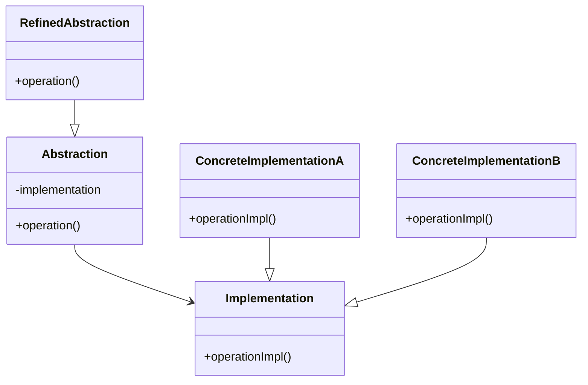
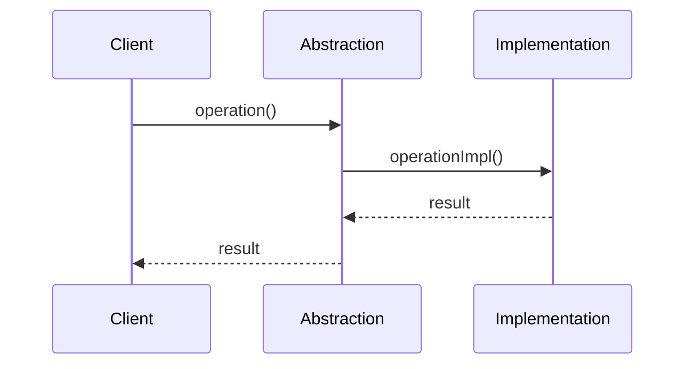

# 桥接模式 (Bridge Pattern)

## 概述

桥接模式将抽象部分与它的实现部分分离，使它们都可以独立地变化。这种模式通过组合而不是继承来实现功能的扩展。

## 问题场景

在Laravel应用中，我们经常需要处理不同的数据存储方式（MySQL、Redis、文件等）或不同的通知方式（邮件、短信、推送等）。如果直接使用继承，会导致类的数量爆炸性增长。

## 解决方案

桥接模式通过将抽象和实现分离，让它们可以独立变化。

## UML类图



## Laravel实现

### 1. 通知系统示例

```php
<?php

namespace App\Patterns\Bridge;

// 实现接口
interface NotificationImplementation
{
    public function send(string $message, string $recipient): bool;
}

// 具体实现 - 邮件
class EmailImplementation implements NotificationImplementation
{
    public function send(string $message, string $recipient): bool
    {
        // 发送邮件逻辑
        \Mail::raw($message, function ($mail) use ($recipient) {
            $mail->to($recipient);
        });
        
        return true;
    }
}

// 具体实现 - 短信
class SmsImplementation implements NotificationImplementation
{
    public function send(string $message, string $recipient): bool
    {
        // 发送短信逻辑
        // 调用短信服务API
        return true;
    }
}

// 具体实现 - 推送
class PushImplementation implements NotificationImplementation
{
    public function send(string $message, string $recipient): bool
    {
        // 发送推送通知逻辑
        return true;
    }
}

// 抽象类
abstract class Notification
{
    protected NotificationImplementation $implementation;
    
    public function __construct(NotificationImplementation $implementation)
    {
        $this->implementation = $implementation;
    }
    
    abstract public function send(string $message, string $recipient): bool;
}

// 精化抽象 - 普通通知
class SimpleNotification extends Notification
{
    public function send(string $message, string $recipient): bool
    {
        return $this->implementation->send($message, $recipient);
    }
}

// 精化抽象 - 加密通知
class EncryptedNotification extends Notification
{
    public function send(string $message, string $recipient): bool
    {
        $encryptedMessage = encrypt($message);
        return $this->implementation->send($encryptedMessage, $recipient);
    }
}

// 精化抽象 - 延迟通知
class DelayedNotification extends Notification
{
    private int $delay;
    
    public function __construct(NotificationImplementation $implementation, int $delay = 60)
    {
        parent::__construct($implementation);
        $this->delay = $delay;
    }
    
    public function send(string $message, string $recipient): bool
    {
        // 使用队列延迟发送
        \Queue::later($this->delay, function () use ($message, $recipient) {
            return $this->implementation->send($message, $recipient);
        });
        
        return true;
    }
}
```

### 2. 数据存储示例

```php
<?php

namespace App\Patterns\Bridge;

// 存储实现接口
interface StorageImplementation
{
    public function save(string $key, $data): bool;
    public function load(string $key);
    public function delete(string $key): bool;
}

// 文件存储实现
class FileStorageImplementation implements StorageImplementation
{
    private string $basePath;
    
    public function __construct(string $basePath = 'storage/app')
    {
        $this->basePath = $basePath;
    }
    
    public function save(string $key, $data): bool
    {
        $path = $this->basePath . '/' . $key;
        return file_put_contents($path, serialize($data)) !== false;
    }
    
    public function load(string $key)
    {
        $path = $this->basePath . '/' . $key;
        if (!file_exists($path)) {
            return null;
        }
        return unserialize(file_get_contents($path));
    }
    
    public function delete(string $key): bool
    {
        $path = $this->basePath . '/' . $key;
        return file_exists($path) ? unlink($path) : true;
    }
}

// Redis存储实现
class RedisStorageImplementation implements StorageImplementation
{
    private $redis;
    
    public function __construct()
    {
        $this->redis = \Redis::connection();
    }
    
    public function save(string $key, $data): bool
    {
        return $this->redis->set($key, serialize($data));
    }
    
    public function load(string $key)
    {
        $data = $this->redis->get($key);
        return $data ? unserialize($data) : null;
    }
    
    public function delete(string $key): bool
    {
        return $this->redis->del($key) > 0;
    }
}

// 数据库存储实现
class DatabaseStorageImplementation implements StorageImplementation
{
    public function save(string $key, $data): bool
    {
        return \DB::table('storage')->updateOrInsert(
            ['key' => $key],
            ['data' => serialize($data), 'updated_at' => now()]
        );
    }
    
    public function load(string $key)
    {
        $record = \DB::table('storage')->where('key', $key)->first();
        return $record ? unserialize($record->data) : null;
    }
    
    public function delete(string $key): bool
    {
        return \DB::table('storage')->where('key', $key)->delete() > 0;
    }
}

// 抽象存储类
abstract class Storage
{
    protected StorageImplementation $implementation;
    
    public function __construct(StorageImplementation $implementation)
    {
        $this->implementation = $implementation;
    }
    
    abstract public function store(string $key, $data): bool;
    abstract public function retrieve(string $key);
    abstract public function remove(string $key): bool;
}

// 简单存储
class SimpleStorage extends Storage
{
    public function store(string $key, $data): bool
    {
        return $this->implementation->save($key, $data);
    }
    
    public function retrieve(string $key)
    {
        return $this->implementation->load($key);
    }
    
    public function remove(string $key): bool
    {
        return $this->implementation->delete($key);
    }
}

// 缓存存储（带TTL）
class CachedStorage extends Storage
{
    private int $ttl;
    
    public function __construct(StorageImplementation $implementation, int $ttl = 3600)
    {
        parent::__construct($implementation);
        $this->ttl = $ttl;
    }
    
    public function store(string $key, $data): bool
    {
        $dataWithTtl = [
            'data' => $data,
            'expires_at' => time() + $this->ttl
        ];
        return $this->implementation->save($key, $dataWithTtl);
    }
    
    public function retrieve(string $key)
    {
        $stored = $this->implementation->load($key);
        
        if (!$stored || !isset($stored['expires_at'])) {
            return null;
        }
        
        if (time() > $stored['expires_at']) {
            $this->implementation->delete($key);
            return null;
        }
        
        return $stored['data'];
    }
    
    public function remove(string $key): bool
    {
        return $this->implementation->delete($key);
    }
}
```

## 使用示例

### 通知系统使用

```php
<?php

// 使用不同的实现发送通知
$emailNotification = new SimpleNotification(new EmailImplementation());
$emailNotification->send('Hello World', 'user@example.com');

$smsNotification = new EncryptedNotification(new SmsImplementation());
$smsNotification->send('Secret Message', '1234567890');

$delayedPushNotification = new DelayedNotification(new PushImplementation(), 300);
$delayedPushNotification->send('Delayed Message', 'user123');
```

### 存储系统使用

```php
<?php

// 使用不同的存储实现
$fileStorage = new SimpleStorage(new FileStorageImplementation());
$fileStorage->store('user_data', ['name' => 'John', 'age' => 30]);

$redisStorage = new CachedStorage(new RedisStorageImplementation(), 1800);
$redisStorage->store('session_data', ['user_id' => 123, 'role' => 'admin']);

$dbStorage = new SimpleStorage(new DatabaseStorageImplementation());
$dbStorage->store('config', ['theme' => 'dark', 'language' => 'zh']);
```

## Laravel中的实际应用

### 1. 队列系统

Laravel的队列系统就是桥接模式的典型应用：

```php
// 抽象层
Queue::push(new SendEmailJob($user));

// 可以使用不同的实现
// config/queue.php
'connections' => [
    'sync' => ['driver' => 'sync'],
    'database' => ['driver' => 'database'],
    'redis' => ['driver' => 'redis'],
    'sqs' => ['driver' => 'sqs'],
]
```

### 2. 缓存系统

```php
// 抽象层
Cache::put('key', 'value', 3600);

// 不同的实现
// config/cache.php
'stores' => [
    'file' => ['driver' => 'file'],
    'redis' => ['driver' => 'redis'],
    'memcached' => ['driver' => 'memcached'],
]
```

### 3. 文件系统

```php
// 抽象层
Storage::put('file.txt', 'content');

// 不同的实现
// config/filesystems.php
'disks' => [
    'local' => ['driver' => 'local'],
    's3' => ['driver' => 's3'],
    'ftp' => ['driver' => 'ftp'],
]
```

## 时序图



## 优点

1. **分离抽象和实现**：可以独立地变化
2. **运行时切换实现**：可以动态改变实现
3. **扩展性好**：新增抽象或实现都很容易
4. **隐藏实现细节**：客户端只需要知道抽象接口

## 缺点

1. **增加系统复杂性**：引入了更多的类和接口
2. **理解难度**：需要理解抽象和实现的分离概念

## 适用场景

1. **不希望在抽象和实现之间有固定绑定关系**
2. **抽象和实现都需要独立扩展**
3. **需要在运行时切换实现**
4. **希望对客户端隐藏实现细节**

## 与其他模式的关系

- **适配器模式**：桥接模式在设计时分离，适配器模式在实现后适配
- **状态模式**：可以结合使用，状态的实现可以使用桥接模式
- **策略模式**：桥接模式关注结构分离，策略模式关注算法替换

桥接模式在Laravel中广泛应用，帮助我们构建灵活、可扩展的系统架构。