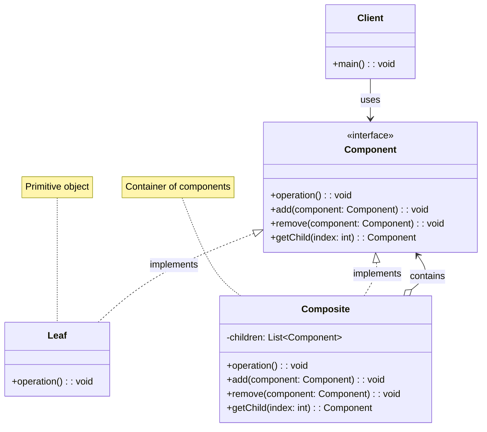
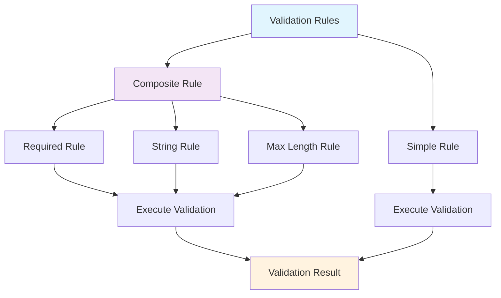
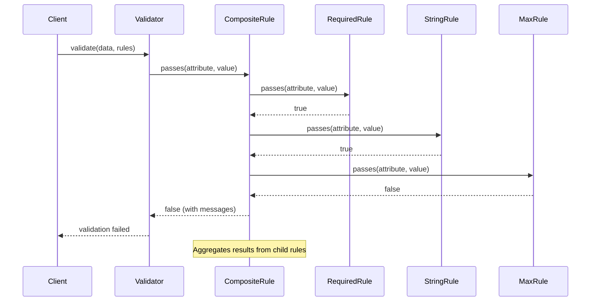

# Composite Pattern

## Overview

Compose objects into tree structures to represent part-whole hierarchies. Composite lets clients treat individual objects and compositions of objects uniformly.

## Architecture Diagram

### Composite Pattern Structure



### Laravel Validation Rules Composite



### Composite Validation Flow



## Implementation in Laravel

### 1. Validation Rules Composite

Laravel's validation system uses the Composite pattern to combine multiple validation rules:

```php
// Illuminate\Validation\Validator.php
class Validator implements ValidatorContract
{
    protected function validateAttribute($attribute, $rule)
    {
        [$rule, $parameters] = ValidationRuleParser::parse($rule);
        
        if ($rule == '') {
            return;
        }
        
        // First we will get the correct keys for the given attribute in case the field
        // is nested in an array. Then we determine if the given rule accepts other
        // field names as parameters. If so, we will replace any asterisks with it.
        $keys = $this->getExplicitKeys($attribute);
        
        if (isset($keys) && count($keys) > 0) {
            return $this->validateAttributeArray($keys, $attribute, $rule, $parameters);
        } else {
            return $this->validateAttributeValue($attribute, $this->getValue($attribute), $rule, $parameters);
        }
    }
    
    protected function validateAttributeValue($attribute, $value, $rule, $parameters)
    {
        $method = "validate{$rule}";
        
        if (! $this->$method($attribute, $value, $parameters, $this)) {
            $this->addFailure($attribute, $rule, $parameters);
        }
    }
}

// Custom composite rule
class CompositeRule implements Rule
{
    protected $rules = [];
    
    public function __construct(array $rules)
    {
        $this->rules = $rules;
    }
    
    public function passes($attribute, $value)
    {
        foreach ($this->rules as $rule) {
            if (! $rule->passes($attribute, $value)) {
                return false;
            }
        }
        
        return true;
    }
    
    public function message()
    {
        $messages = [];
        
        foreach ($this->rules as $rule) {
            if (method_exists($rule, 'message')) {
                $messages[] = $rule->message();
            }
        }
        
        return implode(' ', $messages);
    }
}
```

### 2. Collection Composite

```php
// Illuminate\Support\Collection.php
class Collection implements ArrayAccess, Arrayable, Countable, IteratorAggregate, Jsonable, JsonSerializable
{
    protected $items = [];
    
    public function map(callable $callback)
    {
        $keys = array_keys($this->items);
        
        $items = array_map($callback, $this->items, $keys);
        
        return new static(array_combine($keys, $items));
    }
    
    public function filter(callable $callback = null)
    {
        if ($callback) {
            return new static(Arr::where($this->items, $callback));
        }
        
        return new static(array_filter($this->items));
    }
    
    public function each(callable $callback)
    {
        foreach ($this->items as $key => $item) {
            if ($callback($item, $key) === false) {
                break;
            }
        }
        
        return $this;
    }
}

// Nested collections
$collection = collect([
    collect([1, 2, 3]),
    collect([4, 5, 6]),
    collect([7, 8, 9])
]);

$flattened = $collection->flatten(); // [1, 2, 3, 4, 5, 6, 7, 8, 9]
```

### 3. Menu/Navigation Composite

```php
// Custom menu system using composite pattern
abstract class MenuComponent
{
    abstract public function render();
    
    public function add(MenuComponent $component)
    {
        throw new \Exception('Operation not supported');
    }
    
    public function remove(MenuComponent $component)
    {
        throw new \Exception('Operation not supported');
    }
    
    public function getChild($index)
    {
        throw new \Exception('Operation not supported');
    }
}

class MenuItem extends MenuComponent
{
    protected $name;
    protected $url;
    
    public function __construct($name, $url)
    {
        $this->name = $name;
        $this->url = $url;
    }
    
    public function render()
    {
        return "<li><a href='{$this->url}'>{$this->name}</a></li>";
    }
}

class Menu extends MenuComponent
{
    protected $items = [];
    protected $name;
    
    public function __construct($name)
    {
        $this->name = $name;
    }
    
    public function add(MenuComponent $component)
    {
        $this->items[] = $component;
    }
    
    public function remove(MenuComponent $component)
    {
        $key = array_search($component, $this->items);
        if ($key !== false) {
            unset($this->items[$key]);
        }
    }
    
    public function render()
    {
        $html = "<ul>";
        
        foreach ($this->items as $item) {
            $html .= $item->render();
        }
        
        $html .= "</ul>";
        
        return $html;
    }
}

// Usage
$mainMenu = new Menu('Main Menu');
$mainMenu->add(new MenuItem('Home', '/'));
$mainMenu->add(new MenuItem('About', '/about'));

$productsMenu = new Menu('Products');
$productsMenu->add(new MenuItem('Laptops', '/products/laptops'));
$productsMenu->add(new MenuItem('Phones', '/products/phones'));

$mainMenu->add($productsMenu);
echo $mainMenu->render();
```

### 4. Form Builder Composite

```php
// Form builder using composite pattern
abstract class FormElement
{
    protected $attributes = [];
    
    abstract public function render();
    
    public function setAttribute($name, $value)
    {
        $this->attributes[$name] = $value;
        return $this;
    }
    
    protected function renderAttributes()
    {
        $html = '';
        foreach ($this->attributes as $name => $value) {
            $html .= " {$name}=\"{$value}\"";
        }
        return $html;
    }
}

class Input extends FormElement
{
    protected $type;
    
    public function __construct($type = 'text')
    {
        $this->type = $type;
    }
    
    public function render()
    {
        return "<input type='{$this->type}'{$this->renderAttributes()}>";
    }
}

class FormGroup extends FormElement
{
    protected $elements = [];
    
    public function add(FormElement $element)
    {
        $this->elements[] = $element;
        return $this;
    }
    
    public function render()
    {
        $html = "<div{$this->renderAttributes()}>";
        
        foreach ($this->elements as $element) {
            $html .= $element->render();
        }
        
        $html .= "</div>";
        
        return $html;
    }
}
```