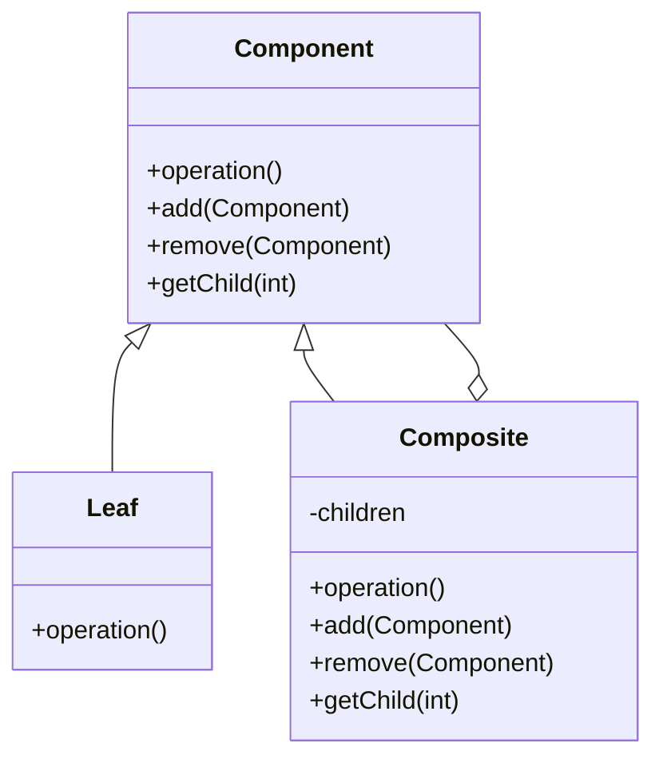
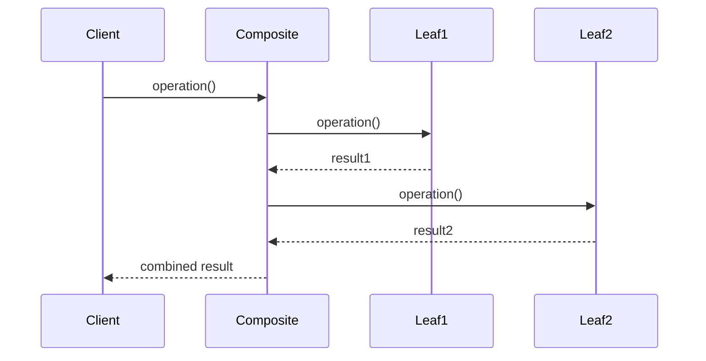

# 组合模式 (Composite Pattern)

## 概述

组合模式将对象组合成树形结构以表示"部分-整体"的层次结构。组合模式使得用户对单个对象和组合对象的使用具有一致性。

## 问题场景

在Laravel应用中，我们经常需要处理树形结构的数据，如：
- 菜单系统（菜单项和子菜单）
- 文件系统（文件夹和文件）
- 组织架构（部门和员工）
- 权限系统（权限组和单个权限）

## 解决方案

组合模式通过统一的接口来处理叶子节点和组合节点，使客户端可以一致地处理单个对象和对象集合。

## UML类图



## Laravel实现

### 1. 菜单系统示例

```php
<?php

namespace App\Patterns\Composite;

// 组件接口
interface MenuComponent
{
    public function render(): string;
    public function add(MenuComponent $component): void;
    public function remove(MenuComponent $component): void;
    public function getChildren(): array;
    public function getName(): string;
}

// 菜单项（叶子节点）
class MenuItem implements MenuComponent
{
    private string $name;
    private string $url;
    private string $icon;
    
    public function __construct(string $name, string $url, string $icon = '')
    {
        $this->name = $name;
        $this->url = $url;
        $this->icon = $icon;
    }
    
    public function render(): string
    {
        $icon = $this->icon ? "<i class='{$this->icon}'></i> " : '';
        return "<li><a href='{$this->url}'>{$icon}{$this->name}</a></li>";
    }
    
    public function add(MenuComponent $component): void
    {
        throw new \Exception("Cannot add to a leaf node");
    }
    
    public function remove(MenuComponent $component): void
    {
        throw new \Exception("Cannot remove from a leaf node");
    }
    
    public function getChildren(): array
    {
        return [];
    }
    
    public function getName(): string
    {
        return $this->name;
    }
}

// 菜单组（组合节点）
class MenuGroup implements MenuComponent
{
    private string $name;
    private array $children = [];
    private string $icon;
    
    public function __construct(string $name, string $icon = '')
    {
        $this->name = $name;
        $this->icon = $icon;
    }
    
    public function render(): string
    {
        $icon = $this->icon ? "<i class='{$this->icon}'></i> " : '';
        $html = "<li class='dropdown'>";
        $html .= "<a href='#' class='dropdown-toggle'>{$icon}{$this->name}</a>";
        $html .= "<ul class='dropdown-menu'>";
        
        foreach ($this->children as $child) {
            $html .= $child->render();
        }
        
        $html .= "</ul></li>";
        return $html;
    }
    
    public function add(MenuComponent $component): void
    {
        $this->children[] = $component;
    }
    
    public function remove(MenuComponent $component): void
    {
        $key = array_search($component, $this->children, true);
        if ($key !== false) {
            unset($this->children[$key]);
            $this->children = array_values($this->children);
        }
    }
    
    public function getChildren(): array
    {
        return $this->children;
    }
    
    public function getName(): string
    {
        return $this->name;
    }
}

// 菜单构建器
class MenuBuilder
{
    private MenuComponent $root;
    
    public function __construct()
    {
        $this->root = new MenuGroup('Main Menu');
    }
    
    public function addItem(string $name, string $url, string $icon = ''): self
    {
        $this->root->add(new MenuItem($name, $url, $icon));
        return $this;
    }
    
    public function addGroup(string $name, string $icon = ''): MenuGroup
    {
        $group = new MenuGroup($name, $icon);
        $this->root->add($group);
        return $group;
    }
    
    public function build(): MenuComponent
    {
        return $this->root;
    }
}
```

### 2. 文件系统示例

```php
<?php

namespace App\Patterns\Composite;

// 文件系统组件
abstract class FileSystemComponent
{
    protected string $name;
    
    public function __construct(string $name)
    {
        $this->name = $name;
    }
    
    abstract public function getSize(): int;
    abstract public function display(int $depth = 0): string;
    
    public function getName(): string
    {
        return $this->name;
    }
    
    protected function getIndent(int $depth): string
    {
        return str_repeat('  ', $depth);
    }
}

// 文件（叶子节点）
class File extends FileSystemComponent
{
    private int $size;
    private string $content;
    
    public function __construct(string $name, string $content = '')
    {
        parent::__construct($name);
        $this->content = $content;
        $this->size = strlen($content);
    }
    
    public function getSize(): int
    {
        return $this->size;
    }
    
    public function display(int $depth = 0): string
    {
        return $this->getIndent($depth) . "📄 {$this->name} ({$this->size} bytes)\n";
    }
    
    public function getContent(): string
    {
        return $this->content;
    }
}

// 目录（组合节点）
class Directory extends FileSystemComponent
{
    private array $children = [];
    
    public function add(FileSystemComponent $component): void
    {
        $this->children[] = $component;
    }
    
    public function remove(FileSystemComponent $component): void
    {
        $key = array_search($component, $this->children, true);
        if ($key !== false) {
            unset($this->children[$key]);
            $this->children = array_values($this->children);
        }
    }
    
    public function getSize(): int
    {
        $totalSize = 0;
        foreach ($this->children as $child) {
            $totalSize += $child->getSize();
        }
        return $totalSize;
    }
    
    public function display(int $depth = 0): string
    {
        $result = $this->getIndent($depth) . "📁 {$this->name}/\n";
        foreach ($this->children as $child) {
            $result .= $child->display($depth + 1);
        }
        return $result;
    }
    
    public function getChildren(): array
    {
        return $this->children;
    }
    
    public function find(string $name): ?FileSystemComponent
    {
        if ($this->name === $name) {
            return $this;
        }
        
        foreach ($this->children as $child) {
            if ($child->getName() === $name) {
                return $child;
            }
            
            if ($child instanceof Directory) {
                $found = $child->find($name);
                if ($found) {
                    return $found;
                }
            }
        }
        
        return null;
    }
}
```

### 3. 权限系统示例

```php
<?php

namespace App\Patterns\Composite;

// 权限组件接口
interface PermissionComponent
{
    public function hasPermission(string $permission): bool;
    public function getPermissions(): array;
    public function getName(): string;
}

// 单个权限（叶子节点）
class Permission implements PermissionComponent
{
    private string $name;
    private string $action;
    private string $resource;
    
    public function __construct(string $name, string $action, string $resource)
    {
        $this->name = $name;
        $this->action = $action;
        $this->resource = $resource;
    }
    
    public function hasPermission(string $permission): bool
    {
        return $this->getFullPermission() === $permission;
    }
    
    public function getPermissions(): array
    {
        return [$this->getFullPermission()];
    }
    
    public function getName(): string
    {
        return $this->name;
    }
    
    private function getFullPermission(): string
    {
        return "{$this->action}:{$this->resource}";
    }
}

// 权限组（组合节点）
class PermissionGroup implements PermissionComponent
{
    private string $name;
    private array $children = [];
    
    public function __construct(string $name)
    {
        $this->name = $name;
    }
    
    public function add(PermissionComponent $component): void
    {
        $this->children[] = $component;
    }
    
    public function remove(PermissionComponent $component): void
    {
        $key = array_search($component, $this->children, true);
        if ($key !== false) {
            unset($this->children[$key]);
            $this->children = array_values($this->children);
        }
    }
    
    public function hasPermission(string $permission): bool
    {
        foreach ($this->children as $child) {
            if ($child->hasPermission($permission)) {
                return true;
            }
        }
        return false;
    }
    
    public function getPermissions(): array
    {
        $permissions = [];
        foreach ($this->children as $child) {
            $permissions = array_merge($permissions, $child->getPermissions());
        }
        return array_unique($permissions);
    }
    
    public function getName(): string
    {
        return $this->name;
    }
    
    public function getChildren(): array
    {
        return $this->children;
    }
}

// 角色类
class Role
{
    private string $name;
    private PermissionComponent $permissions;
    
    public function __construct(string $name)
    {
        $this->name = $name;
        $this->permissions = new PermissionGroup($name . ' Permissions');
    }
    
    public function addPermission(PermissionComponent $permission): void
    {
        $this->permissions->add($permission);
    }
    
    public function hasPermission(string $permission): bool
    {
        return $this->permissions->hasPermission($permission);
    }
    
    public function getAllPermissions(): array
    {
        return $this->permissions->getPermissions();
    }
    
    public function getName(): string
    {
        return $this->name;
    }
}
```

## 使用示例

### 菜单系统使用

```php
<?php

// 构建菜单
$builder = new MenuBuilder();

// 添加单个菜单项
$builder->addItem('首页', '/', 'fas fa-home')
        ->addItem('关于', '/about', 'fas fa-info');

// 添加菜单组
$userGroup = $builder->addGroup('用户管理', 'fas fa-users');
$userGroup->add(new MenuItem('用户列表', '/users', 'fas fa-list'));
$userGroup->add(new MenuItem('添加用户', '/users/create', 'fas fa-plus'));

$systemGroup = $builder->addGroup('系统设置', 'fas fa-cog');
$systemGroup->add(new MenuItem('系统配置', '/settings', 'fas fa-wrench'));
$systemGroup->add(new MenuItem('日志管理', '/logs', 'fas fa-file-alt'));

// 渲染菜单
$menu = $builder->build();
echo $menu->render();
```

### 文件系统使用

```php
<?php

// 创建文件系统结构
$root = new Directory('project');

$src = new Directory('src');
$src->add(new File('index.php', '<?php echo "Hello World";'));
$src->add(new File('config.php', '<?php return ["app" => "MyApp"];'));

$controllers = new Directory('Controllers');
$controllers->add(new File('UserController.php', '<?php class UserController {}'));
$controllers->add(new File('HomeController.php', '<?php class HomeController {}'));

$src->add($controllers);
$root->add($src);

$public = new Directory('public');
$public->add(new File('index.php', '<?php require "../src/index.php";'));
$public->add(new File('style.css', 'body { margin: 0; }'));

$root->add($public);

// 显示文件系统结构
echo $root->display();

// 查找文件
$found = $root->find('UserController.php');
if ($found) {
    echo "Found: " . $found->getName();
}

// 计算总大小
echo "Total size: " . $root->getSize() . " bytes";
```

### 权限系统使用

```php
<?php

// 创建权限
$readUsers = new Permission('读取用户', 'read', 'users');
$writeUsers = new Permission('写入用户', 'write', 'users');
$deleteUsers = new Permission('删除用户', 'delete', 'users');

$readPosts = new Permission('读取文章', 'read', 'posts');
$writePosts = new Permission('写入文章', 'write', 'posts');

// 创建权限组
$userPermissions = new PermissionGroup('用户权限');
$userPermissions->add($readUsers);
$userPermissions->add($writeUsers);
$userPermissions->add($deleteUsers);

$postPermissions = new PermissionGroup('文章权限');
$postPermissions->add($readPosts);
$postPermissions->add($writePosts);

// 创建角色
$admin = new Role('管理员');
$admin->addPermission($userPermissions);
$admin->addPermission($postPermissions);

$editor = new Role('编辑');
$editor->addPermission($postPermissions);
$editor->addPermission($readUsers);

// 检查权限
if ($admin->hasPermission('delete:users')) {
    echo "管理员可以删除用户";
}

if (!$editor->hasPermission('delete:users')) {
    echo "编辑不能删除用户";
}
```

## Laravel中的实际应用

### 1. Eloquent关系

```php
<?php

// 分类模型（支持无限级分类）
class Category extends Model
{
    public function parent()
    {
        return $this->belongsTo(Category::class, 'parent_id');
    }
    
    public function children()
    {
        return $this->hasMany(Category::class, 'parent_id');
    }
    
    public function allChildren()
    {
        return $this->children()->with('allChildren');
    }
    
    // 获取所有后代分类
    public function getDescendants()
    {
        $descendants = collect();
        
        foreach ($this->children as $child) {
            $descendants->push($child);
            $descendants = $descendants->merge($child->getDescendants());
        }
        
        return $descendants;
    }
}
```

### 2. 表单构建器

```php
<?php

// 使用Laravel的表单构建可以看作组合模式的应用
class FormBuilder
{
    public function form($attributes = [])
    {
        // 表单容器（组合节点）
    }
    
    public function text($name, $value = null, $attributes = [])
    {
        // 文本输入（叶子节点）
    }
    
    public function fieldset($legend = null)
    {
        // 字段集（组合节点）
    }
}
```

## 时序图



## 优点

1. **统一接口**：客户端可以一致地处理单个对象和组合对象
2. **简化客户端代码**：不需要区分叶子节点和组合节点
3. **易于扩展**：容易添加新的组件类型
4. **递归结构**：天然支持树形结构的操作

## 缺点

1. **设计过于宽泛**：难以限制组合中的组件类型
2. **类型安全**：运行时才能确定组件的具体类型

## 适用场景

1. **表示对象的部分-整体层次结构**
2. **希望用户忽略组合对象与单个对象的不同**
3. **需要处理树形结构的数据**

## 与其他模式的关系

- **装饰器模式**：都使用递归组合，但装饰器添加职责，组合表示结构
- **迭代器模式**：可以用来遍历组合结构
- **访问者模式**：可以在组合结构上定义操作

组合模式在Laravel应用中非常有用，特别是处理具有层次结构的数据时。