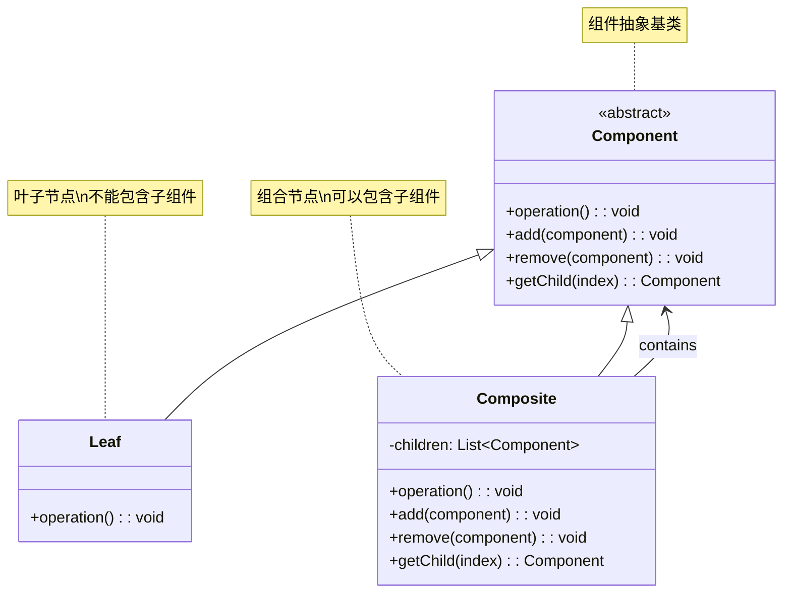
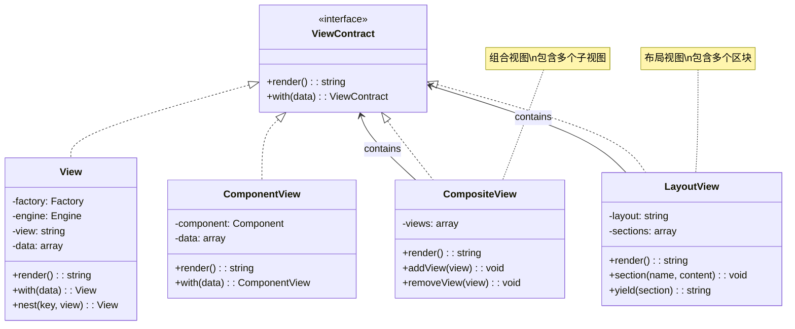
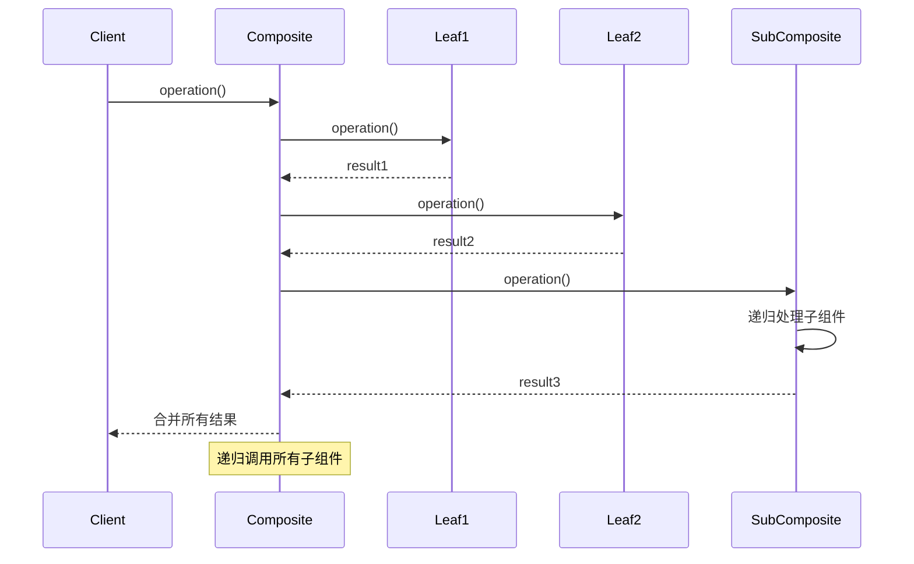
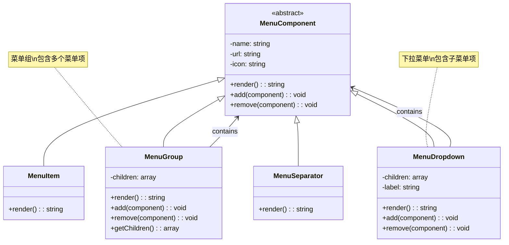
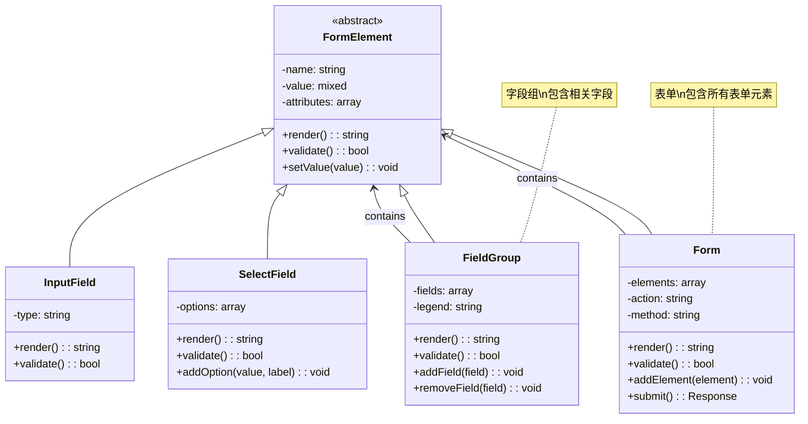
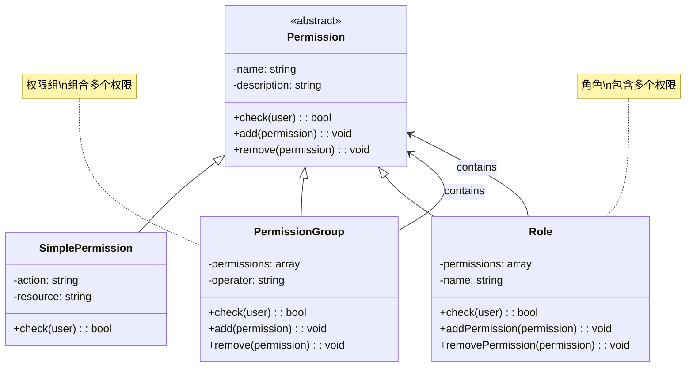
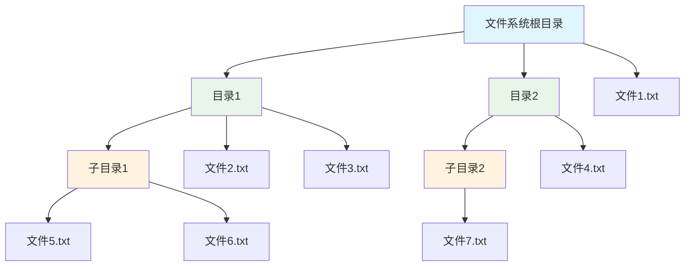
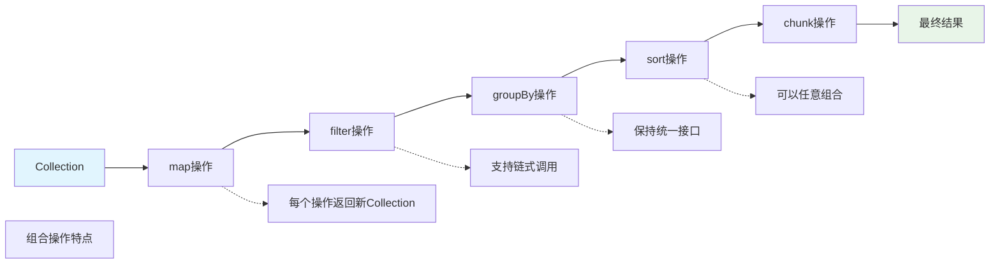

# 组合模式 (Composite Pattern)

## 概述

组合模式将对象组合成树形结构以表示"部分-整体"的层次结构。组合模式使得用户对单个对象和组合对象的使用具有一致性。

## 架构图

### 组合模式类图


### Laravel 视图组合架构


### 组合模式时序图


### Laravel 菜单组合结构


### 表单组合架构


### 权限组合模式


### 文件系统组合结构


### Laravel 集合组合操作


## 设计意图

- **统一处理**：统一对待单个对象和组合对象
- **层次结构**：构建树形结构的对象系统
- **递归组合**：支持对象的递归组合
- **透明性**：客户端无需区分叶子节点和组合节点

## Laravel 中的实现

### 1. 视图组件组合

Laravel 的 Blade 模板系统使用了组合模式：

```php
// Illuminate\View\View.php
class View implements ArrayAccess
{
    protected $factory;
    protected $engine;
    protected $view;
    protected $data;
    protected $path;
    
    public function __construct($factory, $engine, $view, $path, $data = [])
    {
        $this->factory = $factory;
        $this->engine = $engine;
        $this->view = $view;
        $this->path = $path;
        $this->data = $data;
    }
    
    // 组合模式：将视图组合成树形结构
    public function nest($key, $view, array $data = [])
    {
        return $this->factory->make($view, $data, $key);
    }
    
    public function render(callable $callback = null)
    {
        // 递归渲染所有嵌套视图
        $contents = $this->getContents();
        
        if ($callback) {
            $contents = $callback($this, $contents);
        }
        
        return $contents;
    }
    
    protected function getContents()
    {
        // 获取视图内容，包括所有嵌套组件
        return $this->engine->get($this->path, $this->gatherData());
    }
    
    protected function gatherData()
    {
        // 收集所有数据，包括嵌套视图的数据
        $data = array_merge($this->factory->getShared(), $this->data);
        
        foreach ($data as $key => $value) {
            if ($value instanceof Renderable) {
                $data[$key] = $value->render();
            }
        }
        
        return $data;
    }
}
```

### 2. 表单字段组合

Laravel 的表单构建器使用了组合模式：

```php
// 表单组件接口
interface FormComponent
{
    public function render();
    public function getName();
    public function add(FormComponent $component);
    public function remove(FormComponent $component);
    public function getChild($name);
}

// 基础表单组件
abstract class AbstractFormComponent implements FormComponent
{
    protected $name;
    protected $attributes = [];
    protected $children = [];
    
    public function __construct($name, array $attributes = [])
    {
        $this->name = $name;
        $this->attributes = $attributes;
    }
    
    public function getName()
    {
        return $this->name;
    }
    
    public function add(FormComponent $component)
    {
        $this->children[$component->getName()] = $component;
        return $this;
    }
    
    public function remove(FormComponent $component)
    {
        unset($this->children[$component->getName()]);
        return $this;
    }
    
    public function getChild($name)
    {
        return $this->children[$name] ?? null;
    }
    
    abstract public function render();
}

// 叶子节点：输入字段
class InputField extends AbstractFormComponent
{
    protected $type;
    
    public function __construct($name, $type = 'text', array $attributes = [])
    {
        parent::__construct($name, $attributes);
        $this->type = $type;
    }
    
    public function render()
    {
        $attributes = $this->buildAttributes();
        return "<input type=\"{$this->type}\" name=\"{$this->name}\" {$attributes}>";
    }
    
    protected function buildAttributes()
    {
        $attrs = [];
        foreach ($this->attributes as $key => $value) {
            $attrs[] = "{$key}=\"{$value}\"";
        }
        return implode(' ', $attrs);
    }
}

// 组合节点：字段组
class FieldGroup extends AbstractFormComponent
{
    protected $legend;
    
    public function __construct($name, $legend = '', array $attributes = [])
    {
        parent::__construct($name, $attributes);
        $this->legend = $legend;
    }
    
    public function render()
    {
        $output = "<fieldset name=\"{$this->name}\">\n";
        
        if ($this->legend) {
            $output .= "<legend>{$this->legend}</legend>\n";
        }
        
        foreach ($this->children as $child) {
            $output .= $child->render() . "\n";
        }
        
        $output .= "</fieldset>";
        return $output;
    }
}

// 组合节点：表单
class Form extends AbstractFormComponent
{
    protected $method = 'POST';
    protected $action = '';
    
    public function __construct($name, $action = '', $method = 'POST', array $attributes = [])
    {
        parent::__construct($name, $attributes);
        $this->action = $action;
        $this->method = $method;
    }
    
    public function render()
    {
        $attributes = $this->buildAttributes();
        $output = "<form name=\"{$this->name}\" method=\"{$this->method}\" action=\"{$this->action}\" {$attributes}>\n";
        
        foreach ($this->children as $child) {
            $output .= $child->render() . "\n";
        }
        
        $output .= "</form>";
        return $output;
    }
}
```

### 3. 菜单系统组合

实现树形菜单的组合模式：

```php
// 菜单组件接口
interface MenuComponent
{
    public function display($level = 0);
    public function add(MenuComponent $component);
    public function remove(MenuComponent $component);
    public function getChildren();
}

// 菜单项（叶子节点）
class MenuItem implements MenuComponent
{
    protected $name;
    protected $url;
    protected $icon;
    
    public function __construct($name, $url, $icon = '')
    {
        $this->name = $name;
        $this->url = $url;
        $this->icon = $icon;
    }
    
    public function display($level = 0)
    {
        $indent = str_repeat('  ', $level);
        $icon = $this->icon ? "<i class=\"{$this->icon}\"></i> " : '';
        return "{$indent}<li><a href=\"{$this->url}\">{$icon}{$this->name}</a></li>";
    }
    
    public function add(MenuComponent $component)
    {
        throw new Exception('Cannot add to a leaf node');
    }
    
    public function remove(MenuComponent $component)
    {
        throw new Exception('Cannot remove from a leaf node');
    }
    
    public function getChildren()
    {
        return [];
    }
}

// 菜单组（组合节点）
class MenuGroup implements MenuComponent
{
    protected $name;
    protected $children = [];
    protected $icon;
    
    public function __construct($name, $icon = '')
    {
        $this->name = $name;
        $this->icon = $icon;
    }
    
    public function display($level = 0)
    {
        $indent = str_repeat('  ', $level);
        $icon = $this->icon ? "<i class=\"{$this->icon}\"></i> " : '';
        
        $output = "{$indent}<li>\n";
        $output .= "{$indent}  <span>{$icon}{$this->name}</span>\n";
        $output .= "{$indent}  <ul>\n";
        
        foreach ($this->children as $child) {
            $output .= $child->display($level + 2) . "\n";
        }
        
        $output .= "{$indent}  </ul>\n";
        $output .= "{$indent}</li>";
        
        return $output;
    }
    
    public function add(MenuComponent $component)
    {
        $this->children[] = $component;
        return $this;
    }
    
    public function remove(MenuComponent $component)
    {
        $this->children = array_filter($this->children, function($child) use ($component) {
            return $child !== $component;
        });
        return $this;
    }
    
    public function getChildren()
    {
        return $this->children;
    }
}
```

## 实际应用场景

### 1. 权限系统组合

实现树形权限结构的组合模式：

```php
// 权限组件接口
interface PermissionComponent
{
    public function check($user);
    public function add(PermissionComponent $component);
    public function remove(PermissionComponent $component);
}

// 单个权限（叶子节点）
class Permission implements PermissionComponent
{
    protected $name;
    protected $handler;
    
    public function __construct($name, callable $handler = null)
    {
        $this->name = $name;
        $this->handler = $handler;
    }
    
    public function check($user)
    {
        if ($this->handler) {
            return call_user_func($this->handler, $user);
        }
        
        // 默认检查逻辑
        return $user->hasPermission($this->name);
    }
    
    public function add(PermissionComponent $component)
    {
        throw new Exception('Cannot add to a permission');
    }
    
    public function remove(PermissionComponent $component)
    {
        throw new Exception('Cannot remove from a permission');
    }
}

// 权限组（组合节点）
class PermissionGroup implements PermissionComponent
{
    protected $name;
    protected $operator = 'and'; // and, or
    protected $children = [];
    
    public function __construct($name, $operator = 'and')
    {
        $this->name = $name;
        $this->operator = $operator;
    }
    
    public function check($user)
    {
        if (empty($this->children)) {
            return true;
        }
        
        $results = array_map(function($child) use ($user) {
            return $child->check($user);
        }, $this->children);
        
        if ($this->operator === 'and') {
            return !in_array(false, $results, true);
        } else {
            return in_array(true, $results, true);
        }
    }
    
    public function add(PermissionComponent $component)
    {
        $this->children[] = $component;
        return $this;
    }
    
    public function remove(PermissionComponent $component)
    {
        $this->children = array_filter($this->children, function($child) use ($component) {
            return $child !== $component;
        });
        return $this;
    }
}

// 使用示例
$adminPermissions = new PermissionGroup('admin', 'and');
$adminPermissions->add(new Permission('user.create'))
                ->add(new Permission('user.delete'))
                ->add(new Permission('user.edit'));

$moderatorPermissions = new PermissionGroup('moderator', 'or');
$moderatorPermissions->add(new Permission('post.approve'))
                    ->add(new Permission('comment.moderate'));

$rootPermissions = new PermissionGroup('root', 'and');
$rootPermissions->add($adminPermissions)
               ->add($moderatorPermissions);

// 检查权限
$hasAccess = $rootPermissions->check($user);
```

### 2. 文件系统组合

实现文件系统的组合模式：

```php
// 文件系统组件接口
interface FileSystemComponent
{
    public function getName();
    public function getSize();
    public function display($indent = 0);
}

// 文件（叶子节点）
class File implements FileSystemComponent
{
    protected $name;
    protected $size;
    
    public function __construct($name, $size)
    {
        $this->name = $name;
        $this->size = $size;
    }
    
    public function getName()
    {
        return $this->name;
    }
    
    public function getSize()
    {
        return $this->size;
    }
    
    public function display($indent = 0)
    {
        $padding = str_repeat(' ', $indent);
        return "{$padding}- {$this->name} ({$this->size} bytes)";
    }
}

// 目录（组合节点）
class Directory implements FileSystemComponent
{
    protected $name;
    protected $children = [];
    
    public function __construct($name)
    {
        $this->name = $name;
    }
    
    public function getName()
    {
        return $this->name;
    }
    
    public function getSize()
    {
        $total = 0;
        foreach ($this->children as $child) {
            $total += $child->getSize();
        }
        return $total;
    }
    
    public function add(FileSystemComponent $component)
    {
        $this->children[] = $component;
        return $this;
    }
    
    public function remove(FileSystemComponent $component)
    {
        $this->children = array_filter($this->children, function($child) use ($component) {
            return $child !== $component;
        });
        return $this;
    }
    
    public function display($indent = 0)
    {
        $padding = str_repeat(' ', $indent);
        $output = "{$padding}+ {$this->name} (total: {$this->getSize()} bytes)\n";
        
        foreach ($this->children as $child) {
            $output .= $child->display($indent + 2) . "\n";
        }
        
        return $output;
    }
}
```

## 源码分析要点

### 1. 组合模式的核心结构

```php
// 组件接口
interface Component
{
    public function operation();
    public function add(Component $c);
    public function remove(Component $c);
    public function getChild($index);
}

// 叶子组件
class Leaf implements Component
{
    public function operation()
    {
        return "Leaf operation";
    }
    
    public function add(Component $c)
    {
        throw new Exception("Cannot add to a leaf");
    }
    
    public function remove(Component $c)
    {
        throw new Exception("Cannot remove from a leaf");
    }
    
    public function getChild($index)
    {
        return null;
    }
}

// 复合组件
class Composite implements Component
{
    protected $children = [];
    
    public function operation()
    {
        $results = [];
        foreach ($this->children as $child) {
            $results[] = $child->operation();
        }
        return implode(', ', $results);
    }
    
    public function add(Component $c)
    {
        $this->children[] = $c;
    }
    
    public function remove(Component $c)
    {
        $this->children = array_filter($this->children, function($child) use ($c) {
            return $child !== $c;
        });
    }
    
    public function getChild($index)
    {
        return $this->children[$index] ?? null;
    }
}
```

### 2. Laravel 中的组合应用

Laravel 集合类使用了组合模式的思想：

```php
// Illuminate\Support\Collection.php
class Collection implements ArrayAccess, Countable, IteratorAggregate
{
    protected $items = [];
    
    public function __construct($items = [])
    {
        $this->items = $this->getArrayableItems($items);
    }
    
    // 组合模式：可以包含其他集合
    public function flatten($depth = INF)
    {
        return new static(Arr::flatten($this->items, $depth));
    }
    
    public function collapse()
    {
        return new static(Arr::collapse($this->items));
    }
    
    // 递归操作
    public function each(callable $callback)
    {
        foreach ($this->items as $key => $item) {
            if ($callback($item, $key) === false) {
                break;
            }
        }
        
        return $this;
    }
}
```

## 最佳实践

### 1. 合理使用组合模式

**适用场景：**
- 需要表示对象的部分-整体层次结构时
- 希望客户端忽略组合对象与单个对象的差异时
- 处理树形结构数据时

**不适用场景：**
- 组件之间的差异很大时
- 叶子节点和组合节点有显著不同行为时
- 性能要求极高的场景

### 2. Laravel 中的组合实践

**视图组件组合：**
```php
class ViewComposer
{
    public function compose(View $view)
    {
        // 组合多个数据源
        $data = array_merge(
            $this->getGlobalData(),
            $this->getSectionData($view),
            $this->getViewSpecificData($view)
        );
        
        $view->with($data);
    }
    
    protected function getGlobalData()
    {
        return [
            'app' => app(),
            'auth' => auth(),
        ];
    }
}
```

**中间件组合：**
```php
class MiddlewarePipeline
{
    public function send($passable)
    {
        return $this->then(function ($passable) {
            return $passable;
        });
    }
    
    public function then(Closure $destination)
    {
        // 组合多个中间件
        $pipeline = array_reduce(
            array_reverse($this->middleware),
            $this->carry(),
            $destination
        );
        
        return $pipeline($this->passable);
    }
}
```

## 与其他模式的关系

### 1. 与装饰器模式

组合模式构建层次结构，装饰器模式动态添加功能：

```php
// 组合模式：构建树形结构
interface FileSystemComponent 
{
    public function display();
}

class File implements FileSystemComponent 
{
    public function display() 
    {
        return "File";
    }
}

class Directory implements FileSystemComponent 
{
    protected $children = [];
    
    public function add(FileSystemComponent $component) 
    {
        $this->children[] = $component;
    }
    
    public function display() 
    {
        $output = "Directory:\n";
        foreach ($this->children as $child) {
            $output .= $child->display() . "\n";
        }
        return $output;
    }
}
```

### 2. 与迭代器模式

组合模式常与迭代器模式结合使用：

```php
class CompositeIterator implements Iterator
{
    protected $components = [];
    protected $position = 0;
    
    public function __construct(array $components)
    {
        $this->components = $components;
    }
    
    public function current()
    {
        return $this->components[$this->position];
    }
    
    public function next()
    {
        $this->position++;
    }
    
    public function valid()
    {
        return isset($this->components[$this->position]);
    }
    
    public function rewind()
    {
        $this->position = 0;
    }
    
    public function key()
    {
        return $this->position;
    }
}
```

## 性能考虑

### 1. 递归操作开销

组合模式涉及递归操作，需要注意性能：

```php
// 优化：缓存计算结果
class CachingComposite implements Component
{
    protected $cache = [];
    
    public function operation()
    {
        $cacheKey = spl_object_hash($this);
        
        if (!isset($this->cache[$cacheKey])) {
            $this->cache[$cacheKey] = $this->computeOperation();
        }
        
        return $this->cache[$cacheKey];
    }
    
    protected function computeOperation()
    {
        $results = [];
        foreach ($this->children as $child) {
            $results[] = $child->operation();
        }
        return implode(', ', $results);
    }
}
```

### 2. 内存使用优化

组合模式可能创建大量对象，需要合理设计：

```php
// 使用享元模式优化组合模式
class FlyweightComposite implements Component
{
    protected $flyweightFactory;
    protected $children = [];
    
    public function __construct(FlyweightFactory $factory)
    {
        $this->flyweightFactory = $factory;
    }
    
    public function add($type, $extrinsicState)
    {
        $flyweight = $this->flyweightFactory->getFlyweight($type);
        $this->children[] = compact('flyweight', 'extrinsicState');
    }
}
```

## 总结

组合模式是 Laravel 框架中处理层次结构的重要设计模式，它通过统一对待单个对象和组合对象来简化客户端代码。这种模式在视图系统、表单构建、菜单系统等多个场景中都有应用。

组合模式的优势在于：
- **统一接口**：客户端无需区分叶子节点和组合节点
- **递归结构**：天然支持树形结构的递归操作
- **扩展性**：易于添加新的组件类型
- **灵活性**：可以动态构建复杂的对象结构

在 Laravel 开发中，合理使用组合模式可以创建出结构清晰、易于维护的层次化系统，特别是在处理具有部分-整体关系的业务场景时。