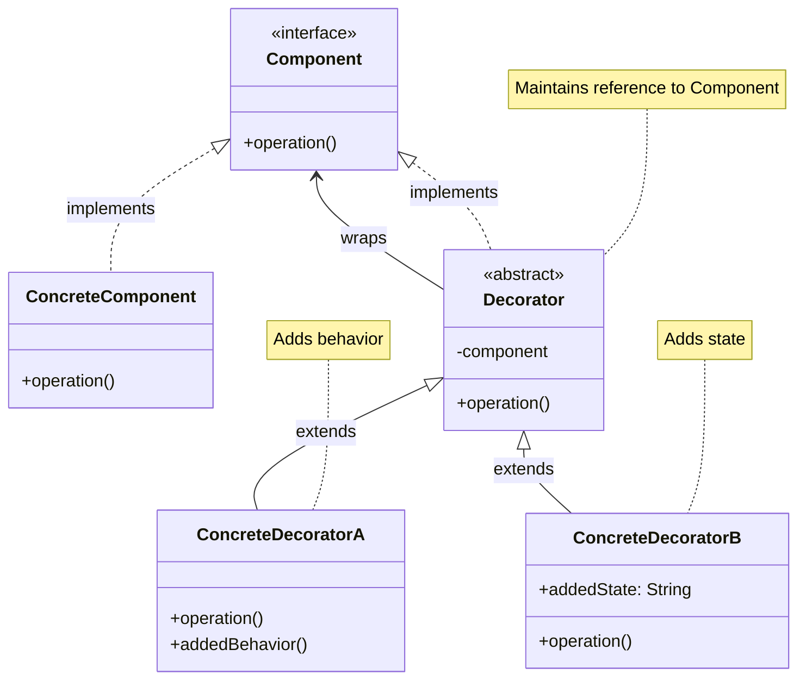
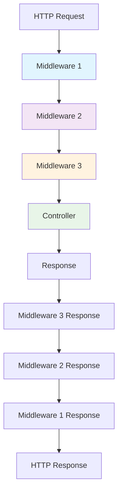
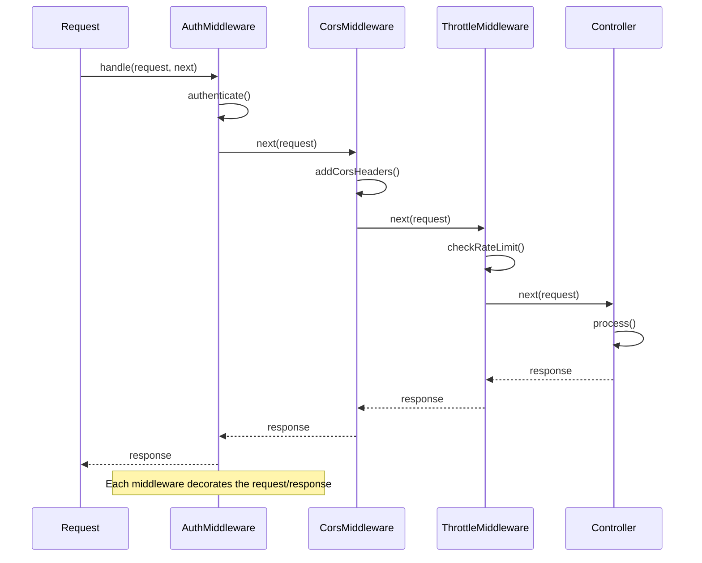

# Decorator Pattern

## Overview

Attach additional responsibilities to an object dynamically. The Decorator pattern provides a flexible alternative to subclassing for extending functionality.

## Architecture Diagram

### Decorator Pattern Structure



### Laravel Middleware Stack



### Middleware Decoration Flow



## Implementation in Laravel

### 1. HTTP Middleware

Laravel's middleware system is a perfect implementation of the Decorator pattern:

```php
// Illuminate\Foundation\Http\Kernel.php
class Kernel implements KernelContract
{
    protected function sendRequestThroughRouter($request)
    {
        $this->app->instance('request', $request);
        
        Facade::clearResolvedInstance('request');
        
        $this->bootstrap();
        
        return (new Pipeline($this->app))
                    ->send($request)
                    ->through($this->app->shouldSkipMiddleware() ? [] : $this->middleware)
                    ->then($this->dispatchToRouter());
    }
}

// Example middleware
class AuthenticateMiddleware
{
    public function handle($request, Closure $next, ...$guards)
    {
        $this->authenticate($request, $guards);
        
        return $next($request);
    }
    
    protected function authenticate($request, array $guards)
    {
        if (empty($guards)) {
            $guards = [null];
        }
        
        foreach ($guards as $guard) {
            if ($this->auth->guard($guard)->check()) {
                return $this->auth->shouldUse($guard);
            }
        }
        
        $this->unauthenticated($request, $guards);
    }
}
```

### 2. Cache Decorators

```php
// Cache tagging decorator
class TaggedCache implements Store
{
    protected $store;
    protected $tags;
    
    public function __construct(Store $store, TagSet $tags)
    {
        $this->store = $store;
        $this->tags = $tags;
    }
    
    public function get($key)
    {
        return $this->store->get($this->taggedItemKey($key));
    }
    
    public function put($key, $value, $seconds)
    {
        $this->store->put($this->taggedItemKey($key), $value, $seconds);
    }
    
    protected function taggedItemKey($key)
    {
        return sha1($this->tags->getNamespace()).':'.$key;
    }
}
```

### 3. Collection Decorators

```php
// Illuminate\Support\Collection.php
class Collection implements ArrayAccess, Arrayable, Countable, IteratorAggregate, Jsonable, JsonSerializable
{
    public function map(callable $callback)
    {
        $keys = array_keys($this->items);
        
        $items = array_map($callback, $this->items, $keys);
        
        return new static(array_combine($keys, $items));
    }
    
    public function filter(callable $callback = null)
    {
        if ($callback) {
            return new static(Arr::where($this->items, $callback));
        }
        
        return new static(array_filter($this->items));
    }
    
    public function reject($callback = true)
    {
        $useAsCallable = $this->useAsCallable($callback);
        
        return $this->filter(function ($value, $key) use ($callback, $useAsCallable) {
            return $useAsCallable
                ? ! $callback($value, $key)
                : $value != $callback;
        });
    }
}
```

### 4. Response Decorators

```php
// Response decorators for different content types
class JsonResponse extends Response
{
    public function setData($data = [])
    {
        $this->data = $data instanceof Jsonable
            ? $data->toJson($this->encodingOptions)
            : json_encode($data, $this->encodingOptions);
            
        return $this->update();
    }
}

class RedirectResponse extends Response
{
    public function with($key, $value = null)
    {
        $key = is_array($key) ? $key : [$key => $value];
        
        foreach ($key as $k => $v) {
            $this->session->flash($k, $v);
        }
        
        return $this;
    }
}
```