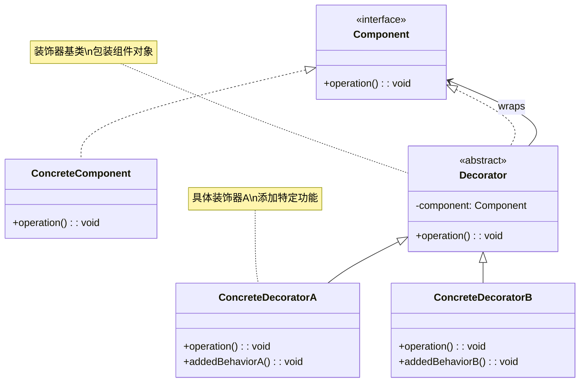
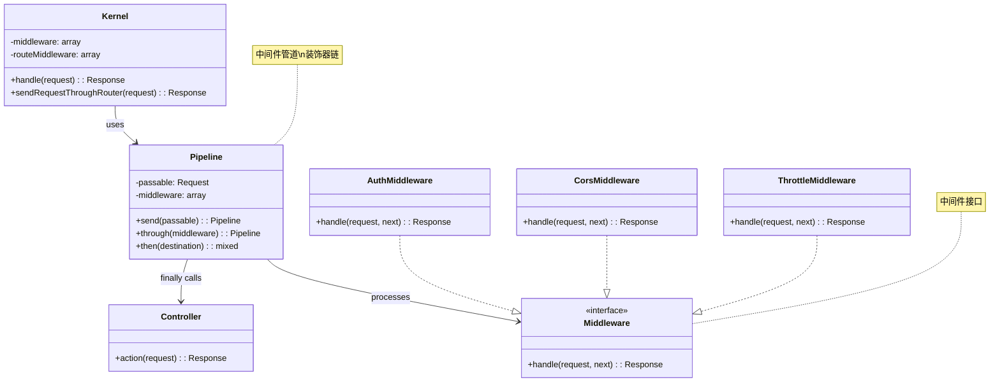
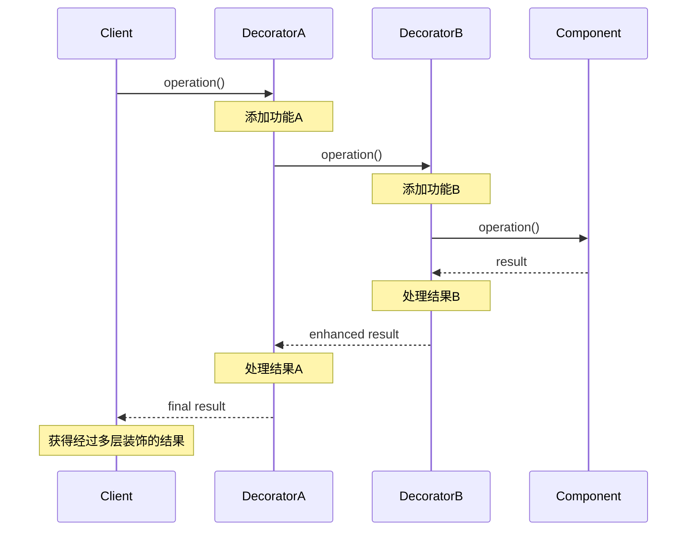
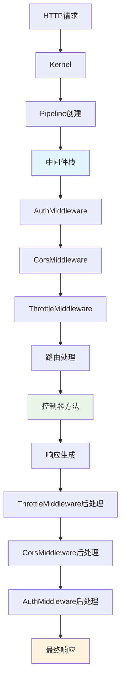
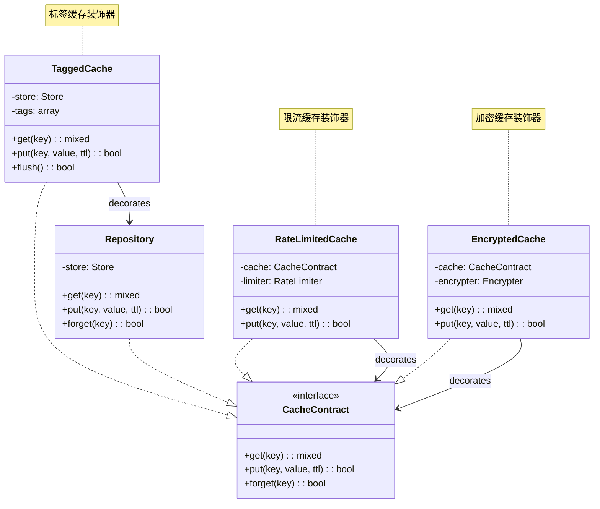
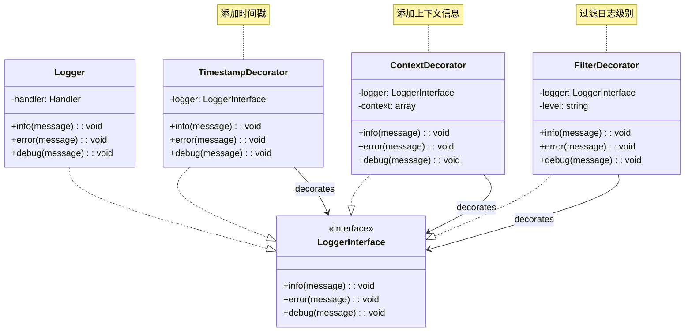
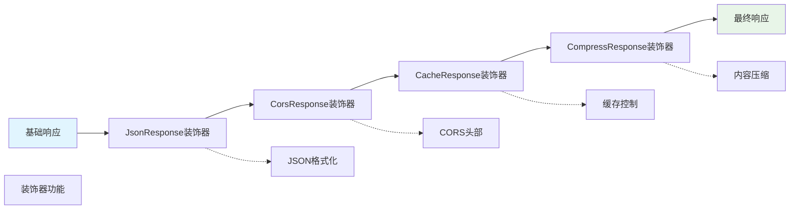

# 装饰器模式 (Decorator Pattern)

## 概述

装饰器模式动态地给一个对象添加一些额外的职责，就增加功能来说，装饰器模式相比生成子类更为灵活。它通过创建一个包装对象来扩展功能，而不是通过继承。

## 架构图

### 装饰器模式类图


### Laravel 中间件装饰器架构


### 装饰器模式时序图


### Laravel 中间件执行流程


### 缓存装饰器架构


### 日志装饰器模式


### 响应装饰器链


## 设计意图

- **动态扩展**：在运行时动态地给对象添加功能
- **避免继承爆炸**：避免通过继承产生大量的子类
- **单一职责**：每个装饰器只关注一个特定的功能
- **灵活组合**：可以任意组合装饰器来创建复杂的行为

## Laravel 中的实现

### 1. 中间件装饰器

Laravel 的中间件系统是装饰器模式的典型应用。每个中间件都是一个装饰器，包装HTTP请求处理过程：

```php
// Illuminate\Pipeline\Pipeline.php
public function then(Closure $destination)
{
    $pipeline = array_reduce(
        array_reverse($this->middleware),
        $this->carry(),
        $destination
    );
    
    return $pipeline($this->passable);
}

protected function carry()
{
    return function ($stack, $pipe) {
        return function ($passable) use ($stack, $pipe) {
            // 装饰器模式：每个中间件包装下一个处理环节
            if (is_callable($pipe)) {
                return $pipe($passable, $stack);
            }
            
            $middleware = $this->container->make($pipe);
            
            return $middleware->handle($passable, $stack);
        };
    };
}
```

### 2. 响应装饰器

Laravel 的响应对象支持装饰器模式，可以动态添加功能：

```php
// Illuminate\Http\Response.php
class Response extends SymfonyResponse implements Responsable
{
    // 基础响应功能
    
    public function withCookie($cookie)
    {
        // 装饰器方法：添加Cookie功能
        $this->headers->setCookie($cookie);
        return $this;
    }
    
    public function withHeaders(array $headers)
    {
        // 装饰器方法：添加头部信息
        foreach ($headers as $key => $value) {
            $this->headers->set($key, $value);
        }
        return $this;
    }
}
```

### 3. 查询构建器装饰器

数据库查询构建器使用装饰器模式添加查询条件：

```php
// Illuminate\Database\Query\Builder.php
class Builder
{
    public function where($column, $operator = null, $value = null, $boolean = 'and')
    {
        // 装饰器模式：添加WHERE条件
        if ($column instanceof Closure) {
            return $this->whereNested($column, $boolean);
        }
        
        $this->wheres[] = compact('type', 'column', 'operator', 'value', 'boolean');
        
        return $this;
    }
    
    public function orderBy($column, $direction = 'asc')
    {
        // 装饰器模式：添加排序条件
        $this->orders[] = [
            'column' => $column,
            'direction' => strtolower($direction) == 'asc' ? 'asc' : 'desc',
        ];
        
        return $this;
    }
}
```

## 实际应用场景

### 1. 中间件装饰器链

```php
// 创建装饰器链：认证 -> 日志 -> 缓存 -> 最终处理
$pipeline = new Pipeline($app);
$response = $pipeline->send($request)
    ->through([
        Authenticate::class,      // 认证装饰器
        LogRequest::class,        // 日志装饰器
        AddCacheHeaders::class,   // 缓存装饰器
    ])
    ->then(function ($request) {
        return $this->router->dispatch($request);
    });
```

### 2. 响应装饰器组合

```php
// 基础响应
$response = response('Hello World');

// 装饰器链：添加Cookie -> 添加头部 -> 设置状态码
$decoratedResponse = $response
    ->withCookie(cookie('user', 'john', 60))
    ->withHeaders(['X-Custom' => 'Value'])
    ->setStatusCode(201);
```

### 3. 查询构建器装饰

```php
// 基础查询
$query = DB::table('users');

// 装饰器链：添加条件 -> 排序 -> 分页
$decoratedQuery = $query
    ->where('active', true)           // 条件装饰器
    ->orderBy('name', 'asc')          // 排序装饰器
    ->skip(10)->take(5);              // 分页装饰器

// 继续装饰：添加关联和选择字段
$finalQuery = $decoratedQuery
    ->select('name', 'email')
    ->with('posts');
```

## 源码分析要点

### 1. 装饰器模式的结构

在 Laravel 中，装饰器模式通常包含以下组件：

**组件接口（Component Interface）：**
```php
interface Middleware
{
    public function handle($request, Closure $next);
}
```

**具体组件（Concrete Component）：**
```php
class TerminateMiddleware implements Middleware
{
    public function handle($request, Closure $next)
    {
        $response = $next($request);
        
        // 终止中间件的具体逻辑
        $this->terminate($request, $response);
        
        return $response;
    }
}
```

**装饰器基类（Decorator Base）：**
```php
abstract class MiddlewareDecorator implements Middleware
{
    protected $next;
    
    public function __construct(Closure $next)
    {
        $this->next = $next;
    }
    
    abstract public function handle($request);
}
```

**具体装饰器（Concrete Decorator）：**
```php
class Authenticate extends MiddlewareDecorator
{
    public function handle($request)
    {
        // 前置处理：认证逻辑
        if (! $this->auth->check()) {
            return redirect('login');
        }
        
        // 调用下一个装饰器
        $response = ($this->next)($request);
        
        // 后置处理（可选）
        return $response;
    }
}
```

### 2. 装饰器链的构建

Laravel 使用函数式编程的方式构建装饰器链：

```php
protected function carry()
{
    return function ($stack, $pipe) {
        return function ($passable) use ($stack, $pipe) {
            // 构建装饰器链：每个装饰器包装前一个装饰器
            if (is_callable($pipe)) {
                return $pipe($passable, $stack);
            }
            
            $middleware = $this->container->make($pipe);
            
            return $middleware->handle($passable, $stack);
        };
    };
}
```

### 3. 装饰器的执行顺序

装饰器链的执行顺序是反向的：

```php
// 装饰器链：A -> B -> C -> 最终处理
$pipeline = [
    MiddlewareA::class,
    MiddlewareB::class, 
    MiddlewareC::class,
];

// 实际执行顺序：C -> B -> A -> 最终处理
$finalHandler = array_reduce(
    array_reverse($pipeline),
    $this->carry(),
    $finalDestination
);
```

## 最佳实践

### 1. 合理使用装饰器模式

**适用场景：**
- 需要动态、透明地给对象添加职责
- 需要撤销已添加的职责
- 通过继承扩展不现实（子类爆炸）
- 需要组合多个功能

**不适用场景：**
- 装饰器链过长，影响性能
- 装饰器之间的顺序依赖复杂
- 需要修改对象的核心行为

### 2. Laravel 中的装饰器实践

**中间件装饰器的最佳实践：**
```php
class EnsureEmailIsVerified
{
    public function handle($request, Closure $next)
    {
        // 前置装饰：验证逻辑
        if (! $request->user()->hasVerifiedEmail()) {
            return redirect()->route('verification.notice');
        }
        
        $response = $next($request);
        
        // 后置装饰：记录验证日志
        Log::info('Email verified access', ['user' => $request->user()->id]);
        
        return $response;
    }
}
```

**响应装饰器的链式调用：**
```php
// 创建响应装饰器链
public function createResponse($data)
{
    return response()
        ->json($data)
        ->withHeaders(['Cache-Control' => 'no-cache'])
        ->setExpires(now()->addMinutes(5))
        ->withCookie(cookie('session', $sessionId, 60));
}
```

### 3. 测试中的装饰器

**测试装饰器功能：**
```php
public function test_middleware_decorator_adds_functionality()
{
    $request = Request::create('/test');
    $next = function ($req) {
        return response('OK');
    };
    
    $middleware = new AuthenticateMiddleware();
    $response = $middleware->handle($request, $next);
    
    $this->assertEquals(200, $response->getStatusCode());
}

public function test_response_decorator_chain()
{
    $response = response('Hello')
        ->withHeaders(['X-Test' => 'value'])
        ->setStatusCode(201);
    
    $this->assertEquals('value', $response->headers->get('X-Test'));
    $this->assertEquals(201, $response->getStatusCode());
}
```

## 与其他模式的关系

### 1. 与适配器模式

装饰器模式改变对象的行为，而适配器模式改变对象的接口：

```php
// 装饰器：增强对象功能
class LoggingDecorator implements CacheInterface
{
    public function __construct(CacheInterface $cache, Logger $logger)
    {
        $this->cache = $cache;
        $this->logger = $logger;
    }
    
    public function get($key)
    {
        $this->logger->info("Cache get: {$key}");
        return $this->cache->get($key);
    }
}

// 适配器：转换对象接口
class RedisAdapter implements CacheInterface
{
    public function __construct(Redis $redis)
    {
        $this->redis = $redis;
    }
    
    public function get($key)
    {
        // 适配Redis接口到Cache接口
        return $this->redis->get($key);
    }
}
```

### 2. 与策略模式

装饰器模式关注功能的叠加，策略模式关注算法的替换：

```php
// 装饰器：功能叠加
$cachedLogger = new CachingDecorator(
    new LoggingDecorator(
        new BasicService()
    )
);

// 策略模式：算法替换
class PaymentContext
{
    public function __construct(PaymentStrategy $strategy)
    {
        $this->strategy = $strategy;
    }
    
    public function pay($amount)
    {
        return $this->strategy->pay($amount);
    }
}
```

### 3. 与组合模式

装饰器模式可以看作是只有一个组件的组合模式：

```php
// 装饰器：单个对象的包装
$decorated = new Decorator(new ConcreteComponent());

// 组合模式：多个对象的集合
$composite = new Composite();
$composite->add(new Leaf());
$composite->add(new Leaf());
```

## 性能考虑

### 1. 装饰器链的性能影响

装饰器模式会引入一定的性能开销：

- **方法调用开销**：每个装饰器都会增加一次方法调用
- **对象创建开销**：需要创建多个装饰器对象
- **内存占用**：装饰器链会占用更多内存

### 2. 优化策略

**对象复用：**
```php
// 复用装饰器实例
class MiddlewareFactory
{
    protected $instances = [];
    
    public function make($middleware)
    {
        return $this->instances[$middleware] ??= app($middleware);
    }
}
```

**延迟装饰：**
```php
// 只有在需要时才应用装饰器
class LazyDecorator
{
    protected $decorated;
    
    public function getDecorated()
    {
        if (!$this->decorated) {
            $this->decorated = $this->createDecorated();
        }
        return $this->decorated;
    }
}
```

## Laravel 12 新特性

### 1. 属性驱动的装饰器注册

Laravel 12 引入了属性驱动的装饰器配置：

```php
use Illuminate\Http\Attributes\AsResponseDecorator;

#[AsResponseDecorator('cache')]
class CacheResponseDecorator
{
    public function decorate(Response $response): Response
    {
        return $response->withHeaders([
            'Cache-Control' => 'public, max-age=3600'
        ]);
    }
}
```

### 2. 基于接口的装饰器组合

新的接口抽象让装饰器组合更加灵活：

```php
interface ResponseDecorator
{
    public function decorate(Response $response): Response;
    public function getPriority(): int;
}

class DecoratorChain
{
    public function decorate(Response $response): Response
    {
        $decorators = $this->getSortedDecorators();
        
        foreach ($decorators as $decorator) {
            $response = $decorator->decorate($response);
        }
        
        return $response;
    }
}
```

## 总结

装饰器模式是 Laravel 框架中实现功能扩展的核心技术。通过装饰器模式，Laravel 能够：

1. **动态扩展功能**：在运行时灵活地添加或移除功能
2. **保持代码简洁**：避免通过继承产生大量的子类
3. **支持功能组合**：可以任意组合装饰器创建复杂行为
4. **遵循开闭原则**：对扩展开放，对修改关闭

装饰器模式在 Laravel 的中间件系统、响应处理、查询构建器等组件中都发挥着重要作用。理解这一模式对于掌握 Laravel 的架构设计和扩展机制至关重要。